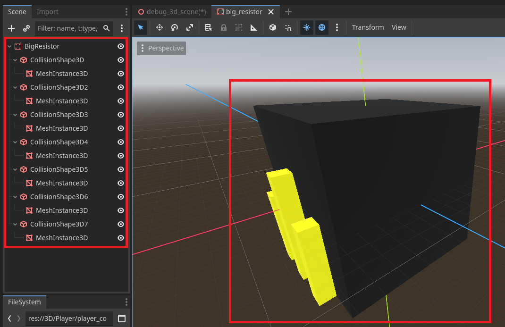

summary: Basics of Godot and 3D
id: export
categories: Installation, Basics, GDScript, Navigation, Nodes, StaticBody3D, Engine UI, 3D
status: Published
authors: Ondřej Kyzr
Feedback Link: https://forms.gle/J8eeuQAJ3wMY1Wnq7

# Lab01 - Basics of Godot and 3D

## Introduction
Duration: hh:mm:ss

This tutorial should provide a surface-level overview of how to use the open-source game engine **Godot Engine** to make games. It won't cover everything there is to cover and will only show a few ways how to program/create game mechanics and systems. If any of the discussed topics catch your interest, I suggest that you look up other, more detailed tutorials that cover the topic in more depth.

In this first lab, we will cover:
- Downloading the **Godot Engine**
- Downloading and opening a **Template Project**
- Overview of the Godot Engine **UI**
- 3D scene **navigation** in the editor
- How to **manipulate objects** in the scene
- How the node **hierarchy** works
- **Creating** our own object and **saving** it

## Getting Godot Engine 
Duration: hh:mm:ss

### Programming Language
First, before we download the Godot Engine, we need to choose a language. Each Godot release has two versions:
- **Standard** (supports **GDScript** language)
- **.NET** (supports **GDScript** and **C#** language)

This tutorial will use the **standard** version and **GDScript**, which is a Python-like scripting language made specifically for Godot. It is possible to use **C#** and **GDScript** interchangeably in one project (with some minor restrictions), but this tutorial will be done entirely in **GDScript** for simplicity.

> aside positive
> To maximise performance of a project, you would ideally use **C#** for complex algorithms (such as pathfinding or other complex calculations) and **GDScript** for interfacing with the engine and calling engine functions.  

> aside negative
> Currently the **.NET** version of Godot **does not** support web builds of the game.

### Engine Version
This tutorial will be done using the engine version `4.4.1`, and I suggest you do the same, but any newer version can be used.

Please download the Godot engine using the following link and place it into a folder of your liking:
<button>
  [Godot 4.4.1](https://godotengine.org/download/archive/4.4.1-stable/)
</button>

> aside negative
> Beware that the differences in major Godot versions may be significant. So if you plan on using a newer version, not all things said in this tutorial might be completely correct.  

> aside positive
> I recommend using the **newest** stable version for your own projects.

## The Project
Duration: hh:mm:ss

In this tutorial, we will be making a game about a robot that goes inside a computer to fight off malware that has infected the computer. It will mainly be a **3D platformer** with seamless **2D platforming and puzzle** sections. The complete **Game Design Document** (perhaps to inspire your own GDD) can be found here: [GDD]("https://github.com/tutek1/DTLabs/blob/main/GDD.pdf")

### Getting and running the template
Each lab will have a template project, which we will fill out together. This lab's template can be downloaded here:
<button>
  [Template Project](https://cent.felk.cvut.cz/courses/39HRY/godot/01_Basics/template.zip)
</button>

1. **Download** the template using the button above
2. **Place it** into a folder of your choosing. I recommend having a folder for all Godot projects.
3. **Launch** the Godot Engine `Godot_v4.4.1-stable_win64.exe` (or an alternative for your operating system)
4. **Click** one of the **Import** buttons and find the folder where you downloaded the template project. In there, select the `project.godot` file, and press **Open**. 
5. A pop-up window will open, select **Import**.
6. The project should be open now.

## Godot UI
Duration: hh:mm:ss

Now that you have the project open, it might be a bit overwhelming to orient yourself in the **Godot UI**, so let's take a look at it.

1. This is the **Scene hierarchy**. Here, you will see all the Nodes (basic building blocks) in the current scene and how they are composed in the scene. There is also a second tab with the import settings of assets.
2. This is the **Scene view**. It is visible because in `6.` the **3D tab** is selected. This is the main way you can look around and preview the scene you are making.
3. This is the **FileSystem**. It shows you all the files, folders, and assets that are present in the root folder of the project.
4. This window has multiple functionalities. 
    - It has the **Output** console, where you will see the messages you print during play mode.
    - The **Debugger**, where you can find all the information about the performance, errors, warnings, networking, etc.
    - Then there are the **Audio Bus** settings, **Animation** window, **Shader Editor**, and much more, depending on the open Node/Asset.
5. This is the **Inspector**. Here you can change exposed parameters of nodes such as the `position`, `rotation`, `scale`, `visibility`, etc.
6. This **tab selection** is where you can change what you can see in `2.`. Currently, it is set to the scene view. 
    - The **2D/3D** tabs show you the current scene from that perspective
    - The **Script** tab hosts the in-engine IDE for writing scripts.
    - The **Game** tab has the game window, where you can see the game once you run it.
    > aside negative
    > Note that 3D scenes **cannot** be viewed in 2D and vice versa by using these tabs.

7. This is the **Play** panel. We will be mainly interested in:
    - The first button starts the full game (a set main scene)
    - The next 2 buttons pause and stop the game
    - The fifth button starts the game with the currently open scene.

Don't worry if you feel lost. We will go through all these parts in much more detail later. This is just an overview.

## 3D Navigation
Duration: hh:mm:ss

> aside negative
> If you don't see the testing scene in the scene view (the one in the video below), here is how to open it. In the **FileSystem** window, open the folder `3D/Debug` and double-click the `debug_3d_scene.tscn` file. 

In this section, we will learn several ways to move in the 3D scene view (2D handles in a very similar way). Now there are 2 most commonly used ways to move in the scene view:

### Middle Mouse Button (MMB)
You can hold the **middle mouse button** to move in different ways in the scene. Watch this video, which shows the 3 basic movements outlined below.
<video id=wXRXxe11oss></video>

- `MMB` - Rotate around a point
- `SHIFT + MMB` - Pan
- `CTRL + MMB`/`Mouse Wheel` - Zoom in/out

Please try to move around in the scene using this method.

### Flying camera
The second way, and in my opinion the best way, to move is using the **flying camera**. It is active while holding the `Right Mouse Button`. Then, by pressing these buttons, you can:
<video id=FSjuFlvCc8U></video>

- `W, A, S, D` to move forwards/backwards and right/left
- `Q, E` to move up/down
- `SHIFT` to move faster
- `MMB scroll` to control the fly speed

Please try to move around in the scene using this method.

## Scene manipulation
Duration: hh:mm:ss

Let's learn how you can manipulate objects (nodes) in the scene. **Find** and **Select** the `Resistor` node in the **scene hierarchy** on the left.

> aside positive
> If the resistor is out of view, or you are far away, you can press `F` to focus on it. 

Now with the `Resistor` selected and in view, you can move it, rotate it, or scale it in 3 ways:

1. Select a tool from the tool panel and then hold **left-click** and drag in the scene view (`Q` select, `W` move, `E` rotate, `R` scale).
2. Grab the colorful parts of the "Gizmo" seen in the image, then hold **left-click** and drag.
3. Directly change the coordinates/degrees/scale of the object in the **inspector**.

> aside positive
> You can hold `CTRL` or `SHIFT` while manipulating objects to snap them to a grid.

> aside negative
> Be careful when scaling an object with collisions. To achieve the correct behavior, you need to scale the node equally on all sides or adjust the collider and mesh properties separately. 

### Object duplication
Our scene is looking a little sad, so let's add more resistors. **Select** the `Resistor` node in the **scene hierarchy** and press `CTRL+D` to duplicate. Now repeat this step and **move, scale,** and **rotate** them to make the scene look nicer.

Try to use all **three ways** described above to manipulate the objects.

> aside positive
> You can select multiple resistors and duplicate all of them at once. So that you don't have to duplicate them one by one.

If you played with the scale of objects or moved some of them up or down, you might have noticed that they are no longer placed precisely on the ground. They are either above/below the ground or partway in the ground. You can use:
- `PAGEDOWN` key to snap an object to the ground.
- `SHIFT+G` and then click to place it on any surface.

When you are happy with the scene, you can continue. Mine looks like this:

### World Environment
The visual look of a game is very important. Let's change the World Environment node and play around with the visual style of the scene.

1. **Select** the `World Environment` node in the **scene hierarchy**.
2. **Click** on the Environment Resource box
3. **Change** the settings of the world to your liking. Many settings can be changed here; try to play with them.

You can look up what each setting does in the [documentation](https://docs.godotengine.org/en/stable/classes/class_environment.html#class-environment) of Godot. If you feel lost or confused, don't dwell on it too much and move to the next section.

## Node Hierarchy
Duration: hh:mm:ss

Let's now dive a bit into the theory behind **nodes**, **trees**, and **the scene hierarchy**.

### Nodes
Nodes are the basic building blocks of a scene. You can think of nodes as ingredients in a recipe, which have a singular purpose. One node might handle showing the Mesh/Sprite of the player, one might handle the collision shape, etc. There are many types of nodes with different functionalities, and by combining them, you create complex systems.

Each node can only have **one script** attached, which further supports that each node only has one functionality. 

### Scene Hierarchy
In the image below (from the documentation), you can see that some nodes are "inside" others. This **tree-like** structure follows the logical ordering of the nodes and their functionalities. For example:
- `Player` node (type CharacterBody2D) handles all player **movement and controls**
    - `AnimatedSprite2D` handles the **animations** of the player sprite
    - `CollisionShape2D` handles the **physics shape** the player has (sphere, box, capsule, etc.)
    - `AudioStreamPlayer2D` handles **playing sounds** the player makes
    - `Camera2D` handles **showing an image** from the scene to the monitor

This hierarchy also propagates many properties from **parent** to **children**.
- **Transform** - if `Player` node is moved/rotated/scaled, the transformation is applied to all the nodes inside it (children).
- **Visibility** - if `Player` is hidden, all children nodes are also hidden (eye icon next to the node)
- **Modulation** - if `Player` has modulation (color) set to red, the children are also colored red
- and many others ...

> aside positive
> Remember that **every node** in Godot can be saved as a scene and can be played as the main scene or created/destroyed at will.

## Add your own object
Duration: hh:mm:ss

One of the last things I would like to cover in this intro lab is how to **create your own object** with collisions (it will come in handy later). So let's make a bigger version of the resistor.

### StaticBody3D
Since the resistor will not move, let's add a `StaticBody3D` node.

> aside negative
> Different types of "body" nodes will be described in depth in the next lab.

1. **Right-click** the Environment node (container for all the objects)
2. **Press** the `+ Add Child Node...` button
3. In the popup window, **search** for `StaticBody3D` and press `Create`

Now we have a new node in the scene. Let's add a cube mesh to it.

### MeshInstance3D
A mesh is a representation of a 3D object composed of vertices/points and triangles/faces. Using the same process as above:

1. **Add** a `MeshInstance3D` node as a child of the `StaticBody3D`.
2. In the **inspector** with the `MeshInstance3D` node selected, **press** the empty mesh resource box
3. **Press** `New BoxMesh` to create a new cube.

Now there is a white cube placed on the ground. Let's make it big and change its color.

1. **Click** the cube mesh in the **inspector**
2. Change the **size** (I changed it to 10x10x10 meters)
3. **Add** a `StandardMaterial3D` which defines how the surface of objects will look
4. Change the **albedo color** to black
5. You can see the **resulting mesh**

### CollisionShape3D
If we want the objects to have collisions, we need to define what collision shape they have. In simple objects such as cubes or spheres, the shape will be the same as the mesh. However, in more complex objects, the collision shape is approximated with multiple simpler shapes.

With the mesh present, we can see that the `StaticBody3D` has a warning next to it.

The warning tells us that the `StaticBody3D` needs a **collision shape**. Let's add one so that later on, our player cannot go through the object, and they collide with it.

1. Let's start by **adding** a new node as a child of the `StaticBody3D` of type ` CollisionObject3D`
2. **Click** the empty shape resource box
3. **Choose** the `BoxShape3D` since our mesh is a box
4. Now **click** on the `BoxShape3D` and set the **size** to the same as the mesh

Now you have a cube with collisions. 

### Saving the object as a scene
Having this new cube **saved** as a reusable object will be useful. Imagine you have 20 of them in a scene, and you want to change some property on all of them. Normally, you would have to go and individually change every single one. This would be inefficient and time-consuming.

If we instead **save** the object as a scene, then all **changes made** to the scene will be **propagated** to every instance of the scene. Let's save the `Big Resistor` as a scene.

1. **Right-click** the `StaticBody3D`, select rename, and name it **"BigResistor"**
2. **Right-click** it again and select **Save Branch as Scene**
3. **Navigate** to `3D/WorldObjects` and press **Save**

Now the `BigResistor` node in the scene no longer has its children visible and has a **"movie flap"** icon next to it.

If you **click** on the icon. It opens up in a new tab in the scene view. In this tab, the root of the scene is the `StaticBody3D ` named `BigResistor`, and all changes made to it here are propagated to all instances. Meaning if you have two of these resistor scenes in the `debug_3d_scene` and you, for example, add a new `MeshInstance3D` to it, **both** of them will have this change.

### Adding a scene to a scene
Now, with the `BigResistor` scene saved, you can **instantiate/add** more copies of it to the debug scene. There are two ways:
1. Simply **press** the  button on the top of the **scene hierarchy** and select it.
2. **Drag-and-drop** the saved scene file `big_resistor.tscn` from the **FileSystem** tab into the **scene view**

> aside negative
> Don't forget to put the newly created resistor as a child of the `Environment` node. This keeps our scene clean and easy to navigate.

### Bonus
If you are up to the challenge, with the `big_resistor.tscn` scene open, you can add the yellow "cables" with collision shapes to the sides in the same way as we added the main cube (with `CollisionShape3D` and `MeshInstance3D`). Here is what my solution looks like:

(**Note:** I parent the mesh to the corresponding collision shape, so that I only need to move/rotate the collision shape to move both of them.)

> aside positive
> Be sure to check the instantiated big resistors in the debug scene to see if they have also changed.

## Recap
Duration: hh:mm:ss

### Feedback
I would be very grateful if you could take a moment to fill out a **very short feedback form** (it takes less than a minute). Your feedback will prove very useful for my master thesis, where I will use it to evaluate the work I have done.
<button>
  [Google Forms](https://forms.gle/xcsTDRJH2sjiuCjP7)
</button>

> aside positive
> This whole course and the game we are making are a part of my master thesis.

### Recap
Let's look at what we did in this lab.
- First we **downloaded** the Godot Engine and **set up** the template project.
- Next up, we looked at the **Godot UI** and got ourselves familiar with it.
- We also learned how to **move** in the 3D scene and how to **manipulate objects** in a scene.
- Then we learned the theory behind **nodes**, **the scene hierarchy** and how changes of a parent **propagate** to children
- Lastly, we tried **adding** our own bigger `Resistor` object, where we learned about the `StaticBody3D` node, `MeshInstance3D` node, and `CollisionShape3D` node.

If you want to see what the finished template looks like after this lab, you can download it here:
<button>
  [Template Done Project](https://cent.felk.cvut.cz/courses/39HRY/godot/01_Basics/template-done.zip)
</button>
