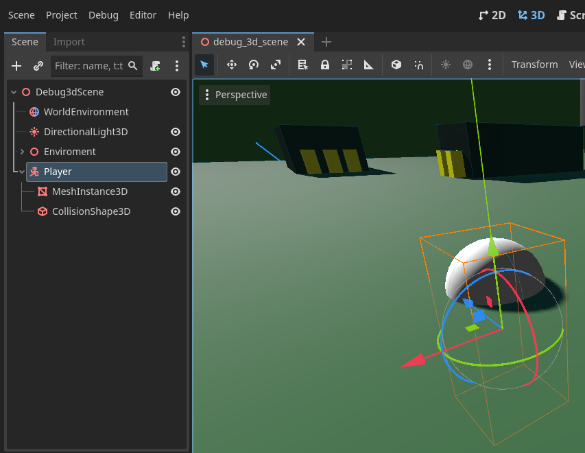
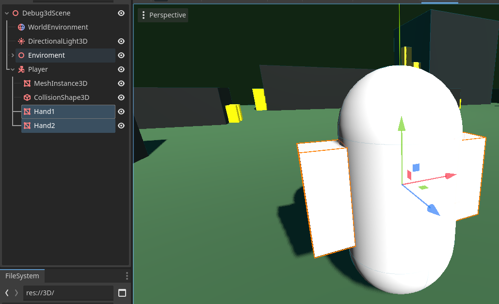
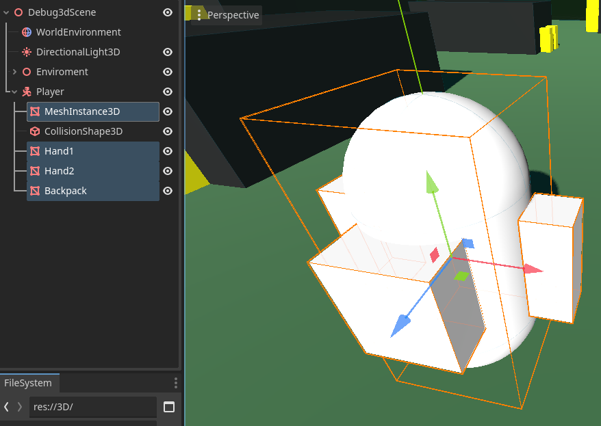

summary: Player Character and Camera
id: export
categories: Player Controller, Camera, Materials, GDScript
status: Published
authors: Ondřej Kyzr
Feedback Link: https://google.com

# Lab02 - Player Character and Camera

## Overview
Duration: hh:mm:ss

In this tutorial we will:
- Create a debug character model
- Learn about `CharacterBody3D`
- Add a camera to the scene
- Learn about the `Game` window and how to start the game
- Learn the basics of programming in GDScript
- Create several different player controllers (all can be used depending on the game type)
- Make the camera follow the player (in 2 different ways)

## Add a player character
Duration: hh:mm:ss

### Types of bodies
Similar to the previous lab we need to add a node to represent our player. Since our player will move in the world and use the physics system, we need to choose an appropriate node for the player. These are our choices:
- `StaticBody3D` - objects with collisions that do not move ❌
- `RigidBody3D` - objects with collisions that are moved by forces with the physics engine ✔️
- `CharacterBody3D` - objects with collisions that are meant to be user-controlled ✔️

Both `RigidBody3D` and `CharacterBody3D` are solid choices for us. The better choice will be `CharacterBody3D` since it already implements many things that will come in handy for us (ground and wall detection, moving platforms, moving slopes, etc.).

### Create the player node
Now that we know what node type the player will be, let's add it.
1. Add a `CharacterBody3D` node as a child of the scene node ("Debug3dScene")
2. Rename it to **"Player"** (Right-click and select rename)
3. Add a `MeshInstance3D` node as a child of the player with a `CapsuleMesh`
4. Add a `CollisionShape3D` node as a child of the player with a `CapsuleShape3D`

The result should look something like this:

Let's move the player a bit up so that they are not in the ground.

<aside class="negative">
Be careful to move the "Player" node and not the mesh or collider of the player.
</aside>

### Nicer player model
The player is now just a plain white capsule. We will give them hands and a backpack to make them look nicer and also learn a bit about materials.

#### Adding hands
1. Add a `MeshInstance3D` node as a child of the player and add a BoxMesh to it. (Optionally rename it to "Hand1")
2. Change the mesh size to look more like a hand (I used `0.3, 0.8, 0.3`)
3. Move the hand on the X-axis so that it is on the side of the player (I moved it by `0.65`)
4. Repeat step 1-3 for the other hand, just move it to the other side of the player

After adding hands the player should look something like this:

#### Adding backpack
The main reason for adding a backpack is so that we can easily tell which way is the player capsule facing. This will come in handy later on.

Use the same process we did in adding hands to add a new BoxMesh, scale it, and move it.

<aside class="negative">
The coordinate system in Godot Engine uses the Z-axis in a way that -Z == Forwards and +Z == Backwards. So be sure to place the backpack on the +Z side of the player.
</aside>

The player should look like this now (mind direction of the Z-axis).

#### Using a shared material
