summary: Player Character and Camera
id: export
categories: 3D, Player Controller, Camera, Materials, GDScript
status: Published
authors: Ondřej Kyzr
Feedback Link: https://google.com

# Lab02 - 3D Player Character and Camera

## Overview
Duration: hh:mm:ss

In this tutorial we will:
- Create a debug character model
- Learn about different Godot bodies `CharacterBody3D`, `RigidBody3D`, `StaticBody3D`
- Learn the basics of programming in **GDScript**
- Learn about the **Game** window and how to start the game
- Add a camera to the scene
- Learn how to gather input from the player
- Create two different **player controllers** (both can be used depending on the game type)
- Make the **camera** follow the player (in 2 different ways)

Please download the template project, that we will be using in this lab:
<button>
  [Template Project](link)
</button>


## Add a Player Character
Duration: hh:mm:ss

### Types of bodies
Similar to the previous lab we need to add a node to represent our player. Since our player will move in the world and use the physics system, we need to choose an appropriate node for the player. These are our choices:
- `StaticBody3D` - objects with collisions that do not move ❌
- `RigidBody3D` - objects with collisions that are moved by forces with the physics engine ✔️
- `CharacterBody3D` - objects with collisions that are meant to be user-controlled ✔️

Both `RigidBody3D` and `CharacterBody3D` are solid choices for us. The better choice will be `CharacterBody3D` since it already implements many things that will come in handy for us (ground and wall detection, moving platforms, moving slopes, etc.).


### Create the player node
Now that we know what node type the player will be, let's add it.
1. Add a `CharacterBody3D` node in the scene hierarchy as a child of the scene node ("Debug3dScene")
2. Rename it to **"Player"** (Right-click and select rename)
3. Add a `MeshInstance3D` node as a child of the player and set the mesh to a `CapsuleMesh`
4. Add a `CollisionShape3D` node as a child of the player and set the collision shape to a `CapsuleShape3D`

The result should look something like this:


Let's move the player a bit up so that they are not in the ground.

> aside negative
> Be careful to move the `Player` node and **NOT** the mesh or collider of the player.


### Nicer player model
The player is now just a plain white capsule. We will give them hands and a backpack to make them look nicer and also learn a bit about materials.

#### Adding hands
1. Add a `MeshInstance3D` node as a child of the player and add a BoxMesh to it. (Optionally rename it to "Hand1")
2. Change the mesh size to look more like a hand (I used `0.3, 0.8, 0.3`)
3. Move the hand on the X-axis so that it is on the side of the player (I moved it by `0.65`)
4. Repeat step 1-3 for the other hand, just move it to the other side of the player

After adding hands the player should look something like this:


#### Adding backpack
The main reason for adding a backpack is so that we can easily tell which way is the player capsule facing. This will come in handy later on.

Use the same process we did in adding hands to add a new BoxMesh, scale it, and move it.

> aside negative
> The coordinate system in Godot Engine uses the **Z-axis** in a way that `-Z == Forwards` and `+Z == Backwards`. So be sure to place the backpack on the **+Z** side of the player.


The player should look like this now (mind the direction of the Z-axis).


#### Giving the player some color
Let's give the player capsule some color.

1. Click on to the `MeshInstance3D` with the capsule mesh in the scene hierarchy.
2. Click on the **CapsuleMesh** in the **inspector**.
3. Add a new `StandardMaterial3D` to the Material slot
4. Click on the created material
5. Set albedo to gray
6. Set Roughness to `0.3`
7. Set Metallic to `0.5`

This makes the capsule look gray and shiny as a metal robots body should be. However, I would like to add the same material to the hands and the backpack.

I could manually set all the properties on each material of each object but what if later on I would like to change to robots color? -> I would have to modify all the parts of the robot, which is not ideal.

#### Saving materials
Let's learn how to save a material and share it with other meshes.

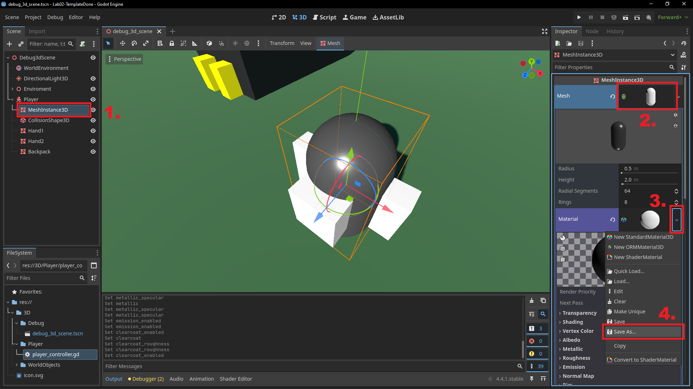
1. Select the Capsule `MeshInstance3D`
2. Click on the **CapsuleMesh** in the **inspector**
3. Click on the small arrow next to the material that you created in the steps in the 7 steps sequence above
4. Select **Save As**
5. In the new popup window: change the name to `player_material.tres`
6. Navigate to folder `3D/Player`
7. Click **Save**

Now we have saved the material as a Resource.

> aside positive
> Resources can represent many types of data (materials, shaders, tile sets, fonts, scenes etc.). They can be instantiated (created/spawned in) to any scene and deleted at will. Saved scenes (`PackedScene`) in Godot are also Resources. This allows us to use them to represent common objects (bullets, enemies, collectibles etc.) that need to be created/deleted at runtime, with them. 


#### Applying materials
Now we can apply the material to the hands and backpack. Please follow the steps in this video.
<video id=AVk8pqCkRpA></video>

> aside negative
> If you only needed to use the material one of the hands of the robot, it means that you used the same mesh for both of them, probably because you duplicated the first hand. This is not wrong, since we want both hands to look the same. However, keep it in mind.


## Entering Play Mode
Duration: hh:mm:ss

### Pressing play
In this section we will take a bit of a detour and look at how to play and test our game. It can be done easily by pressing the **Run current scene** button at the top right. 

However, right now if you press the button all you can see is a gray screen. This happens because there is no camera in the scene though which we would be able to see in the game world.

> aside positive
> Press `ALT+F4` if all you can see is a fullscreen of gray.


### Adding a camera
To solve this add a new `Camera3D` node to the scene as a child of the root (Debug3dScene) and move/rotate it so that the player is in view. For example like this:


Now if you press play you can see the game world. Yippee!

If your game still starts in "fullscreen" I recommend setting the embedding options same as in the next image. It makes the game window embed inside the editor.


### Making something happen
Now if you play the game, you can notice that nothing happens. That is because we have not added any interactive stuff in it. I have prepared a basic script in the folder `3D/Player` called `player_controller.gd`.

Please attach this script to the player. Drag the script from the **FileSystem** on to the `Player` node.

Now if you enter play mode, we can change(drag your mouse or type values) the Speed parameter (a Vector3) to make the player move in all three cardinal directions.
<video id=cKfvzk0Y6uo></video>


This is far from perfect or even playable (since the **inspector** is not available in the final game), but for messing around right before the next section it will suffice.

> aside negative
> Notice that the changes made in **Play** mode to the `Speed` parameter are still present even after exiting.


## Basics of GDScript
Duration: hh:mm:ss

Let's open the script we have added to the player in the previous section. You can do that by:
1. Either by clicking the 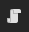 next to the `Player` node in the scene hierarchy.
2. Or double click the script file in the **FileSystem**

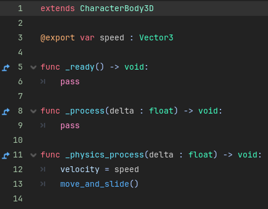

As you can see the syntax of **GDScript** is very similar to **Python**. Each script can be thought of as class that extends the functionality of the node. The first line tells us, what node functionality does the script *extend*. In our case it is the player and their class type is a `CharacterBody3D`. On line 3 you can see that the variable `speed`, which we used in the previous section is declared.

### Variables
Every variable declaration needs to start with the keyword `var`. The name of the variable is written next and is followed by `:` with a type declaration.

There are many variable types from the classic float, bool, int, Vector to more specialized ones. You can see all the base types here in the documentation [Variant class](https://docs.godotengine.org/en/stable/contributing/development/core_and_modules/variant_class.html).

The variable on line 3 is declared with an annotation `@export`. This annotation tells the engine, that it should be visible and changeable from the **inspector**. If is wasn't there we wouldn't be able to change the variable value like we did in the last section. We will come across different annotations in due time.

### Functions
In GDScript a function is declared with the keyword `func` (same as in Python). The keyword is followed by the name of the function and parameters its in brackets. Before closing the function header with `:` it is a good practice to declare the return type with `-> type`.

> aside negative
> GDScript does not have private/protected/public modifiers for functions or variables. The styling guide suggests, that the name of the variable should reflect its access. Private functions and variables should start with an `_`.

### Lifecycle of a Godot node
You might be wondering, what do the functions in the script do and when they are called. That is, where the Godot lifecycle comes in play.

In Godot every node automatically calls a number of virtual functions as it gets created, added to the tree, and so on. The importance of these functions can be seen on this simple enemy example:
- When the enemy is spawned/created, it will play an animation.
- While the enemy is alive, it will chase the player.
- After the enemy is defeated, it will drop some coins.

Ok, what are the functions? Here is a list of them in the order that they are called:
- `_init()` is called **once** when the node is created, it is the same as a constructor in OOP
- `_enter_tree()` is called **every time** the node is added as a child of another node in the scene tree
- `_ready()` is called **once** when the node and all of it's children have been created and are also ready
- `_process()` is called **every frame** and depends on the current framerate of the game (how many FPS does the game run at)
- `_physics_process()` is called **every physics frame**, that means that every time the physics in the game are updated this function is called, it depends on the set FPS of the physics engine
- `_exit_tree()` is called **every time** a node is removed from the scene tree

The most important ones for us are the `_ready()`, `_process()`, and `_physics_process()` functions. They are the backbone of almost every script and node.

### Back to the script
Let's now look back at the script:


We can see that the `_ready()` and `_process()` just use the keyword `pass`, meaning that nothing happens in the function. However, the function `_physics_process()`, which is called every time the physics engine updates. It does two things:
- Sets the variable `velocity = speed`
- Calls the function `move_and_slide()`

The variable `velocity` is declared by the `CharacterBody3D` class, that we are extending. It is a Vector3 that represents how fast in each cardinal direction the character should be currently moving.

The function `move_and_slide()` is also declared by the `CharacterBody3D` class. It is responsible for moving the character based on the current value in `velocity`.

> aside negative
> If we only set the `velocity` of the player and didn't call the `move_and_slide()` function. The player would not move at all. 


## Basic Player Input Pt.1
Duration: hh:mm:ss

Now we know how to move the player on a given axis by manually by setting it in the **inspector**, let's make it so that it responds to **W,A,S,D** instead. Almost all games respond to the player's input and in this section we will look at how to gather the input from the player.


### Adding actions and keys to the Input map
You can follow this video or the step by step below to add the keys we want to listen for.

<video id=xlwMBYhpBUE></video>

1. On top left panel click on **Project**.
2. Click on **Project Settings**.
3. Switch the tab (if not the already) to **Input Map**.

Now we are in the input map. Here you can add all the actions and keys the game should be listening for. An action should correspond to a type of input you want to detect. For example: Jumping will be its own action "jump" and in a 2D game it can be triggered by `W` or `SPACE`. This way we don't have to remember what keys are set for each action, we just have to remember, what action we want to check for. It also allows us to change/add keybindings easily without writing code.

1. Click on the text input box with **Add New Action** text.
2. Let's start with moving right. Write `right` in the box and press the **+ Add** button.
3. Now click the **+** next to the newly added action.
4. Now press the key that you want the player to press to move right (I suggest `D`)
5. Press **Ok**

This way we added the action `right`, which will be responsible for moving the player right, with the keybinding of `D`. Please continue in the same way and add actions `left`, `forward`, and `backward` with the corresponding keys. The result should look like this:

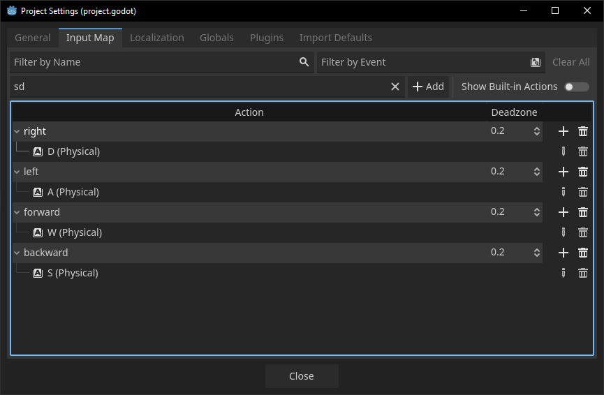

### Using the input in code
Now close the **Project Settings** window and let's get back to the **player_controller.gd** script.

If we want to know if a action is pressed we can use `Input.is_action_pressed("action")`, which returns a `bool`. However, we are checking for player movement. Since this movement is along an axis it is better to use `Input.get_axis("negative_action", "positive_action")`. Let's try to call it with the X-axis movement and print its value.

#### Getting the input
Add these two lines at the beginning of the `_physics_process()` function:
```GDScript
var x_axis : float = Input.get_axis("left", "right")
print(x_axis)
```

Now start the game with , try pressing `A` and `D`, and watch the **Output** console window.

You should see:
- `1.0` being printed when `D` is pressed
- `-1.0` being printed when `A` is pressed
- `0.0` being printed when nothing is pressed or both `D` and `A` is pressed

#### Apply the input
Ok, this should helps us move the player and it will be easier than to check each one of two 2 inputs separately. Let's set the `velocity` on the **X-axis** to this value like this:
```GDScript
velocity.x = x_axis
```
Now when you start the game the player should react to pressing `D` and `A` by slowly move left and right. 

> aside positive
> Notice, that we our code runs in the `_physics_porcess()` function. This is because of 2 reasons:
> 1. We want the player to respond to our inputs. That means we need to check for changes every frame.
> 2. We could just use the `_process()` function but since we are working with a `CharacterBody3D`, that uses physics, we use the `_physics_process()` to synchronize our changes with the physics engine. This avoids visual artifacts and physics glitches.

#### Task
Let's do the same with the **Z-axis** but try it on your own. If you are stuck, continue to the next section that has the solution.


## Basic Player Input Pt.2
Duration: hh:mm:ss

### Solution
Ok, the full `_physics_process()` function should look like this:

```GDScript
func _physics_process(delta : float) -> void:
    var x_axis : float = Input.get_axis("left", "right")
    var z_axis : float = Input.get_axis("backward", "forward")
	
    velocity.x = x_axis
    velocity.z = -z_axis
    move_and_slide()
```

> aside positive
> Notice, that we used `-z_axis` instead of `z_axis`. That is because in the **negative Z-axis** is considered as the **forward** direction in Godot Engine. 

### Make the player faster
We can see that the player moves quite slowly. To change this we can multiply the values that are set to the `velocity` variable. Multiply both of these values by `5` and try it in the game. I would say this speed seems fine, however what if wanted to change it later on? We would have to find all lines where we multiply the velocity by `5`, that is not ideal.

Let's change the export variable `speed` to a float (since we no longer use it), set its default value to `5`, and replace the `* 5` with it.
```GDScript
@export var speed : float = 5
...
func _physics_process(delta : float) -> void:
...
    velocity.x = x_axis * speed
    velocity.z = -z_axis * speed
```
Now if we look in the **inspector** with the `Player` node selected, we can see the `Speed` parameter and we can change it. Start the game, move around, and change the value of `Speed` to see how the player responds to the changes.

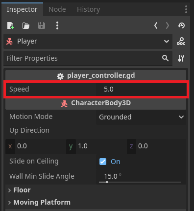


## Simple Player Controller - Rotation
Duration: hh:mm:ss

Let's make a few tweaks to create a simple player controller. It won't be pretty, but it could be easily used in simpler games.

### Camera follow
You probably noticed that the player can easily run away from the camera. To make the camera follow the player in a very simple way, drag and drop the `Camera3D` node in the **scene hierarchy**, so that it is a child of the `Player` node. Now when you start the game, the camera stiffly follows the player around. Try it!

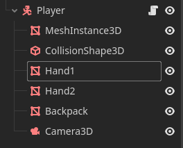

### Rotate the player
It would be nice if the player would look in the direction they are moving. Let's add this functionality.

#### Cleanup
First we should cleanup our code a bit. Since the code we have written handles movement let's create a function called `_movement()` and move all of the code there and call it in `_physics_process()`. We can also do the same for the for the code that we are about to write for player rotation.

This should be the resulting code.
```GDScript
func _physics_process(delta : float) -> void:
    _movement()
    _rotate_player()

    move_and_slide()

func _movement() -> void:
    var x_axis : float = Input.get_axis("left", "right")
    var z_axis : float = Input.get_axis("backward", "forward")

    velocity.x = x_axis * speed
    velocity.z = -z_axis * speed

func _rotate_player() -> void:
    pass
```

> aside positive
> Always try to split up the code into robust, logical, and reusable functions. You will thank yourself later ;)

#### The rotation angle
Using linear algebra we can calculate the angle that the player should be rotated by. We are interested in the `X` and `Z` direction of the player velocity. Place the following code snippet in the `_rotate_player()` function.

```GDScript
var angle : float = atan2(velocity.x, velocity.z) - PI
```

This gives us the degrees by which the player should be rotated. It might be more clear looking at the image below, where the value we are calculating is the `45°`.
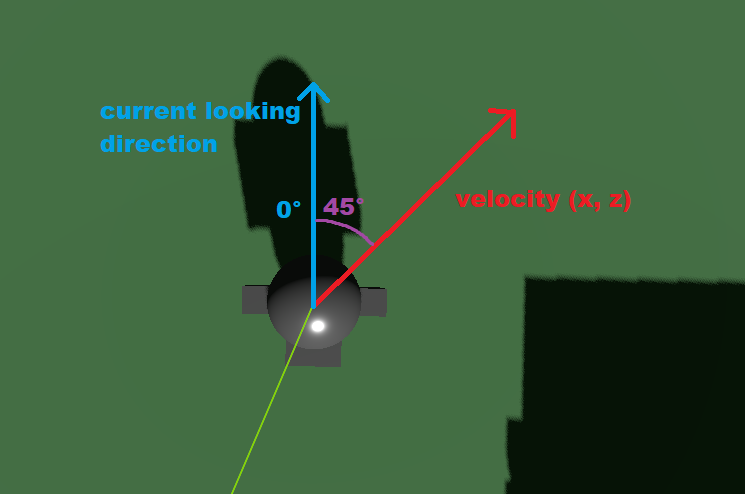

#### The rotation axis
Now we have the angle that the player needs to be rotated by, where do we set it? Let's find it out experimentally.
1. Go in the 3D scene view.
2. Select the `Player` node in the **scene hierarchy** and look at the **inspector**
3. Try to rotate the player manually using the **Rotation** property, to find out which axis makes the player look left and right.

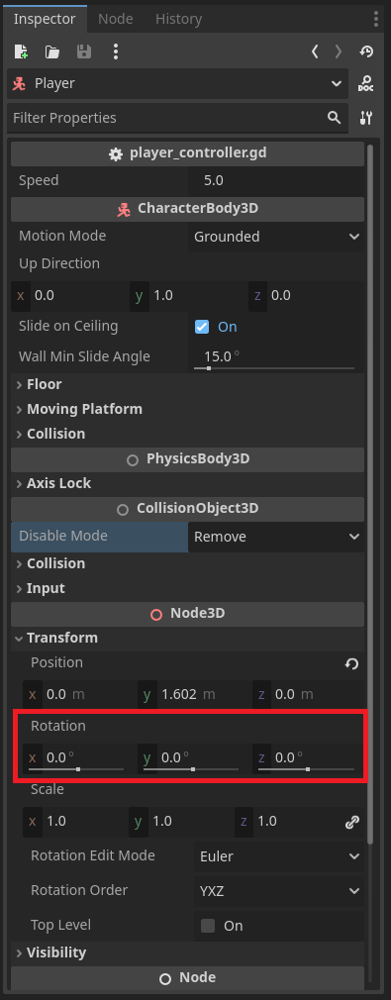

If you followed my instructions (and didn't just skip here) you can see that we want to change the `Y-axis`.

#### Setting the rotation by code
Now let's change the rotation in code. We can use the variable `rotation` (same name as the property in the inspector), which is declared by the `Node3D` class. 

> aside positive
> You might say, that our `Player` node is a `CharacterBody3D` and not a `Node3D`, so how can it use `rotation`. If you `CTRL+Click` on the `CharacterBody3D` text on the first line of the script, the documentation opens up. Here you can see the inheritance chain and that `CharacterBody3D` class inherits from `Node3D` class. That is why we can use the variables declared by it.
> 
> 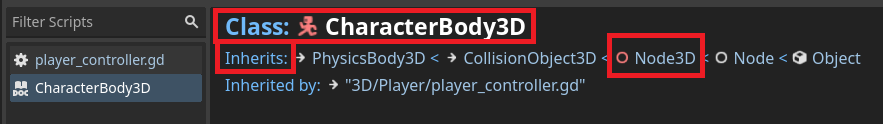
> To go back to the code simply click on it on the left panel (the left column on the image).

If we simply change the value of `rotation.y`. With the function looking like this:
```GDScript
func _rotate_player(delta) -> void:
    var angle : float = atan2(velocity.x, velocity.z) - PI
    rotation.y = angle
```

You might notice the player is rotating as they should but, the camera also rotates with them. That is because the `Camera3D` node is a child of the `Player` node, so all transformations are propagated.

#### Lerp - Theory
Right now the rotation is way too fast and disorienting, let's smooth it out over multiple frames. We can use what's called a `lerp()` function. Basically it calculates a value between `start_value` and `end_value` based on a coefficient from `0.0` to `1.0`. It is called like this `lerp(start_value, end_value, [0.0 - 1.0])` and the values do not have to be floats, it works with vectors, colors, etc.

Here are some examples:
- `lerp(0, 10, 0.4) = 4`.
- `lerp(-2, 6, 0.35) = 0.8`.
- `lerp(-70, 124, 1.0) = 124`.

> aside positive
> The underlying formula is `lerp(A, B, t) = (1-t)*A + B*t`. If you are interested and want to understand more I recommend watching this video: <video id=YJB1QnEmlTs></video>

#### Lerp - Rotate Smoothly
So, now instead of setting the angle directly, let's interpolate from the current `rotation` to the new one we want.
```GDScript
rotation.y = lerp(rotation.y, angle, ?)
```
However, what will the parameter `t` be? One option is to "just use some constant between `0.0 - 1.0`, so it looks good". This is a good idea, but it isn't framerate independent. If we run the `_physics_process()` at 60FPS the interpolation will be much faster than at 30FPS. (nice example can be seen in the video above at 6:58)

We need to compensate for the actual time, that has passed between the last call of the `_physics_process()` and now. That is exactly where **delta** comes in. The parameter that can be seen in `_process()` and `_physics_process` called `delta` is the time in seconds that has passed between the last and current frame.

Ok, so delete the line:
```GDScript
rotation.y = angle
```
and replace it with:
```GDScript
rotation.y = lerp_angle(rotation.y, angle, rotation_speed * delta)
```
> aside positive
> We used `lerp_angle` instead of `lerp` because we are interpolating angles. The angle variant of `lerp` works the same way with the added benefit of handling edge cases, where the object crosses a full circle rotation (going from `360°` to `0°`). 

Where `delta` is the parameter from `_physics_process()` passed into the `_rotate_player()` function, and `rotation_speed` is a new new `@export` variable, that will control how fast the player rotates. 

#### Task
So additionally to make it all work:
1. Change the `_rotate_player()` function header and call to include `delta`.
2. Add the a new `@export` variable called `rotation_speed` of type `float`

Try to do it yourself and experiment with different `rotation_speed` values. Once you are done or stuck you can continue to the solution, which is in the next section.


## Simple Player Controller - Corrections
Duration: hh:mm:ss

### Solution
```GDScript

...
@export var rotation_speed : float = 4

...

func _physics_process(delta : float) -> void:
    _movement()
    _rotate_player(delta)
	
    move_and_slide()

...

func _rotate_player(delta : float) -> void:
    var angle : float = atan2(velocity.x, velocity.z) - PI
	
    rotation.y = lerp_angle(rotation.y, angle, rotation_speed * delta)
```
### Forward Correct Movement
Right now if you try to play the game, the player does rotate according to the direction they move. However, you might notice that the forward direction is always the`-Z-axis`. To change this, so that `W` (and `S`) will always move the player forward in the direction they are facing, we need to have a look at the `_movement()` function again.

Let's create a `Vector3` from the axes we saved from the input. We will do this in a way, that it will represent the direction we want to move in the coordinate space of the player.

```GDScript
var direction : Vector3 = Vector3(x_axis, 0, -z_axis)
```

Now we need to transform this `direction` based on how the player is rotated/scaled/sheered in the world. Luckily the `Node3D` class has just the thing for us and that is the **basis** of the node.

> aside positive
> If you don't remember, what a **basis** is from your linear algebra class. In short, it is a matrix, that represent the transformation from the Standard/Canonical Basis to our new basis (in this case the basis of the `Player` node).

If we multiply the **basis** with the the `direction` of movement it will be transformed in to the coordinate space of the player. This new transformed direction can be used to move the player forward (in relation to their rotation). Making these changes to our `_movement()` function looks like this:

```GDScript
func _movement() -> void:
    var x_axis : float = Input.get_axis("left", "right")
    var z_axis : float = Input.get_axis("backward", "forward")
	
    var direction : Vector3 = Vector3(x_axis, 0, -z_axis)
    direction = basis * direction
	
    velocity = direction * speed
```
> aside negative
> Mind that, we can use the whole `direction` vector multiplied with speed and set it directly to `velocity` instead of doing it per axis.

### Rotation Correction
Try to play the game and see how it handles. You might notice that, while you are moving everything seems to work fine. Once you stop moving though, the player rotates back to face the `+Z-axis`. If we look at the implementation of our `_rotate_player()` function, you might notice the culprit.

When we are not moving the `angle` variable is always set to `-PI`. That is why the player always rotates to face the `+Z-axis`. The fix is straightforward. We will simply not rotate the player, if they are not moving. You can do that by adding the following line at the start of the `_rotate_player()` function:
```GDScript
if abs(velocity.x) < 0.01 and abs(velocity.z) < 0.01: return
```

> aside positive
> A few notes to the line above:
> 1. The constant `0.01` is just an arbitrarily small number, since comparing float number directly with `== 0` does not work due to their imprecise nature.
> 2. We need use the absolute value of the velocity. If we didn't the problem would still be present when moving in the negative axes.

### Speed Correction
You might have or might have not noticed, that moving diagonally is faster than moving in just one direction. The code for movement looks correct, so where is the problem? 

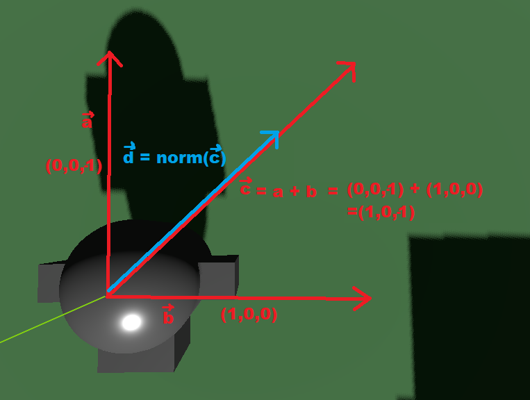
Looking at this image we can see
- vector `a` = negative Z-axis input
- vector `b` = positive X-axis input
- vector `c` = `a`+`b`, which we are doing in code
- vector `d` = our ideal `direcion` vector

The problem should be apparent right now. While we are moving only in one direction the `direction` vector has the length of `1`, but when moving diagonally the `direction` vector has the length of `√2`. To fix this we will simply **normalize** the `direction` vector before we set it to velocity.

```GDScript
direction = direction.normalized()
```

The final resulting code should look like this and the Player Controller should behave like this:

<video id=Vb7btu0sYBg></video>


## Simple Player Controller - Gravity
Duration: hh:mm:ss

If you tried to go over the edge of the platform or you moved the player high enough, you might have noticed, that the player doesn't fall down.

This is because `CharacterBody3D` does not account for **gravity** by default and you need to add it manually in a script. Let's do it.

### Gravity Code
1. Add an another `@export` variable called `gravity` (default value `-9.81`)
2. Create a new function called `_apply_gravity` with a float parameter of `delta`
3. Call the new function in `_physics_process()`

Now applying gravity the gravity can be done by adding this line to the new function.
```GDScript
velocity.y += gravity * delta
```

### Movement Correction
If you play the game now, the player falls very slowly and with a constant speed. That is not how it should work. If you were to print out the value of velocity at the beginning and end of the `_physics_process()` function, you would see that the `y` component is constant, which confirms our suspicion.

How to fix this? If we look at the `_movement()` function, we can see that we are setting the value of `velocity`, even the `y` component. Since this function only handles horizontal movement we should not change the `y` component. Here is the old line:
```GDScript
velocity = direction * speed
```
replace it with these lines:
```GDScript
velocity.x = direction.x * speed
velocity.z = direction.z * speed
```

Now if you start the game and go off the edge of the platform the player falls.

> aside positive
> Usually games have higher gravity than the one on earth. It is more fun that way. If you want to play with the gravity parameter I recommend placing the player high up or close to the edge.

### Why are we adding gravity every frame?
Gravity is a force that **continuously** accelerates a body. In a game engine we can only apply forces (or run code) on a per frame basis -> **discrete**. However, with the parameter of `delta` we can compensate for the time that has passed between the frames.

`delta` tells us how much time in seconds had passed since the last frame and the `gravity` variable we declared is in units of `m/s`.


## Simple Player Controller - Jump
Duration: hh:mm:ss

Now that our player falls, let's make him jump!

### Another functionality, another function
Same as with the applying of the gravity we want to create a new function `_jump()` and a new `@export` variable `jump_force`.

```
@export var jump_force : float = 10
...

func _physics_process(delta : float) -> void:
    ...
    _jump()
...

func _jump() -> void:
    pass
```

### New input
We would like to make the player jump with `SPACE`, so let's add a new input action `jump` with this keybinding in the **Project Settings**.
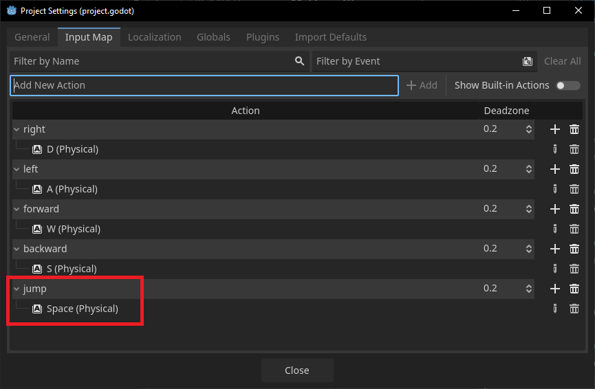


### How to jump?
Jumping can be implemented in many different ways and it always depends on the game, that we are making. One way is to apply a **continuous force** while the player is holding the jump button (for a limited time), which makes the jump very responsive. Another, simpler way, which we will implement, is to apply an **instant force** as the jump.


### Jump Function Code
#### Jump Force
To apply the jump force we will simply set the the `velocity.y` to the value. Like this:
```GDScript
velocity.y = jump_force
```

However, this just sets the force every frame. We want to set it only when certain **conditions** are met. We will structure the function in a way, where we will first check all the conditions, return if they are not met and then apply the jump force.

#### Input
The first condition will be if the player has just pressed the jump button. In Godot there is a neat function `Input.is_action_just_pressed()` for it, which will tell us just that. So the first condition will look like:
```GDScript
if not Input.is_action_just_pressed("jump"): return
```
> aside positive
> - ` Input.is_action_just_pressed()` tests if the action was pressed this frame.
> - `Input.is_action_pressed()` tests if the action.


#### Ground
If you play the game now, you might notice, that you can jump as many times as you want, even in the air. So the second condition we would like to check is if we are on the ground. Luckily `CharacterBody3D` provides is with a function called `is_on_floor()`, which tells us exactly that. The condition will look like this:

```GDScript
if not is_on_floor(): return
```

> aside positive
> Some of you might be wondering if calling the `is_on_floor()` every frame is hindering our performance in any way. Well, since Godot is open-source, we can check the [Source Code](https://github.com/godotengine/godot/blob/master/scene/3d/physics/character_body_3d.cpp#L633), and see what is happening behind the scenes. 
>
> Looking at the source code, we can see that it only returns a boolean `collision_state.floor`, so no expensive computation is happening here :)

#### Full function
The fully implemented jumping function should look like this:
```GDScript
func _jump() -> void:
    if not Input.is_action_just_pressed("jump"): return
    if not is_on_floor(): return
	
    velocity.y = jump_force
```

I suggest you play the game for a bit and test different values for the `gravity` and `jump_force` parameters, so that you can see how the values influence the player character.

<video id=3H-gvI9vTFc></video>


## Better Camera - Follow the Player
Duration: hh:mm:ss

Right now the behavior of the camera that follows the player is suboptimal. It could work for some games but I want the camera in this game to follow the player more smoothly.

### Separate the Camera
Let's remove the `Camera3D` node from the `Player` node and move it one step up, so that it is a **sibling** of the `Player` and not a child. This way it won't rotate and move the same way as the player and we will have to control this ourselves.

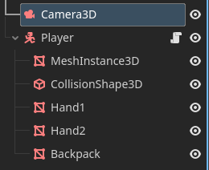

### Create a Camera Script
To control the camera ourselves, we need to create a new script.
1. Select the `Camera3D` node in the scene hierarchy
2. Press the 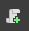 button on top of the scene hierarchy
3. Click the  in the popup window to change the path to `3D/Camera` (create the folder `Camera` if needed)
4. Rename the script (end of the path) to `player_camera_3d.gd`
5. The full path should look like `res://3D/Camera/player_camera_3d.gd`
6. Press **Create**

The script should open with just one line:
```GDScript
extends Camera3D
```

### Write the Camera Script
Now we need to fill out the script so that our camera **follows** the player and **rotates** with mouse movement. Let's split this up and focus on following the player for now.

#### Base framework
This is the base setup of the script for the camera to follow the player (or any target). Please **copy and paste** it into your script.
```GDScript
extends Camera3D

@export var camera_target : Node3D
@export var follow_speed : float = 2


func _physics_process(delta : float) -> void:
    _follow_target(delta)

func _follow_target(delta : float) -> void:
    pass
```
> aside positive
> We could have chosen `CharacterBody3D` instead of `Node3D` for the `camera_target` variable, because our camera will follow the player. However, it is always a good idea to use the **highest possible parent class** in the inheritance chain. In our case it is the `Node3D` class, since it stores 3D **position/rotation/scale** and allows the camera to follow any 3D object (it will come in handy ;) )

#### Follow the player
Now we need to implement the `_follow_target()` function. The camera should **smoothly follow** the player across multiple frames. If this rings a bell, it’s because linear interpolation (**lerp**) is ideal for this task. We used it when we wanted to rotate the player in the direction of their movement.

To change the position of a `Node3D` node (`Camera3D` class also inherits from it), we can modify the property/variable `position`. We did the same with rotation in the `_rotate_player()` function.

> aside negative
> The `position` variable handles the local position of a node. You can think of it as an offset from the parent node.
>
> If you want to change the location of a node in relation to the scene root you can use `global_position` instead.

If we put all of this together, the resulting line will be:
```GDScript
position = lerp(position, camera_target.position, follow_speed * delta)
```
You can think of it as moving the current `position` a bit closer to the `camera_target.position` every frame with a set speed.

> aside positive
> Remember to drag the `Player` node into the `Camera Target` property in the **Inspector**.

#### Adding an offset
Try running the game. You might notice that the camera does indeed smoothly follow the player. The problem is that it goes inside the player. The solution is to add an **offset**, which will dictate how far away the camera should stay from the player.

Declare a new `@export` variable `camera_offset` of type `Vector3`:

```GDScript
@export var camera_offset : Vector3 = Vector3(0, 2, 5)
```
and add it to the **target position** that we want the camera to be in:
```GDScript
position = lerp(..., camera_target.position + camera_offset, ...)
```

> aside positive
> Not all variables should have the `@export` annotation. However, we will want to easily change this parameter, to find the value that fits the game the best.


## Better Camera - Rotate with Mouse
Duration: hh:mm:ss

The camera should rotate around the player like in any **third-person** game.

### Getting the mouse input
The easiest way to gather how much the mouse has moved is to use the `_input()` function. This function is also part of the Godot lifecycle and is called every time on every node in the tree, when an user input happens.

The `_input()` function has a parameter `event` of type `InputEvent`, which tells us information about the input. In our case we will first check, if the input is of class type `InputEventMouseMotion` (mouse movement) and then we will call a new function `_rotate_camera`. We will also pass into the function, how much has the mouse moved since the last frame using `event.relative`.

```GDScript
func _input(event : InputEvent) -> void:
    if event is InputEventMouseMotion: 
        _rotate_camera(event.relative.x, event.relative.y)
```

### Rotate function
We can simply change the rotation of the camera using the property `rotation`. Let's also add an `@export` parameter for the camera sensitivity:

```GDScript
@export var camera_sens : Vector2 = Vector2(0.005, 0.003)

...

func _rotate_camera(x : float, y : float) -> void:
    rotation.x -= y * camera_sens.x
    rotation.y -= x * camera_sens.y
```

> aside negative
> The **X-axis** of the camera should be rotated by moving the mouse up and down - **Y-axis** of the mouse.
>
> The **Y-axis** of the camera should be rotated by moving the mouse left and right - **X-axis** of the mouse.

### Camera pivot scene setup
If you play the game now, the camera does rotate in place (ideal for **first-person** games). However, we are making a **third-person** game. In third person games the camera should rotate around the player (more abstractly a pivot point). Since we want the camera to follow smoothly after the player, let's add a pivot point `Node3D`. This pivot will have the camera as a child and will smoothly follow the player.

This should be the setup:

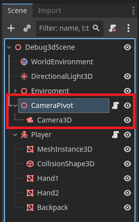

> aside negative
> Please **move** to script to the pivot and change the first line to extend `Node3D` instead of `Camera3D`.

### Camera offset correction
Now we also need to change how we use the `camera_offset` variable, so that it reflects our new setup. The offset should be applied to the child of the pivot - `Camera3D`. To access the child node we need a reference to it. We could make an another `@export` variable but the following way is easier and less error prone. Write this line just below the export variables:

```GDScript
@onready var camera_3d : Camera3D = $Camera3D
```

> aside positive
> The `@onready` annotation makes the variable assignment run in `_ready()` function. It is the same as doing:
> ```GDScript
> func _ready() -> void:
>   camera_3d = get_node("Camera3D")
> ```

> aside positive
> It is recommended to use these absolute node references `$node_name` if we are referencing a **child** of the current node and `@export` is we are referencing a node outside of the subtree of the current node.

Now we need to modify the `_follow_target()` function.
1. Remove the `camera_offset` addition in the lerp
2. Add the following line below the lerp
```GDScript
camera_3d.position = camera_offset
```

Try playing the game and the values of `camera_offset` and `follow_speed`.

### Camera limit
If you played around with the camera, you might have noticed that you can rotate the camera all the way around. Even to the point where it is **upside-down**. Let's add limits to the camera.

```GDScript
@export var camera_limit : Vector2 = Vector2(-60,60)

...
func _rotate_camera(x : float, y : float) -> void:

    ...
    rotation_degrees.x = clamp(rotation_degrees.x, camera_limit.x, camera_limit.y)
```

### Locking the mouse
The camera only responds to the mouse if the mouse is inside the **Game** view. Let's lock the mouse inside it, so that we can easily look around.

This part is quite easy just add this function to the camera script:
```GDScript
func _ready() -> void:
    Input.mouse_mode = Input.MOUSE_MODE_CAPTURED
```

> aside positive
> To stop playing the game press **F8** or press the **Windows Key** to escape the mouse.


## Better Camera - Raycast
Duration: hh:mm:ss

Right now if you move the camera, it can go inside of objects and walls. This is can be fixed by **raycasting**. Raycasting is the process of shooting a ray from a given position in a given direction until it reaches its maximum distance or a physics object.

We will use **raycasting** to shoot a ray from the `CameraPivot` to the `Camera3D` and if any object is in the way, we will set the camera offset to that point.

### RayCast3D
Let's add a `RayCast3D` node as a child of the `CameraPivot`. Now we will interact with it in the `player_camera_3d.gd` script. To get the reference to it. add the following line to the top of the script:

```GDScript
@onready var raycast_3d : RayCast3D = $RayCast3D
```


Delete the following line:
```GDScript
camera_3d.position = camera_offset
```
and paste these lines instead of it:
```GDScript
raycast_3d.target_position = camera_offset
	
if not raycast_3d.is_colliding():
    camera_3d.position = camera_offset
    return
	
var point : Vector3 = raycast_3d.get_collision_point()
point = to_local(point)
camera_3d.position = point
```

Let's go though the code and explain, what is happening.
1. First we set the `raycast_3d.target_position` to the camera offset.
2. Then we check if the raycast has hit something or if we should just use the camera offset.
3. Then we get the point (position), where the ray has hit the terrain.
4. Transform the point into the local coordinates of the camera pivot.
5. Then we set the offset.

### Problem 1 - Offset from surface
The raycasting now works pretty solidly, however you still might see inside the terrain when moving the camera close to the edges.

This can be fixed by moving the `point` in the direction of the normal vector of the hit terrain.


Add this line before the `to_local()` call:
```GDScript
point += raycast_3d.get_collision_normal() * 0.5
```

### Problem 2 - Change to ShapeCast3D
However, this only fixes our problem only partway. A better solution is to change `RayCast3D` to `ShapeCast3D`. This node works in a similar way to a raycast. Instead of shooting a ray in a direction, it shoots a shape in that direction and checks if it collides with anything.

These are the changes to be made:

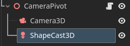 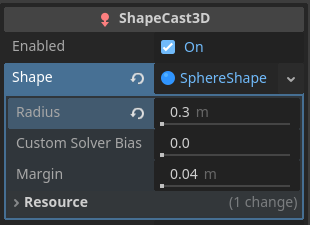

```GDScript
@onready var shapecast_3d : ShapeCast3D = $ShapeCast3D

...

func _follow_target(delta : float) -> void:
    position = lerp(position, camera_target.position, follow_speed * delta)

    shapecast_3d.target_position = camera_offset
	
    if not shapecast_3d.is_colliding():
        camera_3d.position = camera_offset
        return
	
    var point : Vector3 = shapecast_3d.get_collision_point(0)
    point += shapecast_3d.get_collision_normal(0) * (shapecast_3d.shape as SphereShape3D).radius
    point = to_local(point)
    camera_3d.position = point
```

### Problem 3 - Player collisions
Now the setup seems even more broken because it just shows the backpack of the player. This is because the `ShapeCast3D` is colliding with the player. We need to learn a bit about collision masks and layers.

#### Collision layer and mask
Each physics object has a physics layer and a physics mask. The **physics layer** tells the physics engine, what kind of physics object it is. The **physics mask** tells the physics engine, which physics layers is the object interested in (wants to be updated upon collision update with that layer).

Let's setup the layers and masks of the scene objects so that the shapecast only cares about the terrain (which is the default). Please use this video to set it up:
<video id=g9lYt3jF950></video>


The video also shows the result of this section.


## Player Controller - Camera forward 
Duration: hh:mm:ss

Now the player does not handle very well. I would like the player to move forward in the direction of the camera, not the player themselves.

### Change the basis
Open the `player_controller.gd` file and look in the `_movement()` function. If you remember, the movement direction is adjusted by the **basis** of the player. Let's try to change it to the basis of the camera.
1. Add an `@export` variable as a reference to the camera pivot.
2. Change the `direction` calculation to use the **basis** of the camera pivot

If we run the game now, it crashes with an error
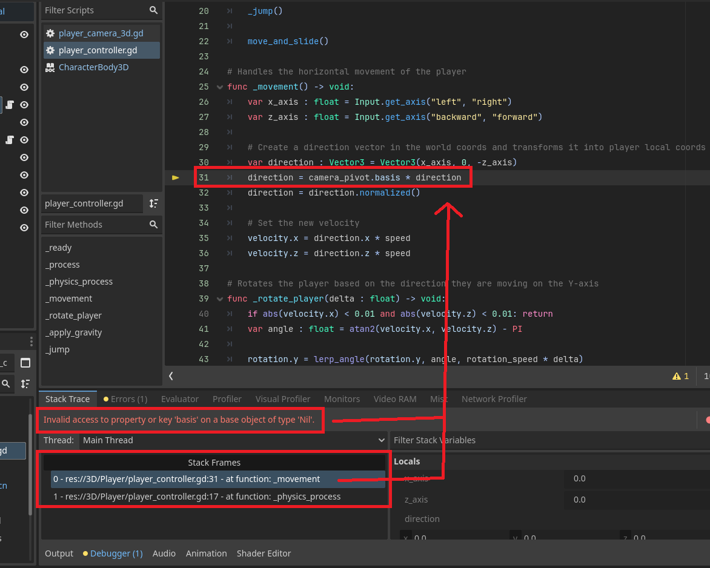

If we look at the error and the line it tells us the error is at, we can deduce that the `camera_pivot` must be `Nil` (null). That is indeed the case, because we forgot to set the reference to the camera pivot in the **Inspector** of the player script. Please set it.

### Wrong direction
If you are very observant, you might have noticed that when you are looking down, the player moves **slower** than when you are looking forward. This happens due to the way we are calculating the **direction** vector. Since the forward vector of the camera pivots basis can point down/up the resulting direction will be skewed by this.

An easy fix is to ignore the `y` component, while still normalizing the direction. The whole direction calculation will look like this:

```GDScript
var direction : Vector3 = Vector3(x_axis, 0, -z_axis)
direction = camera_pivot.basis * direction
direction.y = 0
direction = direction.normalized()
```

### The result
With all of this done, we have a pretty solid player controller and a third-person camera. You can always make it more responsive, more robust etc. (see bonus sections) but this is a very usable setup.

<video id=FGj33txMw3g></video>


## Bonus Task - Double jump 
Duration: hh:mm:ss

As a bonus let's add a double jump to our player. You can try it on your own.
1. Create a new function `_double_jump()` to handle this functionality
2. Create a "private" bool `_has_double_jumped` to remember if double jump has already happened
3. Reset the bool upon touching the floor
4. Check the double jump conditions


## Bonus Solution - Double jump 
Duration: hh:mm:ss

```GDScript
# Handles the double jump of the player, conditions, reset, and apply
func _double_jump() -> void:
    # Double jump reset when on ground
    if is_on_floor():
        _has_double_jumped = false
        return
	
    # Conditions
    if _has_double_jumped: return
    if not Input.is_action_just_pressed("jump"): return
	
    # Jump
    _has_double_jumped = true
    velocity.y = jump_force
```


## Bonus - Velocity-based player 
Duration: hh:mm:ss

This is a **optional** section, where we will expand on the Player Controller from previous sections. This version will not just override the **velocity** every frame but add to it. This will make the player have acceleration, deceleration, and inertia, which will feel more natural while remaining responsive. It is not strictly better or worse than the controller we already have. It always depends on the games you are making.

### Additional parameters
First, let's define some more `@export` variables.

```GDScript
@export var acceleration : float = 75
@export var dampening : float = 7
```

- **Acceleration** will control how fast will the player reach the max speed (`speed` parameter).
- **Dampening** will control how fast will the player slow down, when not pressing inputs.

### Add force to velocity
Next go to the `_movement()` function. Let's **add** the speed change of this frame to the velocity. Since we want add acceleration (meters per second) we need to pass the `delta` time.

Replace the:
```GDScript
velocity.x = direction.x * speed
velocity.z = direction.z * speed
```

with:
```GDScript
velocity.x += direction.x * delta * acceleration
velocity.z += direction.z * delta * acceleration
```

Playing the game now, you can see that the player easily accelerates the crazy speeds. It feels like being on an extremely slippery ice.

### Max speed
Now we need to clamp (limit) the max speed of the player based on the `speed` parameter. We also need to be careful not to limit the `Y` component, since that is controlled by gravity and jumping, not the `_movement()` function.

Let's create a new velocity variable with only the `x` and `z` components to test the max speed. Paste this code under the `velocity` change we added above:

```GDScript
var horizontal_velocity : Vector3 = Vector3(velocity.x, 0, velocity.z)
if horizontal_velocity.length() > speed:
    horizontal_velocity = horizontal_velocity.normalized() * speed
    velocity.x = horizontal_velocity.x
    velocity.z = horizontal_velocity.z
```

Now the player is much more controllable. However, the player still needs to decelerate because now the player just keeps sliding forever.

### Dampening
Simplest way to apply the dampening is to multiply the `velocity` with some number just under 1 (for example `0.998`). But of course we need to account for `delta` since this way the dampening would be much stronger with higher framerates.

Let's also check if the player wants to move `x_axis` and `z_axis` variables. So that we apply dampening only when the player doesn't want to move. This way the max speed will be consistent. Add this code below clamping of the max speed:

```GDScript
if abs(z_axis) < 0.01 and abs(x_axis) < 0.01:
    velocity.x *= 1 - dampening * delta
    velocity.z *= 1 - dampening * delta
```

### The Result
Now the player handles much better in my opinion. Try to play with the `acceleration`, `dampening`, and `speed` parameters to see how they influence the gameplay feel of the game.

<video id=4gKj2mov560></video>


## Recap
Duration: hh:mm:ss

Let's look at what we did in this lab.
- We added a `CharacterBody3D` with a test model, composed of several `MeshInstance3D` nodes 
- We learned how to **enter** our game
- Then we looked at the **GDScript** language and learned how to get the **player input**
- We finished the player controller with **rotation** in the movement direction, application of **gravity**, and **jumping** functionality
- Last thing we did in the mandatory part was making the **camera** follow the player and **rotate** it with mouse movements around a pivot point
- In the first **bonus** part we added **double jump** to our game
- Lastly in the second **bonus** part we implemented a **velocity-based** player controller