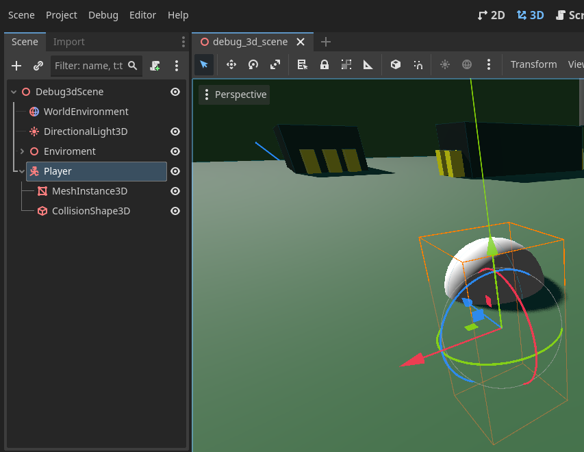
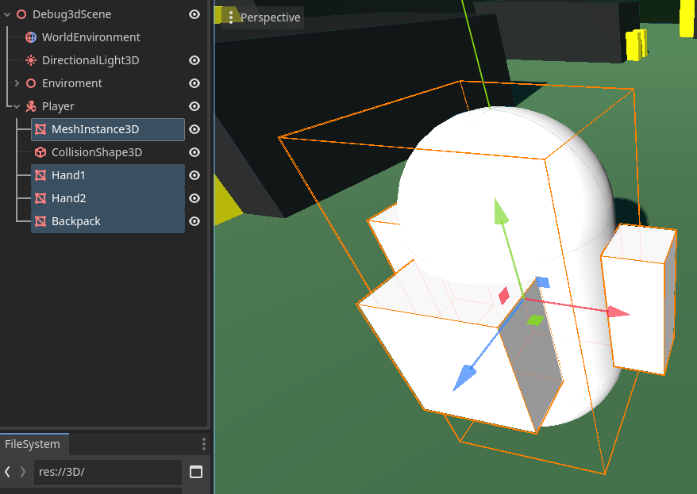
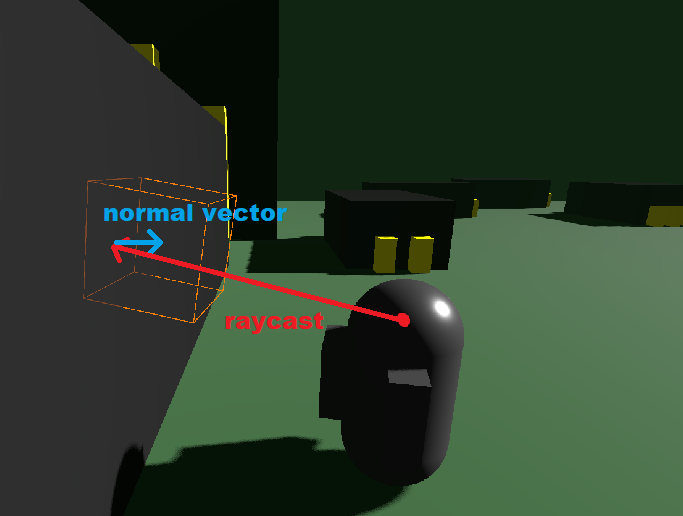

summary: 3D Player Character and Camera
id: export
categories: 3D, CharacterBody3D, 3D Player Controller, Camera3D, Materials, GDScript
status: Published
authors: Ondřej Kyzr
Feedback Link: https://forms.gle/J8eeuQAJ3wMY1Wnq7

# Lab02 - 3D Player Character and Camera

## Overview
Duration: hh:mm:ss

In this tutorial, we will:
- **Create** a debug character model
- Learn about different Godot "bodies" `CharacterBody3D`, `RigidBody3D`, `StaticBody3D`
- Learn the basics of programming in **GDScript**
- Learn about the **Game** window and how to start the game
- Add a **camera** to the scene
- Learn how to **gather input** from the player
- Create two different **player controllers** (both can be used depending on the game type)
- Make the **camera** follow the player (in 2 different ways)

Please download the template project that we will be using in this lab:
<button>
  [Template Project](https://cent.felk.cvut.cz/courses/39HRY/godot/02_Player/template.zip)
</button>


## Add a Player Character
Duration: hh:mm:ss

### Types of bodies
Similar to the previous lab, we need to add a node, this time to represent our player. Since our player will move in the world and interact with the physics system, we need to choose an appropriate node for the player. These are our choices:
- `StaticBody3D` - objects with collisions that do not move ❌
- `RigidBody3D` - objects with collisions that are moved by forces with the physics engine ✔️
- `CharacterBody3D` - objects with collisions that are meant to be user-controlled ✔️

Both `RigidBody3D` and `CharacterBody3D` are solid choices for us. The better choice will be the `CharacterBody3D` since it already implements many things that will come in handy (ground and wall detection, moving platforms, moving on slopes, etc.).


### Create the player node
Now that we know what node type the player will be, let's add it.
1. Add a `CharacterBody3D` node in the scene hierarchy as a child of the scene node ("Debug3dScene")
2. Rename it to **"Player"** (Right-click ⇾ rename)
3. Add a `MeshInstance3D` node as a child of the player and set the `Mesh` property to a `CapsuleMesh`
4. Add a `CollisionShape3D` node as a child of the player and set the collision shape to a `CapsuleShape3D`

The result should look something like this:


Please move the player up a bit so that they are not stuck in the ground.

> aside negative
> Be careful to move the `Player` node and **NOT** the mesh or collider of the player.


### Nicer player model
The player is now just a plain white capsule. Let's add hands and a backpack to make them look a bit nicer (before we change it to a 3D model in a future lab), and also learn a bit about materials.

#### Adding hands
1. Add a `MeshInstance3D` node as a child of the player and add a `BoxMesh` to it (Optionally rename it to "Hand1").
2. **Change** the size of the mesh to make it look more like a hand (I used `0.3, 0.8, 0.3`)
3. **Move** the hand on the **X-axis** so that it is on the side of the player (I moved it by `0.65`)
4. **Repeat** the steps 1-3 for the other hand, just move it to the other side of the player (negative X-axis)

After adding hands, the player should look like this:


#### Adding a backpack
The primary reason for adding a backpack is to easily tell which way the player capsule is facing, which will help us debug the movement controller later on.

Use the same process as we did in adding the hands to add a new `BoxMesh`, scale it, and move it.

> aside negative
> The coordinate system in Godot Engine uses the **Z-axis** in a way that `-Z == Forwards` and `+Z == Backwards`. So be sure to place the backpack on the **+Z** side of the player.


The player looks like this now (note the direction of the **blue arrow**, which indicates the **+Z** direction).


#### Giving the player some color
Let's give the player capsule some color.

1. Click on to the `MeshInstance3D` with the capsule mesh in the **Scene Hierarchy**
2. Click on the **CapsuleMesh** in the **Inspector**
3. Add a new `StandardMaterial3D` to the **Material slot**
4. **Click** on the created material
5. Set **Albedo** to gray
6. Set **Roughness** to `0.3`
7. Set **Metallic** to `0.5`

This makes the capsule look gray and shiny like a stereotypical robot. However, I would like to add the same material to the hands and the backpack.

I could manually set all the properties on each material of each object, but what if I decide later on that the robot will have a different color? ⇾ I would have to modify all the parts of the robot, which is not ideal.

#### Saving materials
Let's learn how to save materials, so we can reuse them on other meshes.

[](https://raw.githubusercontent.com/tutek1/DTLabs/refs/heads/main/02_Player/img/MaterialResourceSave.PNG)
1. **Select** the `MeshInstance3D` with the capsule
2. Click on the `Mesh` property with the **CapsuleMesh** in the **inspector**
3. Click on the **small arrow** next to the material that you created in the 7-step sequence above
4. Select **Save As**
5. In the new popup window: **change the name** to `player_material.tres`
6. **Navigate** to folder `3D/Player`
7. Click **Save**

Now we have saved the material as a **Resource**.

> aside positive
> **Resources** can represent many types of data (materials, shaders, tile sets, fonts, scenes, animations, etc.) that can be saved on the disk. They cannot be used on their own; instead, their data is used by nodes.


#### Applying materials
Now we can apply the **saved material** to the hands and backpack. Please follow the steps in this video.
<video id=AVk8pqCkRpA></video>

> aside negative
> If you used the material on **one of the hands** of the robot and the other one had it also applied, it means that you used the same mesh for both of the hands, probably because you **duplicated** the first hand. This is not wrong, since we want both hands to look the same. However, keep it in mind because sometimes this is not the behavior we want.


## Entering Play Mode
Duration: hh:mm:ss

### Pressing play
In this section, we will take a brief detour to explore how to play and test our game. It can be done easily by pressing the **Run current scene** button at the top right. 

However, right now, if you **press the button** all you can see is a gray screen. This happens because there is no camera in the scene through which we would be able to see the game world.

> aside positive
> Press `F8` or `ALT+F4` if all you can see is a full-screen of gray and cannot get out of it.


### Adding a camera
To solve this, add a new `Camera3D` node to the scene as a **child** of the root (Debug3dScene) and **move/rotate** it so that the player is in view. For example, like this:


Now, if you press play, you can see the game world. Yippee!

> aside positive
> If your game still starts in **"full-screen"**, I recommend setting the embedding options in the same way as shown in the next image. It makes the **game window** embed inside the editor, and you can still use the other panels even when fullscreen is toggled.
> 

### Making something happen
Now, if you play the game, you can notice that **nothing happens**. That is because we have not added any interactive stuff to it. I have prepared a **basic script** in the `3D/Player` folder, called `player_controller.gd`.

Please attach this script to the player by **dragging** the script from the **FileSystem** onto the `Player` node.

Now, when you enter play mode, you can change the `Speed` parameter (a Vector3) by typing in values or dragging your mouse over the value to make the player move in all three cardinal directions.
<video id=cKfvzk0Y6uo></video>


This is far from perfect or even playable (since the **inspector** is not available in the final game), but it will suffice for messing around before the next section.

> aside negative
> Notice that the changes made in **Play** mode to the `Speed` parameter are still present even after exiting.


## Basics of GDScript
Duration: hh:mm:ss

Let's **open the script** that we added to the player in the previous section. You can do that by:
1. Either click the  next to the `Player` node in the scene hierarchy.
2. Or double-click the script file in the **FileSystem**


As you can see, the syntax of **GDScript** is very similar to **Python**. Each script can be thought of as a class that extends the node's functionality. The first line tells us what class the script **extends**. In our case, it is the player, and their class type is a `CharacterBody3D`.

### Variables
Every variable declaration needs to start with the keyword `var`. The variable **name** follows next, and after it the symbol `:` with a type declaration.

There are many variable types, ranging from the classic **float**, **bool**, **int**, and **Vector** to more specialized ones. You can see all the base types here in the documentation [Variant class](https://docs.godotengine.org/en/stable/contributing/development/core_and_modules/variant_class.html).

The variable on line 3 `speed`, which we used in the previous section, has the annotation of `@export`. This annotation instructs the engine to make the element visible and changeable from the **Inspector**. Without the annotation, we wouldn't be able to change the variable value as we did in the last section. We will come across different annotations in due time.

> aside positive
> You do not have to declare the variable types, but it is **recommended**. Declaring variable types improves performance and helps Godot autocomplete your lines more often.  

### Functions
In **GDScript**, a function is declared with the keyword `func`. The keyword is followed by **the name** of the function and **parameters** with types in brackets. Before closing the function header with `:`, it is a good practice to declare the return type with `-> type`.

> aside negative
> **GDScript** does not have `private/protected/public` modifiers for functions or variables. The [styling guide](https://docs.godotengine.org/en/stable/tutorials/scripting/gdscript/gdscript_styleguide.html) suggests that the name of the variable should reflect its access. Private functions and variables should start with an `_`.

### Lifecycle of a Godot node
You may be wondering what the **methods** present in the script actually do and when they are invoked. That is where the Godot lifecycle comes into play.

In Godot, every node automatically calls several **virtual functions** as it gets created, added to the tree, and so on. The importance of these functions can be seen in this simple enemy example:
- When the enemy is **spawned/created**, it will play an animation -> `_ready()`
- While the enemy is **alive**, it will chase the player -> `_process()` or `_physics_process()`
- After the enemy is **defeated**, it will drop some coins -> `_exit_tree()`

Ok, what are the functions? Here is a list of some of them in the order that they are called:
- `_init()` is called **once** when the node is created, it is the same as a constructor in OOP
- `_enter_tree()` is called **every time** the node is added as a child of another node in the scene tree
- `_ready()` is called **once** when the node and all of its children have been created and are also ready
- `_process()` is called **every frame** and depends on the current framerate of the game (how many FPS does the game run at)
- `_physics_process()` is called **every physics frame**, that means that every time the physics engine in the game updates, this function is called. The rate of calls depends on the set FPS of the physics engine
- `_exit_tree()` is called **every time** a node is removed from the scene tree

The most important ones for us are the `_ready()`, `_process()`, and `_physics_process()` functions. They are the backbone of almost every script and node.

### Back to the script
Let's now look back at the script:


We can see that the `_ready()` and `_process()` functions simply use the `pass` keyword, meaning that nothing happens within them. However, the function `_physics_process()`, which is called every time the physics engine updates, does two things:
- Sets the variable `velocity = speed`.
- Calls the function `move_and_slide()`.

The variable `velocity` is declared by the `CharacterBody3D` class, which we are extending. It is a `Vector3` that represents the character's current speed in each cardinal direction.

The function `move_and_slide()` is also declared by the `CharacterBody3D` class. It is responsible for moving the character based on the current value in the `velocity` variable.

> aside negative
> If we only set the `velocity` of the player and didn't call the `move_and_slide()` function. The player would not move at all. 


## Basic Player Input Pt 1
Duration: hh:mm:ss

Now we know how to move the player on a given axis by manually setting it in the **Inspector**, let's make it so that it responds to `W, A, S, D` instead. Almost all games respond to the player's input, and in this section, we will look at how to **gather the input** from the player.


### Adding actions and keys to the Input map
Input in Godot is handled with **input actions**. Each action should correspond to a type of input you want to detect. For example, Jumping will be its own action "jump", and in a 2D game, it can be triggered by `W` or `SPACE`. This way, we don't have to remember what keys are set for each action. We just have to remember what action we want to check for. It allows us to change/add **keybindings** or **controller support** easily without rewriting or adding code.

You can follow this video or the step-by-step below to add the keys and actions we want to listen for.

<video id=xlwMBYhpBUE></video>

1. On the top left panel, click on **Project**.
2. Click on **Project Settings**.
3. Switch the tab (if not there already) to **Input Map**.

We are now in the input map. Here, you can add all the actions and keys that the game should listen for.

1. Click on the text input box with **Add New Action** text.
2. Let's start with moving right. Write `right` in the text box and press the **+ Add** button.
3. Now click the **+** button next to the newly added action.
4. Now **press the key** that you want the player to press to move right (I suggest `D`)
5. Press **Ok**

This way, we added the action `right`, which will be responsible for moving the player right, with the keybinding of `D`. Please continue in the same way and add actions `left`, `forward`, and `backward` with the corresponding keys. The result should look like this:


### Using the input in code
Now close the **Project Settings** window and let's get back to the **player_controller.gd** script.

If we want to know if an action is pressed, we can use `Input.is_action_pressed("action")`, which returns a `bool`. However, we are checking for player movement. Since this movement is along an axis, it is better to use `Input.get_axis("negative_action", "positive_action")`. Let's try to **call** it with the X-axis movement and **print** its value.

#### Getting the input
Add these two lines at the beginning of the `_physics_process()` function:
```GDScript
var x_axis : float = Input.get_axis("left", "right")
print(x_axis)
```

Now start the game with , try pressing `A` and `D`, and watch the **Output** console window at the bottom of the editor.

You should see:
- `1.0` is being printed when `D` is pressed
- `-1.0` is being printed when `A` is pressed
- `0.0` is being printed when nothing is pressed or both `D` and `A` are pressed

#### Apply the Input
Ok, this should help us move the player, and it will be easier than checking each of the two 2 inputs separately. Let's set the `velocity` on the **X-axis** to this value like this:
```GDScript
velocity.x = x_axis
```
Now, when you start the game, the player should react to pressing `A` and `D` by slowly moving left and right. 

> aside positive
> Notice that our code runs in the `_physics_process()` function. This is because of 2 reasons:
> 1. We want the player to respond to our inputs. That means we need to check for changes very quickly, ideally every frame.
> 2. We could simply use the `_process()` function, but since we are working with a `CharacterBody3D`, which uses physics, we use the `_physics_process()` to synchronize our changes with the physics engine. This avoids visual artifacts and physics glitches.

#### Task
Let's do the same with the **Z-axis**, but try it on your own. If you are stuck, proceed to the next section, which contains the solution.


## Basic Player Input Pt 2
Duration: hh:mm:ss

### Solution
Ok, the full `_physics_process()` function should look like this:

```GDScript
func _physics_process(delta : float) -> void:
    var x_axis : float = Input.get_axis("left", "right")
    var z_axis : float = Input.get_axis("backward", "forward")
	
    velocity.x = x_axis
    velocity.z = -z_axis
    move_and_slide()
```

> aside positive
> Notice, that we used `-z_axis` instead of `z_axis`. That is because the **negative Z-axis** is considered the **forward** direction in Godot Engine. 

### Make the player faster
Playing the game, we can see that the player moves quite slowly. To change this, we can multiply the values assigned to the `velocity` variable. Multiply both of these values by `5` and try it in the game. I would say this speed seems fine. However, what if we wanted to change it later on? We would have to find all lines where we multiply the velocity by `5`, which is not ideal.

Let's change the **exported** variable `speed` to a float (since we no longer use it), set its default value to `5`, and replace the `* 5` with it.
```GDScript
@export var speed : float = 5
...
func _physics_process(delta : float) -> void:
...
    velocity.x = x_axis * speed
    velocity.z = -z_axis * speed
```
Now, if we look in the **Inspector** with the `Player` node selected, we can see the `Speed` parameter and change it. Start the game, move around, and change the value of `Speed` to see how the player responds to the changes.


## Simple Player Controller - Rotation
Duration: hh:mm:ss

Let's make a few tweaks and complete this very simple player controller. It won't be pretty, but it could be used in simpler games.

### Camera follow
You may have noticed that the player can easily move out of the camera's view. To make the camera follow the player in a very simple way, **drag-and-drop** the `Camera3D` node in the **scene hierarchy**, so that it is a child of the `Player` node. Now, when you start the game, the camera **stiffly** follows the player around. Try it!


### Rotate the player
It would be nice if the player would look in the direction they are moving. Let's add this functionality.

#### Cleanup
First, we should clean up our code a bit. Since the code we have written handles movement, let's create a function called `_movement()` and move all the code there, and call it in `_physics_process()`. We can also apply the same approach to the code we are about to write for player rotation.

This should be the resulting code.
```GDScript
func _physics_process(delta : float) -> void:
    _movement()
    _rotate_player()

    move_and_slide()

func _movement() -> void:
    var x_axis : float = Input.get_axis("left", "right")
    var z_axis : float = Input.get_axis("backward", "forward")

    velocity.x = x_axis * speed
    velocity.z = -z_axis * speed

func _rotate_player() -> void:
    pass
```

> aside positive
> Always try to split up the code into **robust**, **logical**, and **reusable** functions. You will thank yourself later ;)

#### The rotation angle
Using linear algebra, we can calculate the angle by which the player should be rotated. We are interested in the `X` and `Z` direction of the player velocity. Place the following code snippet in the `_rotate_player()` function.

```GDScript
var angle : float = atan2(velocity.x, velocity.z) - PI
```

This gives us the degrees by which the player should be rotated. It might be clearer to look at the image below, where the value we are calculating is `45°`.


#### The rotation axis
Now we have the angle that the player needs to be rotated by. Where do we set it? Let's find it out experimentally.
1. Go to the **3D scene view**
2. Select the `Player` node in the **scene hierarchy** and look at the **Inspector**
3. Try to rotate the player manually using the **Rotation** property, to find out which axis makes the player look left and right


If you followed my instructions (and didn't just skip here), you can see that we want to change the `Y-axis`.

#### Setting the rotation by code
Now let's change the rotation in code. We can use the variable `rotation` (same name as the property in the inspector), which is declared by the `Node3D` class. 

> aside positive
> You might say that our `Player` node is a `CharacterBody3D` and not a `Node3D`, so how can it use `rotation`? If you `CTRL+Click` on the `CharacterBody3D` text on the first line of the script, the documentation opens up. Here you can see the inheritance chain and that `CharacterBody3D` class inherits from `Node3D` class. That is why we can use the variables declared by it.
> 
> 
> To go back to the code, simply click on it in the left panel (the left column in the image).

If we simply change the value of `rotation.y`. With the function looking like this:
```GDScript
func _rotate_player(delta) -> void:
    var angle : float = atan2(velocity.x, velocity.z) - PI
    rotation.y = angle
```

You might notice the player is **instantly** rotating as they should, but the camera also rotates with them. That is because the `Camera3D` node is a child of the `Player` node, so all transformations are propagated.

### Lerp - Theory
Currently, the rotation is too fast and disorienting. Let's smooth it out over multiple frames. We can use a function called `lerp()`. Basically, it calculates a value between `start_value` and `end_value` based on a coefficient from `0.0` to `1.0`. It is invoked like this `lerp(start_value, end_value, [0.0 - 1.0])` and the values do not have to be just floats; it works with vectors, colors, etc.

Here are some examples:
- `lerp(0, 10, 0.4) = 4`.
- `lerp(-2, 6, 0.35) = 0.8`.
- `lerp(-70, 124, 1.0) = 124`.

> aside positive
> The underlying formula is `lerp(A, B, t) = (1-t)*A + B*t`. If you are interested and want to understand more, I recommend watching this video: <video id=YJB1QnEmlTs></video>

### Lerp - Rotate Smoothly
So now, instead of setting the angle directly, let's interpolate from the current `rotation` to the new one we want.
```GDScript
rotation.y = lerp(rotation.y, angle, ?)
```
However, what will the parameter `t` be? One option is to "just use some constant between `0.0 - 1.0`, so it looks good". This is a good idea, but it isn't **framerate independent**. If we run the game and the `_physics_process()` at 60 FPS, the interpolation will be much faster than at 30 FPS. (A nice example can be seen in the video above at **6:58**)

We need to compensate for the actual time that has passed between the last call of the `_physics_process()` and now. That is exactly where the parameter of **delta** comes in. The parameter that can be seen in `_process()` and `_physics_process` called `delta` is the time in seconds that has passed between the last and current frame.

Ok, so delete the line:
```GDScript
rotation.y = angle
```
And replace it with:
```GDScript
rotation.y = lerp_angle(rotation.y, angle, rotation_speed * delta)
```

Where `delta` is the parameter from `_physics_process()` that you need to pass into the `_rotate_player()` function, and `rotation_speed` is a new `@export` variable that you need to add, which controls how fast the player rotates. 

> aside positive
> We used `lerp_angle` instead of `lerp` because we are interpolating angles. The angle variant of `lerp` works the same way with the added benefit of handling edge cases, where the object crosses a full circle rotation (going from `360°` to `0°`). 

#### Task
So, additionally, to make it all work:
1. Change the `_rotate_player()` function header and call to include `delta`.
2. Add a new `@export` variable called `rotation_speed` of type `float`.

Try to do it yourself and experiment with different `rotation_speed` values. Once you are **done** or **stuck**, you can continue to the solution, which is in the next section.


## Simple Player Controller - Corrections
Duration: hh:mm:ss

### Solution
```GDScript

...
@export var rotation_speed : float = 4

...

func _physics_process(delta : float) -> void:
    _movement()
    _rotate_player(delta)
	
    move_and_slide()

...

func _rotate_player(delta : float) -> void:
    var angle : float = atan2(velocity.x, velocity.z) - PI
	
    rotation.y = lerp_angle(rotation.y, angle, rotation_speed * delta)
```
### Forward Correct Movement
Currently, when you attempt to play the game, the player rotates according to the direction they move. However, you might notice that the forward direction is always the **negative Z-axis**. To change this so that `W` (and `S`) will always move the player forward in the direction they are facing, we need to take a look at the `_movement()` function again.

Let's create a `Vector3` from the axes we gathered from the input. We will do this in a way that represents the direction we want the player to move in, from the player's perspective (their coordinate space).

```GDScript
var direction : Vector3 = Vector3(x_axis, 0, -z_axis)
```

Now we need to transform this `direction` based on how the player is rotated/scaled/sheered in the world. Luckily, the `Node3D` class has the solution, and that is the **basis** of the node.

> aside positive
> If you don't remember what a **basis** is from your linear algebra class, it is a matrix that represents the transformation from the Standard/Canonical Basis to another basis (in this case, the basis of the `Player` node).

If we multiply the **basis** by the `direction` of movement, the `direction` will be transformed into the coordinate space of the player. This new transformed direction can be used to move the player forward (in relation to their transformation). Making these changes to our `_movement()` function looks like this:

```GDScript
func _movement() -> void:
    var x_axis : float = Input.get_axis("left", "right")
    var z_axis : float = Input.get_axis("backward", "forward")
	
    var direction : Vector3 = Vector3(x_axis, 0, -z_axis)
    direction = basis * direction
	
    velocity = direction * speed
```
> aside negative
> Mind that we can use the whole `direction` vector multiplied by speed and set it directly to `velocity` instead of doing it per axis.

### Rotation Correction
Try to play the game and see how it handles. You might notice that while you are moving, everything seems to work fine. Though once you stop moving, the player rotates back to face the `+Z-axis`. Upon examining the implementation of our `_rotate_player()` function, you may notice the culprit.

When we are not moving, the `angle` variable is set to `-PI`. That is why the player always rotates to face the `+Z-axis`. The fix is straightforward. We will simply not rotate the player if they are stationary. You can do that by adding the following line at the start of the `_rotate_player()` function:
```GDScript
if abs(velocity.x) < 0.01 and abs(velocity.z) < 0.01: return
```

> aside positive
> A few notes to the line above:
> 1. The constant `0.01` is just an arbitrarily small number, since comparing a `float` number directly with `== 0` does not always work due to their imprecise nature.
> 2. We need to use the absolute value of the velocity. If we didn't, the problem would still persist when moving in the direction of negative axes (a speed of `-1` still indicates the player is moving).

### Speed Correction
You might not have noticed that moving diagonally is **faster** than moving in just one direction. The code for movement appears to be correct, so where is the problem? 


Looking at this image, we can see
- vector `a` = negative Z-axis input
- vector `b` = positive X-axis input
- vector `c` = `a`+`b`, which we are doing in code
- vector `d` = our ideal `direction` vector

The problem should be apparent at this point. While we are moving only in one direction, the `direction` vector has a length of `1`. However, when moving diagonally, the summed-up `direction` vector has a length of `√2`. To fix this, we will simply **normalize** the `direction` vector before we set it to velocity.

```GDScript
direction = direction.normalized()
```

The final resulting code should look like this, and the Player Controller should behave like this:

<video id=Vb7btu0sYBg></video>


## Simple Player Controller - Gravity
Duration: hh:mm:ss

If you tried to go over the edge of the platform, or you manually moved the player high enough, you might have noticed that the player doesn't **fall**.

This is because the `CharacterBody3D` does not account for **gravity** by default, and we need to add it manually in a script. Let's do it.

### Gravity Code
1. **Add** another `@export` variable called `gravity` (default value `-9.81`)
2. **Create** a new function called `_apply_gravity` with a float parameter of `delta`
3. **Call** the new function in `_physics_process()`

Now, applying the gravity can be done by adding this line to the new function.
```GDScript
velocity.y += gravity * delta
```

#### Why are we adding gravity every frame?
Gravity is a force that **continuously** accelerates a body. In a game engine, we can only apply forces (or run code) on a per-frame basis, which makes time **discrete**. However, with the parameter of `delta`, we can compensate for the time that has passed between the frames.

`delta` tells us how much time in seconds has passed since the last frame.


### Movement Correction
If you play the game now, the player falls very slowly and at a constant speed. That is not how it should work. If you were to print out the value of velocity at the **beginning** and **end** of the `_physics_process()` function, you would see that the `y` component is constant, which confirms our suspicion because the gravity should **accelerate** the body.

How to fix this? If we look at the `_movement()` function, we can see that we are setting the value of `velocity`, even the `y` component. Since the `_movement()` function only handles horizontal movement, we should not change the `y` component. Here is the old line:
```GDScript
velocity = direction * speed
```
Replace it with these lines:
```GDScript
velocity.x = direction.x * speed
velocity.z = direction.z * speed
```

Now, if you start the game and go off the edge of the platform, the player falls as they should.

> aside positive
> Usually, games have **higher gravity** than the one on Earth. It is more fun that way. If you want to experiment with the gravity parameter, I recommend placing the player high up or near the edge.


## Simple Player Controller - Jump
Duration: hh:mm:ss

Now that our player falls, let's make the player jump!

### Another functionality, another function
Same as with the application of the gravity, we want to create a new function `_jump()` and a new `@export` variable `jump_force`.

```
@export var jump_force : float = 10
...

func _physics_process(delta : float) -> void:
    ...
    _jump()
...

func _jump() -> void:
    pass
```

### New input
We would like to make the player jump with `SPACE`, so let's add a new input action `jump` with this keybinding in the **Project Settings**.


### How to jump?
Jumping can be implemented in many ways, and it always depends on the game being made. One way is to apply a **continuous force** while the player is holding the jump button (for a limited time), which makes the jump very responsive. Another, simpler way, which we will implement, is to apply an **instant force** as the jump.


### Jump Function Code
#### Jump Force
To apply the jump force, we will simply set the `velocity.y` to the value. Like this:
```GDScript
velocity.y = jump_force
```

However, this just sets the force every frame. We want to set it only when certain **conditions** are met. We will structure the function so that it first checks all the **conditions**, **returns** if they are not met, and then **applies the jump force**.

#### Input
The first condition is that the player has just pressed the jump button. In Godot, there is a neat function `Input.is_action_just_pressed()`, which tells us exactly that. So the first condition will look like:
```GDScript
if not Input.is_action_just_pressed("jump"): return
```
> aside positive
> - ` Input.is_action_just_pressed()` tests if the action has begun between the last and the current frame.
> - `Input.is_action_pressed()` tests if the action is pressed.


#### Ground
If you play the game now, you might notice that you can jump as many times as you want, even in the air. So the second condition we would like to check is whether we are on the ground. Luckily, `CharacterBody3D` provides us with a function called `is_on_floor()`, which tells us exactly that. The condition will look like this:

```GDScript
if not is_on_floor(): return
```

> aside positive
> Some of you might be wondering if calling the `is_on_floor()` every frame is hindering our performance in any way. Well, since Godot is **open-source**, we can check the [Source Code](https://github.com/godotengine/godot/blob/master/scene/3d/physics/character_body_3d.cpp#L633), and see what is happening behind the scenes. 
>
> Looking at the source code, we can see that it only returns a boolean `collision_state.floor`, so no expensive computation is happening here :)

#### Full `_jump()` function
The fully implemented jumping function should look like this:
```GDScript
func _jump() -> void:
    if not Input.is_action_just_pressed("jump"): return
    if not is_on_floor(): return
	
    velocity.y = jump_force
```

I suggest you play the game for a bit and test different values for the `gravity` and `jump_force` parameters, so that you can see how the values influence the player character.

<video id=3H-gvI9vTFc></video>


## Better Camera - Follow the Player
Duration: hh:mm:ss

Currently, the camera's behavior, which follows the player, is suboptimal. It could work for some games, but I want the camera in this game to respond more smoothly to mouse movements and follow the player more closely.

### Separate the Camera
Let's remove the `Camera3D` node from the `Player` node and move it one step up, so that it is a **sibling** of the `Player` and not a **child**. This way, it won't rotate and move the same way as the player, and we will be able to control the camera ourselves.


### Create a Camera Script
To control the camera ourselves, we need to create a new script.
1. **Select** the `Camera3D` node in the **scene hierarchy**
2. **Press** the  button on top of the **scene hierarchy**
3. **Click** the  in the popup window to change the path to `3D/Camera` (create the folder `Camera` if needed)
4. **Rename** the script (end of the path) to `player_camera_3d.gd`
5. The full path should look like `res://3D/Camera/player_camera_3d.gd`
6. Press **Create**

The script should open with just one line:
```GDScript
extends Camera3D
```

### Write the Camera Script
Now we need to fill out the script so that our camera **follows** the player and **rotates** in response to mouse movement. Let's split this up into two sections and focus on following the player.

#### Base framework
This is the base setup of the script for the camera to follow the player (or any target). Please **copy and paste** it into your script.
```GDScript
extends Camera3D

@export var camera_target : Node3D
@export var follow_speed : float = 2


func _physics_process(delta : float) -> void:
    _follow_target(delta)

func _follow_target(delta : float) -> void:
    pass
```
> aside positive
> We could have chosen `CharacterBody3D` instead of `Node3D` for the `camera_target` variable, because our camera will follow the player. However, it is always a good idea to use the **highest possible parent class** in the inheritance chain. In our case, it is the `Node3D` class, since it stores 3D **position/rotation/scale** and allows the camera to follow any 3D object (we will use this later on)

#### Follow the player
Now we need to implement the `_follow_target()` function. The camera should **smoothly follow** the player across multiple frames. If this rings a bell, it’s because linear interpolation (**lerp**) is ideal for this task. We used it when we wanted to rotate the player in the direction of movement.

To change the position of a `Node3D` node (`Camera3D` class also inherits from it), we can modify the property/variable `position`. We did the same with rotation in the `_rotate_player()` function.

> aside negative
> The `position` variable stores the **local position** of a node. You can think of it as an offset from the parent node.
>
> If you want to change the location of a node in relation to the scene root, you can use the variable `global_position` instead.

If we put all of this together, the resulting line will be:
```GDScript
position = lerp(position, camera_target.position, follow_speed * delta)
```

> aside positive
> You can think of it as moving the current `position` a bit closer to the `camera_target.position` every frame with a set speed.

The last step we need to do, before trying it out, is to **drag** the `Player` node from the **scene hierarchy** into the `Camera Target` property in the **Inspector** of the `Camera3D`.

#### Adding an offset
Try running the game. You may notice that the camera indeed smoothly follows the player. The problem is that it goes inside the player. The solution is to add an **offset**, which dictates how far the camera should stay from the player.

Declare a new `@export` variable `camera_offset` of type `Vector3`:

```GDScript
@export var camera_offset : Vector3 = Vector3(0, 2, 5)
```
And add it to the **target position** that we want the camera to be in:
```GDScript
position = lerp(..., camera_target.position + camera_offset, ...)
```

> aside negative
> Not all variables should have the `@export` annotation. However, we want it here so that we can easily adjust this parameter to find the value that best suits the game.


## Better Camera - Rotate with Mouse
Duration: hh:mm:ss

The camera should rotate around the player, similar to most **third-person** games.

### Getting the mouse input
The easiest way to gather mouse movement is to use the `_input()` function. This function is also part of the Godot lifecycle and is called every time a user input happens on every node in the tree.

The `_input()` function has a parameter `event` of type `InputEvent`, which tells us information about the input. In our case, we will first check if the input is of class type `InputEventMouseMotion` (mouse movement), and then we will call a new function `_rotate_camera`. The parameters of the function will be how much the mouse has moved since the last frame. This can be gathered by using the `event.relative` vector.

```GDScript
func _input(event : InputEvent) -> void:
    if event is InputEventMouseMotion: 
        _rotate_camera(event.relative.x, event.relative.y)
```

### Rotate function
We can simply change the camera's rotation using the `rotation` property. Let's also add an `@export` parameter for the camera sensitivity:

```GDScript
@export var camera_sens : Vector2 = Vector2(0.005, 0.003)

...

func _rotate_camera(x : float, y : float) -> void:
    rotation.x -= y * camera_sens.x
    rotation.y -= x * camera_sens.y
```

> aside negative
> The **X-axis** of the camera should be rotated by moving the mouse up and down - **Y-axis** of the mouse.
>
> The **Y-axis** of the camera should be rotated by moving the mouse left and right - **X-axis** of the mouse.

### Camera pivot scene setup
If you play the game now, the camera rotates in place (ideal for **first-person** games). However, we are making a **third-person** game. In third-person games, the camera should rotate around the player (more abstractly, a **pivot point**). Since we want the camera to follow smoothly after the player, we cannot use the player as the pivot. Let's add a pivot point `Node3D`, which will have the camera as a child and will smoothly follow the player.

This should be the setup:


Now **remove** the script from the `Camera3D` node and **add** it to the pivot. Also, change the first line extend type to `Node3D` instead of `Camera3D`.

### Camera offset correction
We also need to update how we use the `camera_offset` variable to reflect our new setup. The **offset** should be applied to the child of the pivot - the `Camera3D` node. To access the child node, we need a **reference** to it. We could make another `@export` variable, but the following way is easier and less error-prone. Write this line just below the export variables:

```GDScript
@onready var camera_3d : Camera3D = $Camera3D
```

- The `$` symbol is same as calling the `get_node("Camera3D")` function. 
- The `@onready` annotation makes the variable assignment run in the `_ready()` function. It is the same as doing:
    ```GDScript
    func _ready() -> void:
        camera_3d = get_node("Camera3D")
    ```
    This is necessary here because we cannot obtain a reference to a child node before the scene tree has been created.

Now we need to modify the `_follow_target()` function.
1. **Remove** the `camera_offset` addition in the lerp
2. **Add** the following line below the lerp
```GDScript
camera_3d.position = camera_offset
```

Try playing the game and adjust the values of `camera_offset` and `follow_speed` to your liking.

> aside positive
> It is recommended to use the relative node references `$node_name` if we are referencing a **child** node and `@export` if we are referencing a node outside the subtree of the current node.


### Camera limit
If you experimented with the camera, you might have noticed that it can be rotated all the way around. To the point where it is even **upside-down**. Let's add limits to the cameras `X-axis` rotation.

```GDScript
@export var camera_limit : Vector2 = Vector2(-60,60)

...
func _rotate_camera(x : float, y : float) -> void:

    ...
    rotation_degrees.x = clamp(rotation_degrees.x, camera_limit.x, camera_limit.y)
```
We utilize the `rotation_degrees` property so that we can also have the export parameter in degrees, which is easier for humans to work with.

> aside positive
> The `clamp()` function restricts the given value between a maximum and a minimum. If the **value** is bigger than the maximum, it is set to the maximum. The inverse applies to the minimum.

### Locking the mouse
The camera only responds to the mouse if the mouse is inside the **Game** view. Let's lock the mouse inside it, so that we can easily look around.

This part is quite easy. Add this function to the camera script just after variable definitions:
```GDScript
func _ready() -> void:
    Input.mouse_mode = Input.MOUSE_MODE_CAPTURED
```

> aside positive
> To stop playing the game press **F8** or press the **Windows Key** to escape the mouse.


## Better Camera - Raycast, Shapecast
Duration: hh:mm:ss

Currently, if you move the camera, it can pass through objects and walls. This can be fixed by **raycasting**. Raycasting is the process of shooting a ray from a given position in a given direction until it reaches a **physics object** or its **maximum distance**.

We will use **raycasting** to shoot a ray from the `CameraPivot` to the `Camera3D`, and if any object is in the way, we will set the camera offset to that point.

> aside positive
> Raycasting is a very common and useful technique. It can be used for various purposes, such as shooting, camera offset, and ground check, among others.


### RayCast3D
Let's add a `RayCast3D` node as a child of the `CameraPivot`. Now we will interact with it in the `player_camera_3d.gd` script. To get the reference to it, add the following line to the top of the script:

```GDScript
@onready var raycast_3d : RayCast3D = $RayCast3D
```


Delete the following line in the `_follow_target()` function:
```GDScript
camera_3d.position = camera_offset
```
And paste these lines instead of it:
```GDScript
raycast_3d.target_position = camera_offset
	
if not raycast_3d.is_colliding():
    camera_3d.position = camera_offset
    return
	
var point : Vector3 = raycast_3d.get_collision_point()
point = to_local(point)
camera_3d.position = point
```

Let's go through the code and explain what is happening.
1. First we **set** the `raycast_3d.target_position` to the camera offset.
2. Then we **check** if the raycast hit something or if we should just use the default camera offset.
3. Then we get the **collision point** (position), where the ray hit the terrain.
4. Transform the **point** in global (world) coordinates into the **local coordinates** of the camera pivot.
5. Then we set the **offset**.

### Problem 1 - Offset from surface
The raycasting now works pretty solidly. However, you may still see the terrain when moving the camera close to the edges.

This can be fixed by moving the `point` in the direction of the **normal vector** of the hit terrain.



Add this line before the `to_local()` call:
```GDScript
point += raycast_3d.get_collision_normal() * 0.5
```

### Problem 2 - Change to ShapeCast3D
However, this fixes our problem only partway. A better solution is to change `RayCast3D` to `ShapeCast3D`. This node works similarly to a raycast. Instead of shooting a ray in a direction, it checks if the shape would collide with anything if it moved along the ray.

These are the changes to be made in the **scene hierarchy** and **inspector** of the shapecast:

 

These are the changes to be made to the code:
```GDScript
@onready var shapecast_3d : ShapeCast3D = $ShapeCast3D

...

func _follow_target(delta : float) -> void:
    position = lerp(position, camera_target.position, follow_speed * delta)

    shapecast_3d.target_position = camera_offset
	
    if not shapecast_3d.is_colliding():
        camera_3d.position = camera_offset
        return
	
    var point : Vector3 = shapecast_3d.get_collision_point(0)
    point += shapecast_3d.get_collision_normal(0) * (shapecast_3d.shape as SphereShape3D).radius
    point = to_local(point)
    camera_3d.position = point
```

> aside positive
> The keyword `as` works as a **type cast**. It works in the same way as doing this in C:
>```C
>a = (int)b;
>```


### Problem 3 - Player collisions
Now the setup appears even more broken, as it only displays the player's backpack. This is because the `ShapeCast3D` is colliding with the player. We need to learn a bit about **collision masks** and **layers**.

#### Collision layer and mask
Each physics object in Godot has a collision layer and a collision mask. The **collision layer** informs the physics engine about the type of physics object it represents. The **collision mask** indicates to the physics engine which collision layers the object is interested in (i.e., it wants to be updated upon collision with that layer).

Let's set up the **layers and masks** of the scene objects so that the shapecast only checks collision with the terrain. Please use this video to set it up:
<video id=g9lYt3jF950></video>


> aside positive
> This can be further improved by using `lerp()` for the camera offset, which removes the jittering/stuttering when slowly brushing against objects.


## Player Controller - Camera forward 
Duration: hh:mm:ss

Currently, it is quite difficult to control the player effectively. A fix would be to move the player in the direction the camera is looking, not the player's forward direction.

### Change the basis
Open the `player_controller.gd` file and look in the `_movement()` function. If you remember, the movement direction is adjusted by the **basis** of the player. Let's try to change it to the basis of the camera.
1. **Add** an `@export` variable as a reference to the **camera pivot**.
2. **Change** the `direction` calculation to use the **basis** of the camera pivot

> aside negative
> **Don't forget** to set the reference to the camera in the **Inspector** of the player script, or you will get this error:
> 


### Wrong direction
If you are very observant, you might have noticed that when you are looking down, the player moves **slower** than when you are looking forward. This happens because of the way we calculate the **direction** vector. Since the forward vector of the camera pivots, the basis can point down/up, and the resulting direction will be skewed by this.

An easy fix is to ignore the `y` component before normalizing the direction. The whole direction calculation will look like this:

```GDScript
var direction : Vector3 = Vector3(x_axis, 0, -z_axis)
direction = camera_pivot.basis * direction
direction.y = 0
direction = direction.normalized()
```

### The result
With all of this done, we have a fairly **solid player controller** and a **third-person camera**. You can always make it more responsive, more robust, and so on (see bonus sections), but this is a very usable setup.

<video id=FGj33txMw3g></video>


## Bonus Task - Double jump 
Duration: hh:mm:ss

As a bonus task, let's add a double jump to our player. You can try it on your own.
1. **Create** a new function `_double_jump()` to handle this functionality
2. **Call** this function in `_physics_process()`
3. **Create** a "private" bool `_has_double_jumped` to remember if the double jump has already happened
4. **Reset** the bool upon **touching the floor**
5. **Check** the double jump conditions
6. If all conditions are met, **apply** the jump force


## Bonus Solution - Double jump 
Duration: hh:mm:ss

```GDScript
...

var _has_double_jumped : bool = false

...

func _physics_process(delta : float) -> void:

    ...
    _double_jump()

    move_and_slide()

...

# Handles the double jump of the player, conditions, reset, and apply
func _double_jump() -> void:
    # Double jump reset when on ground
    if is_on_floor():
        _has_double_jumped = false
        return
	
    # Conditions
    if _has_double_jumped: return
    if not Input.is_action_just_pressed("jump"): return
	
    # Jump
    _has_double_jumped = true
    velocity.y = jump_force
```


## Bonus - Velocity-based player 
Duration: hh:mm:ss

This section is **optional**. Will expand on the Player Controller. This version will not just override the **velocity** every frame, but add to it. Thus, the player will experience **acceleration**, **deceleration**, and **inertia**, which will feel more natural while remaining responsive. This approach is not strictly better or worse than the controller we already have. It always depends on the game you are making. However, this approach is quite common, so I would like to review it.

### Additional parameters
First, let's define some more `@export` variables.

```GDScript
@export var acceleration : float = 75
@export var dampening : float = 7
```

- **Acceleration** will control how fast the player will reach the max speed (`speed` parameter).
- **Dampening** will control how fast the player will slow down when not pressing inputs.

### Add force to velocity
Next, go to the `_movement()` function and **pass** the `delta` parameter from the `_physics_process()`. We will need it because acceleration is denoted in **meters per second**. We will also replace the `speed` variable with the `acceleration`.

Replace the:
```GDScript
velocity.x = direction.x * speed
velocity.z = direction.z * speed
```

With:
```GDScript
velocity.x += direction.x * delta * acceleration
velocity.z += direction.z * delta * acceleration
```

Playing the game now, you can see that the player easily accelerates to crazy speeds. It feels like being on extremely slippery ice.

### Max speed
Now we need to **clamp** (limit) the max speed of the player based on the `speed` parameter. We also need to be careful not to limit the `Y` component of `velocity`, since that is controlled by gravity and jumping, not the `_movement()` function.

Let's create a new velocity variable with only the `x` and `z` components to test the max speed. Paste this code **under** the `velocity` change we replaced above:

```GDScript
var horizontal_velocity : Vector3 = Vector3(velocity.x, 0, velocity.z)
if horizontal_velocity.length() > speed:
    horizontal_velocity = horizontal_velocity.normalized() * speed
    velocity.x = horizontal_velocity.x
    velocity.z = horizontal_velocity.z
```

The player is now much more controllable. However, the player still needs to slow down (decelerate) because they continue to slide indefinitely.

### Damping
The simplest way to apply the **damping** is to multiply the `velocity` by some number just under 1 (for example, `0.998`). However, we need to account for `delta` since this would result in much stronger damping with higher framerates.

Let's also check if the player is moving. We can achieve this by checking the `x_axis` and `z_axis` variables, so that we apply damping only when the player **isn't** moving. This way, the max speed will be consistent. Add this code below the clamping of the max speed:

```GDScript
if abs(z_axis) < 0.01 and abs(x_axis) < 0.01:
    velocity.x *= 1 - dampening * delta
    velocity.z *= 1 - dampening * delta
```

### The Result
Now the player handles much better in my opinion. Try adjusting the `acceleration`, `dampening`, and `speed` parameters and observe how they affect the player's control.

<video id=4gKj2mov560></video>


## Recap
Duration: hh:mm:ss

### Feedback
I would be very grateful if you could take a moment to fill out a **very short feedback form** (it takes less than a minute). Your feedback will prove very useful for my master's thesis, where I will use it to evaluate the work I have done.
<button>
  [Google Forms](https://forms.gle/xcsTDRJH2sjiuCjP7)
</button>

> aside positive
> This entire course, as well as the game we are creating, is part of my master's thesis.

### Recap
Let's look at what we did in this lab.
- We added a `CharacterBody3D` with a test model, composed of several `MeshInstance3D` nodes 
- We learned how to **enter** our game
- Then we looked at the **GDScript** language and learned how to get the **player input**
- We finished the player controller with **rotation** in the movement direction, application of **gravity**, and **jumping** functionality
- Last thing we did in the mandatory part was making the **camera** follow the player and **rotate** it with mouse movements around a pivot point
- In the first **bonus** part we added **double jump** to our game
- Lastly in the second **bonus** part we implemented a **velocity-based** player controller

If you want to see what the finished template looks like after this lab, you can download it here:
<button>
  [Template Done Project](https://cent.felk.cvut.cz/courses/39HRY/godot/02_Player/template-done.zip)
</button>
