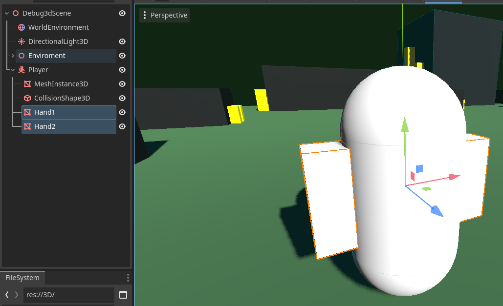
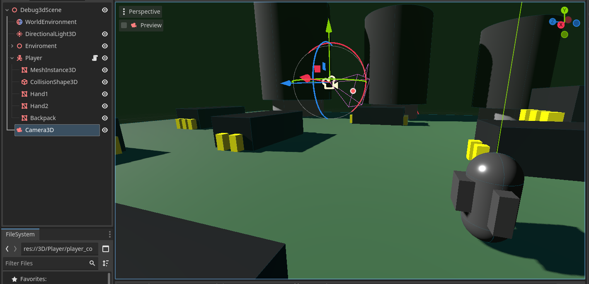
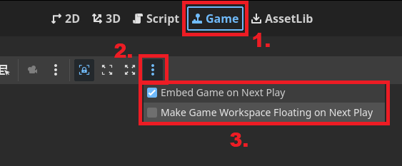

summary: Player Character and Camera
id: export
categories: Player Controller, Camera, Materials, GDScript
status: Published
authors: Ondřej Kyzr
Feedback Link: https://google.com

# Lab02 - Player Character and Camera

## Overview
Duration: hh:mm:ss

In this tutorial we will:
- Create a debug character model
- Learn about `CharacterBody3D`
- Learn the basics of programming in GDScript
- Add a camera to the scene
- Learn about the `Game` window and how to start the game
- Create several different player controllers (all can be used depending on the game type)
- Make the camera follow the player (in 2 different ways)

## Add a player character
Duration: hh:mm:ss

### Types of bodies
Similar to the previous lab we need to add a node to represent our player. Since our player will move in the world and use the physics system, we need to choose an appropriate node for the player. These are our choices:
- `StaticBody3D` - objects with collisions that do not move ❌
- `RigidBody3D` - objects with collisions that are moved by forces with the physics engine ✔️
- `CharacterBody3D` - objects with collisions that are meant to be user-controlled ✔️

Both `RigidBody3D` and `CharacterBody3D` are solid choices for us. The better choice will be `CharacterBody3D` since it already implements many things that will come in handy for us (ground and wall detection, moving platforms, moving slopes, etc.).

### Create the player node
Now that we know what node type the player will be, let's add it.
1. Add a `CharacterBody3D` node in the scene hierarchy as a child of the scene node ("Debug3dScene")
2. Rename it to **"Player"** (Right-click and select rename)
3. Add a `MeshInstance3D` node as a child of the player with a `CapsuleMesh`
4. Add a `CollisionShape3D` node as a child of the player with a `CapsuleShape3D`

The result should look something like this:

Let's move the player a bit up so that they are not in the ground.

<aside class="negative">
Be careful to move the "Player" node and not the mesh or collider of the player.
</aside>

### Nicer player model
The player is now just a plain white capsule. We will give them hands and a backpack to make them look nicer and also learn a bit about materials.

#### Adding hands
1. Add a `MeshInstance3D` node as a child of the player and add a BoxMesh to it. (Optionally rename it to "Hand1")
2. Change the mesh size to look more like a hand (I used `0.3, 0.8, 0.3`)
3. Move the hand on the X-axis so that it is on the side of the player (I moved it by `0.65`)
4. Repeat step 1-3 for the other hand, just move it to the other side of the player

After adding hands the player should look something like this:

#### Adding backpack
The main reason for adding a backpack is so that we can easily tell which way is the player capsule facing. This will come in handy later on.

Use the same process we did in adding hands to add a new BoxMesh, scale it, and move it.

<aside class="negative">
The coordinate system in Godot Engine uses the Z-axis in a way that -Z == Forwards and +Z == Backwards. So be sure to place the backpack on the +Z side of the player.
</aside>

The player should look like this now (mind direction of the Z-axis).

#### Using a shared material
Let's give the player capsule some color.

1. Click on to the `MeshInstance3D` with the capsule mesh in the scene hierarchy.
2. Click on the capsule mesh in the inspector.
3. Add a new `StandardMaterial3D` to the Material slot
4. Click on the new material
5. Set albedo to gray
6. Set Roughness to `0.3`
7. Set Metallic to `0.5`

This makes the capsule look gray and shiny as a metal robots body should be. However, I would like to add the same material to the hands and the backpack.

I could manually set all the properties on each material of each object but what if later on I would like to change to robots color? -> I would have to modify all the parts of the robot, which is not ideal.

Let's learn how to save a material and share it with other meshes.

1. Select the Capsule `MeshInstance3D`
2. Open the CapsuleMesh menu
3. Click on the small arrow next to the material that you created in the steps in the 7 steps sequence above
4. Select `Save As`
5. Change the name to `player_material.tres`
6. Navigate to folder `3D/Player`
7. Click `Save`

Now we have saved the material as a Resource.

<aside class="positive">
Resources can represent many types of data (materials, shaders, tile sets, fonts, scenes etc.). They can be instantiated (created/spawned in) to any scene and deleted at will. Saved scenes (PackedScene) in Godot are also Resources. This allows us to use them to represent common objects (bullets, enemies, collectibles etc.) that need to be created/deleted at runtime, with them. 
</aside>

Now we can apply the material to the hands and backpack.
<video id=AVk8pqCkRpA></video>

<aside class="negative">
If you only needed to use the material one of the hands of the robot, it means that you use the same mesh for both of them. This is not wrong, since we want both hands to look the same. 
</aside>

## Entering play mode
Duration: hh:mm:ss

### Pressing play
In this section we will take a bit of a detour and look at how to play and test our game. It can be done easily by pressing the **Run current scene** button at the top right. 

However, right now if you press the button all you can see is a gray screen (ALT+F4 if you are stuck there). This happens because there is no camera in the scene though which we would be able to see in the game world.

### Adding a camera
To solve this add a new `Camera3D` node to the scene as a child of the root (Debug3dScene) and move/rotate it so that the player is in view. For example like this:

Now if you press play you can see the game world. Yippee!

If your game is still in a kind of a "fullscreen" I recommend setting the embedding options same as in the next image. It makes the game window embed inside the editor.

### Making something happen
Now if you play the game, you can notice that nothing happens. That is because we have not added any interactive stuff in it. I have prepared a basic script in the folder `3D/Player` called `player_controller.gd`.

Please attach this script to the player. Drag the script from the **FileSystem** on to the `Player` node.

Now if you enter play mode, we can change(drag your mouse or type values) the Speed parameter (a Vector3) to make the player move in all three cardinal directions.
<video id=cKfvzk0Y6uo></video>

This is far from perfect or even playable (since the inspector is not available in the final game), but for messing around right before the next section it will suffice.

<aside class="negative">
Notice that the changes made in "Play" mode to the Speed parameter are still present even after exiting.
</aside>

## Basics of GDScript
Duration: hh:mm:ss

Let's open the script I have prepared and look what is inside. You can do that by:
1. Either by clicking the  next to the `Player` node in the scene hierarchy.
2. Or double click the script file in the `FileSystem`

As you can see the syntax of **GDScript** is very similar to **Python**. Each script can be thought of as class that extends the functionality of the node. The first line tells us, what node functionality does the script *extend*. In our case it is the player and their type is a `CharacterBody3D`. On line 3 you can see that the variable `speed`, which we used in the previous section is declared.

### Variables
Every variable declaration needs to start with the keyword `var`. The name of the variable is written next and is followed by `:` with a type declaration.

There are many variable types from the classic float, bool, int, Vector to more specialized ones. You can see all the base types here in the documentation [Variant class](https://docs.godotengine.org/en/stable/contributing/development/core_and_modules/variant_class.html).

The variable on line 3 is declared with an annotation `@export`. This annotation tells the engine, that it should be visible and changeable from the inspector. If is wasn't there we wouldn't be able to change the variable value like we did in the last section. We will come across different annotations in due time.

### Functions
In GDScript a function is declared with the keyword `func` (same as in Python). The keyword is follow by the name of the function and parameters its in brackets. Before closing the function header with `:` it is a good practice to declare the return type with `-> type`.

<aside class="negative">
GDScript does not have private/protected/public modifiers for functions or variables. The styling guide suggests, that the name of the variable should reflect its access. Private functions and variables should start with an "_".
</aside>

### Lifecycle of a Godot node
You might be wondering, what do the functions in the script do and when they are called. That is, where the Godot lifecycle comes in play.

In Godot every node automatically calls a number of virtual functions as it gets created, added to the tree, and so on. The importance of these functions can be seen on this simple enemy example:
- When the enemy is spawned/created, it will play an animation.
- While the enemy is alive, it will chase the player.
- After the enemy is defeated, it will drop some coins.

Ok, what are the functions? Here is a list of them in the order that they are called:
- `_init()` is called **once** when the node is created, it is the same as a constructor in OOP
- `_enter_tree()` is called *every time* the node is added as a child of another node in the scene tree
- `_ready()` is called **once** when the node and all of it's children have been created and are also ready
- `_process()` is called **every frame** and depends on the current framerate of the game (how many FPS does the game run at)
- `_physics_process()` is called **every physics frame**, that means that every time the physics in the game are updated this function is called, it depends on the set FPS of the physics engine
- `_exit_tree()` is called **every time** a node is removed from the scene tree

The most important ones for us are the `_ready()`, `_process()`, and `_physics_process()` functions. They are the backbone of almost every script and node.

### Back to the script
Let's now look back at the script:

We can see that the `_ready()` and `_process()` just use the keyword `pass`, meaning that nothing happens in the function. However, the function `_physics_process()`, which is called every time the physics engine updates. It does two things:
- Sets the variable `velocity = speed`
- Calls the function `move_and_slide()`

The variable `velocity` is declared by the `CharacterBody3D`, that we are extending and represents how fast and in what direction the character is currently moving in.

The function `move_and_slide()` is also declared by the `CharacterBody3D`. It is responsible for moving the character based on the current value in `velocity`.

<aside class="negative">
If we only set the "velocity" of the player and didn't call the "move_and_slide()" function. The player would not move at all. 
</aside>

## Player input
Duration: hh:mm:ss