summary: 2D Platformer
id: export
categories: 2D, Tilemap, Tileset, Sprite, 2D Player Controller, CharacterBody2D
status: Published
authors: Ondřej Kyzr
Feedback Link: https://google.com

# Lab03 - 2D Platformer

## Overview
Duration: hh:mm:ss

This lab will move away a bit from the previous one. We will look at how to make a basic **2D platformer**. We will connect this 2D platformer to our 3D game in the next lab.

Today we will look over:
- What is a **sprite sheet/atlas**
- What are **tile maps** and how to use them
- Setting up a **tile set** for tile maps with collisions
- Create a **2D player controller** (mostly a copy of the 3D controller)
- Add **velocity** to tiles
- Learn to use **Custom Data** in tiles in a `TileSet`
- Create **spikes** by manually **processing collision**
- Learn how to **reset** the scene
- Learn about scaling 2D objects in the **viewport**

Here is the template for this lab. Please download it, there are new assets, scenes, and folders.
<button>
  [Template Project](link)
</button>


## Project Organization
Duration: hh:mm:ss

Let's have a look in the template project that I provided. If you look in the **FileSystem**, you can see the folder `2DPlatforming`. Inside it, you can find the debug scene, in which we will work in this codelab, and a sprite sheet image.

### Folder management
The way you structure the folders in your project is very important. Many people have folders based on **file type** (`Scripts`, `Art`, `Scenes`, `Sounds` etc.). This can be quick and useful to find something in smaller projects or folders. I will use this approach in the `2DPlatforming` part of the project, since it will be a small minigame.

The other approach, which you can see in the `3D` folder, is to split everything based on the **type of the game object**. I personally like this approach better, since it is more **logical** and **scalable**.

### Folder colors
Another important thing is to stay organized. I recommend setting colors to the main folders (3D and 2DPlatforming) in the **FileSystem**. You can do it like this with a `right-click`:

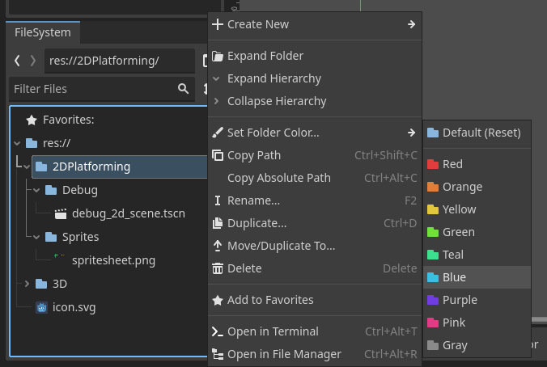

Personally, in this project it would be nice to color the **3D** folder red and **2D** folder blue, since 3D nodes are red and 2D nodes are blue. Like this:

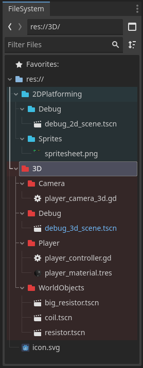


Now open the `debug_2d_scene.tscn` and switch to the **2D tab**


## Sprite Sheet Theory and TileSet
Duration: hh:mm:ss

### Sprite Sheets/Atlases
**Sprite sheets** or **sprite atlases** are a way of storing 2D drawn images. In games, where the environment can be built in a **grid** (Super Mario, Terraria, Core Keeper, etc.) it is a useful way to save memory, draw calls to the GPU, and reduce the number of image files.

 The main rules for sprite sheets are:
- One sprite sheet is **one image**
- Each tile in the sheet has the **same size**
- Tiles are spread out **equally** next to each other

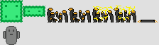

This is an example of a sprite sheet from our game. The first tile is the **wall tile**. Next to it there is a **platform tile**. Then there are 4 sprites with the electric cable animation and one sprite for a jump pad. The second line features the test player character from the 3D game.

> aside positive
> Sprite sheets are also ideal for frame-by-frame animations.

### TileSet
To use our sprite sheet in Godot, we need to create a `TileSet` resource. This resource will store how the sprite sheet should be used (tile bounds, physics shapes, color modulation, etc.).

#### TileSet Creation
Let's create and save a new `TileSet` resource.
1. **Right-click** the `Sprites` folder.
2. Select `+ Create new` -> `Resource`
3. Search for **"TileSet"** and press `Create`
4. Name it `platforming_tileset.tres` and press `Save`
5. **Double-click** the newly created resource

#### TileSet Setup
First, we need to set the tile size of the `TileSet`. In the **inspector**, set the **X** and **Y** to `32px`, since our tiles are 32x32 pixels. Now the `TileSet` is setup in the bottom of the Godot editor:

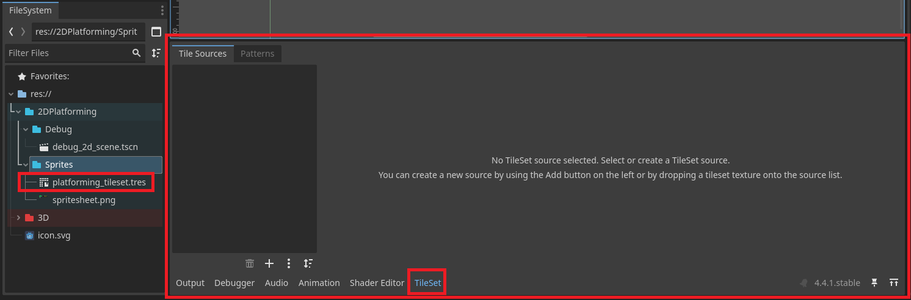

Now with the tileset windows open:
1. **Drag-and-drop** the `spritesheet.png` file into the **Tile Sources** tab
2. Godot is going to ask you if you want to **automatically** create tiles. Press `Yes`.

This should be the result.
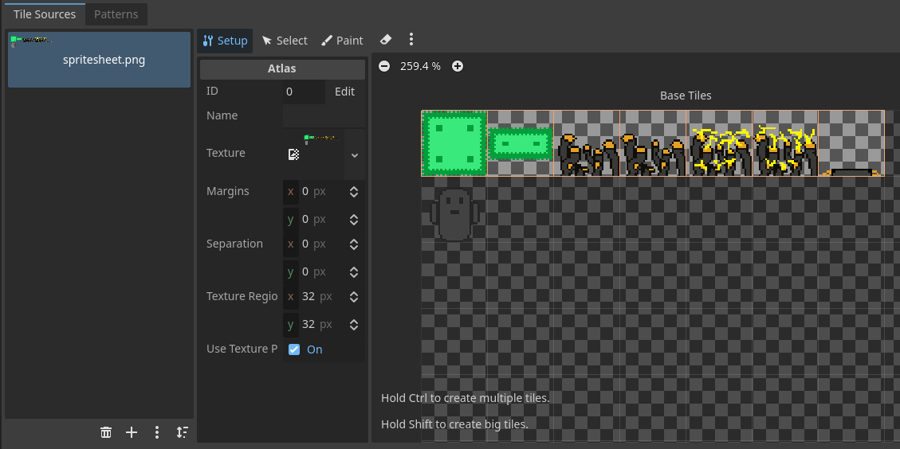

There are 3 main **tabs** in the tileset editor:
- **Setup** - used to set up the base properties of the tiles
- **Select** - where you can select a Tile and look at its properties or change them
- **Paint** - where you can paint different properties to the tiles

> aside positive
> You can delete the player tile, as I have done, since we will be using a `Sprite2D` for the player and not a tilemap.

> aside positive
> You can even use a saved scene as a **Tile Source**, when you want a tile to run code or behave in a very special way that tilesets do not support.


#### TileSet Physics
Let's add collision shapes to our tile, so that the player, once we add them later, will collide with the environment.

First, we need to add a physics layer to the tileset. The **physics layer** is a specific setup of a collision layer and mask. This way, you don't need to setup collision layers and masks for each tile but only set the physics layer to those tiles.

With the tileset resource open, look in the **Inspector** and:
1. Open the dropdown called **Physics Layers**
2. Press `+ Add Element`
3. Keep the layer and mask settings unchanged for now
4. Rename the first layer/mask (they share names) to **"Terrain"**

Now let's paint the collision shapes. Please follow the steps in this video:

<video id=1tBQOqsrEwM></video>


## TileMapLayer
Duration: hh:mm:ss

With the tileset set up, let's learn how to use it. A `TileSet` can be used in a `TileMapLayer`. There can be multiple layers in a scene. This is useful when you need for example:
- A background below all terrain
- Decoration on top of the terrain
- etc.

### Add a layer
Let's add one to our scene:
1. Add a `TileMapLayer` node to the scene
2. In the **Inspector** set the property of `Tile Set` to the resource we created.

> aside negative
> Do **NOT** add `TileMap`, add `TileMapLayer`. `TileMap` is a deprecated node, that is only kept for compatibility reasons.


### Draw an environment
Now we will use the `TileSet` and `TileMapLayer` to draw an environment. Try to create a similar environment to the one in the picture below using the steps described.

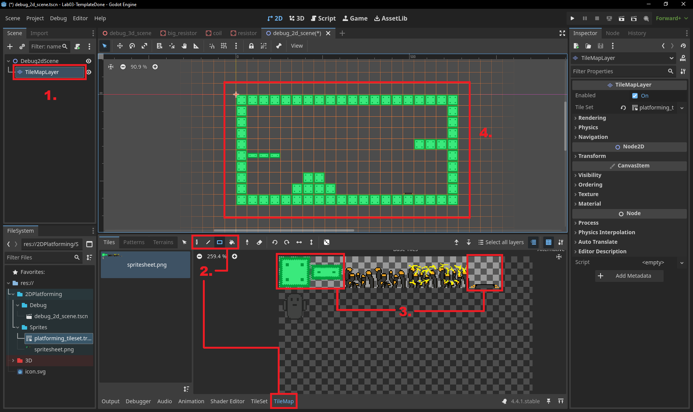

1. Select the `TileMapLayer` node
2. Select a **tool** of your liking (make sure you have `TileMap` tab selected at the bottom)
3. **Click** on a tile you want to draw
4. **Left-Click** in the scene view to draw tiles, **Right-Click** to delete tiles


## Player Controller 2D - Task
Duration: hh:mm:ss

Let's create the player character, so that we can control them and test out the `TileMapLayer` we drew. The player will be very similar to the 3D one.


### Player Node Setup
Let's set up the player node:

1. Add a `CharacterBody2D` node and rename it to the **"Player"**
2. Add a `Sprite2D` node as a child of the player
3. Add a `CollisionShape2D` node as a child of the player

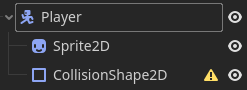

Let's also rename the second collision layer/mask to **"Player"** and change the collision layer and mask of the player in this way:

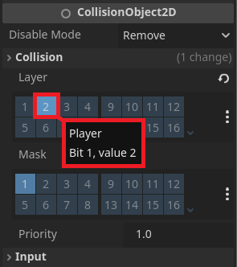


### Sprite2D setup
A sprite is basically an image/texture that is shown on the screen. Sprites in Godot allow us to use a **"region"** of an image. We will use this to get the player sprite from the `spritesheet.png` file. With the `Sprite2D` node **selected**:
1. Add the `spritesheet.png` to the property `Texture`
2. Enable **Region** in the dropdown
3. Use **Edit Region** button or manually set the `x`, `y`, `w`, and `h` properties to the ones in the picture.

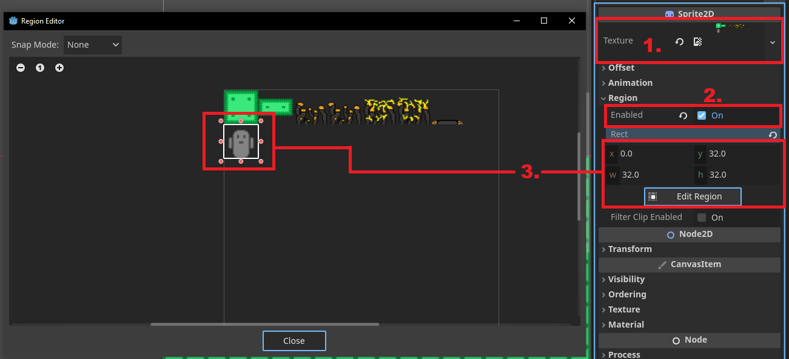


### Pixel-art filtering
When you use high-quality textures in your game, `Linear` filtering (similar effect to blur) makes the textures look better and not flicker at distances (for more information look up **mipmaps**).

Our 2D platforming game uses pixel art. If we look at the tilemap and player close-up, we can see that it is blurry. To change this, **select** both the `Player` and `TileMapLayer` nodes and in the **Inspector** change the `Texture -> Filter` settings like so:

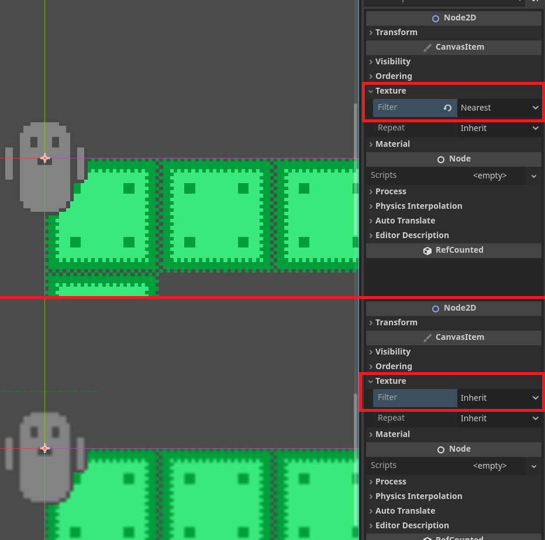

> aside positive
> The default setting in Godot is to **Inherit** the texture filtering from the parent. The top node uses the filtering setting from **project settings**, which by default is `Linear`.


### CollisionShape2D setup
Similarly as in 3D, let's set up the shape of the `CollisionShape2D` node. **Select** the `CollisionShape2D` node of the player and set it up like this:

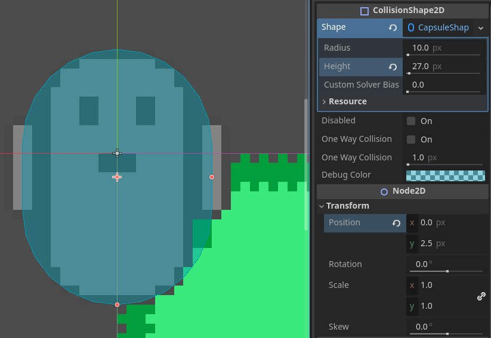

> aside positive
> It is good to be as precise as possible. However, sometimes it is better to make the CollisionShape/hitbox a bit smaller to make the game feel more fair to the player.


### Camera setup
If you play the game, the base camera is very zoomed out. Add a new `Camera2D` node and adjust it so that the environment you made is all in view.

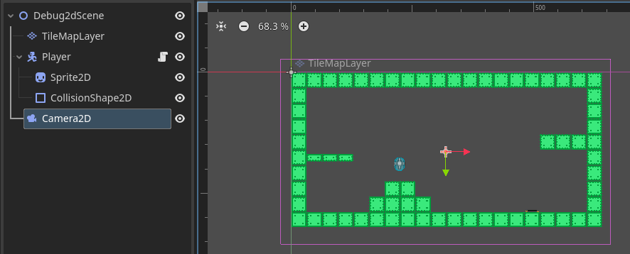

> aside positive
> Adjust the `Zoom` property of the camera if it is too zoomed out.


### Task - Player Controller 2D
Since the script that will control our player will be very similar to the 3D player:
1. **Duplicate** the `player_controller.gd`
2. **Rename** it to `player_controller_2d.gd` and move it to a folder `2DPlatforming/Scripts`
3. **Attach** the script to the `Player` node

Now as a practice, try to rewrite the new script so that it works with the `CharacterBody2D` and in 2 dimension. The next section will have the **solution** of this task.

> aside positive
> **Tip 1:** If the jump or gravity behaves weirdly, remember that in 2D in Godot the **up-direction** is `-Y`.

> aside positive
> **Tip 2:** The 3D world units were meters, in 2D it is pixels. I recommend multiplying all parameters at least by `10` to achieve a similar behavior.


## Player Controller 2D - Solution
Duration: hh:mm:ss

This is the whole `player_controller_2d.gd` script:

```GDScript
extends CharacterBody2D

@export var speed : float = 175
@export var acceleration : float = 1200
@export var dampening : float = 30

@export var gravity : float = 627.84
@export var jump_force : float = -240.0

var _has_double_jumped : bool = false

func _ready() -> void:
    pass

func _process(delta : float) -> void:
    pass

func _physics_process(delta : float) -> void:
    _movement(delta)
    _apply_gravity(delta)
    _jump()
    _double_jump()
	
    move_and_slide()

# Handles the horizontal movement of the player
func _movement(delta : float) -> void:
    var x_axis : float = Input.get_axis("left", "right")
	
    # Add the new velocity
    velocity.x += x_axis * delta * acceleration
	
    # Clamp max speed
    if abs(velocity.x) > speed:
        velocity.x = sign(velocity.x) * speed
	
    # Dampening if not moving
    if abs(x_axis) < 0.01:
        velocity.x *= clamp(1 - dampening * delta, 0, 1)

# Applies the gravity to the player
func _apply_gravity(delta : float) -> void:
    velocity.y += gravity * delta

# Checks if the player can and wants to jump. If yes the apply instant force
func _jump() -> void:
    if not Input.is_action_just_pressed("jump"): return
    if not is_on_floor(): return
	
    velocity.y = jump_force

# Handles the double jump of the player, conditions, reset, and apply
func _double_jump() -> void:
    # Double jump reset when on ground
    if is_on_floor():
        _has_double_jumped = false
        return
	
    # Conditions
    if _has_double_jumped: return
    if not Input.is_action_just_pressed("jump"): return
	
    # Jump
    _has_double_jumped = true
    velocity.y = jump_force
```

> aside positive
> **Note 1:** In the `_movement()` function, in the part that "clamps" the max speed, I used the `sign` function. This gives us `+1` or `-1` depending on whether we are going left or right, which is basically what the `normalize()` did in 3D.

> aside positive
> **Note 2:** In the `_movement()` function, in the part that dampens the velocity, I decided to `clamp` the dampening coefficient. This only ensures that it remains between `0` and `1`, even in cases where the dampening is very strong. I also recommend to add this to the 3D controller just to be sure.


## Functional Jump Pad
Duration: hh:mm:ss

If you placed the **jump pad tile** into the environment, you might notice that it does not work. This is because we have not given the tile any functionality.

One option would be to make it a **separate scene**, code a script that would **detect** the player, and **apply** force to the player.

The second and much easier option is to **paint** the physics property of `linear_velocity` to the tile in the `TileSet`. This will **apply** velocity to every movable body, that is touching the tile. (Only if the tile has the body's collision layer enabled in the collision mask).

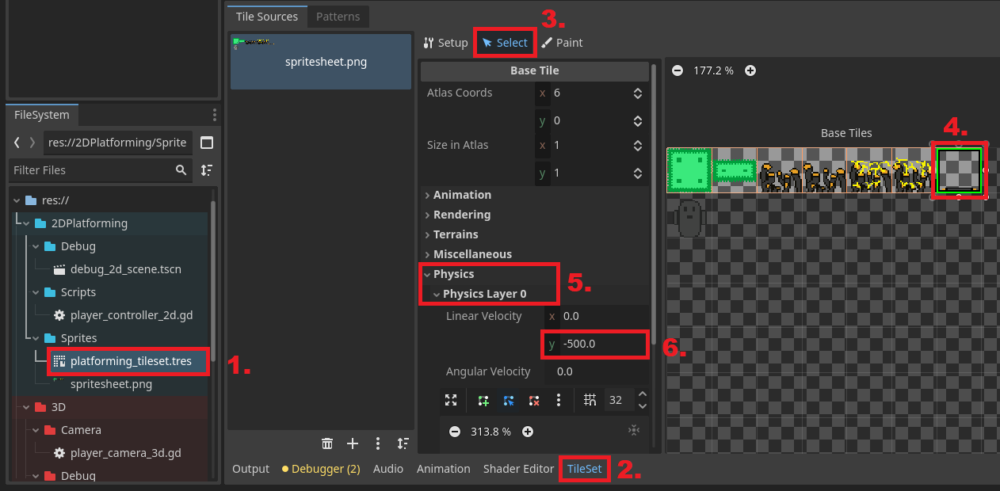
1. Open the `platforming_tileset.tres` file
2. Make sure you have the **TileSet** tab opened
3. Select the **Select** tab
4. Select the **jump pad tile**
5. Open the dropdown **Physics** and then **Physics Layer 0**
6. Set the `Y` component of the property `Linear Velocity` to `-500` for example.

> aside positive
> Remember, that in 2D the **up-direction** is in the direction of negative `Y`.

Now if you play the game and step on the **jump pad** the player will be pushed upwards.


## Functional Electric Cables/Spikes
Duration: hh:mm:ss

Now let's look at the **electric cable** sprites, that are in the sprite sheet. I want them to act like spikes in any other 2D platforming games. You might also notice, that there are several cable tiles. That is because they are a part of an animation and we will learn how to create an **animated tile** out of them.

### Animated Tile
First, we need to only keep the first sprite as a tile, since the other 3 tiles are only the animation of the first one. So with the `TileSet` open:

1. Go in the `Setup` tab
2. **Right-click** on the second cable tile
3. Press **Delete**
4. Repeat for the 3rd and 4th cable tile

Next up:

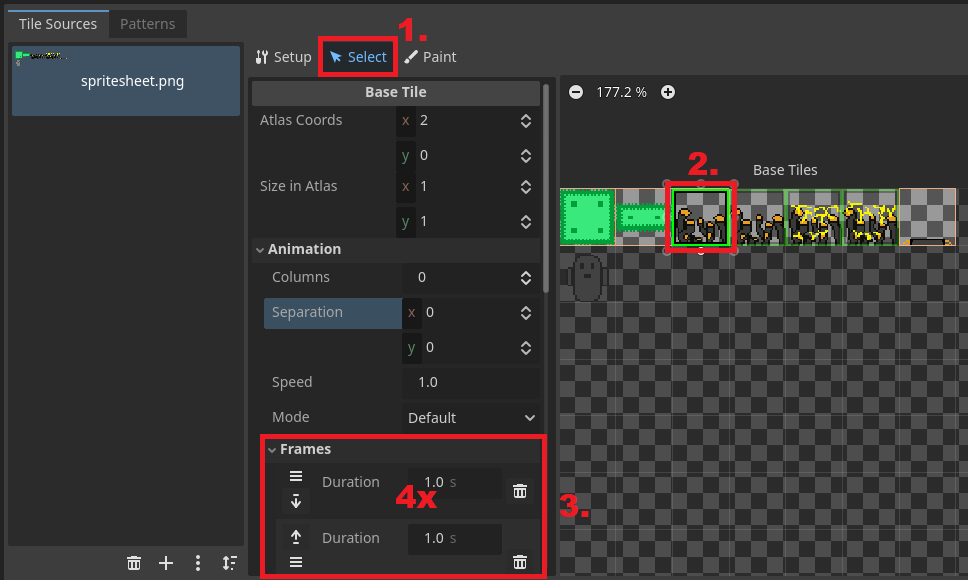

1. Go into the **Select** tab
2. Select the **first cable tile**
3. Open the **Animation** -> **Frames** dropdown and add frames so that there are `4` frames

This will create an animation with 4 tiles. The selected tile will be the first frame and the next frames are selected depending on the settings in the **Animation** dropdown. By default, this will take 4 tiles in a row.

You can further adjust the **duration** of the frames. Something around `0.15 s` looks good.


### Tile Custom Data and Physics Shape
We will detect if the player is touching the spikes with **Custom Data** of a tile. With the `TileSet` selected:

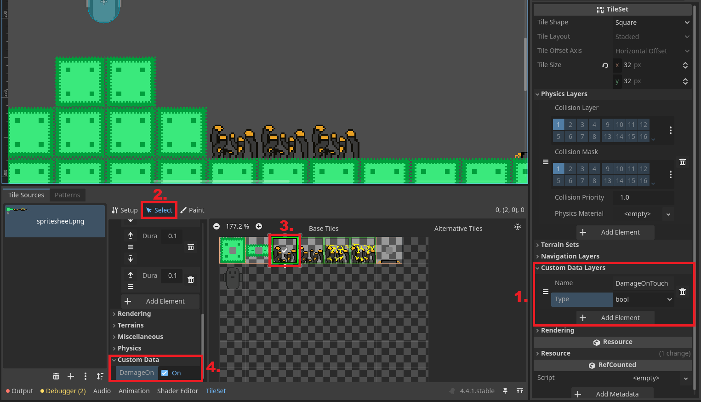

1. Add a custom data layer **"DamageOnTouch"** of type `bool`
2. Go into the **Select** tab
3. Select the **cable tile**
4. Under the dropdown **Custom Data** set **"DamageOnTouch"** to `On`

Now to detect the collision, the electric cables need a collision shape. Add it in the **select** tab so it looks similar to this:

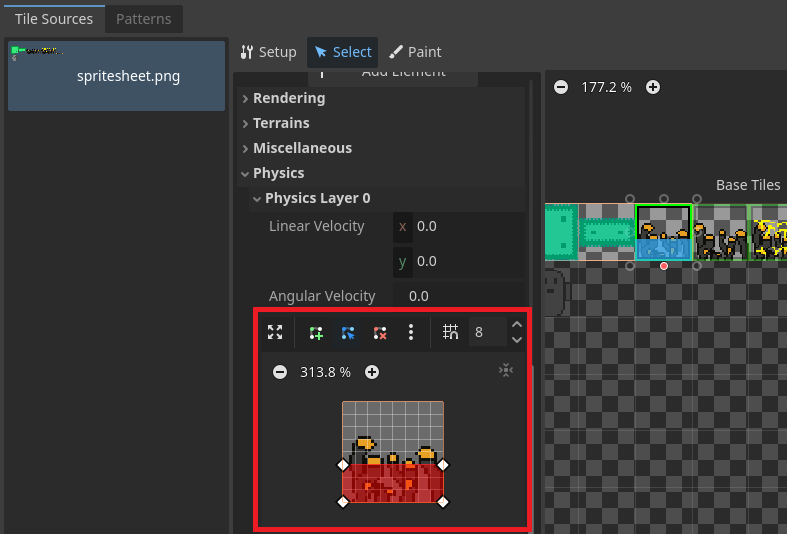

> aside positive
> I recommend setting the collider a bit lower than the highest pixels of the sprite. It gives the player a bit of leeway when trying to dodge them.


### Process Collisions
Now we need to go through all the **collisions** of the player, to see if the player collided with a tile, that has the **Custom Data** "DamageOnTouch" set.

To find a collision that occurred in this frame in the `CharacterBody2D` class, we can call `get_slide_collision(idx)` function. However, this function needs to be called **AFTER** the function `move_and_slide()`, since `move_and_slide()` handles the collisions.

Add a call to a function `_process_new_collision()` after the `move_and_slide()` call. Now add the following function at the end of the script:

```GDScript
func _process_new_collision():
    for i in get_slide_collision_count():
        var collision : KinematicCollision2D = get_slide_collision(i)
        var collider : Object = collision.get_collider()
		
        if collider is TileMapLayer:
            var tile_rid : RID = collision.get_collider_rid()
            var tile_coords : Vector2 = collider.get_coords_for_body_rid(tile_rid)
            if collider.get_cell_tile_data(tile_coords).get_custom_data("DamageOnTouch"):
                print("cable collision")
```

- The `for cycle` goes through each new collision that happened after the `move_and_slide()` call.
- We get one of the **collisions** that happened with `get_slide_collision(i)`.
- We get the **collider** that the player collided with using `collision.get_collider()`.
- Next we check if the collider `is` a `TileMapLayer` -> if the player collided with the tilemap.
- Then we get the `RID`, which is the **unique Resource ID** of the tile we collided with.
- We use this RID to get the **coordinates** of tile in the `TileSet`
- Lastly, we get the `TileData` using the tile coordinates and we use it to check if the **Custom Data** `DamageOnTouch` is turned on.

> aside positive
> The keyword `is` is used to check the class type.


For now, we just print **"cable collision"**. **Place** some cables in the scene, play the game, and try to jump on them. The **"cable collision"** should be printed in the `Output` console.


### Reset on collision
You can decide, what happens when the player touches the cables. For now, before we add the **2DPlatforming** game to the **3D** game, I want to just reset the scene.

We can do this by changing the `print` line with:
```GDScript
get_tree().reload_current_scene()
```

If you try to jump on the cables now, you can see that it works. The more observant of you might notice that the `Debugger` throws this error:

`player_controller_2d.gd:75 @ _process_new_collision(): Parameter "found" is null.`

Looking at the code, the issue might not be so obvious. The problem arises, if there are **multiple collisions** with the cables in one frame. The first collision **resets** the scene and then the other collisions try to interact with the deleted scene. To fix this, we can easily **add** a
```GDScript
return
```
statement after the scene reload line.  


## Correct Viewport Scale
Duration: hh:mm:ss

Right now if you change the **window size**, the size of objects stays the same on the monitor. You might think that this is what we want, but consider someone with a bigger monitor resolution. In this case, the player would see much more/less of the game world. Let's change it in the **Project Settings**. Watch this video and follow it step by step:

<video id=srwBrfGeiKs></video>


## Recap
Duration: hh:mm:ss

Let's look at what we did in this lab.
- We looked at **project organization** and folder management
- Then we learned what **sprite sheets** are and how to setup a `TileSet` from one
- We used the created `TileSet` in a `TileMapLayer` and drew an **environment**
- Next I tasked you to create a **2D player controller**
- Then we made the **jump pad** functional using the `Linear Velocity` property in tiles
- We added **electric cables**, which reset the level on touch, while learning about **Custom Data** in tiles and how to get them.
- Lastly, we set up the camera to **correctly scale** with the window size


If you want to see how the finished template after this lab looks like, you can download it here:
<button>
  [Template Done Project](link)
</button>