summary: 2D Platformer in 3D
id: export
categories: 2D, 3D, SubViewport, Area3D, Camera3D
status: Published
authors: Ondřej Kyzr
Feedback Link: https://google.com

# Lab04 - 2D Platformer in 3D

## Overview
Duration: hh:mm:ss

This lab will combine the 2D minigame created in the previous lab with the 3D game we were making before. We will do this using `SubViewports` and learn how to use them.

Today we will look over:
- See the **changes** I made from the last lab and save the **2D player scene**
- How to setup a `SubViewport` and **view a 2D scene in 3D**
- Learn about **signals**, how to **create** them and **use** them
- How to **"turn off"** a subtree
- The process of **entering** and **exiting** 2D
- Encounter many **errors** and learn how to **deal** with them and **fix** them
- Bonus: Try out **Tweens** by making entering and exiting 2D smoothly animated

Here is the template for this lab. Please download it, there are new scenes and folders.
<button>
  [Template Project](link)
</button>


## Project Changes and Saving the Player2D
Duration: hh:mm:ss

### 3D Scene Changes
I cleaned up our 3D scene a bit more by moving all the objects under the node `Obstacles`, which is a child of `Environment`. I also added another node container called `2DPlatforming`, which will hold all the 2D platforming sections. There is already a `Sprite3D` for the first section and we will setup a `SubViewport` in the next section.

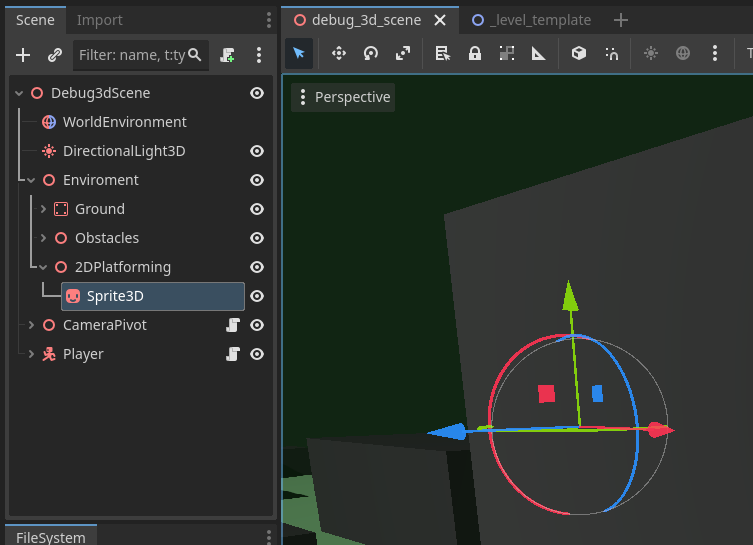


### 2D Changes
I created a 2D platforming template level and a testing level for this codelab. The template will work as a base scene, that can be duplicated to easily create more 2D platforming levels. All the levels can be found in the folder `2DPlatforming/Levels/`.

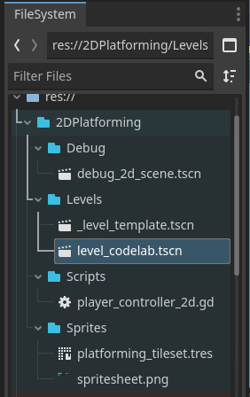

> aside positive
> The levels do not have a `Camera2D`, since the `SubViewport` will work as a camera into the 2D world.


### Save the player
Currently, if we wanted to change a property of the 2D player, for example the sprite, we would have to go into every scene with the 2D player and change it manually. This is not **very time efficient** and can produce **many bugs**. Let's save the player as a scene and replace it in all the 2D scenes.

1. **Open** the `debug_2d_scene.tscn` scene (or any one of the three 2D scenes)
2. **Right-click** the `Player2D` node
3. Select **Save Branch as a Scene**
4. **Save it** to a folder `2DPlatforming/Scenes` (needs to be created) and name the file `player_2d.tscn`
5. Now **open** all the other 2D scenes
6. **Delete** the `Player2D` node
7. **Instantiate** the saved `player_2d.tscn` scene using the  icon above the scene hierarchy

> aside negative
> Remember to move to newly instantiated player node to the position where the deleted one was.

The resulting scene hierarchy in `debug_2d_scene.tscn` should look like this:

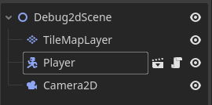

Now if we change something in the `player_2d.tscn` scene, it shows up in all 2D scenes. Try it out!


## Visible 2D Scene in 3D
Duration: hh:mm:ss

Now in order to make the 2D scene visible in 3D, we need a something to show it on. **Open** the `debug_3d_scene.tscn` and look at the **Scene Hierarchy**. There, you can see the node `Enviroment` -> `2DPlatforming` (a container for all the 2D platforming sections), which has a single `Sprite3D` as a child (a single platforming section). `Sprite3D` node is used to display 2D sprites/images in 3D.


### Adding a SubViewport
To look inside the 2D scene and use the image, we need to add a `SubViewport` node, which basically works as a window/camera into the child subtree of the `SubViewport`.

1. **Add** a `SubViewport` node as a child of the `Sprite3D`
2. **Set** the `Texture` property of the `Spite3D` to **New ViewportTexture**
3. In the pop-up window **select** the newly created `SubViewport`

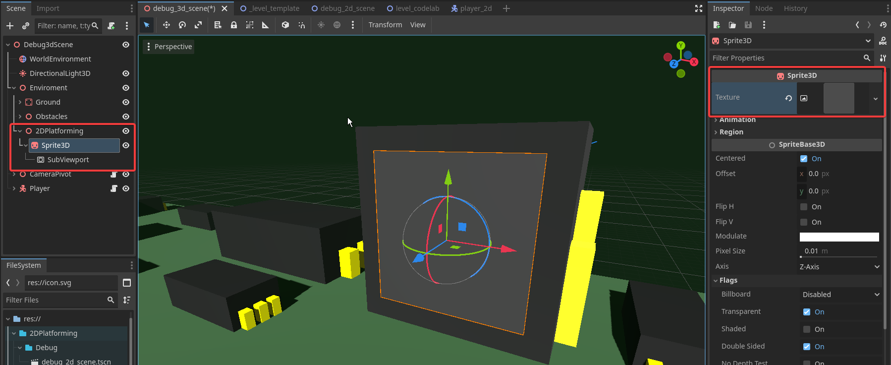

Now to actually see the 2D scene, let's **instantiate** () the `level_codelabs.tscn` scene as a child of the `SubViewport`.


### Settings of the SubViewport
If you look at the `Sprite3D` now, there are 3 issues:
1. The whole level is not in view. We need to change **the dimensions** of the `SubViewport`.
2. The level looks blurry up close. We need to change **the sprite filtering** option.
3. The level has a gray background. We need to toggle **transparent background** ON.

To fix them do:
1. In the **Inspector** of the `SubViewport` change the size to `x=448` and `y=640`.
2. In the **Inspector** of the `Sprite3D` change the `Texture Filter` property to `Nearest`.
3. In the **Inspector** of the `SubViewport` switch the `Transparent BG` on. 

The result should look like this:
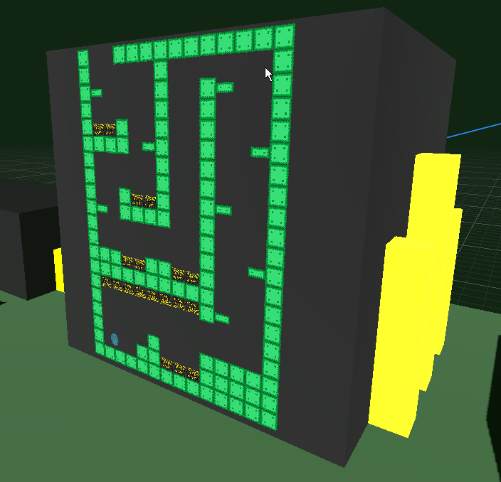

> aside positive
> The size of the `SubViewport` is in multiples of `32px` because the size of a single tile in `32px` by `32px`.


## PlatformingManager2D and ProcessMode
Duration: hh:mm:ss

Try to play the game now. You can see that you can control **both** the 2D and 3D player at the same time. This is not how the game is supposed to work. Let's make a script called `PlatformingManager2D`, which will control the winning, losing, starting, and ending the 2D platforming level.

1. **Create** a new script `platforming_manager_2d.gd` it the folder `2DPlatforming/Scripts`
2. **Add** a function `turn_on()` and `turn_off()` with no parameters and return type of `void`
3. **Add** the script to the `LevelCodelabs` node in `level_codelabs.tscn`
3. **Add** the script to the `LevelTemplate` node in `_level_template.tscn`


What to put into the new functions? 🤔


### ProcessMode
We want the 2D level to be inactive until we "enter" it, how do we do that? Each node that inherits from `Node` (which is basically every node there is) has a property of `Mode` in the `Process` category. This determines if the node runs the `_process()` and `_physics_process()` function every frame. For example, when you disable a `CharacterBody2D` it will stop moving and processing all collisions.

Here you can see all the modes, that can be set:

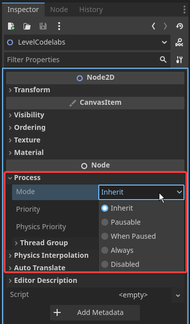

- **Inherit** - uses the same mode as the parent node
- **Pausable** - the node will not process when `get_tree().paused = true` is set
- **WhenPaused** - the node will process ONLY when `get_tree().paused = true` is set
- **Always** - the node will process no matter what
- **Disabled** - the node will not process at all


### Back to the PlatformingManager2D
So let's fill in the `turn_on()` function with:
```GDScript
process_mode = Node.PROCESS_MODE_INHERIT
```

and the `turn_off()` function with:
```GDScript
process_mode = Node.PROCESS_MODE_DISABLED
```

For now, the script doesn't do much. We will fix it in the next section, where we will add another script.


## Area3D, PlatformingSection, and Signals
Duration: hh:mm:ss

Let's setup the rest of the platforming section so that the player enters the 2D platforming once they touch an enter area in space. That is where the `Area3D` (and `Area2D` for 2D) node comes in.

1. **Add** an `Area3D` node as a child of the `Sprite3D`
2. As the `Area3D` warning suggests, **add** a `CollisionShape3D` as a child of the `Area3D`
3. **Fill in** the `Shape` property of the `CollisionShape3D` with a `BoxShape3D`
4. **Move** the `Area3D` to the bottom left corner of the `BigResistor` object
5. **Adjust** the collision **layer** of the `Area3D` like this:

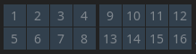

6. **Adjust** the collision **mask** of the `Area3D` like this:

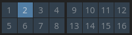

7. Optional: **Add** a `MeshInstance3D` as a child of the `Area3D` and **create** an interesting mesh

Here is what the resulting scene should look like.

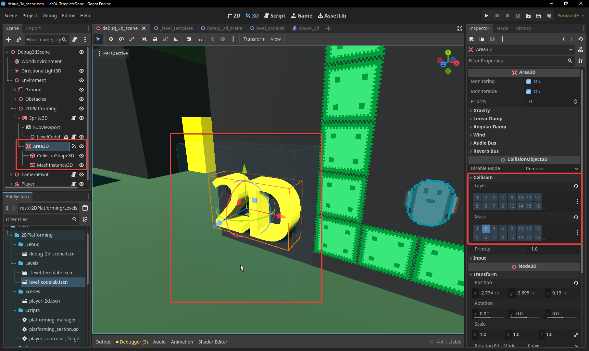

> aside positive
> I chose a text mesh to show you, that you can easily create 3D text meshes from any fonts.


### Create PlatformingSection Script
With the setup complete, let's create and add a script to the `Sprite3D`, which will control the entering and exiting the 2D platforming level from the 3D world.

1. **Create** a new script `platforming_section.gd` in the `2DPlatforming/Scripts` folder
2. **Add** the script to the `Sprite3D`, which has the `SubViewport` as a child

Now we would like to be notified, when the player enters the `Area3D`. This can be easily done using Godot **Signals**.

### Godot Signals
They are very similar to events in other programming languages. Any node can **connect** to a signal of another node with a given **Callable** function. Once the signal is fired, all the connected nodes are **notified** and the given functions are **called**. You can also create your own signals, which we will do in this codelab later on. Let's try them out!

### Connecting the signal
If you select the `Area3D`, you can switch the tab at the top of the **inspector** to the **Node** tab.

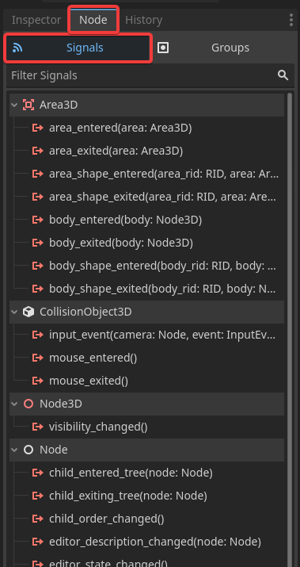

The `Area3D` has many different signals that can be connected. We are interested in the signal `body_entered(body: Node3D)` since our player is a `CharacterBody3D` -> `body_entered`.

1. **Select** the `body_entered(body: Node3D)` signal
2. **Press** the `Connect...` button on the bottom right
3. In the pop-up window, **select** the `Sprite3D` with the `platforming_section.gd` script
4. Press the `Connect` button

The script should open with a new function `_on_area_3d_body_entered(body)`, let's change it up and test it out with a print like this:
```GDScript
func _on_area_3d_body_entered(body : Node3D) -> void:
    print("Player entered!")
```
Try to play the game and enter/exit the `Area3D`. The console should print `"Player entered!"` every time you enter the area.


## Entering 2D
Duration: hh:mm:ss

### Reference to the 2D scene
Our 2D platforming scene has the script with the `turn_off()` and `turn_on()` function. To call it from the `platforming_section.gd` we need a reference to the script. To have a reference to a script we need to set the name of the script class.

1. **Open** the `platforming_manager_2d.gd` script
2. **Add** the line `class_name PlatformingManager2D` as the first line of the script

Now in the `platforming_section.gd` let's get the reference to the 2D level and turn the level off in the `_ready()` function. This will make the 2D player stop moving with the 3D one.

Place this in the script:
```GDScript
@onready var platforming_manager : PlatformingManager2D = $SubViewport/LevelCodelabs

func _ready() -> void:
    platforming_manager.turn_off()
```

Running the game now, the 2D player no longer moves, which was our goal.


### Function `_enter2D()` 
Let's add a function in the `platforming_section.gd`, which will prepare everything needed to transport us into the 2D level.

Add this function to the script:
```GDScript
func _enter2D() -> void:
    platforming_manager.turn_on()
```

This just turns on the 2D level, when we enter the `Area3D` for now.


#### Player 3D reference
Once in the 2D level, we want to **turn off** the 3D player, so we need a reference to it. We could add a `export` reference to the player, but we would have to set all the references **manually**, which would be quite cumbersome if we had a lot of 2D platforming sections. In this case, we can easily get the reference to the 3D player once it **collides** with the `Area3D`.

In the `player_controller_3d.gd` script:
1. **Add** the line `class_name PlayerController3D` as the first line of the script

In the `platforming_section.gd` script:
1. **Add** the variable `_player_3d` of type `PlayerController3D`
2. **Rewrite** the `body_entered` function as such:
```GDScript
func _on_area_3d_body_entered(body : Node3D) -> void:
    if body is PlayerController3D:
        _player_3d = body
        _enter2D()
```

> aside positive
> The keyword `is` is used to check the class type.

#### Turn off the Player
Now the next step is to **turn off** the 3D player. We will do this the same way as we did the for the 2D player.

Add this line to the `_enter2D()` function:
```GDScript
_player_3d.process_mode = Node.PROCESS_MODE_DISABLED
```

It would also be nice, if the player 2D was not **visible** until we enter the 2D world and if the player 3D was invisible until we exit the 2D world. There are several ways to do it and each has a pro and con, we will stick with the simplest and just set the **scale** of the player to `0`.

For the 3D player, add this line to the `_enter2D()` function:
```GDScript
_player_3d.scale = Vector3.ZERO
```

For the 2D player in the script `platforming_manager_2d.gd` we need to add the reference to the player with `export` and add the correct lines to the `turn_on()` and `turn_off()` functions. The script should look like this:
```GDScript
class_name PlatformingManager2D
extends Node

@export var player : Node2D

func turn_on() -> void:
    process_mode = Node.PROCESS_MODE_INHERIT
    player.scale = Vector2.ONE


func turn_off() -> void:
    process_mode = Node.PROCESS_MODE_DISABLED
    player.scale = Vector2.ZERO
```

Remember to set the `export` variable in the **inspector** in all the 2D platforming scenes!


## Camera Follow 2D Player
Duration: hh:mm:ss

Playing the game in seems as if the player enters the 2D world, which is nice. One problem is that the camera stays on the position of the 3D Player. We would like it to follow the 2D player.


### Dummy target
So that we can easily see and debug the position translation from 2D to 3D, let's add a `Node3D` with a mesh, which will act as our new camera target.

**Recreate** this setup:
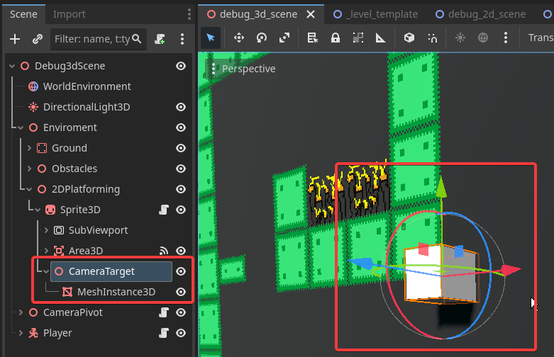


### Player2D position
How do we get the 2D player position in the `platforming_section.gd` script? Well we have a reference to the `PlatformingManager2D` and the manager has a reference to the player. Let's add a function to the manager to get the reference to the player 2D.

```GDScript
func get_player2D() -> Node2D:
	return player
```


### How to translate 2D position to 3D?
The 2D world has the **origin** in the top left corner with the `Y-axis` going down and `X-axis` going right. So if we get the **player position**, we know how the player is translated in relation to the top left corner of the sprite.

However, the `Sprite3D` is centered, so we also need to **offset** the position by half of the width and half of the height.

Another thing is that the units of the 2D player position are in **pixels** and the units of the 3D world are in **meters**. Luckily, the `Sprite3D` node has a property of `pixel_size`, which tells us how big in meters a single pixel is.

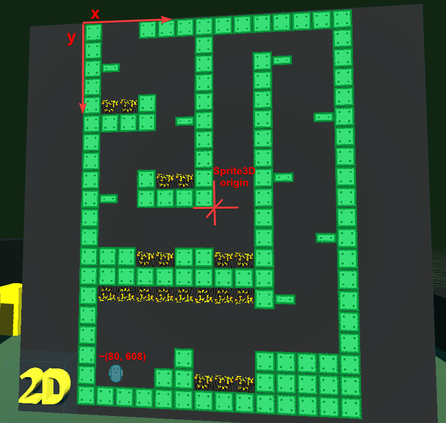


### The code
Since these changes are quite big and the codelab will be quite long already, I won't though the code in great detail. Here is the full `platforming_section.gd` script:

```GDScript
extends Sprite3D

@onready var platforming_manager : PlatformingManager2D = $SubViewport/LevelCodelabs
@onready var camera_target : Node3D = $CameraTarget

var _player_3d : PlayerController3D
var _is_in_2d : bool = false

func _ready() -> void:
    platforming_manager.turn_off()

func _physics_process(delta):
    _update_camera_target()

# When in 2D, moves the 3D camera target to be at the same place as the 2D player
func _update_camera_target() -> void:
    if not _is_in_2d: return
	
    # Get the position, offset it, and multiply it by pixel size
    var player2D_position : Vector2 = platforming_manager.get_player2D().position
    camera_target.position.x = (player2D_position.x - texture.get_width()/2) * pixel_size
    camera_target.position.y = (-player2D_position.y + texture.get_height()/2) * pixel_size

# Handles the transition from 3D to 2D platforming
func _enter2D() -> void:
    if _is_in_2d: return
    _is_in_2d = true
	
    # Turn on the 2D level
    platforming_manager.turn_on()
	
    # Disable the 3D Player
    _player_3d.process_mode = Node.PROCESS_MODE_DISABLED
    _player_3d.scale = Vector3.ZERO
	
    # Change the camera target
    _player_3d.camera_pivot.camera_target = camera_target

# Upon body collision, check if it is the player and enter2D
func _on_area_3d_body_entered(body : Node3D) -> void:
    if body is PlayerController3D:
        _player_3d = body
        _enter2D()

```

### PlayerCamera3D changes
Now if you play the game, the camera follows the 2D player with the cube pretty well. However the camera is too **zoomed** in (due to the shapecasting) and we can still **rotate** the camera.

#### Shapecasting problem
The easies way to fix this is to move the camera target a bit out of the wall, so that the shapecast does not hit it. We can easily adjust it in the function `_update_camera_target()` by setting:
```GDScript
camera_target.position.z = 0.5
```

> aside positive
> You can put a different number to the `position.z` than `0.5`. I just find this value to work and look well with out setup.


#### Rotation problem
We will fix this by adding a function to switch off and on the ability to rotate the camera with the mouse. 

Let's add this "public" **function** in the `player_camera_3d.gd` script, a **new bool variable** so that we know if we should rotate or not, and a **check**:
```GDScript
...
var _do_rotate_camera : bool = true
...
func _rotate_camera(x : float, y : float) -> void:
	if not _do_rotate_camera: return
    ...

func set_user_rotation_control(value : bool, fixed_rotation : Vector3) -> void:
	_do_rotate_camera = value
	rotation_degrees = fixed_rotation
```
- `value` will determine if we want the rotation to turn on or off
- `fixed_rotation` will determine the rotation, which will be set and present throughout the 2D level

The rotation should be an `export` variable since some 2D platforming levels might be set at an different angle in the 3D space. **Add** this to the top of the script:
```GDScript
@export var camera_angle : Vector3 = Vector3.ZERO
```

The last thing to do is to **call** the function at the end of the `_enter2D()` function. **Add** this line there:
```GDScript
_player_3d.camera_pivot.set_user_rotation_control(false, camera_angle)
```

You can of course play around with the angle in the **inspector** but I will keep it at `Vector3.ZERO`

Playing the game now, you should be able to be transported into the 2D world upon touching the `Area3D`.


## 2D Level Result
Duration: hh:mm:ss

Currently, if we run through the whole 2D level we can just fall out and if we jump on spikes the whole game reloads (even the 3D). Let's change this.

We will add a **signal** to the 2D player, which will notify the platforming manager when the **player dies**. Then we will add a **`Area2D`**, which will notify the manager that the **player has won** (a sort of goal). Next, we will add another **signal** to the manager, which will notify the section manager (the one in 3D) that the **game ended** with a result (died or won). Here is a small diagram to better understand, what we are trying to do:

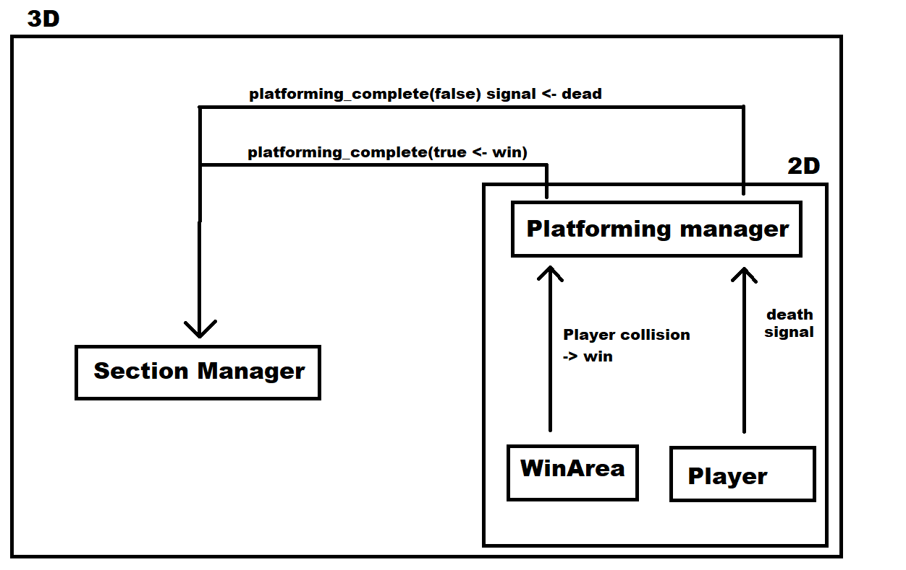


### Platforming Complete Signal
To create our own signal we need to write the next line into the `platforming_manager_2d.gd`. Place near the top of the script, after the `class_name` and `extends`:
```GDScript
signal platforming_complete(bool)
```
This signal is special, because it is called with a `bool` variable, which will determine if the player completed the 2D platforming successfully or not.


### Adding the WinArea
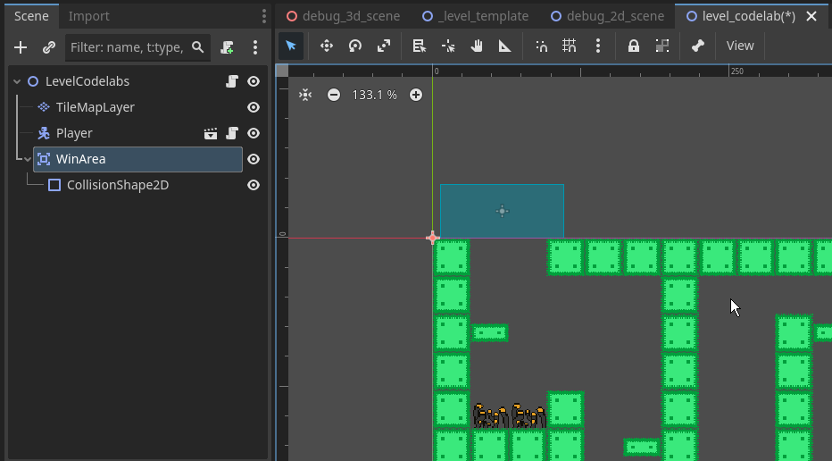

1. **Open** the `level_codelabs.tscn` scene
2. **Add** a `Area2D` node and rename it to `WinArea`
3. **Add** a `CollisionShape2D` as a child of the `Area2D`
4. **Setup** the collision layer and mask of the `Area2D` same as the image below

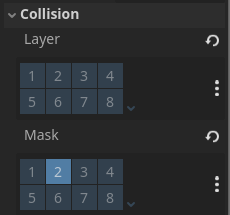

Now, let's connect the signal of the **win area** to the **platforming manager** using the `Node` tab of the area.
1. **Select** the `body_entered` signal
2. **Press** the `Connect...` button on the bottom right
3. **Select** the 2D platforming scene root
4. **Press** the `connect` button

This will create a function in the `platforming_manager_2d.gd`. Fill it out like this:
```GDScript
func _on_win_area_body_entered(body):
    platforming_complete.emit(true)
```


### Player 2D Death
Add these lines to the top of the `player_controller_2d.gd`:
```GDScript
class_name PlayerController2D
...
signal player2D_died
```

and in the `_process_new_collision()` function replace scene reset line:
```GDScript
get_tree().reload_current_scene()
```
with:
```GDScript
player2D_died.emit()
```
which will emit the signal once the player has died.

Now let's connect it to the `platforming_manager_2d.gd`, we could do it the same way as the `WinArea` but I want to show you how to do it through code.

First, let's change the node type of the player from `Node2D` to `PlayerController2D`.

Next, add the Godot lifecycle function `_ready()` with the next line, which might be a bit confusing. Don't worry, I will explain it shortly:
```GDScript
func _ready():
    player.player2D_died.connect(platforming_complete.emit.bind(false))
```
- **`player`** is the reference to the `PlayerController2D`
- **`player2D_died`** is the signal, which will be emitted when the player dies
- **`connect()`** is a function of a signal, its parameter is the function, which will be called once the signal is emitted
- **`platforming_complete.emit`** is the function that will be called once the `player2D_died` signal is emitted
- **`bind(false)`** add the value `false` as the parameter of the function `emit` 

> aside negative
> We cannot do:
> ```GDScript
> player.player2D_died.connect(platforming_complete.emit(false))
> ```
> Since that would call the function `platforming_complete.emit(false)` and put its return value as the function to call.


### Connect the Platforming Manager (2D) to Platforming Section (3D)
To connect it we can easily put the following line into the `platforming_section.gd` script:

```GDScript
func _ready() -> void:
    ...
    platforming_manager.platforming_complete.connect(print)
```

For now, let's just print out the bool of the signal -> success or not. Try to play the game, jump on the spikes, and try to enter the `WinArea`. The `Output` should print out `false` for spikes and `true` for the `WinArea`.


## Exiting 2D
Duration: hh:mm:ss

Now it is time to make a function to **exit the 2D world**. It will work in a similar way as the enter function but in **reverse**. The result of the 2D platforming section will determine, if the player will be pushed **up and forward** (success) or **down and backwards** (failure).


### The Exit Function
The `_exit2D()` function is very straightforward, we just need to reverse the changes done in `_enter2D()`.

```GDScript
# Handles the transition from 2D platforming to 3D 
func _exit2D(success : bool) -> void:
    if not _is_in_2d: return
    _is_in_2d = false

    # Turn off the 2D level
    platforming_manager.turn_off()

    # Enable the 3D Player
    _player_3d.scale = Vector3.ONE
    _player_3d.process_mode = Node.PROCESS_MODE_INHERIT

    # Change the camera target
    _player_3d.camera_pivot.camera_target = _player_3d
    _player_3d.camera_pivot.set_user_rotation_control(true, camera_angle)
```

> aside positive
> We also needed to **match** the parameters of the function with the signal, that calls it `platforming_complete(bool)` hence the `success : bool` parameter.


### Player 2D Death Glitch
If you run the game and die on the spikes in the 2D level. You start going **back and forth** between 2D and 3D. To fix this we will need to do 3 things.

#### Move Player 3D Outside of the `Area3D`
The second problem is, that the player 3D stays in the `Area3D` and is disabled. This is problematic, since once they are enabled,the collision is triggered again resulting in constant exiting and entering loop. To fix this we will **move** the player 3D out of the `Area3D` and **wait** one frame with disabling them.

```GDScript
func _enter2D() -> void:
    if _is_in_2d: return
    _is_in_2d = true

    # Turn on the 2D level
    platforming_manager.turn_on()

    # Disable the 3D Player
    _player_3d.scale = Vector3.ZERO
    _player_3d.position += Vector3.RIGHT * 2    # Move the player a bit right

    # Change the camera target
    _player_3d.camera_pivot.camera_target = camera_target
    _player_3d.camera_pivot.set_user_rotation_control(false, camera_angle)

    # Wait a frame before disabling
    await get_tree().process_frame                          
    _player_3d.process_mode = Node.PROCESS_MODE_DISABLED
```

The **`await`** keyword pauses the execution of the function until the signal after the keyword emits. The signal here is the `get_tree().process_frame`, which is called before the next physics frame is called on all the nodes in the tree.

> aside negative
> We need to use `get_tree().process_frame` since it we are setting the `process_mode` property and `process` updates more frequently than `physics_process`.


#### Move Player 2D Outside of the `WinArea`
The first problem is that once the 2D player dies, they stay on the spikes and constantly **die over and over**. To fix this we need to reset the 2D player position upon **losing or winning** the 2D level. We will do this by **caching** the position of the player at the beginning of the game and then **moving** the 2D player to that position once end the 2D game.

Apply these changes to the `platforming_manager_2d.gd`:
```GDScript
...
var _start_pos : Vector2
...
func _ready():
    ...
    _start_pos = player.position

func turn_off() -> void:
    ...
	player.position = _start_pos
```

The second problem is with the `WinArea`. The same thing as in the player 3D case happens and we will fix this in the same way. Please apply this fix to the `platforming_manager.gd` script:
```GDScript
func turn_off() -> void:
    player.scale = Vector2.ZERO
    player.position = _start_pos

    await get_tree().process_frame
    process_mode = Node.PROCESS_MODE_DISABLED
```


### Error in Debugger
If you try playing the game, everything seems to work perfectly well. However, looking at the `Debugger` you can see these errors:

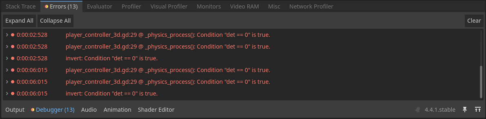

This error `det==0` means that the **determinant** of the transformation matrix of a node (the player) is `0`. This is due to the fact that, we are **setting the scale** of the player to `(0, 0, 0)` and then some **physics frames** are still run until we **disable** the node later.

One fix is to **scale** the player to some small but non-zero number like `(0.001, 0.001, 0.001)`.

The second fix, that we will apply, is to move the setting of **scale** to `0` to be also after the wait.

Simple move the `_player_3d.scale = Vector3.ZERO` line below the `await` line like this:
```GDScript
func _enter2D() -> void:
    ...
    # Wait a frame before disabling
    await get_tree().process_frame
    _player_3d.scale = Vector3.ZERO
    _player_3d.process_mode = Node.PROCESS_MODE_DISABLED
```


### Move and push the 3D Player
Now, let's **move** the 3D player to the position the 2D one ended in and **push** them based on the 2D level result.

#### Moving the player
This part will be very easy since the only thing we have to do is **set the right position** to the player when they exit the 2D level.

How to get the position? That is simple, the `CameraTarget` node (the white box) already moves in a way that it is in the same place as the 2D player. We can simply set the 3D player position to the same position as the `CameraTarget`.

```GDScript
func _exit2D(success : bool) -> void:
    ...
    # Enable the 3D Player
    ...
    _player_3d.global_position = camera_target.global_position
```

> aside positive
> We use `global_position` instead of `position` to avoid unnecessary manual coordinate space calculation between the box and the 3D player. `global_position` tells us the position of a node in the relation to the scene tree root. 


#### Pushing the player
If we leave it like this, the player just **pops-out** based on the player 2D position. That's not very pretty and it can even make the player **fall off** the platforming they are trying to climb on using the 2D platforming section.

Let's define 3 `export` variables, that will determine the **success** and **failure** force the player should be pushed by and a variable that will determine for **how long** the player should be pushed for. Add this to the top of the `platforming_section.gd`:
```GDScript
@export var success_push_force : Vector3
@export var failure_push_force : Vector3
@export var push_time : float = 0.3
```

Now we can just **apply the velocity** to the player in the `_exit2D(...)` function:
```GDScript
func _exit2D(success : bool) -> void:
    ...
    # Enable the 3D Player
    ...
    _player_3d.velocity = success_push_force if success else failure_push_force
```

However, trying it now the velocity gets quickly **overridden** by the dampening of the player. We can fix this by using a function that I have added to the 3D player between the last codelab and this one. The function `set_do_movement(...)` sets a variable, that **disables/enables** the calling of the movement function of the player (handles WASD input, dampening, etc.). So the plan is to **disable the player** movement, then **wait a while** (`push_time`), and then **enable the player** movement. How do we wait?

Waiting can be done either by the `Timer` node, which we will do in a later codelab, or by using `get_tree().create_time()` with `await`. Paste this code at the end of the `_exit2D(...)` function:
```GDScript
func _exit2D(success : bool) -> void:
    ...
    _player_3d.set_do_movement(false)
    await get_tree().create_timer(push_time).timeout
    _player_3d.set_do_movement(true)
```

Try using different values for the push forces to make them feel right. I set them up like this:

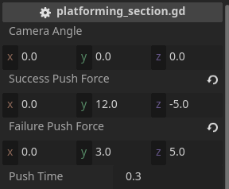


## WinArea Error
Duration: hh:mm:ss

If you play the game and manage to exit the 2D level by entering the `WinArea`. The **Debugger** shows this error:
```
E 0:00:36:347   platforming_manager_2d.gd:19 @ turn_off(): Disabling a CollisionObject node during a physics callback is not allowed and will cause undesired behavior. Disable with call_deferred() instead.
    <C++ Source>  scene/2d/physics/collision_object_2d.cpp:244 @ _apply_disabled()
    <Stack Trace> platforming_manager_2d.gd:19 @ turn_off()
                  platforming_section.gd:58 @ _exit2D()
                  platforming_manager_2d.gd:28 @ _on_win_area_body_entered()
```

> aside positive
> For easier testing of the `WinArea`, you can move the 2D player closer to it.

### Cause

Going over the error, we can see that the "Disabling a CollisionObject node" happens in the `turn_off()` function on this line:
```GDscript
process_mode = Node.PROCESS_MODE_DISABLED
```

The "... during a physics callback" part happens because the previous line is called from the `_on_win_area_body_entered()` signal function in the `platforming_manager_2d.gd`.


### Deferred Calls
We can fix this by postponing the this signal emit `platforming_complete.emit(true)` in the `_on_win_area_body_entered()` function. To do this we will need to learn about `deferred` **calling** and **setting**.

Calling a function or setting a variable **deferred** makes the action take place during idle time, which takes place after the `process` and `physics_process`. This is useful when you want or need something to happen at the **end of the frame**. In our case we will use it to make our signal emit after the physics have been resolved in this frame. Calling a **function deferred** can be done like this:

```GDScript
# Template, {var} is a placeholder for a real value
{node}.call_deferred( "{function_name}", {parameter1}, {parameter2} ... )

# Examples
call_deferred("rotate", Vector3(1, 0, 0), 30)
platforming_manager.call_deferred("turn_off")
...
```

Setting a variable value can be done the same way using:s
```GDScrip
# {var} is a placeholder for a real value
set_deferred("{var_name}", {value})`
```


### Fix - Deferred Signal
Signals are a bit different. To make a signal **emit deferred**, we need to set a **flag** when we are connecting it. When we connect a signal in the editor, we can set it to **deferred** in the pop-up window after toggling the `advanced` option.

When we connect a signal using code, like in our case in `_ready()` function in `platforming_section.gd`, we can add a flags as parameters. **Replace** the signal connection line with this:
```GDScript
func _ready() -> void:
    ...
    platforming_manager.platforming_complete.connect(_exit2D, ConnectFlags.CONNECT_DEFERRED)
```


## Bonus: Enter2D and Exit2D Smoothly + Task
Duration: hh:mm:ss

The instant pop-in and pop-out of the players when they enter and exit the 2D does not look very good. Let's make it smooth by using **Tweens**.

### Tweens
What are tweens? Here is an excerpt from the [Godot Documentation](https://docs.godotengine.org/en/4.4/classes/class_tween.html):

*Tweens are mostly useful for animations requiring a numerical property to be interpolated over a range of values. The name tween comes from in-betweening, an animation technique where you specify keyframes and the computer interpolates the frames that appear between them. Animating something with a Tween is called tweening. ...*

Overall, they are a very powerful tool for making **small animations** or things that happen instantly **more smooth** such as UI bars, text micro movements, fade in/out character bobbing, screen transitions, recoil, static camera movements, rotating/scaling objects, moving objects to mouse, and much more.


### Tweens in Godot
To create a tween in Godot, you can simply call the `create_tween()` function, which will return a **`Tween`** object. The `Tween` class has a two important functions for us:
- `tween_property(node, "property", final_value, time)` - tweens a property (variable) from its current value to a given value taking given time
- `tween_method(function, start, end, time)` - tweens a value from `start` to `end` and calls a given function with that value (useful for more complex scenarios, where you don't just set a value)

These function return a variable of type **`Tweener`**. This variable tells you everything about the animation you created. You can change the `easing` and `transition`, which determine **how the value** will be interpolated (changed in time). An example of how these settings change the animation can be seen in this [cheatsheet](https://easings.net/en#) (I recommend bookmarking it).


### Enter2D
Let's start in the `_enter2D()` function in the `platforming_section.gd` script. I would like the player to slowly **scale down** to 0 and **move** to the position of the 2D player. The tweens will take some time to play out and this **time** should be easily configurable.

**Add** another `export` variable called `tween_time` of type `float`.

We will also need to rewrite more parts of the `_enter2D()` function, so here is the **new version**:

```GDScript
# Handles the transition from 3D to 2D platforming
func _enter2D() -> void:
    if _is_in_2d: return
    _is_in_2d = true

    # Turn on the 2D level
    platforming_manager.turn_on()

    # Change the camera target
    _player_3d.camera_pivot.camera_target = camera_target
    _player_3d.camera_pivot.set_user_rotation_control(false, camera_angle)

    # Manual update to get Player2D position
    _update_camera_target()

    # Create Position and Scale tweens
    var scale_tween : Tweener = create_tween().tween_property(_player_3d, "scale", Vector3.ZERO, tween_time)
    var pos_tween : Tweener = create_tween().tween_property(_player_3d, "global_position", camera_target.global_position, tween_time)

    # Wait for tween before disable
    await pos_tween.finished
    _player_3d.process_mode = Node.PROCESS_MODE_DISABLED
```
1. **Manual update** of the `CameraTarget` so that it has correct position for the Tween.
2. **Creation** of two Tweens (position and scale) and storing them in variables.
3. **Awaiting** the end of the Tweens (only the position one, but they takes the same time to complete).
4. **Disabling** the process mode of the player after waiting.

Try to play the game and see how it looks like. We will now try to use `easings` and `transtions` to make it look much better.

Simply **add** these lines above the `await`:
```GDScript
pos_tween.set_trans(Tween.TRANS_EXPO)
pos_tween.set_ease(Tween.EASE_OUT)
scale_tween.set_trans(Tween.TRANS_CUBIC)
scale_tween.set_ease(Tween.EASE_IN)
```

The tweens should look much better now. Here is a video of the difference:
<video id=10Lpj4ArnxU></video>

You can see in the video, that even when we place the 2D player far away, it works quite well.


### Exit2D
The exiting of 2D will be very similar. This time we only care about the **scale** of the 3D player. Let's just try to reverse the **scale tween** in the enter function.

#### Task
Try to do this part of the codelab it yourself.
1. **Create** the scale tween
2. **Set** transition
3. **Set** easing

> aside negative
> **Change** the current scale line to this:
>```GDScript
>_player_3d.scale = Vector3(0.001, 0.001, 0.001)
>```
> Not doing this will cause a physics error since for a few frames the players scale will be `0`.


## Task Exit2D Solution 
Duration: hh:mm:ss

Here is the solution to the task from the previous section:
```GDScript
func _exit2D(success : bool) -> void:
    ...
    platforming_manager.turn_off()

    # Scale the player back up
    _player_3d.scale = Vector3(0.001, 0.001, 0.001)
    var scale_tween : Tweener = create_tween().tween_property(_player_3d, "scale", Vector3.ONE, tween_time)
    scale_tween.set_trans(Tween.TRANS_CUBIC)
    scale_tween.set_ease(Tween.EASE_OUT)

    # Enable the 3D Player
    _player_3d.process_mode = Node.PROCESS_MODE_INHERIT
    ...
```

> aside positive
> I used `EASE_OUT` instead of `EASE_IN`, which makes the effect look much better

### Afterword about Tweens
As you can see, Tweening can make a huge difference in the feel and look of your game. More importantly, choosing the wrong `transition` or `easing` can have the exact opposite visual effect that you were going for. You can spend a lot of time tweaking and perfecting tweens but I personally think that they are worth it.


### One more thing
Don't forget to hide the cube mesh of the `CameraTarget`. We had it there only for testing of the player 2D position.

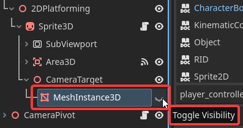


## Recap
Duration: hh:mm:ss

Let's look at what we did in this lab.
- We looked at the **changes I made** between the last codelab and this one
- Then, we learned the importance of **reusing scenes** by saving them (Player2D)
- We made **managers** for the 2D game and for the 2D section in 3D, which made **entering and exiting 2D** possible
- Next, we learned about what are **signals**, how to **create** them, and **use** them
- Then, we made the **camera follow** the 2D player by **recalculating 2D coordinates** to 3D
- We made the **result** of the 2D game **propagate upwards** the tree to the section manager
- Next, we fixed many different **errors** that sprung up
- Lastly, we made the **entering** and **exiting** 2D smoothly animated using **Tweens**


If you want to see how the finished template looks like after this lab, you can download it here:
<button>
  [Template Done Project](link)
</button>