summary: Ground Enemy AI (NavMesh, FSM)
id: export
categories: Globals, AI, NavMesh, 3D, FSM, Plugin, Projectile
status: Published
authors: Ondřej Kyzr
Feedback Link: https://forms.gle/J8eeuQAJ3wMY1Wnq7

# Lab05 - Ground Enemy AI (NavMesh, FSM)

## Overview
Duration: hh:mm:ss

This lab will focus on creating a **Ground Enemy** for our game, including their behavior and navigation, so that they can interact with the player and the environment.

Today, we will look over:
- Changes made in the project between the codelabs. 
- The `NavMesh`, what it is, how it works, and how to use it.
- Learn about **Finite-State Machines** and implement one for our Ground Enemy.
- Creating **different states** for the FSM and the **transitions** between them.
- **Spawning/Instantiating nodes** during play time.

Here is the template for this lab. Please **download it**. There are new folders, 3D models/meshes, updates in scenes, and scripts.
<button>
  [Template Project](https://cent.felk.cvut.cz/courses/39HRY/godot/05_AI-NavMeshFSM/template.zip)
</button>


## Project Changes
Duration: hh:mm:ss

I have made quite a few changes since the last codelab. Most notably, I added **comments** to most of the code, changed the **main 3D scene** to accommodate the theme of this lab, and added **3D models** for the enemy and projectile. More on that later on.

### global_debug.gd
One of the more important additions is the `global_debug.gd` script. You can make use of it during playtime by pressing these keys:
- `ESC` - unlocks/locks the mouse (no more pressing Windows key)
- `F2` - slows down time by 1/2
- `F3` - speeds up time by 2

Having a script like this in your project is **extremely useful** for fast and easy **debugging**. Moreover, you can easily expand it to solve your project-specific debugging issues. I **recommend** copying it into your project if you plan on using Godot. 

However, firstly, we need to learn about **Singletons** and **Autoload**!

### Singleton Pattern and Autoload
The Singleton pattern is a software design pattern that **restricts a class**, so that there cannot be more than a **singular instance** of it. In most other game engines, you would have to use Singletons for scripts like the `global_debug.gd`.

In **Godot,** you could also use Singletons, but there is an easier way. Godot allows you to set **scripts** or even **node trees** as **Autoload**. If you add a node/script as **Autoload**, it will be automatically created and added above the scene tree upon start. This makes the node accessible from anywhere, which is useful for many reasons. The usual **Godot Lifecycle** functions are still run.

Let's add the `global_debug.gd` as an **Autoload**:
1. **Open** the `Project Settings`
2. **Navigate** to the `Globals` tab
3. **Go** into the `Autoload` tab
4. **Click** on the folder icon and find the `global_debug.gd` script.
5. **Press** the `Add` button

The result should look like this:


> aside negative
> If you plan to use this or a similar script in your own project, you will also need to add the script to `Autoload` in **Project Settings**.


### Globals in Remote Scene Tree View
Now, if you **run the game** and press the keys outlined above, they should do their job. While running the game, you can switch the scene hierarchy to `Remote` mode. This allows you to see the **current state of the scene** as the game runs. This is useful for looking at node properties in **real time**. Looking at it now, we can see that the autoloaded `GlobalDebug` node sits as a **sibling** to the current 3D scene.

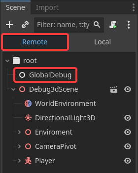

Autoload/Singletons are very useful for **tracking global values** (max reached level, time played, player stats, number of deaths, highscore...) or to easily **access important nodes** (Managers, UI, Fade In/Out, debugging...).


> aside positive
> One small note: The `global_debug.gd` **only works in the editor**. When running a build of the game (compiled .exe file), the node automatically deletes itself (see `_ready()` function of the script).


## NavMesh
Duration: hh:mm:ss

Imagine you have an NPC character**, and you want them to navigate through a **maze**. We need to know where they **can and cannot walk** and then somehow **plan a path** through the maze. We can solve this problem easily with a **NavMesh** and a **NavMeshAgent**:

- **NavMesh** is a simplified representation of the environment using convex polygons that defines which areas of an environment are traversable by **NavMeshAgents**.
- **NavMeshAgent** uses the **NavMesh** and a pathfinding algorithm like `A*` to plan a path from point A to point B.

Here is an example of a **NavMesh** in Godot. The light-blue areas are walkable by an agent. 


A **NavMesh** is usually "baked" or calculated in the editor, so naturally it is **NOT** suitable for **highly dynamic** environments since you would need to rebake the **NavMesh** every time something changes. If you really need to, you can bake a NavMesh while the **game is running**, but be aware that the computation is quite **costly**.

> aside positive
> Depending on the engine or literature, the **NavMeshAgent** and **NavMesh** may be called by different names. In Godot, it is a **NavigationAgent** and **NavigationRegion**. Both versions of these terms are correct, and I will use them interchangeably.


## NavMesh in Godot Engine
Duration: hh:mm:ss

Now that we know what a **NavMesh** is, we can try to use it in our project. Open the project and our `debug_3d_scene.tscn` scene.

1. **Add** a `NavigationRegion3D` node as a child of the root
2. In the **Inspector** of the new node **add** a new `NavigationMesh`
3. **Open** the created `NavigationMesh`

There are many settings that you can change here, and it would take too much time to go through them all. I will show you the basics, and you can look up the rest. 

First, we need to specify which **meshes/colliders** should be considered during the **NavMesh** calculation. We can do that in the `Geometry` category with the `Source Geometry Mode` property. I find the `Group With Children` option to be the most manageable, so let's use it. Also, set the property `Source Group Name` to `NavMeshSource`.


### Groups
Now we have set the `Source Group Name` property, but what are the **groups**? Each node can be a part of any number of **Groups**. They can be used to easily **tag** nodes. For example, you can tag **boxes and barrels** in your game as **"Destructible"** and then when the player attacks an object, you can **check** if the object is in the group "Destructible", if yes, then you can **delete** the object.

Every node has a function to check if it is in a group: 
```GDScript
# {var} is in place of a real value 
{node}.is_in_group({string_name})
```


### Back to NavigationRegion3D
With the `Source Group Name` set, the NavigationRegion will **only consider** nodes (and their children) that are in the group `NavMeshSource`. Let's set the **group** to the correct nodes.

1. In the **Inspector** of the `Ground` node, **select** the **Node** tab
2. **Click** on the **Groups** button next to Signals
3. **Press** the `+` button and in the popup **set** the name to `NavMeshSource` and **check** the `Global` toggle

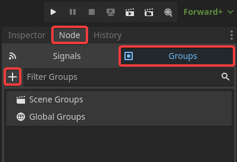 


Now the node `Ground` is in the group `NavMeshSource`.

Please also add the node `Obstacles` to the same group. Now, since the group is already created, you can just **select** the `Obstacles` node and toggle the `NavMeshSource` group in the **Groups** tab.


### Baking the NavMesh
To bake the NavMesh in the editor:
1. **Select** the `NavigationRegion3D` node
2. **Press** the `Bake NavigationMesh` button in the context menu


The result should look like this:

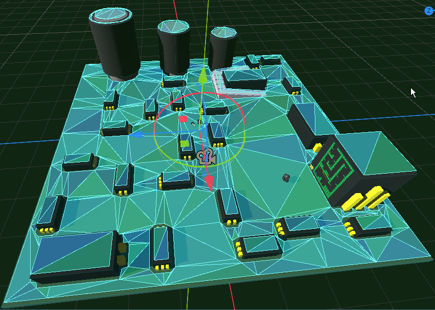


> aside positive
> Godot has 3D and 2D `NavigationRegions` and `NavigationAgents`.


## Prepare the Enemy for NavMesh
Duration: hh:mm:ss

I have prepared a **basic enemy** with a script and node setup. However, there are a few things that need to be **adjusted** first.

**Open** the `ground_enemy_fsm.tscn` scene located in the folder `3D/Enemies/GroundEnemy/FSM`.

### Import Settings of Assets

#### Enemy Model
Looking at the scene in **3D view**, we can see that the enemy is **misplaced** and is not inside the area of the **collision shape**. However, the position of the `MeshInstance3D` is `(0,0,0)`. That means that the person who created the model (me) must have placed **the origin of the object** in the wrong place. `¯\_(ツ)_/¯`


To fix this, we will learn about the **Import** tab.

1. **Select** the `GORODITH_ground_enemy_corrupted.obj` in the folder `3D/Enemies/GroundEnemy`
2. **Switch** to the **Import** tab at the top of the **Scene Hierarchy**
3. **Set** the `Offset Mesh` property to `(-1.05, -2, 1.1)` to center the mesh
4. **Press** the `Reimport` button


Now the enemy should be correctly centered, like in the picture above. 

> aside positive
> I created this 3D Voxel model in a free program called **MagicaVoxel**. It is very easy to use, and I recommend it if you want to use a similar aesthetic.


#### Enemy Texture
There is one more issue with the import. When I modelled the enemy, it had very **different colors**. See these images for reference (the first one is from the modelling software, the second one from Godot):


This problem comes from how the modelling program uses textures. The colors are exported as a small **strip of colors** from the color palette.


However, by default, Godot **compresses a texture** upon importing to save **memory and computational power**. Our textures are so small (256x1 px) that we do not need to compress them.

1. **Select** the `GORODITH_ground_enemy_corrupted.png` in the folder `3D/Enemies/GroundEnemy`
2. **Switch** to the **Import** tab at the top of the **Scene Hierarchy**
3. In the `Compress` category **change** the `Mode` to **Lossless** 
4. **Press** the `Reimport` button


> aside positive
> Another option for bigger textures would be to keep the `VRAM Compress` mode but toggle on the `High Quality` setting.


### Navigation Agent Node
Now we need the enemy/agent to communicate with the `NavigationRegion3D`. To do this, we can just add the `NavigationAgent3D` node to our enemy scene and then use it in the script. We **do not** need a reference to the `NavigationRegion3D` since all **navigation communication** happens through the `NavigationServer3D`, so our job is a bit easier. Think of it as a **magical black box** that transmits all the necessary information between `NavMeshes` and `Agents`.

1. **Add** the `NavigationAgent3D` node as a child of the `GroundEnemyFSM`.
2. **Set** the property `Path Height Offset` to `-0.5` (since our player is `1m` tall)

#### Agent Reference
We will also need a reference to the `NavigationAgent3D` node in the script, so **open the script** on the enemy and add the reference to the top of the script using one of the **two following methods**:

You can either **drag the node**, then **press CTRL**, and **drop it** in the code (don't forget to add the type), or just **copy the code** below:
```GDScript
@onready var navigation_agent_3d : NavigationAgent3D = $NavigationAgent3D
```

### Move the Enemy in Scene
Now let's **open** our favorite `debug_3d_scene.tscn`. We can see that the enemy is already instantiated in the scene. **Playing** the game, you can see that the enemy just **moves forward** into the wall. Let's **look at the code** controlling the enemy.

Most of the code is very similar to the player's movement code. To test out the `NavMesh`, we just need to change 2 lines of code. First, we would like to set the target of the agent to the position where we click with the mouse. 

#### Set Target
I have already prepared all the raycasting math needed, so you can just go into the `_input()` function and **change** the last `if` statement to this:
```GDScript
# Same as `result != null`
if result: 
    navigation_agent_3d.target_position = result.position
```

This sets the **target** of the `NavigationAgent` to the **clicked position** and the agent finds the **closest path** to the point.

#### Move to the Target
The second change is at the top of the `_movement()` function. We need to change the `target_pos` to the next point on the path generated by the `NavigationAgent`. There is just the function for it in the `NavigationAgent`. **Change the line** to this:
```GDScript
var target_pos : Vector3 = navigation_agent_3d.get_next_path_position()
```

Try to **play the game** and click somewhere. If the clicked position was on the `NavMesh`, the enemy should go there.


## NavMesh and Enemy Fixes 
Duration: hh:mm:ss

If you played around with our current setup enough, you might have noticed that the enemy can get **stuck on corners**, cannot **climb the steps**, etc. We will go through these issues and fix them.

### Debug View
For easier debugging, let's open the enemy scene and look in the `NavigationAgent3D`'s **Inspector**.

There in the `Debug` category **turn on** the `Enabled` property.


Now, if you **play the game** and click somewhere, you can see the **path** (red line) the agent is taking.


> aside negative
> Don't forget to **save** the **enemy scene** every time we change something!


### Stuck on Corners
The reason the enemy is getting **stuck on corners** is that the enemy is **wider** than the `radius` property that the `NavMesh` was baked with. The `radius` property controls how much space is between the edge of the `NavMesh` and the edge of the obstacle. Our enemy has a `SphereShape` with a radius of `1m` as the collider. Let's go into the `NavigationMesh` settings and **change** the `radius` property:

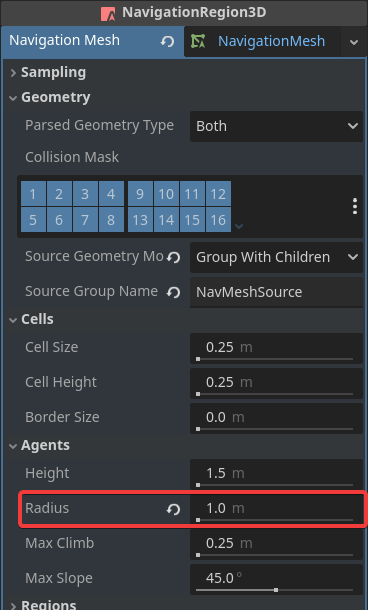

Every time you change something in the `NavigationMesh`, you need to bake it again. So press the `Bake NavigationMesh` button again from the **context menu**.

> aside positive
> There are many more settings in `NavigationMesh` that completely change how it is created. I suggest you try out different settings. In the end, almost **every enemy type** needs slightly **different settings**.


### Stuck on the Stairs
This problem is a bit different since it does not originate from any of the **navigation nodes**, but from the `CharacterBody3D` itself. The `CharacterBody3D` considers the steps as a **wall**, so it does not allow movement up the steps. The **solution** I found (there may be other and even better) is to set the `Max Angle` property in the `Floor` category of the `CharacterBody3D` to `60`. So please **set** it:


> aside positive
> If your game needs to have different `NavMeshes` for different enemies, you can add more `NavigationRegion` nodes and toggle which enemy can use which `NavMeshes` with the `Navigation Layers` property.


## Extra Navigation Nodes
Duration: hh:mm:ss

There are **2 extra nodes** related to `NavMeshes`/`NavigationRegions`, that can be used. This chapter is a bit **optional**, but I recommend at least looking through it, so that you know that these nodes exist.


### NavigationObstacle3D
This node is useful when you want to mark an area as **unwalkable** on the `NavMesh`. We will use it to get rid of these **small patches** on top of the resistors.

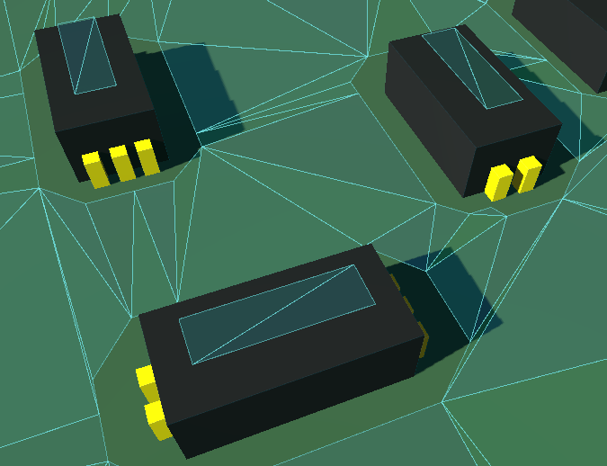

To do this:
1. **Open** the `resistor.tscn` scene
2. **Add** a `NavigationObstacle3D` as a child of the root
3. **Open** the `vertices` property and **add** 4 vertices
4. **Set** the **coordinates** of the vertices, so it matches the bounds of the gray square
5. **Set** the `height` property to `1.5m` (needed so that the top of the object is unwalkable)
6. **Toggle** the property `Affect Navigation Mesh` ON in the `Navigation Mesh` category

The resulting `Resistor` should look like this:
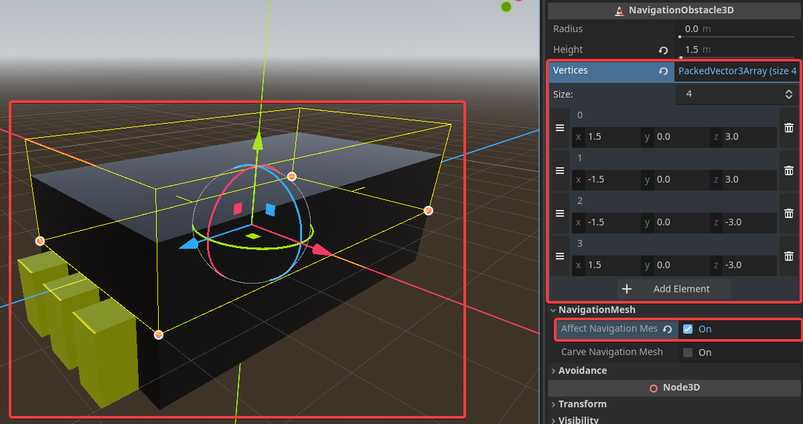

Now, the last thing we need to do is to **bake** the `NavMesh` again. The `NavMesh` in the scene should now be without the small patches:


### NavigationLink3D
The second node is useful when you want to add connections to the `NavMesh` manually. For example, you can add a link to a ledge to enable the agent to **jump down**, or make them **jump over** a gap. 

**Add** the `NavigationLink3D` node to the scene. I like to keep them as a **child** of the `NavigationRegion3D`, but you are free to put them where you want. The link has several interesting properties:
- `Bidirectional` - control whether the agent can traverse the link **both ways**
- `Start Position` - the **coordinates** of the start position (it is easier to set it using the **red dot** gizmo in scene view)
- `End Position` - the **coordinates** of the end position (it is easier to set it using the **red dot** gizmo in scene view)
- `Travel Cost` - length **multiplier** for the pathfinding, higher values make the links more costly, it has an effect only when there are **multiple ways** to the target

As an example, I created this link setup:

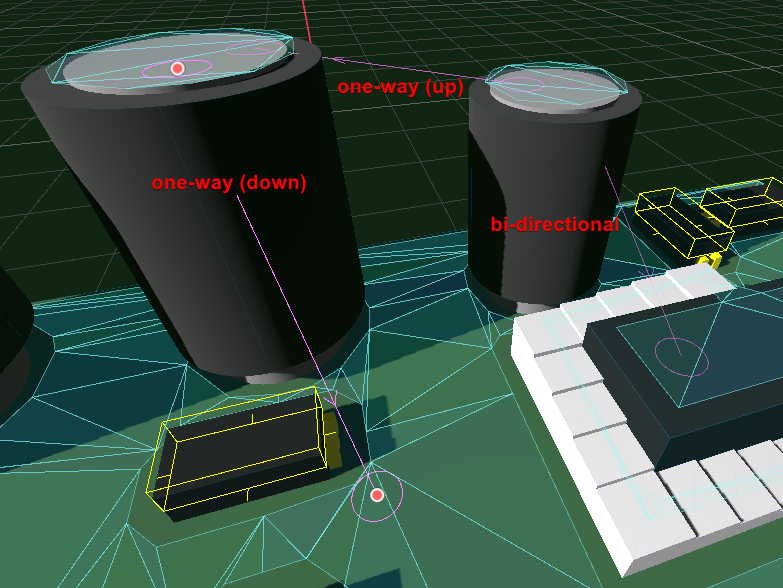

You can **try to make** a similar one and see how the enemy handles it.


## Finite-State Machines (FSM)
Duration: hh:mm:ss

I would like our Ground Enemy to work like this:
- When the player is **not spotted** ⇾ **Patrol**
- When **patrolling** ⇾ move between a **sequence of points**
- When the player is **spotted** ⇾ **Chase** the player
- When **chasing** the player ⇾ Go to the **player position** and periodically **shoot a projectile** at them

This behavior can be expressed as the graph below. Where each **box is a state** the enemy can be in, and each **arrow is a transition** from one state to another. These transitions are taken when the **conditions are met** (red squares).

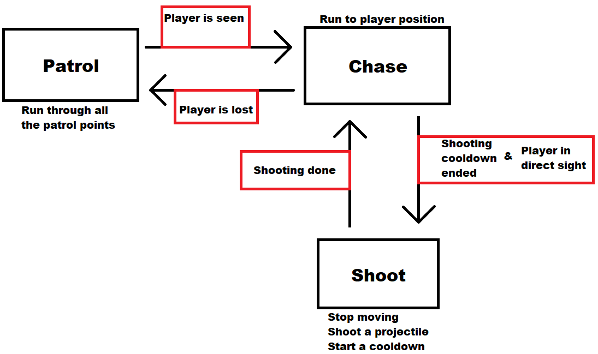

This makes our **enemy AI** very readable and easy to understand. We will now recreate this structure in our project.

### Definitions
Let's first outline a few definitions that will hold for our implementation (and most implementations of FSMs):
- The enemy can be **only in one state** at a time.
- The enemy **starts in one** defined state.
- States can be **changed** (transitioned from one to another) only upon **meeting set conditions**.
- When a state is **entered**, its `state_enter()` **function is called**.
- When the enemy is **in a state**, each **process tick**, it
s `state_process()` **function is called**.
- When a state is **exited**, its `state_exit()` **function is called**.


### What do we have so far?
If you look in the folder `3D/Enemies/GroundEnemy/FSM`, you can see a **script** called `abstract_fsm_state.gd`. Here is the full script, just in case:
```GDScript
class_name AbstractFSMState
extends Resource

# Called upon transition into the state
func state_enter(_enemy : GroundEnemyFSM) -> void:
    assert(false, "Do not use this abstract class!")

# Called every physics process frame
func state_physics_process(_enemy : GroundEnemyFSM, _delta : float) -> void:
    assert(false, "Do not use this abstract class!")

# Called upon transition from the state
func state_exit(_enemy : GroundEnemyFSM) -> void:
    assert(false, "Do not use this abstract class!")

```

This will be our **parent class**, meeting our definitions, for **all the states** that we will create.


> aside positive
> The `AbstractFSMState` class `extends Resource`. We do not need to `extend Node`, because the state just **holds data** and **the behavior**. Keeping the states as resources will enable us to:
> - Easily **create** them in the **Inspector** window, without needing more nodes.
> - Have the possibility to **save, switch, and reuse** states (looping patrol vs. back-and-forth patrol)


## Task: Patrol State 
Duration: hh:mm:ss

Let's first tackle the **patrol state** of our FSM, so that we can then create the **brain of the FSM** in the enemy script.

Start by:
1. **Creating** a new script called `patrol_state.gd` in the `FSM` folder
2. **Set** the `class_name` to `PatrolState`
3. **Set** `extend` to `AbstractFSMState`
4. **Copy** the **three empty functions** from the `abstract_fsm_state.gd`
5. **Replace** the `assert` lines with `pass` instead

Additionally, we will need to be able to **set and store** the points of the **patrol path**. Let's **add** an `@export` variable and an **index**, so that we know which point we are targeting:
```GDScript
@export var patrol_points : Array[Vector3]

var _curr_patrol_idx : int = 0
```

I will leave the patrol state **implementation to you**. The next few paragraphs outline what each function should do. The **solution** will be in the **next section**. Before you start, let's make the enemy **use the patrol state by default**, so that you can easily test it out while implementing. Change the `ground_enemy_fsm.gd` like this:

```GDScript
@export var patrol_state : PatrolState
...
func _ready():
    patrol_state.state_enter(self)
...
func _physics_process(delta : float) -> void:
    _gravity(delta)
    _movement(delta)
    # call to rotate_enemy was deleted -> will be handled by states 
    
    patrol_state.state_physics_process(self, delta)
    ...
...
# Comment out the whole function
#func _input(event : InputEvent):
    #...
```

Also in the **Inspector** of the `GroundEnemyFSM` node, **create** a `PatrolState` resource in the `Patrol State` property and **add patrol points**. Without seeing the points, it is difficult to set the coordinates, so you can just **use these for now** (we will make debugging the patrol path easier later):

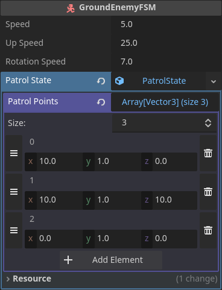


### **`state_enter(...)`**
When **entering the patrol state**, the enemy should **pick a patrol point** that is the **closest to them** and **set it as the target** of `NavigationAgent`.


### **`state_physics_process(...)`**
What should the patrol state do **every frame**? Well, since the navigation is handled by the `NavigationAgent` and the enemy currently just **walks to the set position** (recall the `_input()` function in `GroundEnemyFSM`), we only need to handle the **patrol points**.

Each frame, we will rotate the enemy (`enemy.rotate_enemy()` function) and **check** if the enemy has **reached the target** we set (patrol point). If the target was **reached**, we will **pick the next point** from the `patrol_points`. If there are **no more patrol points**, just start from **the beginning**.


### **`state_exit(...)`**
The patrol state doesn't need to do anything here, but for clarity, we should **reset the** `target_position` of the `NavigationAgent`, so that the enemy stops on the spot.


## Solution: Patrol State and Path debugging
Duration: hh:mm:ss

My solution looks like this:
```GDScript
class_name PatrolState
extends AbstractFSMState

@export var patrol_points : Array[Vector3]
@export var dist_treshold : float = 1.5


var _curr_patrol_idx : int = 0

# Called upon transition into the state
func state_enter(enemy : GroundEnemyFSM) -> void:
	var best_dist : float = enemy.global_position.distance_to(patrol_points[0])
	var best_idx : int = 0
	
	# Find the closest patrol point
	for idx in range(0, patrol_points.size()):
		var dist : float = enemy.global_position.distance_to(patrol_points[idx])
		
		if dist < best_dist:
			best_dist = dist
			best_idx = idx
	
	_curr_patrol_idx = best_idx
	enemy.navigation_agent_3d.target_position = patrol_points[best_idx]

# Called every physics process frame
func state_physics_process(enemy : GroundEnemyFSM, _delta : float) -> void:
    enemy.rotate_enemy(delta, enemy.velocity)
	var curr_point : Vector3 = patrol_points[_curr_patrol_idx]
	
    # Alternative: enemy.navigation_agent_3d.is_target_reached()
    # + change the distance threshold of the `NavigationAgent3D` node

	# Check if the target is reached -> set a new one
	if enemy.global_position.distance_to(curr_point) < dist_treshold:
		_curr_patrol_idx += 1
		if _curr_patrol_idx >= len(patrol_points):
			_curr_patrol_idx = 0
		
		enemy.navigation_agent_3d.target_position = patrol_points[_curr_patrol_idx]

# Called upon transition from the state
func state_exit(enemy : GroundEnemyFSM) -> void:
	enemy.navigation_agent_3d.target_position = enemy.global_position

```

Don't worry if your solution is different. Many things in **Game Development** can be done in almost an **infinite number of ways**. The important thing is that **it works**.


### Path debugging 
It would be helpful if we could **see the patrol path**. There is a very useful plugin for Godot that has just the tools we need for **visualizing stuff** in 3D. Let's use it, while also learning about plugins.


#### Get the Plugin
To download the plugin, you can simply navigate to the `AssetLib` tab next to `Game` at the top center of the Godot editor.

1. **Search** for `Debug Draw 3D`
2. **Click** on it and **press** `Download`
3. **Wait** for a while and **press** `Install`
4. **Press** `Ok`


> aside positive
> Most plugins for Godot are **free** under the `MIT license`. Meaning you can use them even in **commercial products**, if you include the original **copyright notice and the license text**.


#### Debug Draw Path
I have already prepared the script and node that will visualize the path.

1. **Add** the `debug_draw_path.tscn` node into our scene
2. **Go** into the script of the node
3. **Uncomment** the `for loop` and `if condition` at the end of the `process`
4. In the **Inspector** of the `DebugDrawPath` node **add** the `GroundEnemyFSM` to the `Node` property
5. Still in the **Inspector**, put `patrol_state.patrol_points` in the `Property` property

Now, if you look into the 3D scene, you should see a **red line** connecting all the patrol points. Feel free to **add more patrol points** and **create an interesting patrol route**.

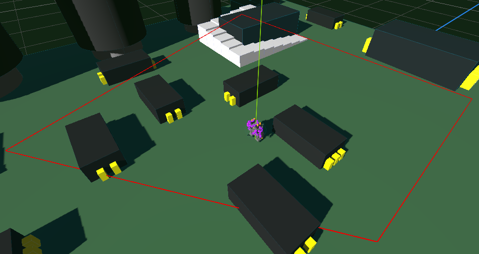

> aside positive
> The script has the **annotation** `@tool` at the top, which makes the **Godot Lifecycle** functions (_ready, _process, etc.) run in the editor, without needing to play the game.


## Chase State 
Duration: hh:mm:ss

The chase state is, for the most part **already implemented**. We will just quickly go through the state script to see what it is approximately doing. Please **open** the `chase_state.gd` script.
- `state_enter(...)` 
    - Makes the enemy **stretch up** for `0.2 sec` and then **back down** to create an interesting visual effect.
- `state_physics_process(...)` 
    - Sets the `NavigationAgent`'s target to the **player position** every `2 sec` (no need to recalculate the path every frame).
    - Rotates the enemy, so that they are partway **looking at the player** and partway **in the direction of movement**.
- `state_exit(...)`
    - Does nothing.


### Complete the ChaseState
There are a few additions needed for the `ChaseState` to be usable.

#### Adding Chase State as a Resource
Similarly to the `PatrolState`, we will add an `@export` variable of the type `ChaseState` to the enemy.
```GDScript
@export var chase_state : ChaseState
```

> aside negative
> Don't forget to **create the resource** of `ChaseState` in the **Inspector** of the `GroundEnemyFSM` scene!


#### Enemy Vision
The enemy needs to somehow **detect the player**. The most straightforward way is to add an `Area3D` to the enemy and **check all bodies** that enter this area. If the entered body is the **player**, the enemy **sees them**.

1. **Add** an `Area3D` to the `ground_enemy_fsm.tscn` scene (rename to `VisionArea`)
2. **Add** a `CollisionShape3D` as a child of the `Area3D`
3. **Add** a new `ConvexPolygonShape3D` as the `Shape` property of the `CollisionShape3D`

We added a `ConvexPolygonShape3D`, because we want to **create a custom shape** for the vision of the enemy (a vision cone). **Add the points** to the shape similarly to the image below:

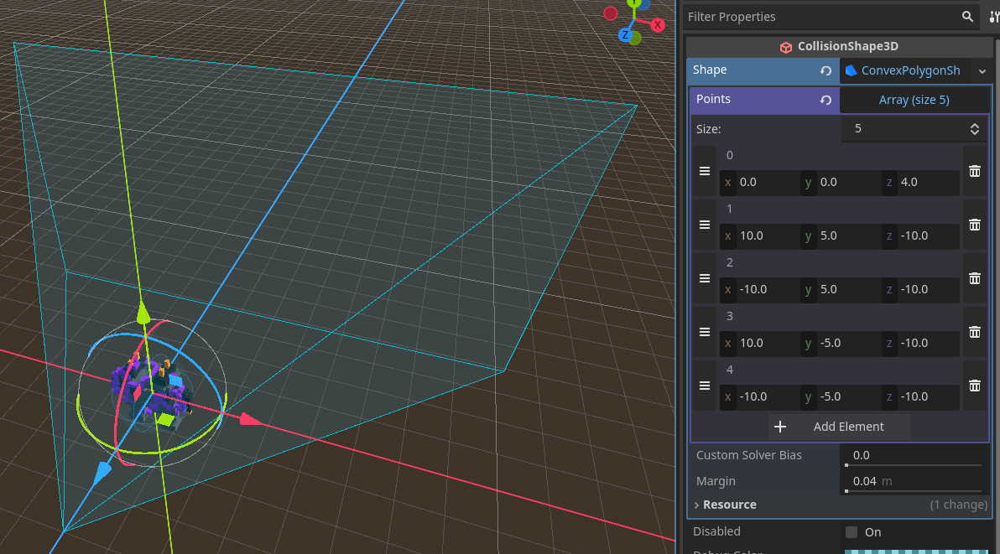

> aside negative
> Don't forget to set the correct **collision layer and mask** for the `VisionArea`:
>


Now connect the signal `body_entered()` to the enemy script using the **Inspector** in the **Node** ⇾ **Signal** tab. This will **create a function** called `_on_vision_area_body_entered()` (if you renamed the `Area3D` to `VisionArea`). Let's use it:

```GDScript
var _trigger_player_seen : bool = false

...

func _on_vision_area_body_entered(body : Node3D):
    if not body is PlayerController3D: return
	
    _player = body
    _trigger_player_seen = true
```
- First, we **check** if the body the enemy sees is **the player**
- Then, we **set** the **reference to the player** (which the `ChaseState` uses through the `get_player()` function)
- Lastly, we **set** the **player seen trigger** (`bool`) to true, so that we know that we have started to **see the player** (will be important in the next part for **transitions**)


### GroundEnemyFSM framework
Now we will need to update the FSM code in the `GroundEnemyFSM` so that it works with **multiple states**, **state switching**, and **state transitions**.

#### Switch State Function
Let's add a function that will handle **switching the current state** to a new one. First, we need to **track the current state**.
```GDScript
var _curr_state : AbstractFSMState
```

Then the function will handle the `state_enter` and `state_exit` like this:
```GDScript
func _switch_state(new_state : AbstractFSMState) -> void:
    if new_state == _curr_state: return

    if _curr_state != null: _curr_state.state_exit(self)
    _curr_state = new_state
    _curr_state.state_enter(self)
```

Now with the **switch function** ready, we can change the `_ready()` function to use it.
```GDScript
func _ready():
    _switch_state(patrol_state)
```

Let's also **change** the `_physics_process()` function, so it updates the `_curr_state` instead of the `patrol_state`.
```GDScript
func _physics_process(delta : float) -> void:
    ...
    rotate_enemy(delta, velocity)
	
    _curr_state.state_physics_process(self, delta)
    ...

```


#### State Transitions
Now, the last thing we need to do is to **check if a transition** from one state to another should happen. We will do this using the `match` **keyword**. This is the same as `switch ... case` in other programming languages. This is the **full code** to be added to the `GroundEnemyFSM`:

```GDScript
# Checks all possible transitions from the current state
func _check_transitions() -> void:
    match _curr_state:
        patrol_state:
            if _trans_patrol_to_chase():
                _switch_state(chase_state)
        chase_state:
            if _trans_chase_to_patrol():
                _switch_state(patrol_state)
	
    # Reset triggers
    _trigger_player_seen = false

# Checks if we have started seeing the player this frame
func _trans_patrol_to_chase() -> bool:
    return _trigger_player_seen

# Checks if the player is too far away from the enemy
func _trans_chase_to_patrol() -> bool:
    var dist_to_player : float = _player.global_position.distance_to(global_position)
    if dist_to_player > chase_state.chase_max_dist:
        return true
	
    return false
```

The aim of creating a **function per transition** is to make the code as **clear, readable**, and **easily debuggable** as possible. For example, if the enemy does not stay in the `PatrolState`, we know that the problem will be somewhere in the `_trans_patrol_to_chase()` function.

We want to check if we should transition to a different state **each frame**, so don't forget to **add a call** to the function to the `_physics_process()` function.

```GDScript
func _physics_process(delta : float) -> void:
    ...
    _curr_state.state_physics_process(self, delta)
    _check_transitions()
    ...
```

Try to **play the game**, the enemy should patrol, and once you enter the `VisionArea`, they should chase you, until you are too far away from them.


> aside positive
> For easier debugging, you can **turn on** `Visible Collision Shapes` in the `Debug` menu on the **top left**. Now you will see the `VisionArea` during **play mode**.
> 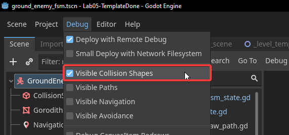


## Shoot State and Spawning Scenes 
Duration: hh:mm:ss

We will end the FSM chapter by **adding a third state** called `ShootState`. This will also be a perfect opportunity to learn about the `Timer` node and how to **spawn/create scenes**.

I have prepared some of the code that will be needed in the `3D/Enemies/GroundEnemy/FSM/shoot_state.gd` file. Please **open the script** and let's see what it does: 
- **`projectile_prefab : PackedScene`** - This is a reference to the scene of the projectile, which we will spawn. The `preload` function loads the scene located at the path, so that it is ready to use.
- **`state_enter()`** - We set the target of the enemy to their position to stop them in place. We will also spawn the projectile here later on.
- **`state_physics_process()`** - Here, we get the player reference and turn the enemy towards the player.
- **`state_exit()`** - Nothing for now.

Now add an `export` reference to our new `ShootState` in the same way as the `PatrolState` and `ChaseState`:
```GDScript
@export var shoot_state : ShootState
```

> aside negative
> Don't forget to **create the resource** of `ShootState` in the **Inspector** of the `GroundEnemyFSM` scene!


### State Transition
If you recall the diagram from the **Theory: Finite-State Machines (FSM)** section, we want the enemy to shoot when:
- The **shooting cooldown** has ended
- Player is in **direct sight**

Let's tackle the **cooldown** first.

#### Cooldown
To handle recurring cooldowns or waiting times, I recommend using the `Timer` node. Let's add one to the enemy:
1. **Add** the `Timer` node as the child of the `GroundEnemyFSM`
2. **Rename** it to `ShootCooldownTimer`
3. **Connect** the `timeout()` signal of the node to the `GroundEnemyFSM` script

Now, in the `GroundEnemyFSM`, let's add a reference to the `Timer`:
```GDScript
@onready var shoot_cooldown_timer : Timer = $ShootCooldownTimer
```

Now to know if we **can or cannot shoot** (⇾ go to the `ShootState`), we can **add a variable** to track it and a **setter function** for the variable:
```GDScript
var _can_shoot : bool = true
...
func set_can_shoot(value : bool) -> void:
    _can_shoot = value
```

We have everything ready to fill the **signal callback function**:
```GDScript
func _on_shoot_cooldown_timer_timeout():
    set_can_shoot(true)
```

> aside positive
> We use **getter** and **setter** functions instead of **directly setting** the value, because in the future we might want to do **other operations** while getting/setting the value (e.g., bounds check, default value override, reference null check, etc.) 


#### Player in Direct Sight
To check if the player is in **direct sight**, we will use a `RayCast3D` node. The node will be **disabled by default**, and we will enable it and check the result only when checking the **transition conditions**. This will save us some performance, as the enemy will not shoot raycasts every frame, but only when they want to shoot a projectile.

1. **Add** a `RayCast3D` node and call it `ShootCast`.
2. **Set** the `enabled` property to `false` and **set the collision mask** to check `Player`, `Terrain`, `Enemy`.
3. **Add** a reference to the `ShootCast` to the `GroundEnemyFSM` script 

(`@onready var shoot_cast : RayCast3D = $ShootCast`)

This is all we need to **add the transitions**.


#### **`_check_transitions()`** changes
We need two transition checking functions, one from `ChaseState` to `ShootState` and one from `ShootState` to `ChaseState`:
```GDScript
# Checks we can shoot the player
func _trans_chase_to_shoot() -> bool:
    if _player == null: return false
    if not _can_shoot: return false
	
    shoot_cast.enabled = true
    shoot_cast.target_position = shoot_cast.to_local(_player.global_position)
    shoot_cast.force_raycast_update()
    shoot_cast.enabled = false
	
    if shoot_cast.get_collider() is PlayerController3D:
        return true
	
    return false

# Checks we can go back to chase from shooting the player
func _trans_shoot_to_chase() -> bool:
    return not _can_shoot
```

> aside positive
> We need to use `shoot_cast.to_local()` function, because the `target_position` property is in the **local coordinates** of the `RayCast3D` node.


The last thing we need to do is to **update** the `_check_transition()` function like this:
```GDScript
func _check_transitions() -> void:
    match _curr_state:
        patrol_state:
            if _trans_patrol_to_chase():
                _switch_state(chase_state)
        chase_state:
            if _trans_chase_to_patrol():
                _switch_state(patrol_state)
            if _trans_chase_to_shoot():
                _switch_state(shoot_state)
        shoot_state:
            if _trans_shoot_to_chase():
                _switch_state(chase_state)
	
    # Reset triggers
    _trigger_player_seen = false
```


### Shoot State
The last few things we need to do to make the whole enemy functional are to **spawn the projectile**, **set the** `_can_shoot` to false, and **start the cooldown timer**.

#### **`state_enter()`**
In this function, we would like to **create a projectile**. We already have the projectile scene loaded using the `preload`, which gives us a `PackedScene` variable. Here is the **full code** for the `state_enter()` function with an **explanation below** of how the spawning works:
```GDScript
func state_enter(enemy : GroundEnemyFSM) -> void:
    enemy.navigation_agent_3d.target_position = enemy.global_position
	
	# Wait before shooting
	await enemy.get_tree().create_timer(shoot_wait).timeout

    # Spawn projectile
    var projectile : ElectricProjectile = projectile_prefab.instantiate()
    projectile.initialize(enemy.get_player())
    projectile.position = enemy.global_position
    enemy.get_tree().current_scene.add_child(projectile)
	
    enemy.set_can_shoot(false)
```
- First, we **wait a while** before shooting.
- The `.instantiate()` function **creates a copy** of the `PackedScene` and returns it.
- The `projectile.initialize(...)` is a function of the `ElectricProjectile` script (made by me), which needs the player, since the **projectile is homing** (chases the player).
- The `projectile.position = enemy.global_position` line makes sure the **projectile** starts in the **same place as the enemy**.
- The `enemy.get_tree().current_scene.add_child(projectile)` line does this:
    - First, it goes to the **enemy node** (`ShootState` is a Resource, not a node)
    - To get a **reference** to **the scene tree**
    - Then gets **the current scene** (`Debug3dScene` in our case)
    - Lastly it **adds the projectile** as a **child** of the scene.
    - The last step is **very important**, without it the projectile **would not fly** or even **render**, since it **would not be present** in the **current scene**.
- Lastly, we **set the** `_can_shoot` variable to **false**, since we have just shot.

> aside negative
> Few notes:
> 1. We cannot add the **projectile** as a **child of the enemy**, because if the enemy moved, the projectile would **also move**.
> 2. The waiting before shooting could/should be a `Timer` node, but I wanted to show you different ways of waiting.

The projectile already flies towards the player. **Check** `electric_projectile.gd` for more info.

> aside positive
> The projectile has many **visual effects** going on. Such as: cycling 2 meshes, scaling up and down, random rotation axis, etc. More effects could be added easily since Godot has really easy-to-use tools (`Tweens`, `awaits`, etc.).


#### **`state_physics_process()`**
Every frame, we want to **look at the player**, so we can get the reference to the player from the enemy and use the player's position in the `rotate_enemy()` function.
```GDScript
func state_physics_process(enemy : GroundEnemyFSM, delta : float) -> void:
    var player : Node3D = enemy.get_player()
    if player == null: return

    # Rotate to player
    enemy.rotate_enemy(delta, (player.global_position - enemy.global_position))
```


#### **`state_exit()`**
The exit function is pretty straightforward. We just want to **start the timer** for the shooting cooldown.
```GDScript
func state_exit(enemy : GroundEnemyFSM) -> void:
    enemy.shoot_cooldown_timer.start(shoot_cooldown)
```


## Bonus: Projectile Knockback 
Duration: hh:mm:ss

It wouldn't be bad if the projectile did something to the player before we implement player HP, stats, etc., in future codelabs. For now, it could knockback the player with a given force and time.

### ElectricProjectile
We need two parameters to have the knockback configurable:
```GDScript
@export var knockback_force : Vector2 = Vector2(6, 7)
@export var knockback_time : float = 0.75
```

and then we will change the `_on_body_enter()` function:
```GDScript
func _on_body_entered(body : Node3D):
    if _is_dying: return

    _destroy()

    if body is PlayerController3D:
        _player.set_do_movement(false)

        var dir_to_player : Vector3 = (_player.global_position - global_position).normalized()
        dir_to_player.x *= knockback_force.x
        dir_to_player.z *= knockback_force.x
        dir_to_player.y = knockback_force.y

        _player.velocity = dir_to_player

        _player.set_do_movement(true, knockback_time)
```

> aside negative
> We cannot use `await get_tree.create_time(knockback_time).timeout` for calling the `set_do_movement(true)`, because the node will be destroyed soon, which would make the code not run.


### PlayerController3D
We need to change the `set_do_movement()` function in `PlayerController3D`, so that the code above works. The change is quite simple. We will just add the parameter of `delay` and implement the waiting logic, so that the function code runs after waiting.
```GDScript
func set_do_movement(value : bool, delay : float = 0) -> void:
    if delay == 0:
        _do_movement = value
        return

    await get_tree().create_timer(delay).timeout
    _do_movement = value
```

> aside positive
> The delay parameter has a **default value** of `0`, meaning that if you call the function without specifying the parameter, an error is NOT thrown, but it is called with a delay of `0`


## Recap
Duration: hh:mm:ss

### Feedback
I would be very grateful if you could take a moment to fill out a **very short feedback form** (it takes less than a minute). Your feedback will prove very useful for my diploma thesis, where I will use it to evaluate the work I have done.
<button>
  [Google Forms](https://forms.gle/xcsTDRJH2sjiuCjP7)
</button>

> aside positive
> This whole course and the game we are making are a part of my diploma thesis.

### Recap
Let's look at what we did in this lab.
- We looked at the **changes I made** between the last codelab
- In these changes, we learned about **Singletons** and **Autoloads**
- Then, we looked at what a `NavMesh` and a `NavMeshAgent` are
- To make the enemy walk on the `NavMesh`, we needed to correctly reimport the enemy **mesh and texture**
- Next, we correctly **set the parameters** of the `NavMesh` based on our enemy/agent and **baked it**.
- Then, we looked at extra navigation nodes `NavigationObstacle3D` and `NavigationLink3D`.
- After that we looked at **Finite-State Machines (FSM)** and implemented it in our **Ground Enemy**.
- Next, we created **all 3 states** of our FSM:
    - **Patrol** - walking from point to point
    - **Chase** - upon seeing the player (`Area3D`), run towards them
    - **Shoot** - wait and spawn a projectile and start a cooldown using the `Timer` node
- Lastly, in the bonus section, we added **knockback** to the projectiles.


If you want to see what the finished template looks like after this lab, you can download it here:
<button>
  [Template Done Project](https://cent.felk.cvut.cz/courses/39HRY/godot/05_AI-NavMeshFSM/template-done.zip)
</button>

Or you can watch this video to see how the completed enemy behaves:
<video id=fse6tLpUbwI></video>
