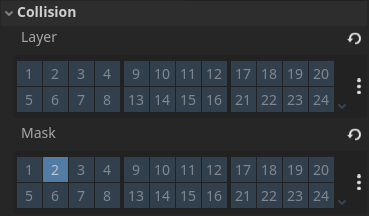

summary: Ground Enemy AI (NavMesh, FSM)
id: export
categories: Globals, AI, NavMesh, 3D, FSM, Plugin, Projectile
status: Published
authors: Ondřej Kyzr
Feedback Link: https://google.com

# Lab05 - Ground Enemy AI (NavMesh, FSM)

## Overview
Duration: hh:mm:ss

This lab will focus on creating a **Ground Enemy** for our game. We will need to create an AI for them with a behavior, so that they can interact with the player and the environment.

Today we will look over:
- Changes made in the project between the codelabs. 
- The `NavMesh`, what it is, how it works, and how to use it.
- Learn about **Finite-State Machines** and implement one for our Ground Enemy.
- Creating **different states** for the FSM and the **transitions** between them.
- **Spawning/Instantiating nodes** during play time.

Here is the template for this lab. Please download it, there are new folders, 3D models/meshes, updates in scenes and scripts.
<button>
  [Template Project](link)
</button>


## Project Changes
Duration: hh:mm:ss

I have made quite a few changes since the last codelab. Most notably, I added **comments** to most of the code, changed the **main 3D scene** to accommodate the theme of this lab, and added **3D models** for the enemy and projectile. More on that later on.

### global_debug.gd
One of the more important additions is the `global_debug.gd` script. You can make use of it during playtime by pressing these keys:
- `ESC` - unlocks/locks the mouse (no more pressing Windows key)
- `F2` - slows down time by 1/2
- `F3` - speeds up time by 2

Having a script like this in your project is **extremely useful** for fast and easy **debugging**. More over you can easily expand it to solve your project specific debugging issues. I **recommend** copying it into your project if you plan on using Godot. 

However, firstly we need to learn about **Singletons** and **Autoload**!

### Singleton Pattern and Autoload
The Singleton pattern is a software design pattern that **restricts a class**, so that there cannot be more than a **singular instance**. In most other game engines you would have to use Singletons for scripts like the `global_debug.gd`.

In **Godot** you could also use Singletons but there is an easier way. Godot allows you to set **scripts** or even **node trees** as **Autoload**. If you add a node/script as **Autoload** it will be automatically created and added above the scene tree upon start. The usual **Godot Lifecycle** functions are still run and you can access the class from anywhere in code.

Let's add the `global_debug.gd` as an **Autoload**:
1. **Open** the `Project Settings`
2. **Navigate** to the `Globals` tab
3. **Go** into the `Autoload` tab
4. **Click** on the folder icon and find the `global_debug.gd` script.
5. **Press** the `Add` button

The result should look like this:


> aside negative
> If you plan to use this or a similar script in your own project, you will also need to add the script `Autoload`.


### Globals in Remote Scene Tree View
Now if you **run the game** and press the keys outlined above they should do their job. While running the game you can switch the scene hierarchy to `Remote` mode. This allows you to see the **current state of the scene** as the game runs. This is useful for looking at node properties in **real time**. Looking at it now, we can see that the autoloaded `GlobalDebug` node sits as a **sibling** to the current 3D scene.


Autoload/Singletons are very useful for **tracking global values** (max reached level, time played, player stats, number of deaths, highscore...) or to easily **access important nodes** (Managers, UI, Fade In/Out, debugging...).


> aside positive
> One small note: The script **only works in the editor**. When running a build of the game (compiled .exe file) the node automatically deletes itself (see `_ready()` function of the `global_debug.gd`).


## NavMesh
Duration: hh:mm:ss

Imagine you have a **NPC character** and you want them to navigate through a **maze**. We need to know where they **can and cannot walk** and then somehow **plan a path** through the maze. We can solve this problem easily with a **NavMesh** and a **NavMeshAgent**:

- **NavMesh** is a simplified representation of the environment using convex polygons, that defines which areas of an environment are traversable by **NavMeshAgents**.
- **NavMeshAgent** uses the **NavMesh** and a pathfinding algorithm like `A*` to plan a path from point A to a point B.

Here is an example of a **NavMesh** in Godot. The light-blue areas are walkable by an agent. 


A **NavMesh** is usually "baked" or calculated in the editor, so naturally it is **NOT** suitable for **highly dynamic** environments. If you really need to, you can bake a NavMesh while the **game is running**, but be aware that the computation is quite **costly**.

> aside positive
> Depending on the engine or literature the **NavMeshAgent** and **NavMesh** may be called by different names. In Godot it is a **NavigationAgent** and **NavigationRegion**. Both version of these terms are correct and I will use them interchangeably.


## NavMesh in Godot Engine
Duration: hh:mm:ss

Now that we know what a **NavMesh** is, we can try and use it in our project. Open the project and our `debug_3d_scene.tscn` scene.

1. **Add** a `NavigationRegion3D` node as a child of the root
2. In the **Inspector** of the new node **add** a new `NavigationMesh`
3. **Open** the created `NavigationMesh`

There are many settings that you can change here and I will not go through all of them. I will show you the basics and you can look up the rest. 

First, we need to specify, which **meshes/colliders** should be considered during the **NavMesh** calculation. We can do that in the `Geometry` category. This can be set in the `Source Geometry Mode` property. I find the most manageable to be the `Group With Children` setting, so please set it. Also set the property `Source Group Name` to `NavMeshSource`.


### Groups
Now we have set a **Group Name** but what are groups? Each node can be a part of any number of **Groups**. They can be used to easily **tag** nodes. For example you can tag **boxes and barrels** in your game as **"Destructible"** and then when the player attacks an object, you can **check** if the object is in the group "Destructible", if yes then you can **delete** the object.

Every node has a function to check if it is in a group: 
```GDScript
# {var} is in place of a real value 
{node}.is_in_group({string_name})
```


### Back to NavigationRegion3D
With the `Source Group Name` set the NavigationRegion will **only consider** nodes (and their children) that are in the group `NavMeshSource`. Let's set the **group** to the correct nodes.

1. In the **Inspector** of the `Ground` node, **select** the **Node** tab
2. **Click** on the **Groups** button next to Signals
3. **Press** the `+` button and in the popup **set** the name to `NavMeshSource` and **check** the `Global` toggle

 


Now the node `Ground` is in the group `NavMeshSource`.

Please also add the node `Obstacles` to the same group. Now, since the group is already created, you can just **select** the `Obstacles` node and toggle the `NavMeshSource` group in the **Groups** tab.


### Baking the NavMesh
To bake the NavMesh in the editor:
1. **Select** the `NavigationRegion3D` node
2. **Press** the `Bake NavigationMesh` button in the context menu


The result should look like this:


> aside positive
> Godot has 3D and 2D `NavigationRegions` and `NavigationAgents`.


## Prepare the Enemy for NavMesh
Duration: hh:mm:ss

I have prepared a **basic enemy** with a script and node setup. However, there are a few things that need to be **adjusted** first.

**Open** the `ground_enemy_fsm.tscn` scene located in the folder `3D/Enemies/GroundEnemy/FSM`.

### Import Settings of Assets

#### Enemy Model
Looking at the scene in **3D view**, we can see that the enemy is **misplaced** and is not inside the area of the **collision shape**. However, the position of the `MeshInstance3D` is `(0,0,0)`. That means that the person, who created the model (me), must have placed **the origin of the object** in the wrong place. `¯\_(ツ)_/¯`


To fix this we will learn about the **Import** tab.

1. **Select** the `GORODITH_ground_enemy_corrupted.obj` in the folder `3D/Enemies/GroundEnemy`
2. **Switch** to the **Import** tab at the top of the **Scene Hierarchy**
3. **Set** the `Offset Mesh` property to `(-1.05, -2, 1.1)`
4. **Press** the `Reimport` button


Now the enemy should be correctly centered like in the picture above. 

> aside positive
> I created this 3D Voxel model in a free program called **MagicaVoxel**. It is very easy to use and I recommend it if you want to use a similar aesthetic.


#### Enemy Texture
There is a one more import issue. When I modelled the enemy it had very **different colors**. See these images for reference (first one is from the modelling software, second one from Godot):


This problem comes from how the modelling program uses textures. The colors are exported as a small **strip of colors** from the color palette.


However, by default Godot **compresses a texture** upon importing to save **memory and computational power**. Our textures are so small (256x1 px) that we so not need to compress them.

1. **Select** the `GORODITH_ground_enemy_corrupted.png` in the folder `3D/Enemies/GroundEnemy`
2. **Switch** to the **Import** tab at the top of the **Scene Hierarchy**
3. **Change** the in the `Compress` category the `Mode` to **Lossless** 
4. **Press** the `Reimport` button


> aside positive
> Another option for bigger textures would be to keep the `VRAM Compress` mode but toggle on the `High Quality` setting.


### Navigation Agent Node
Now we need the enemy/agent to communicate with the `NavigationRegion3D`. To do this, we can just add the `NavigationAgent3D` node to our enemy scene and then use it in the script. We **do not** need a reference to the `NavigationRegion3D` since all **navigation communication** happens through the `NavigationServer3D`, so our job is a bit easier. Think of it as a **magical black box**, that transmits all the necessary information between `NavMeshes` and `Agents`.

Please **add** the `NavigationAgent3D` node as a child of the `GroundEnemyFSM`.


#### Agent Reference
We will also need a reference to the `NavigationAgent3D` node in the script, so **open the script** on the enemy and add the reference to the top of the script using one of the **two following methods**:

You can either **drag the node**, then **press CTRL**, and **drop it** in the code (don't forget to add the type) or just **copy the code** below:
```GDScript
@onready var navigation_agent_3d : NavigationAgent3D = $NavigationAgent3D
```

### Move the Enemy in Scene
Now let's **open** our favorite `debug_3d_scene.tscn`. We can see that the enemy is already instantiated in the scene. **Playing** the game, you can see that the enemy just **moves forward** into the wall. Let's **look at code** controlling the enemy.

Most of the code is very similar to the player's movement code. To test out the `NavMesh` we just need to change 2 lines of code. First, we would like to set the target of the agent to the position, where we click with the mouse. 

#### Set Target
I have already prepared all the raycasting math needed, so you can just go into the `_input()` function and **change** the last `if` statement to this:
```GDScript
# Same as `result != null`
if result: 
    navigation_agent_3d.target_position = result.position
```

This sets the **target** of the `NavigationAgent` to the **clicked position** and the agent finds the **closest path** to the point.

#### Move to the Target
The second change is at the top of the `_movement()` function. We need to change the `target_pos` to the next point on the path generated by the `NavigationAgent`. There is just the function for it in the `NavigationAgent`. **Change the line** to this:
```GDScript
var target_pos : Vector3 = navigation_agent_3d.get_next_path_position()
```

Try to **play the game** and click somewhere. If the position was on the `NavMesh` the enemy should go there.


## NavMesh and Enemy Fixes 
Duration: hh:mm:ss

If you played around with our current setup enough you might have noticed, that the enemy can get **stuck on walls**, cannot **climb the steps**, etc. We will go through these issues and fix them.

### Debug View
For easier debugging, let's open the enemy scene and and look in the `NavigationAgent3D`'s **Inspector**.

There in the `Debug` category **turn on** the `Enabled` property.


Now if you **play the game** and click somewhere, you can see the **path** (red line) the agent is taking.


> aside negative
> Don't forget to **save** the **enemy scene** every time we change something!


### Stuck on Walls
The reason the enemy is getting **stuck on walls** is because they are **wider** than the `radius` property that the `NavMesh` was baked with. Our enemy has a `SphereShape` with radius of `1m` as the collider. Let's go into the `NavigationMesh` settings and **change** the `radius` property:


Every time you change something in the `NavigationMesh` you need to bake it again. So press the `Bake NavigationMesh` button again from the **context menu**.

> aside positive
> There are many more settings in `NavigationMesh`, that completely change how it is created. I suggest you try out different setting. In the end almost **every enemy type** needs slightly **different settings**.


### Stuck on the Stairs
This problem is a bit different since it does not originate from the any of the **navigation nodes**, but from the `CharacterBody3D` itself. The `CharacterBody3D` considers the steps as a **wall**, so it does not allow movement up the steps. The **solution** I found (there may be other and even better) is to set the `Max Angle` property in the `Floor` category of the `CharacterBody3D` to `60`. So please **set** it:


> aside positive
> If your game needs to have different `NavMeshes` for different enemies, you can add more `NavigationRegion` nodes and toggle, which enemy can use which `NavMeshes` with the `Navigation Layers` property.


## Extra NavMesh Nodes
Duration: hh:mm:ss

There are **2 extra nodes** related to `NavMeshes`/`NavigationRegions`, that can be used. This chapter is a bit **optional** but I recommend at least looking through it, so that you know that these nodes exist.


### NavigationObstacle3D
This node is useful when you want an to mark and area as **unwalkable** on the `NavMesh`. We will use it to get rid of these **small patches** on top of the resistors.


To do this:
1. **Open** the `resistor.tscn` scene
2. **Add** a `NavigationObstacle3D` as a child of the root
3. **Open** the `verticies` property and **add** 4 vertices
4. **Set** the **coordinates** of vertices so it matches the bounds of the grey square
5. **Set** the `height` property to `1.5m` (needed so that the top of the object is unwalkable)
6. **Toggle** the property `Affect Navigation Mesh` ON in the `Navigation Mesh` category

The resulting `Resistor` should look like this:


Now, the last thing we need to do is to **bake** the `NavMesh` again. The `NavMesh` in the scene should now be without the small patches:


### NavigationLink3D
The second node is useful when you want to add connections to the `NavMesh` manually. For example, you can add a link to a ledge to enable the agent to **jump down**, or make them **jump over** a gap. 

**Add** the `NavigationLink3D` node to the scene. I like to keep them as a **child** of the `NavigationRegion3D`, but you are free to put them where you want. The link has several interesting properties:
- `Bidirectional` - control whether the agent can traverse the link **both ways**
- `Start Position` - the **coordinates** of the start position (it is easier to set it using the **red dot** gizmo in scene view)
- `End Position` - the **coordinates** of the end position (it is easier to set it using the **red dot** gizmo in scene view)
- `Travel Cost` - length **multiplier** for the pathfinding, higher values makes the links more costly, it has an effect only when more there are **multiple ways** to the target

As an example I created this link setup:


You can **try to make** a similar one and see how the enemy handles it.


## Finite-State Machines (FSM)
Duration: hh:mm:ss

I would like our Ground Enemy to work like this:
- When the player is **not spotted** -> **Patrol**
- When **patrolling** -> move between a **sequence of points**
- When the player is **spotted** -> **Chase** the player
- When **chasing** the player -> Go to the **player position** and periodically **shoot a projectile** at them

This behavior can be expressed as the graph below. Where each **box is a state** in which the enemy can be in and each **arrow is a transition** from one state to another. These transitions are taken, when the **conditions are met** (red squares).


This makes our **enemy AI** very readable and easy to understand. We will now recreate this structure in our project, so that the enemy will behave exactly like that.

### Definitions
Let's first make a few definitions, that will hold true for our implementation (and most implementations of FSMs):
- The enemy can be **only in one state** at a time.
- The enemy **starts in one** defined state.
- States can be **changed** (transitioned from one to another) only upon **meeting set conditions**.
- When a state is **entered**, its `state_enter()` **function is called**.
- When the enemy is **in a state**, each **process tick**, it
s `state_process()` **function is called**.
- When a state is **exited**, its `state_exit()` **function is called**.


### What we have so far?
If you look in the folder `3D/Enemies/GroundEnemy/FSM` you can see a **script** called `abstract_fsm_state.gd`. Here is the full script, just in case:
```GDScript
class_name AbstractFSMState
extends Resource

# Called upon transition into the state
func state_enter(_enemy : GroundEnemyFSM) -> void:
    assert(false, "Do not use this abstract class!")

# Called every physics process frame
func state_physics_process(_enemy : GroundEnemyFSM, _delta : float) -> void:
    assert(false, "Do not use this abstract class!")

# Called upon transition from the state
func state_exit(_enemy : GroundEnemyFSM) -> void:
    assert(false, "Do not use this abstract class!")

```

This will be our **parent class**, meeting our definitions, for **all the states** that we will create.


> aside positive
> The `AbstractFSMState` class `extends Resource`. We do not need to `extend Node`, because the state just **holds data** and **the behavior**. Keeping the states as resources will enable us to:
> - Easily **create** them in the **Inspector** window, without needing more nodes.
> - Have the possibility to **save, switch, and reuse** states (looping patrol vs. back-and-forth patrol)


## Task: Patrol State 
Duration: hh:mm:ss

Let's first tackle the **patrol state** of our FSM, so that we can then create the **brain of the FSM** in the enemy script.

Start by:
1. **Creating** a new script called `patrol_state.gd` in the `FSM` folder
2. **Set** the `class_name` to `PatrolState`
3. **Set** `extend` to `AbstractFSMState`
4. **Copy** the **three empty functions** from the `abstract_fsm_state.gd`
5. **Remove** the `assert` lines and put `pass` instead of them

Additionally, we will need to be able to **set and store** the points of the **patrol path**. Let's **add** an `export` variable and an **index**, so that we know which point we are targeting:
```GDScript
@export var patrol_points : Array[Vector3]

var _curr_patrol_idx : int = 0
```

I will leave the patrol state **implementation to you**. The next few paragraphs outline what each function should do. The **solution** will be in the **next section**. Before you start, let's make the enemy **use the patrol state by default**, so that you can easily test it out, while implementing. Change the `ground_enemy_fsm.gd` like this:

```GDScript
@export var patrol_state : PatrolState
...
func _ready():
    patrol_state.state_enter(self)
...
func _physics_process(delta : float) -> void:
    _gravity(delta)
    _movement(delta)
    # call to rotate_enemy was deleted -> will be handled by states 
    
    patrol_state.state_physics_process(self, delta)
    ...
...
# Comment out the whole function
#func _input(event : InputEvent):
    #...
```

Also in the **Inspector** of the `GroundEnemyFSM` node, **create** a `PatrolState` resource in the `Patrol State` property and **add patrol points**. Without seeing the points, it is difficult to set the coordinates, so you can just **use these for now** (we will make debugging the patrol path easier later):


### **`state_enter(...)`**
When **entering the patrol state**, the enemy should **pick a patrol point** that is the **closest to them** and **set it as the target** of `NavigationAgent`.


### **`state_physics_process(...)`**
What should the patrol state do **every frame**? Well since the navigation is handled by the `NavigationAgent` and the enemy currently just **walks to the position we set** in the agent (recall the `_input()` function in `GroundEnemyFSM`), so we only need to handle the **patrol points**.

Each frame, we will rotate the enemy (`enemy.rotate_enemy()` function) and **check** if the enemy has **reached the target** we set (patrol point). If the target was **reached**, we will **pick the next point** from the `patrol_points`. If there are **no more patrol points**, just start from **the beginning**.


### **`state_exit(...)`**
The patrol state doesn't need to do anything here but for clarity, we should **reset the** `target_position` of the `NavigationAgent`, so that the enemy stops on the spot.


## Solution: Patrol State and Path debugging
Duration: hh:mm:ss

My solution looks like this:
```GDScript
class_name PatrolState
extends AbstractFSMState

@export var patrol_points : Array[Vector3]
@export var dist_treshold : float = 1.5


var _curr_patrol_idx : int = 0

# Called upon transition into the state
func state_enter(enemy : GroundEnemyFSM) -> void:
	var best_dist : float = enemy.global_position.distance_to(patrol_points[0])
	var best_idx : int = 0
	
	# Find the closest patrol point
	for idx in range(0, patrol_points.size()):
		var dist : float = enemy.global_position.distance_to(patrol_points[idx])
		
		if dist < best_dist:
			best_dist = dist
			best_idx = idx
	
	_curr_patrol_idx = best_idx
	enemy.navigation_agent_3d.target_position = patrol_points[best_idx]

# Called every physics process frame
func state_physics_process(enemy : GroundEnemyFSM, _delta : float) -> void:
    enemy.rotate_enemy(delta, enemy.velocity)
	var curr_point : Vector3 = patrol_points[_curr_patrol_idx]
	
    # Alternative: enemy.navigation_agent_3d.is_target_reached()
    # + change the distance threshold of the `NavigationAgent3D` node

	# Check if the target is reached -> set a new one
	if enemy.global_position.distance_to(curr_point) < dist_treshold:
		_curr_patrol_idx += 1
		if _curr_patrol_idx >= len(patrol_points):
			_curr_patrol_idx = 0
		
		enemy.navigation_agent_3d.target_position = patrol_points[_curr_patrol_idx]

# Called upon transition from the state
func state_exit(enemy : GroundEnemyFSM) -> void:
	enemy.navigation_agent_3d.target_position = enemy.global_position

```

Don't worry if your solution is different, many things in **Game Development** can be done almost **infinite number of ways**. The important thing is that **it works**.


### Path debugging 
It would be helpful if we could **see the patrol path**. There is a very good plugin for Godot, that has just the tools we need for **visualizing stuff** in 3D. Let's use it, while also learning about plugins.


#### Get the Plugin
To download the plugin (or any other ones), you can simply navigate to the `AssetLib` tab next to `Game` at the top center of the Godot editor.

1. **Search** for `Debug Draw 3D`
2. **Click** on it and **press** `Download`
3. **Wait** for a while and **press** `Install`
4. **Press** `Ok`


> aside positive
> Most plugins for Godot are **free** under the `MIT license`. Meaning you can use them even in **commercial products**, if you include of the original **copyright notice and the license text**.

#### Debug Draw Path
I have already prepared the script and node, that will visualize the path.

1. **Add** the `debug_draw_path.tscn` node into our scene
2. **Go** into the script of the node
3. **Uncomment** the `for loop` and `if condition` at the end of the `process`
4. In the **Inspector** of the `DebugDrawPath` node **add** the `GroundEnemyFSM` to the `Node` property
5. Still in the **Inspector**, put `patrol_state.patrol_points` in the `Property` property

Now if you look into the 3D scene, you should see a **red line** connecting all the patrol points. Feel free to **add more patrol points** and **create an interesting patrol route**.


> aside positive
> The script has the **annotation** `@tool` at the top, which makes the **Godot Lifecycle** functions (_ready, _process, etc.) run in the editor, without needing to play the game.


## Chase State 
Duration: hh:mm:ss

The chase state is for the most part **already implemented**. We will just quickly go through the state script to see what it is approximately doing. Please **open** the `chase_state.gd` script.
- `state_enter(...)` 
    - Makes the enemy **stretch up** for `0.2 sec` and then **back down** to create an interesting visual effect.
- `state_physics_process(...)` 
    - Sets the `NavigationAgent`'s target to the **player position** every `2 sec` (no need to recalculate the path every frame).
    - Rotates the enemy, so that they are partway **looking at the player** and partway **in the direction of movement**.
- `state_exit(...)`
    - Does nothing.


### Complete the ChaseState
There are a few additions needed for the `ChaseState` to be usable.

#### Adding Chase State as a Resource
In a similar way to the `PatrolState` we will add an `export` variable of the type `ChaseState` to the enemy.
```GDScript
@export var chase_state : ChaseState
```

> aside negative
> Don't forget to **create the resource** of `ChaseState` in the **Inspector** of the `GroundEnemyFSM` scene!


#### Enemy Vision
The enemy needs to somehow **detect the player**. The most straightforward way is to add an `Area3D` to the enemy and **check all bodies** that enter this area. If the entered body is the **player**, the enemy **sees them**.

1. **Add** an `Area3D` to the `ground_enemy_fsm.tscn` scene (rename to `VisionArea`)
2. **Add** a `CollisionShape3D` as a child of the `Area3D`
3. **Add** a new `ConvexPolygonShape3D` as the `Shape` property of the `CollisionShape3D`

We added a `ConvexPolygonShape3D`, because we want to **create a custom shape** for the vision of the enemy (a vision cone). **Add the points** to the shape in a similar way as the image below:


> aside negative
> Don't forget to set the correct **collision layer and mask** for the `VisionArea`:
>


Now connect the signal `body_entered()` to the enemy script using the **Inspector** in the **Node** -> **Signal** tab. This will **create a function** called `_on_vision_area_body_entered()` (if you renamed the `Area3D` to `VisionArea`). Let's use it:

```GDScript
var _trigger_player_seen : bool = false

...

func _on_vision_area_body_entered(body : Node3D):
    if not body is PlayerController3D: return
	
    _player = body
    _trigger_player_seen = true
```
- First, we **check** if the body the enemy sees is **the player**
- Then, we **set** the **reference to the player** (which the `ChaseState` uses though the `get_player()` function)
- Lastly, we **set** the **player seen trigger** (`bool`) to true, so that we know, that we have started to **see the player** (will be important in the next part for **transitions**)


### GroundEnemyFSM framework
Now we will need to update the FSM code in the `GroundEnemyFSM` so that it works with **multiple states**, **state switching**, and **state transitions**.

#### Switch State Function
Let's add a function that will handle **switching the current state** to a new one. First we need to **track the current state**, that we are in.
```GDScript
var _curr_state : AbstractFSMState
```

Then the function will handle the `state_enter` and `state_exit` like this:
```GDScript
func _switch_state(new_state : AbstractFSMState) -> void:
    if new_state == _curr_state: return

    if _curr_state != null: _curr_state.state_exit(self)
    _curr_state = new_state
    _curr_state.state_enter(self)
```

Now with the **switch function** ready, we can change the `_ready()` function to use it.
```GDScript
func _ready():
    _switch_state(patrol_state)
```

Let's also **change** the `_physiscs_process()` function so it updates the `_curr_state` instead of the `patrol_state`.
```GDScript
func _physics_process(delta : float) -> void:
    ...
    rotate_enemy(delta, velocity)
	
    _curr_state.state_physics_process(self, delta)
    ...

```


#### State Transitions
Now, the last thing we need to do is to **check if a transition** from a state to another should happen. We will do this using the `match` **keyword**. This is the same as `switch ... case` in other programming languages. This is the **full code** to be added to the `GroundEnemyFSM`:

```GDScript
# Checks all possible transitions from the current state
func _check_transitions() -> void:
    match _curr_state:
        patrol_state:
            if _trans_patrol_to_chase():
                _switch_state(chase_state)
        chase_state:
            if _trans_chase_to_patrol():
                _switch_state(patrol_state)
	
    # Reset triggers
    _trigger_player_seen = false

# Checks if we have started seeing the player this frame
func _trans_patrol_to_chase() -> bool:
    return _trigger_player_seen

# Checks if the player is too far away from the enemy
func _trans_chase_to_patrol() -> bool:
    var dist_to_player : float = _player.global_position.distance_to(global_position)
    if dist_to_player > chase_state.chase_max_dist:
        return true
	
    return false
```

The aim of creating a **function per transition** is to make the code as **clear, readable**, and **easily debuggable** as possible. For example, if the enemy does not stay in the `PatrolState`, we know that the problem will be somewhere in the `_trans_patrol_to_chase()` function.

We want to check if we should transition to a different state **each frame**, so don't forget to **add a call** to the function to the `_physics_process()` function.

```GDScript
func _physics_process(delta : float) -> void:
    ...
    _curr_state.state_physics_process(self, delta)
    _check_transitions()
    ...
```

Try to **play the game**, the enemy should patrol and once you enter the `VisionArea`, they should chase you, until you are too far away from them.


> aside positive
> For easier debugging, you can **turn on** `Visible Collision Shapes` in the `Debug` menu on the **top left**. Now you will see the `VisionArea` during **play mode**.
> 


## Shoot State and Spawning Scenes 
Duration: hh:mm:ss

We will end the FSM chapter by **adding a third state** called `ShootState`. This will also be a perfect opportunity to learn about the `Timer` node and how to **spawn/create scenes**.

I have prepared some of the code that will be needed in the `3D/Enemies/GroundEnemy/FSM/shoot_state.gd` file. Please **open the script** and let's see what it does: 
- **`projectile_prefab : PackedScene`** - This is a reference to the scene of the projectile, which we will spawn. The `preload` function loads the scene located at the path, so that it is ready to use.
- **`state_enter()`** - We set the target of the enemy to their position to stop them in place. We will also spawn the projectile here later on.
- **`state_physics_process()`** - Here, we get the player reference and turn the enemy towards the player.
- **`state_exit()`** - Nothing for now.

Now add a `export` reference to our new `ShootState` in the same way as the `PatrolState` and `ChaseState`:
```GDScript
@export var shoot_state : ShootState
```

> aside negative
> Don't forget to **create the resource** of `ShootState` in the **Inspector** of the `GroundEnemyFSM` scene!


### State Transition
If you recall the diagram from the **Theory: Finite-State Machines (FSM)** section, we want the enemy to shoot when:
- The **shooting cooldown** has ended
- Player is in **direct sight**

Let's tackle the **cooldown** first.

#### Cooldown
To handle reoccurring cooldowns or waiting times, I recommend using the `Timer` node. Let's add one to the enemy:
1. **Add** the `Timer` node as the child of the `GroundEnemyFSM`
2. **Rename** it to `ShootCooldownTimer`
3. **Connect** the `timeout()` signal of the node the the `GroundEnemyFSM` script

Now in the `GroundEnemyFSM` let's add a reference to the `Timer`:
```GDScript
@onready var shoot_cooldown_timer : Timer = $ShootCooldownTimer
```

Now to know if we **can or cannot shoot** ( -> go to the `ShootState`), we can **add a variable** to track it and a **setter function** for the variable:
```GDScript
var _can_shoot : bool = true
...
func set_can_shoot(value : bool) -> void:
    _can_shoot = value
```

We have everything ready to fill the **signal callback function**:
```GDScript
func _on_shoot_cooldown_timer_timeout():
    set_can_shoot(true)
```

> aside positive
> We use **getter** and **setter** functions instead of **directly setting** the value, because in the future we might want to do **other operations** while getting/setting the value (eg. bounds check, default value override, reference null check etc.) 


#### Player in Direct Sight
To check if the player is in **direct sight**, we will use a `RayCast3D` node. The node will be **disabled by default** and we will enable it and check the result, only when checking the **transition conditions**. This will save us some performance, as the enemy will not shoot raycasts every frame, but only when they want to shoot a projectile.

1. **Add** a `RayCast3D` node and call it `ShootCast`.
2. **Set** the `enabled` property to `false` and **set the collision mask** to check `Player`, `Terrain`, `Enemy`.
3. **Add** a reference to the `ShootCast` to the `GroundEnemyFSM` script 

(`@onready var shoot_cast : RayCast3D = $ShootCast`)

This is all we need to **add the transitions**.


#### **`_check_transitions()`** changes
We need two transition checking functions, one from `ChaseState` to `ShootState` and one from `ShootState` to `ChaseState`:
```GDScript
# Checks we can shoot the player
func _trans_chase_to_shoot() -> bool:
    if _player == null: return false
    if not _can_shoot: return false
	
    shoot_cast.enabled = true
    shoot_cast.target_position = shoot_cast.to_local(_player.global_position)
    shoot_cast.force_raycast_update()
    shoot_cast.enabled = false
	
    if shoot_cast.get_collider() is PlayerController3D:
        return true
	
    return false

# Checks we can go back to chase from shooting the player
func _trans_shoot_to_chase() -> bool:
    return not _can_shoot
```

> aside positive
> We need to use `shoot_cast.to_local()` function, because the `target_position` property is in the **local coordinates** of the `RayCast3D` node.


The last thing we need to do is to **update** the `_check_transition()` function like this:
```GDScript
func _check_transitions() -> void:
    match _curr_state:
        patrol_state:
            if _trans_patrol_to_chase():
                _switch_state(chase_state)
        chase_state:
            if _trans_chase_to_patrol():
                _switch_state(patrol_state)
            if _trans_chase_to_shoot():
                _switch_state(shoot_state)
        shoot_state:
            if _trans_shoot_to_chase():
                _switch_state(chase_state)
	
    # Reset triggers
    _trigger_player_seen = false
```


### Shoot State
The last few things we need to do, to make the whole enemy functional is to **spawn the projectile**, **set the** `_can_shoot` to false, and **start the cooldown timer**.

#### **`state_enter()`**
In this function, we would like to **create a projectile**. We already have the projectile scene loaded using the `preload`, which gives us a `PackedScene` variable. Here is the **full code** for the `state_enter()` function with an **explanation below** of how the spawning works:
```GDScript
func state_enter(enemy : GroundEnemyFSM) -> void:
    enemy.navigation_agent_3d.target_position = enemy.global_position
	
	# Wait before shooting
	await enemy.get_tree().create_timer(shoot_wait).timeout

    # Spawn projectile
    var projectile : ElectricProjectile = projectile_prefab.instantiate()
    projectile.initialize(enemy.get_player())
    projectile.position = enemy.global_position
    enemy.get_tree().current_scene.add_child(projectile)
	
    enemy.set_can_shoot(false)
```
- First, we **wait a while** before shooting.
- The `.instantiate()` function **creates a copy** of the `PackedScene` and returns it.
- The `projectile.initialize(...)` is a function of the `ElectricProjectile` script (made by me), which needs the player, since the **projectile is homing** (chases the player).
- The `projectile.position = enemy.global_position` line makes sure the **projectile** starts in the **same place as the enemy**.
- The `enemy.get_tree().current_scene.add_child(projectile)` line does this:
    - First it goes to the **enemy node** (`ShootState` is a Resource not a node)
    - To get a **reference** to **the scene tree**
    - Then gets **the current scene** (`Debug3dScene` in our case)
    - Lastly it **adds the projectile** as a **child** of the scene.
    - The last step is **very important**, without it the projectile **would not fly** or even **render**, since it **would not be present** in the **current scene**.
- Lastly, we **set the** `_can_shoot` variable to **false**, since we have just shot.

> aside negative
> Few notes:
> 1. We cannot add the **projectile** as a **child of the enemy**, because if the enemy moved the projectile would **also move**.
> 2. The waiting before shooting could/should be a `Timer` node, but I wanted to show you different ways of waiting.

The projectile already flies towards the player. **Check** `electric_projectile.gd` for more info.

> aside positive
> The projectile has many different **visual effects** applied. Such as: cycling 2 meshes, scaling up and down, random rotation axis, etc. More effects could be added easily since Godot has really easy to use tools (`Tweens`, `awaits`, etc.).


#### **`state_physics_process()`**
Every frame we want to just **look at the player**. So we can get the reference to them from the enemy and use the `rotate_enemy()` function.
```GDScript
func state_physics_process(enemy : GroundEnemyFSM, delta : float) -> void:
    var player : Node3D = enemy.get_player()
    if player == null: return

    # Rotate to player
    enemy.rotate_enemy(delta, (player.global_position - enemy.global_position))
```


#### **`state_exit()`**
The exit function is pretty straightforward. We just want to **start the timer** for the shooting cooldown.
```GDScript
func state_exit(enemy : GroundEnemyFSM) -> void:
    enemy.shoot_cooldown_timer.start(shoot_cooldown)
```


## Bonus: Projectile Knockback 
Duration: hh:mm:ss

It would be nice if the projectile did something to the player, before we implement player HP, stats, etc. in future codelabs. For now, it could knockback the player with given force and time.

### ElectricProjectile
We need two parameters to have the knockback configurable:
```GDScript
@export var knockback_force : Vector2 = Vector2(6, 7)
@export var knockback_time : float = 0.75
```

and then we will change the `_on_body_enter()` function:
```GDScript
func _on_body_entered(body : Node3D):
    if _is_dying: return

    _destroy()

    if body is PlayerController3D:
        _player.set_do_movement(false)

        var dir_to_player : Vector3 = (_player.global_position - global_position).normalized()
        dir_to_player.x *= knockback_force.x
        dir_to_player.z *= knockback_force.x
        dir_to_player.y = knockback_force.y

        _player.velocity = dir_to_player

        _player.set_do_movement(true, knockback_time)
```

> aside negative
> We cannot use `await get_tree.create_time(knockback_time).timeout` for calling the `set_do_movement(true)`, because the node will be destroyed soon and the code would not run.


### PlayerController3D
We need to change the `set_do_movement()` function in `PlayerController3D`, so that the code above works. The change is quite simple, we just add the parameter of `delay` so that the function code runs after waiting.
```GDScript
func set_do_movement(value : bool, delay : float = 0) -> void:
    if delay == 0:
        _do_movement = value
        return

    await get_tree().create_timer(delay).timeout
    _do_movement = value
```

> aside positive
> The delay parameter has a **default value** of `0` meaning, that if you call the function without specifying the parameter an error is NOT thrown but it is called with a delay of `0`


## Recap
Duration: hh:mm:ss

Let's look at what we did in this lab.
- We looked at the **changes I made** between the last codelab
- In these changes, we learned about **Singletons** and **Autoloads**
- Then, we looked at what is a `NavMesh` and a `NavMeshAgent`
- In order to make the enemy walk on the `NavMesh`, we needed to correctly reimport the enemy **mesh and texture**
- Next, we correctly **set the parameters** of the `NavMesh` based on our enemy/agent and **baked it**.
- Then, we looked at extra navigation nodes `NavigationObstacle3D` and `NavigationLink3D`.
- After that we looked at **Finite-State Machines (FSM)** and implemented it in our **Ground Enemy**.
- Next, we created all 3 states of our FSM:
    - Patrol - walking from point to point
    - Chase - upon seeing the player (`Area3D`), run towards them
    - Shoot - wait and spawn a projectile and start a cooldown using the `Timer` node
- Lastly in the bonus section, we added **knockback** to the projectiles.


If you want to see how the finished template looks like after this lab, you can download it here:
<button>
  [Template Done Project](link)
</button>

Or you can watch this video to see how the completed enemy behaves:
<video id=fse6tLpUbwI></video>
