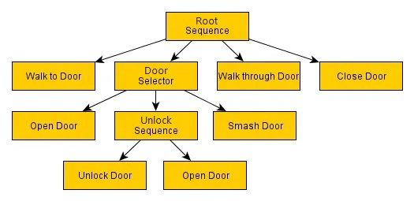
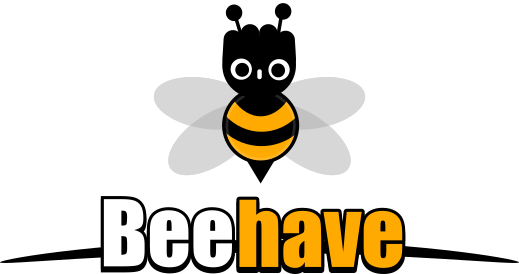
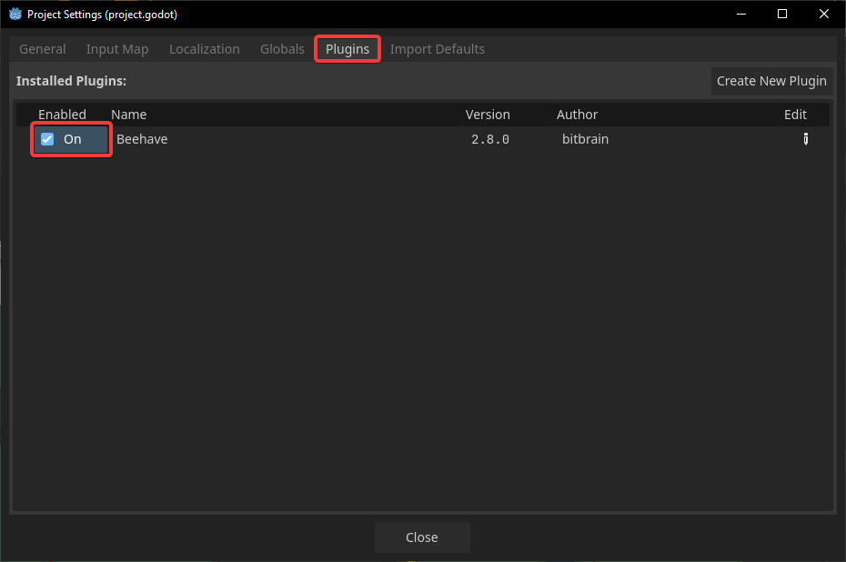
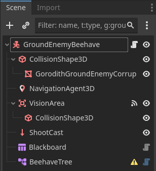
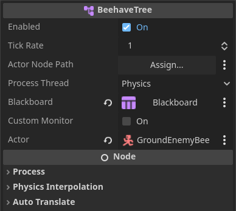
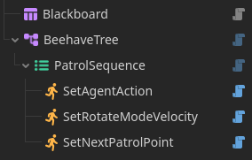
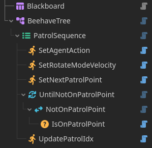
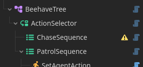
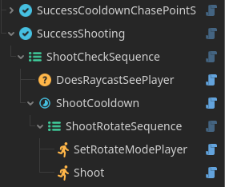

summary: Ground Enemy AI (Behavior Trees), Air Enemy AI (Steering)
id: export
categories: AI, Behavior Trees, Beehave, NavMesh, 3D, Plugin
status: Published
authors: Ondřej Kyzr
Feedback Link: https://google.com

# Lab06 - Ground Enemy AI (Behavior Trees), Air Enemy AI (Steering)

## Overview
Duration: hh:mm:ss
TODO
This lab will focus on learning about **Behavior Trees**. We will recreate the behavior of the **Ground Enemy Finite-State Machine** from the last lab using a Behavior Tree.

Today we will look over:
- Changes made in the project between the codelabs. 
- The 
- Learn 
- Creating 
- 

Here is the template for this lab. Please download it, there are scripts needed for the Behavior tree implementation.
<button>
  [Template Project](link)
</button>


## Behavior Trees 
Duration: hh:mm:ss

When it comes to creating an AI character in a videogame, there are many known ways/architectures that you can use. For example:
- easy but restrictive **Simple reactive planning** (bunch of if-else statements, that only react to the current environment)
- more complex **Finite-State Machine** (becoming less and less clear the more states and transitions you add)
- easily modifiable **Behavior Tree** (forcing you to learn to think about AI in a different way)
- and many more...

The choice of the architecture always depends on the complexity of the character you are making. However, most of the more complex characters are usually made with **FSMs** or **Behavior Trees**, that is why I wanted to cover them in this tutorial series.

> aside positive
> Behavior Trees are **very powerful** once you know how to use them. The ability to represent them visually makes them easy to debug. Most popular games use them, here are a few notable examples:
> - **GTA V** - pedestrian NPCs reacting to players actions
> - **The Sims** - each Sim manages their needs and interacts with objects
> - **Kingdom Come: Deliverance** - with their life-like NPC behavior
> - Nearly all modern AAA games using the Unity Engine of the Unreal Engine use Behavior Trees


### What are  Behavior Trees?
Behavior trees are and alternative way to of creating AI for videogames. The whole behavior of the AI is divided into a **tree structure with many nodes**, that can have various types and purposes. The tree is run from **the root** and when there are sibling nodes, they are run left -> right, or top -> bottom (depends on the orientation of the tree).

When a node is run, it **must return the state** that it is in. A node can be in one of these three states:
- `SUCCESS` - Signals to the parent that the node has executed the action successfully.
- `FAILURE` - Signals to the parent that the node failed to execute the action.
- `RUNNING` - Signals to the parent that the node is still performing the execution. This pauses the tree traversal and the node will be run again next frame/tick. This is used for actions that take some time to complete.

There are 3 base node types:
- **Composite** - has more than one children and the state return value depends on the children
- **Leaf** - has no children, usually performs an action or checks a condition ("go to patrol point", "is player seen?" etc.)
- **Decorator** - has exactly one child node, that is a leaf and performs operation on the state return (invert state, always SUCCESS, etc.)


###  Composite
Let's look how the two most basic composite nodes work.

####  SequenceComposite
Sequence node runs all child nodes one by one until **one has failed or all have succeeded**:
- Child node return `SUCCESS` -> run the next child node -> no more child nodes to run -> return `SUCCESS`
- Child node return `FAILURE` -> return `FAILURE`
- Child node return `RUNNING` -> return `RUNNING` (next frame/tick the child node is run again)

####  SelectorComposite
Similar to sequence, the selector node runs all child nodes one by one until **one has succeeded or all have failed**:
- Child node return `FAILURE` -> run the next child node -> no more child nodes to run -> return `FAILURE`
- Child node return `SUCCESS` -> return `SUCCESS`
- Child node return `RUNNING` -> return `RUNNING` (next frame/tick the child node is run again)


### Example Behavior Tree
I think Behavior Trees are best shown on an example. This modified example was taken from [gamedeveloper.com](https://www.gamedeveloper.com/programming/behavior-trees-for-ai-how-they-work) and I will walk you through it.



Here, the goal of the tree is to perform actions so that the character **goes through a door**. The execution starts in the **root of the tree**, in the top-most composite `RootSequence` node. Let's take a scenario, where the door is locked.

1. **`RootSequence`** runs **`Walk to Door`** -> `SUCCESS`
2. **`RootSequence`** runs the **`DoorSelector`**, which runs the **`Open Door`** node -> `FAILURE` (door is locked)
3. **`DoorSelector`** runs **`UnlockSequence`**, which runs **`Unlock Door`** -> `SUCCESS` (worked since the door was locked) then run **`Open Door`** -> `SUCCESS` 
4. This makes the **`UnlockSequence`** -> `SUCCESS`, making the **`DoorSelector`** -> `SUCCESS`
5. **`RootSequence`** runs **`Walk through Door`** -> `SUCCESS`, then runs **`Close Door`** -> `SUCCESS`
6. **`RootSequence`** -> `SUCCESS`, which means that the tree executed successfully

> aside positive
> If a node returned **`RUNNING`** in the example above, the tree would be **"stuck" and continuously run** the node until it would return `SUCCESS` or `FAILURE`

Try to walk through the tree with **other scenarios** (door is only closed or it has a broken lock). You should find that the tree adapts to the situation and if something were to go wrong, you would be able to see, which node/action had failed -> easy debugging.

> aside negative
> **Small but important note:** "node -> SUCCESS" means that "node returns SUCCESS"

###  Blackboard
The last thing you should know about Behavior Trees for now is how to handle dynamic information. In the example above the dynamic information could be:
- Position of the door
- Does the AI have a key to the door?
- etc.

Behavior Trees use a **Blackboard** to store this information. Every node can **access, read, and write** into the Blackboard. In most frameworks it is implemented as a set of `{key} = {value}` pairs, the same way that the data structure `Dictionary` works.


## Beehave Installation, Project Setup 
Duration: hh:mm:ss

The Godot Engine does not support Behavior Trees out of the box. To use them you either need to code them yourself or use a plugin. I have chosen the **Beehave** plugin, that implements Behavior Trees. The plugin is not perfect and has a few quirks and visual glitches. However, having the live visual debugging is perfect for our educational purposes.




### Beehave Installation
I have already installed the plugin to save time. However, some more complex plugins, such as this one, need to be enabled in the **Project Settings**. Please do so:




### GroundEnemyBH script
I have created a copy of the `GroundEnemyFSM` called `GroundEnemyBH` and replaced them in the `debug_3d_scene.tscn` scene. All relevant scripts and scenes can be found in the `3D/Enemies/GroundEnemy/Beehave/` folder. Please **open** the `ground_enemy_bh.gd` script and let's go through it:
- At the top, there are all the **`@export` variables** from the `GroundEnemyFSM` and all of the FSM states. These variables are declared here in the enemy, because they are not dynamic data (during play time they do not change).
- Then, there are several `enums`:
    - **`BB_VAR`** - These are all the keys for the **Blackboard variables**, that we will need. Normally, you would use strings as keys but I feel like that leads to many bugs due to typos.
    - **`ROTATE_MODE`** - You might have noticed that in the FSM version our enemy rotated differently in each state. For simplicity I decided to delegate the job back to the main enemy script and the Behavior Tree will only switch, which mode is currently running.
    - **`ACTIONS`** - This will be used to easily detect what action (Patrol, Chase) the enemy is currently in. We will use it to detect that we started chasing the player and play the "pop up" tween animation. 
- The `_ready()` function sets the **default values** of all the Blackboard variables.
- Rest of the script is pretty much the same as the FSM variant, except for **storing and loading dynamic variables**, where the Blackboard is used.

> aside positive
> **Setting** and **Getting** the values of the Blackboard can be easily done with `blackboard.set_value(key, value)` and `blackboard.get_value(key)`


### `bh_...` scripts
You might have noticed that there quite a few `bh_...` scripts in the `GroundEnemy/Beehave/` folder. These are the **custom actions and decorators** that we will use as nodes in the Behavior Tree. Coding all of them from the ground up would take far too much time and this codelab would be very long. We will at least go through some of them and **create 2 actions** on our own later on.


### GroundEnemyBH scene
Now **open** the `ground_enemy_bh.tscn`. The scene is pretty much the same as the `ground_enemy_fsm.tscn` except for the missing `Timer` node. We will supplement its functionality by a Decorator node in the Behavior Tree.

Let's create a basic Beehave setup, so that in the next section, we can start making the behavior already.
1. **Add** a `Blackboard` node as a child of the `GroundEnemyBeehave`
2. **Add** a `BeehaveTree` node as a child of the `GroundEnemyBeehave`
3. **Set** the property of `Blackboard` in the `BeehaveTree` node the the `Blackboard` node





## Patrolling Behavior
Duration: hh:mm:ss

Let's start by creating the **Patrolling behavior** of the enemy, since that is an easy place to start. In **Beehave** the Behavior Tree is build with nodes in the **Scene Hierarchy**. This works because the **Scene Hierarchy** is a tree-like structure with nodes and children. Don't worry about how adding the Chase behavior will work for now.

###  Patrol Sequence
If you think about the behavior of **Patrolling** it is a **Sequence** of actions (Go to point -> Wait until there -> Update index -> Go to next point -> ...) by that logic, we should use a `SequenceComposite` node as the root of the tree. The `BeehaveTree` in `ground_enemy_bh.tscn` will be the **parent of the root of the tree**.

1. **Add** a  `SequenceComposite` node as a child of the  `BeehaveTree`
2. **Rename** it to `PatrolSequence`

Now what should the patrol sequence look like? Let's first set the action (Patrol/Chase) that we are in.

1. **Add** a  `ActionLeaf` node as a child of the  `PatrolSequence`
2. **Rename** it to `SetAgentAction`
3. **Add** the `bh_set_agent_action.gd` script from folder `GroundEnemy/Beehave/` to it

Ok, next let's set the rotation mode of the enemy, so that it rotates based on velocity (looks the way it is walking).

1. **Add** a  `ActionLeaf` node as a child of the  `PatrolSequence`
2. **Rename** it to `SetRotateModeVelocity`
3. **Add** the `bh_set_rotation_mode.gd` script from folder `GroundEnemy/Beehave/` to it
4. In the **Inspector** of the node **set** the property `Rotate Mode` to `Velocity` 

Next, let's set the target of the `NavigationAgent` using another action node. The process will be basically the same as the nodes above, so I will shorten it:

- **Node**  `ActionLeaf` child of  `PatrolSequence`
    - **Name** `SetNextPatrolPoint`
    - **Script** `bh_set_next_patrol_point.gd`

For **reference** the tree should look like this now, with custom scripts on all the action nodes:




####  UntilFail decorator
Now the interesting part come in. The sequence to this point sets the **agent action**, sets the **rotate mode**, and sets a **new target to walk to** for the enemy. If you remember how the `PatrolState` in the FSM worked, we want to wait now until the enemy reaches the patrol point. In Beehave we can do that using the Decorator `UntilFail`.

Looking at the **Beehave [documentation](https://bitbra.in/beehave/#/manual/decorators)**, we can see that the decorator:
- Executes its child and returns `RUNNING` as long as it returns either `RUNNING` or `SUCCESS`.
- Once the child returns `FAILURE` it returns `SUCCESS`

So if we add a **condition node** that checks if the enemy is NOT on the patrol point, the tree execution would be stuck here until then. Meaning we can effectively **wait** with the rest of the sequence (index update, next point set, etc.) until the enemy is at the currently set patrol point.

1. **Node**  `UntilFailDecorator` child of  `PatrolSequence` 
    - **Name** `UntilNotOnPatrolPoint`
    - **Script** default
2. **Node**  `InverterDecorator` child of  `UntilNotOnPatrolPoint`
    - **Name** `NotOnPatrolPoint`
    - **Script** default
3. **Node**  `ConditionLeaf` child of  `NotOnPatrolPoint`
    - **Name** `IsOnPatrolPoint`
    - **Script** `bh_is_on_patrol_point.gd`

> aside positive
> We used the `InverterDecorator` node instead of making the inverse condition script `bh_is_not_on_patrol_point.gd` since it is easier and also in line with the modularity, that the Behavior Trees are known for. 


#### Another action
The last thing, we need to do, to complete the Behavior Tree setup of the Patrol Behavior, is to **update the patrol point index**.

- **Node**  `ActionLeaf` child of  `PatrolSequence` 
    - **Name** `UpdatePatrolIdx`
    - **Script** `bh_update_patrol_idx.gd`

The whole tree should look like this:




### **`bh_set_next_patrol_point.gd`** Script
Making the scripts of the **Action and Condition** nodes takes quite some time and as I have said before we will not code the them in this codelab. However, I would still like to create at least **two scripts** to show you how it is done. One of them is the `bh_set_next_patrol_point.gd` script, which we have to fill out to make the **Patrol Behavior** functional.

The script looks like this now:
```GDScript
@tool
extends ActionLeaf

func tick(actor, blackboard: Blackboard):
    if not actor is GroundEnemyBH: return FAILURE
    var enemy : GroundEnemyBH = actor as GroundEnemyBH

    # TODO Get patrol point idx and set target_position of the navigation agent

    return SUCCESS
```
- `func tick(actor, blackboard: Blackboard):` - this function is called every frame similarly to `_process`
- `actor` is the parent of the Behavior Tree, which in our case is the `GroundEnemyBH`
- The first two lines of the `tick` function make sure that we are dealing with the `GroundEnemyBH` and makes them usable


> aside positive
> Beehave has its own Lifecycle functions:
> - `tick()` - executes the node and returns a status code
> - `before_run()` - called by the parent before it ticks (not called again when `tick` is returning `RUNNING`)
> - `after_run()` - called after it ticks and returns `SUCCESS` or `FAILURE`


Let's complete it. First, we need to get the **current index of the patrol point**. To do this, we need to interface with the **Blackboard**, where we store this index.
```GDScript
var patrol_point_idx : int = blackboard.get_value(GroundEnemyBH.BB_VAR.PATROL_POINT_IDX)
```

Then we can easily set the `NavigationAgent` target like this:
```GDScript
var patrol_point : Vector3 = enemy.patrol_points[patrol_point_idx]
enemy.navigation_agent_3d.target_position = patrol_point
```

### Visual Debugging
Now if you play the game, the enemy should patrol in the same way as the `GroundEnemyFSM` did. To see how the **Behavior Tree** is working in real time, you can follow the steps in the video below:

<video id=VawO4Iq8NW0></video>

> aside negative
> Changing the `Tick Rate` property to a higher number makes the tree update less often, making it easier for us to see, what is really happening. However, this makes the waiting nodes (used in later sections) wait that much longer. This is probably a bug of the plugin.


> aside positive
> A better practice for making AI with **Behavior Trees** could be making an `AbstractEnemyBH`, that is not dependent on anything specific to any enemy type. Then the enemies would be defined entirely by their Behavior Trees. However as always, this depends on the scale of the game you are making.


## Chase Behavior 
Duration: hh:mm:ss

The chasing behavior will be a bit more complex. Let's first tackle how the switching between **Patrol Behavior** and **Chase Behavior** will work. Start by adding a sequence for the Chase Behavior.

- **Node**  `SequenceComposite` child of  `BeehaveTree` 
    - **Name** `ChaseSequence`
    - **Script** default

Now we would like to **choose** between these two sequences. For this we can use the  `SelectorComposite` node.

- **Node**  `SelectorComposite` child of  `BeehaveTree` 
    - **Name** `ActionSelector`
    - **Script** default

Put the `ChaseSequence` as the **first child** of the `ActionSelector` and the `PatrolSequence` as the **second child**. This should be the setup now:




### **Chase Conditions**
If you remember how the  `Selector` node works, it only runs the first child that returns `SUCCESS`. So if we add conditions, that check the **visibility and closeness** of the player, as children of the  `ChaseSequence`, it will ensure that **Chase Behavior** is only run when the player is seen and close enough, otherwise the **Patrol Behavior** will be run.

- **Node**  `ConditionLeaf` child of  `ChaseSequence` 
    - **Name** `IsPlayerSeen`
    - **Script** `bh_is_player_seen.gd`

- **Node**  `ConditionLeaf` child of  `ChaseSequence` 
    - **Name** `IsPlayerCloseEnough`
    - **Script** `bh_is_player_close_enough.gd`


### **Task: Condition**
Now open the `bh_is_player_close_enough.gd` script and try to **fill it out yourself using the TODO text**. Once you think you are done look at the **code at the bottom of the page** for the solution.

### **Rotate Mode**
If the sequence gets this far it means the conditions are true and we have "entered" the `ChaseState` (speaking in FSM terms). We should switch the **Rotate Mode** of the enemy to match the FSM version of the enemy:

- **Node**  `ActionLeaf` child of  `ChaseSequence` 
    - **Name** `SetRotateModeHalfHalf`
    - **Script** `bh_set_rotate_mode.gd`
    - **Property** `Rotate Mode` = `Half Velocity Half Player`


### ** CooldownDecorator and  AlwaysSucceedDecorator**
Now all that is left to do is to **set the target** of the `NavigationAgent` to the **player position**. However, similar to the FSM version, we want to do that only every so often. To do **timed or repeated** Actions in the Beehave Tree, we can use the  `CooldownDecorator` node, which works like this:
- Executes its child until it either returns `SUCCESS` or `FAILURE`, after which it will start an internal timer and return `FAILURE` until the timer is complete.

However, having just the  `CooldownDecorator` node and an  `ActionLeaf` node with **target setting** as a child, would not work, due to the **timer returning** `FAILURE` while waiting. This would cause the  `ChaseSequence` to **fail** and the **Patrol subtree would run**. To circumvent this we can **"ignore" the result** of the  `CooldownDecorator` node and act as it would always return `SUCCESS`. Achieving this can be done using the  `AlwaysSucceedDecorator` as a parent of the  `CooldownDecorator` node.

- **Node**  `AlwaysSucceedDecorator` child of  `ChaseSequence` 
    - **Name** `SuccessCooldownChasePointSet`
    - **Script** default

- **Node**  `CooldownDecorator` child of  `SuccessCooldownChasePointSet` 
    - **Name** `CooldownChasePointSet`
    - **Script** `bh_chase_point_set_cooldown.gd`

- **Node**  `ActionLeaf` child of  `CooldownChasePointSet` 
    - **Name** `ChasePointSet`
    - **Script** `bh_chase_point_set.gd`

> aside positive
> Normally, you would have to set the `Wait Time` property of the  `CooldownDecorator` node in the **Inspector** but here it is handled by the `bh_chase_point_set_cooldown.gd` script. This way you can just change the properties on the root node of the enemy.


### **Reactive Composites**
Play the game now, when the enemy sees the player in the middle of **going from one patrol point to another**, they react to the player only **after reaching the patrol point**. This is due to the  `UntilNotOnPatrolPoint` node, which is `RUNNING` until the patrol point is reached. To fix this and make our enemy more "reactive" we can use a **special variant** of the  `SelectorComposite`.

1. **Right-click** the  `ActionSelector`
2. **Select** the option `Change Type`
3. **Choose** the  `SelectorReactiveComposite`

This version of the  `SelectorComposite` works in the same way, except for when a node returns `RUNNING`. Normally, you would just tick the `RUNNING` child again, but the  `SelectorReactiveComposite` node, first **ticks all the previous children again**. In our case it checks the conditions of the **Chase Behavior** almost every tick, which makes the enemy react immediately.

Playing the game now, the enemy should be as reactive as the FSM variant.


### **Task Solution: Condition**
The `bh_is_player_close_enough.gd` script should look like this:
```GDScript
func tick(actor, blackboard: Blackboard):
    if not actor is GroundEnemyBH: return FAILURE
    var enemy : GroundEnemyBH = actor as GroundEnemyBH
    var enemy_pos : Vector3 = enemy.global_position

    var player : PlayerController3D = blackboard.get_value(GroundEnemyBH.BB_VAR.PLAYER_NODE)

    if player.global_position.distance_to(enemy_pos) > enemy.chase_max_dist:
        blackboard.set_value(GroundEnemyBH.BB_VAR.IS_PLAYER_SEEN, false)
        return FAILURE

    return SUCCESS
```


## Shooting and Chase Enter Tweens 
Duration: hh:mm:ss

To match the **GroundEnemyFSM** we need to add last two things to our Beehave Tree. One of them is the **periodic shooting** and the other thing are the **tweens** that play when entering chase. 

### Shooting
The shooting subtree will be very similar to the  `SuccessChasePointSet` subtree. Same as before we will need to have a  `CooldownDecorator`, whose **return state will be ignored**, since we do not care if the shooting succeeds or fails. So let's start:

- **Node**  `AlwaysSucceedDecorator` child of  `ChaseSequence` 
    - **Name** `SuccessShooting`
    - **Script** default

Now, we also want to check if the **player is in direct sight**, so let's add a sequence with a condition and the cooldown:

- **Node**  `SequenceComposite` child of  `SuccessShooting` 
    - **Name** `ShootCheckSequence`
    - **Script** default

- **Node**  `ConditionLeaf` child of  `ShootCheckSequence`
    - **Name** `DoesRaycastSeePlayer`
    - **Script** `bh_does_raycast_see_player.gd`

- **Node**  `CooldownDecorator` child of  `ShootCheckSequence`
    - **Name** `CooldownShoot`
    - **Script** `bh_shoot_cooldown.gd`

Ok, all the conditions for the start of shooting are now set. The shooting itself is a single  `ActionLeaf` but we also want to set the correct `Rotate Mode` so we need a sequence:

- **Node**  `SequenceComposite` child of  `CooldownShoot` 
    - **Name** `ShootRotateSequence`
    - **Script** default

- **Node**  `ActionLeaf` child of  `ShootRotateSequence`
    - **Name** `SetRotateModePlayer`
    - **Script** `bh_set_rotate_mode.gd`
    - **Property** `Rotate Mode` = `Player`

- **Node**  `ActionLeaf` child of  `ShootRotateSequence`
    - **Name** `Shoot`
    - **Script** `bh_shoot.gd`

Now if you play the game, the enemy should **shoot and rotate towards you** the same way the FSM version did. Here is how the **shoot subtree** should look like:




### Chase Enter Tweens
Playing the chase enter tweens is a bit more tricky, since we do not have `OnSubTreeEnter` or something similar. Perhaps a better design of the tree should be used, but for our purposes I came up with **storing the last action (Chase/Patrol)** and based on that, we can determine if we just started chasing. We already have the  `SetAgentAction` node in the  `PatrolSequence`, so let's add it here too:

- **Node**  `ActionLeaf` child of  `ChaseSequence`
    - **Name** `SetAgentAction`
    - **Script** `bh_set_agent_action.gd`
    - **Property** `Value` = `Chase`
    - **Between** nodes  `IsPlayerCloseEnough` and  `SetRotateModeHalfHalf`

Next we will add a  `Selector` to choose between a condition "Are we in the chase state?" and playing the tweens. This will make the tweens play only if the agent action is not Chase -> played only on chase enter.

- **Node**  `SelectorComposite` child of  `ChaseSequence`
    - **Name** `OnEnterChaseSelector`
    - **Between** nodes  `IsPlayerCloseEnough` and  `SetAgentAction`

- **Node**  `ConditionLeaf` child of  `OnEnterChaseSelector`
    - **Name** `IsActionChase`
    - **Script** `bh_state_check.gd`
    - **Property** `Is Action` = `Chase`

- **Node**  `ActionLeaf` child of  `OnEnterChaseSelector`
    - **Name** `EnterChaseTweens`
    - **Script** `bh_enter_chase_tweens.gd`

Now the enemy pops up and back down (enter chase tweens) when it starts to see the player. To make the enemy behavior the same as the FSM version you can also add the node  `EnterChaseTweens` as a child of the  `ShootRotateSequence`, which will make the enemy do the tween when shooting.


## test
Duration: hh:mm:ss


## Notes TODO
Duration: hh:mm:ss

Do on your own `bh_set_next_patrol_point.gd`, `bh_is_player_close_enough.gd`
use user guide: [text](https://bitbra.in/beehave/#/manual/)
`logan/login/lungo` something AI plugin


## Recap
Duration: hh:mm:ss
TODO
Let's look at what we did in this lab.
- We looked at the **changes I made** between the last codelab
- In 
- Then, 
- In order to 
- Next, we 
- Then, we 
- After that 
- Next, we
    - 
    - 
    - 
- Lastly


If you want to see how the finished template looks like after this lab, you can download it here:
<button>
  [Template Done Project](link)
</button>


> aside positive
> All custom icons used in headers taken from the free Godot plugin [Beehave](https://github.com/bitbrain/beehave).
