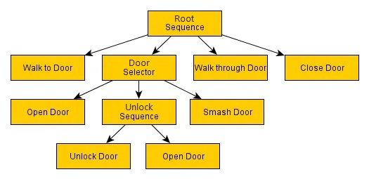

summary: Ground Enemy AI (Behavior Tree)
id: export
categories: AI, Behavior Trees, Beehave, NavMesh, 3D, Plugin
status: Published
authors: Ondřej Kyzr
Feedback Link: https://google.com

# Lab06 - Ground Enemy AI (Behavior Tree)

## Overview
Duration: hh:mm:ss
TODO
This lab will focus on learning about **Behavior Trees**. We will recreate the behavior of the **Ground Enemy Finite-State Machine** from the last lab using a Behavior Tree.

Today we will look over:
- Changes made in the project between the codelabs. 
- The 
- Learn 
- Creating 
- 

Here is the template for this lab. Please download it, there are scripts needed for the Behavior tree implementation.
<button>
  [Template Project](link)
</button>

## Behavior Trees 
Duration: hh:mm:ss

When it comes to creating an AI character in a videogame, there are many known ways/architectures that you can use. For example:
- easy but restrictive **Simple reactive planning** (bunch of if-else statements, that only react to the current environment)
- more complex **Finite-State Machine** (becoming less and less clear the more states and transitions you add)
- easily modifiable **Behavior Tree** (forcing you to learn to think about AI in a different way)
- and many more...

The choice of the architecture always depends on the complexity of the character you are making. However, most of the more complex characters are usually made with **FSMs** or **Behavior Trees**, that is why I wanted to cover them in this tutorial series.

> aside positive
> Behavior Trees are **very powerful** once you know how to use them. The ability to represent them visually makes them easy to debug. Most popular games use them, here are a few notable examples:
> - **GTA V** - pedestrian NPCs reacting to players actions
> - **The Sims** - each Sim manages their needs and interacts with objects
> - **Kingdom Come: Deliverance** - for their life-like NPC behavior
> - Nearly all modern AAA games using the Unity Engine of the Unreal Engine use Behavior Trees

### What are behavior trees?
Behavior trees are and alternative way to of creating AI for videogames. The whole behavior of the AI is divided into a **tree structure with many nodes**, that can have various types and purposes. The tree is run from **the root** and when there are sibling nodes, they are run left -> right, or top -> bottom (depends on the orientation of the tree).

When a node is run, it **must return the state** that it is in. A node can be in one of these three states:
- `SUCCESS` - Signals to the parent that the node has executed the action successfully.
- `FAILURE` - Signals to the parent that the node failed to execute the action.
- `RUNNING` - Signals to the parent that the node is still performing the execution. This pauses the tree traversal and the node will be run again next frame/tick. This is used for actions that take some time to complete.

There are 3 base node types:
- **Composite** - has more than one children and the state return value depends on the children
- **Leaf** - has no children, usually performs an action or checks a condition ("go to patrol point", "is player seen?" etc.)
- **Decorator** - has exactly one child node, that is a leaf and performs operation on the state return (invert state, always SUCCESS, etc.)

###  Composite
Let's look how the two most basic composite nodes work.

####  SequenceComposite
Sequence node **runs all child nodes one by one** and decides based on the result of the child nodes like this:
- Child node return `SUCCESS` -> run the next child node -> no more child nodes to run -> return `SUCCESS`
- Child node return `FAILURE` -> return `FAILURE`
- Child node return `RUNNING` -> return `RUNNING` (next frame/tick the child node is run again)

####  SelectorComposite
Same as the sequence, the selector node **runs all child nodes one by one** and decides based on the result of the child nodes like this:
- Child node return `FAILURE` -> run the next child node -> no more child nodes to run -> return `FAILURE`
- Child node return `SUCCESS` -> return `SUCCESS`
- Child node return `RUNNING` -> return `RUNNING` (next frame/tick the child node is run again)

### Example Behavior Tree
I think Behavior Trees are best shown on an example. This modified example was taken from [gamedeveloper.com](https://www.gamedeveloper.com/programming/behavior-trees-for-ai-how-they-work) and I will walk you through it.

Here, the goal of the tree is to perform actions so that the character **goes through a door**. The execution starts in the **root of the tree**, in the top-most composite `Sequence` node. Let's take a scenario, where the door is locked.

1. **`RootSequence`** runs **`Walk to Door`** -> `SUCCESS`
2. **`RootSequence`** runs the **`DoorSelector`**, which runs the **`Open Door`** node -> `FAILURE` (door is locked)
3. **`DoorSelector`** runs **`UnlockSequence`**, which runs **`Unlock Door`** -> `SUCCESS` (worked since the door was locked) then run **`Open Door`** -> `SUCCESS` 
4. This makes the **`UnlockSequence`** -> `SUCCESS`, making the **`DoorSelector`** -> `SUCCESS`
5. **`RootSequence`** runs **`Walk through Door`** -> `SUCCESS`, then runs **`Close Door`** -> `SUCCESS`
6. **`RootSequence`** -> `SUCCESS`, which means that the tree executed successfully

> aside positive
> If a node returned **`RUNNING`** in the example above, the tree would be **"stuck" and continuously run** the node until it would return `SUCCESS` or `FAILURE`

Try to walk through the tree with **other scenarios** (door is only closed or it has a broken lock). You should find that the tree adapts to the situation and if something were to go wrong, you would be able to see, which node/action had failed -> easy debugging.

> aside negative
> **Small but important note:** "node -> SUCCESS" means that "node returns SUCCESS"

SKIPK ISPSI

1.  `SequenceRoot` runs 1st child: `Walk to Door` node (since it is not finished)
2.  `Walk to Door` returns `SUCCESS`
3.  `SequenceRoot` runs 2nd child: `Selector` node
4.  `Selector` runs 1st child: `Open Door` node
5.  `Open Door` node returns `FAILURE`
6.  `Selector` runs 2nd child: `Sequence` node
7.  `Sequence` runs 1st child: `Unlock Door` node
8.  `Unlock Door` returns `SUCCESS`
9.  `Sequence` runs 2st child: `Open Door` node
10. `Open Door` returns `SUCCESS`
11. `Sequence` returns `SUCCESS`
12. `Selector` returns `SUCCESS`
13. `SequenceRoot` runs 3rd child: `Walk through Door` node
14. `Walk through Door` returns `SUCCESS`
15. `SequenceRoot` runs 4th child: `Close Door` node
16. `Close Door` returns `SUCCESS`
17. `SequenceRoot` returns `SUCCESS`
18. Tree ended with `SUCCESS`
    

## Notes TODO
Duration: hh:mm:ss

Do on your own `bh_set_next_patrol_point.gd`, `bh_is_player_close_enough.gd`
use user guide: [text](https://bitbra.in/beehave/#/manual/)
`logan/login` something AI plugin

## Recap
Duration: hh:mm:ss
TODO
Let's look at what we did in this lab.
- We looked at the **changes I made** between the last codelab
- In 
- Then, 
- In order to 
- Next, we 
- Then, we 
- After that 
- Next, we
    - 
    - 
    - 
- Lastly

If you want to see how the finished template looks like after this lab, you can download it here:
<button>
  [Template Done Project](link)
</button>

