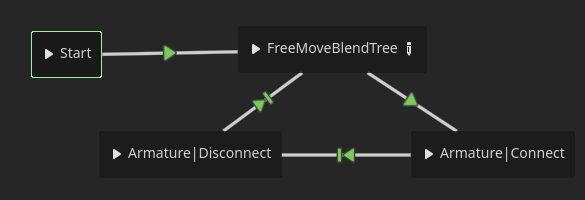
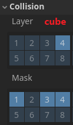
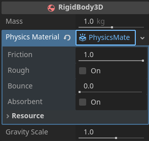

summary: Animation & Physics
id: export
categories: Animation, Physics, Colliders, 3D, Models, Joints, Animation Tree, Skeleton, Bones, Light
status: Published
authors: Ondřej Kyzr
Feedback Link: https://forms.gle/J8eeuQAJ3wMY1Wnq7

# Lab07 - Animation & Physics

## Overview
Duration: hh:mm:ss

This lab will focus on learning about three ways of making/using **Animations**. We will create the animation behavior of our player character, shooting, and a moving platform.

Then we will learn about **Physics** and make the player interact with `RigidBody3D` nodes. We will also check out **joints**, which can be used to make complex physics behavior.

In a bullet point format, we will:
- Look at the **changes I made** in the project such as.
- **Import** the player model and animation.
- Learn about **skeletal animations** and how they are made.
- Look at the 3 types of animations **Premade**, **Procedural**, and **In-engine**.
- Implement physically accurate **`CharacterBody3D` and `RigidBody3D` interactions** play around with **physics materials** and **properties**.
- Learn how to create **precise and performant colliders** for more complex objects.
- Use the `HingeJoint3D` node to set up a **seesaw**-like object.
- Lastly, look at **other joint types** (both for `2D` and `3D`).

Here is the template for this lab. Please download it, there are scripts, models, and scenes needed for the Behavior Trees and Steering Behaviors.
<button>
  [Template Project](https://cent.felk.cvut.cz/courses/39HRY/godot/07_Animation&Physics/template.zip)
</button>


## Changes Made in the Project
Duration: hh:mm:ss

Since the last template I have added and changed quite a few things in our game.

### 2D Puzzle
Quite a large addition is the 2D puzzle section. It works similarly as the **platforming section** except you use the mouse to play it. You can take a look at the code and node setup if you are interested in how games that are controlled with a mouse work.


### Player Stats
Some player parameters (`speed`, `jump_force`, `health`, `can_double_jump`, etc.) will change during the gameplay though the upgrade system. To easily handle changes, saving, and loading of these parameters I created a `Resource` class called **PlayerStats** that has all of these parameters. This way the stats of the player can be changed on the go.

> aside negative
> Some parameters, that do not change (`rotation_speed`, `gravity`, `acceleration`, etc.), are still present as `@export` parameters of the player class.

### Player, Broken pin, Cylinder, and Cube models
I made the model for the **Player** in **MagicaVoxel** and then rigged, weight-painted, and animated the model in **Blender**. We will use the model in the first part of the codelab focusing on animation.


Next, I created several models for us to play around with in **MagicaVoxel**. We will use them in the **Physics** part of this codelab for `Rigidbodies`, `Joints`, etc.


### Environment
The main `debug_3d_scene.tscn` was also expanded. I made the floor much bigger, created a playground for the **Physics** part of the codelab, and added the new models.


## Player Model
Duration: hh:mm:ss

Let's open the `player.tscn` scene and set up the player model.

### Put player in place
As you can see, the player is not in the right place. The capsule collider is way off and the `InteractArea`, which signalizes the front of the player is on the side.

Please **rotate** and **move** the `Mesh` node to match the collider. This is the before and after image:


> aside positive
> I moved the `Mesh` node to `y = -1.0` and rotated to `y = -90`, which closely matches the player collider.

### Blurry Textures
You may have noticed, that the textures on the player model are a bit blurry, and they start to clear up, when you get really close to the player. Let's fix this.

1. **Open** the file `3D/Player/GORODITH_Player_anim.fbx` in the **FileSystem**.
2. Now in the **Advanced Import Settings** disable the `Generate LODs` option in the menu on the right side.
3. **Press** the `Reimport` button.

Now the texture should be crystal-clear:


> aside positive
> The `Generate LODs` option is almost necessary for high-poly models and environments, since it improves performance. However, our model is low-poly and only suffers from this option.

###  **`AnimationPlayer`** Node
Importing a `.fbx` model with animations will automatically create a `AnimationPlayer` node. This node can play a single animation at a time and has parameters such as `Speed Scale`. You can use the `Current Animation` property to tryout and **play animations** of the player model.

In our case, we need to disable the animation `Optimizer` since it breaks (skipping some frames) a few of the animations.
1. Again, **open** the **Advanced Import Settings** of the player model.
2. **Select** the `AnimationPlayer` node in the left menu.
2. **Disable** the `Optimizer` in the right menu.

> aside positive
> More complex behaviors, such as **blending animations**, **changing them** based on current circumstances/parameters, etc. needs to be done either by **`AnimationTree`** node (covered in later section) or **your own implementation** for switching animations.

### Animation Import
While we are messing around with the importing, let's set some properties of the animations of the player. We want some animations to loop since they will be continuously playing. To do this we need to change the import settings of the animation.

1. Again, **open** the **Advanced Import Settings** of the player model.
2. **Select** the `Armature|Fall` animation in the left menu.
3. **Change** the `Loop Mode` property to `Linear`.
4. **Repeat** the process for these animations:
    1. `Armature|Idle`
    2. `Armature|WalkForward`
    3. `Armature|WalkBackwards`
    4. `Armature|WalkLeft`
    5. `Armature|WalkRight`


## Theory: Skeletal Animations
Duration: hh:mm:ss

In this section I would like to tell you the theory behind **Skeletal Animations**, how they work, and how they are created. We will look at the process of creating a proper **Rig** for our player model. Feel free to look over this section if you are interested, or you can skip it and comeback later, if some part of **Skeletal Animation** is unclear.

**Skeletal Animation** is a technique of using connected **bones** to simulate movement and bend vertices of the model in natural ways. **Animations** are then created by only moving the bones of the model, since the vertices follow the bones.

### Step 1: Skeleton
First, the bones of the model need to be created and connected. The skeleton does not need to the match all the real joints and bones that the model has. For example here you can see the **Skeleton** of our player model, which only has one bone for the whole right arm, since I do not want the elbow to bend in any of the animations:


The bones work in the same way as the nodes in a **hierarchy**. By transforming the parent bone all the child bones are also transformed in the same way. An example can be seen in the GIF below, where rotating the `LegBone` also rotates the `FootBone`. 

### Step 2: Weight Painting
Next, you need to define, which vertices react to, which bones of the model and how strongly they react to them. This is done with the process of **Weight Painting**, where you automatically or manually paint each vertex ranging from **blue** (no influence) to **red** (maximum influence) for each bone.

Here you can see the weight painting of the right leg and foot of the player:


> aside positive
> Note that in the "knee" area, the both bones have the same influence. You could say that the influence of the bones "cross-fades".

### Step 3: Posing
The last step is the transform the bones into poses. You can see in the GIF below how the model reacts to moving the bones.


### Step 4: Animation
Animations are made by capturing these poses in **keyframes** at set times. You can think of keyframes as the desired **transforms of the bones** of the model. The final animation is then only a sequence of theses keyframes. The animation is then played by interpolating from one keyframe to another, creating a seamless motion, while storing only a fraction of the data.

Here you can see the keyframes (gray and yellow dots) of all the bones for the player during the `WalkForward` animation:


### Final Note
**Skeletal Animation** is a very useful technique to create natural moving models and are a much deeper topic. If you are interested in 3D modelling or procedural animation, I recommend looking up more sources. This brief overview will be sufficient for us to use them in this codelab.


## Animation Tree (Premade Animations)
Duration: hh:mm:ss

In the first half of this codelab, we will look at 3 different ways to make and use animations. The first one is working with animations created in another software, such as `Blender` or others.


### `AnimationTree`
Creating more complex animation behavior, than just playing one animation, can be done in Godot with the use of the `AnimationTree` node. It can be used to create very complex animation behavior with state switching and blending trees.

The tree has a property of `Tree Root`, which can be set to create the behavior. There are several options but only some of them are useful (✔️) to be chosen as the root of the animation tree. 


- ❌ **`AnimationRootNode`** is just an abstract class that all other animation node classes inherit from.
- ✔️ **`AnimationNodeBlendTree`** is a canvas in which you can connect nodes to blend animations.
- 🟡 **`AnimationNodeBlendSpace1D`** is a 1D axis that interpolates between several animations based on a value `[0.0 - 1.0]`. It can be used but it is very limited.
- 🟡 **`AnimationNodeBlendSpace2D`** is the same as the 1D version, however you blend/interpolate in 2D space. Again, it can be used, but it is very limited.
- ✔️ **`AnimationNodeStateMachine`** a visual state machine, similar to the one we created in one of the previous codelabs, but specialized for animation.
- ❌ **`AnimationNodeAnimation`** a single animation. Useless as the root since you can achieve this behavior by setting a fixed animation in the `AnimationPlayer`.


### `AnimationTree` setup
Let's open the `player.tscn` scene and set up an `AnimationTree`.

1. **Add** a `AnimationTree` node as a child of the `Mesh` node.
2. **Set** the property of `Anim Player` of the new node to the `AnimationPlayer` node.
3. **Set** the property of `Tree Root` to a new `AnimationNodeStateMachine`.

Now with the setup complete, we can view the state machine by pressing the `AnimationTree` button on the bottom panel:


### State machine
With the state machine open we can see the `Start` node, which is initial state, and the `End` node. The state machine can be used as such:


> aside positive
> Selecting a transition, many things can be set in the **Inspector** such as `Priority`, `Switch Mode`, `Transition Conditions`, etc. More on that later.

### Blend tree
If you followed the steps in the GIF above, please **clear the state machine** and let's fill it out properly.

1. **Add** a `BlendTree` node.
2. **Rename** the node to `FreeMoveBlend`.
3. **Connect** a transition from the `Start` node to the `FreeMoveBlend` node.
4. **Click** the **pencil icon** in the `FreeMoveBlend` node. 

The `BlendTree` editor should now be open, with a single `Output` node. You can navigate this space by holding the middle-mouse button and dragging.

#### What is a `BlendTree`?
A `BlendTree` is a special node, that allows us to blend together different animations based on the values of parameters (0.0–1.0), which can be set in code. The functionality is best shown on an example. Let's create a `BlendTree` for our player character.

#### Filling out the `BlendTree`
Please **recreate** the setup seen in the picture below.
- You can add new nodes by **right-clicking** 
- You can connect nodes by **left-click and dragging** the white circles
- You can set the animation clip of an `Animation` node by clicking the **"film" icon**


The `Blend2` node blends two animations based on the value in the slider.

The `BlendSpace2D` node is a bit more complex, and we will look into it more closely.

> aside positive
> This configuration of animations has an inherited priority to them. For example: The `FallBlend` will override all any animation that comes before it.

### Walking animation using `BlendSpace2D`
`BlendSpace2D` is useful when you want to animate an action that takes place in 2D, meaning that the animation should slightly differ based on some parameter (velocity in our case). For example: I did not create the animations for walking diagonally, but I don't need to because I can just blend the `WalkForward` and `WalkRight` animations. 

1. **Set** the `WalkBlend` value to `1` (so that we can see the preview)
2. **Click** the `Open Editor` button in the `BlendSpace2D` node.
3. **Select** the third tool from the left.
4. **Right-click** and add the animation `Armature|WalkForward` to the center middle `[0, 1]`
5. **Repeat** step 4 but with the other 3 walking animations in the correct spots (left animation ⇾ `[-1, 0]` etc.)

Alternatively you can follow this GIF:


To get back to the `Blendtree` **click** the `FreeMoveBlendTree` button at the top of the `AnimationTree` panel.

> aside positive
> You can use the first tool, as I did in the GIF, to try out how different values of the 2D blending parameter look like.

### Setting the blending parameters
If you had tried to play the game, the animations would not have worked. That's because we still need to set the values of the `AnimationTree` **blending parameters** in the script of our player.

**Open** the `player_controller_3D.gd` script and find the function `_animation_tree_update()` (should be around line 168). This function will be responsible for setting all the **animation blend values**. 

#### Blending the falling animation
Let's start with the `FallBlend`. We want the falling animation to play only when the `velocity.y` of our player is lower than `0`. The animation should also not play **as strongly** when the player starts to fall. That will be done by multiplying the force by some small number for example around `0.1`. This is the code for the `FallBlend`:

```GDScript
# Blend amount Fall
var fall_coef : float = 0 
if velocity.y < 0:
  fall_coef = clamp(-velocity.y * fall_mult, 0.0, 1.0) 
animation_tree.set("parameters/FreeMoveBlendTree/FallBlend/blend_amount", fall_coef)
```
- `fall_mult` is an `@export` variable that controls the amount of force needed to blend.

#### Parameter path
The path of the parameter to set can be found in the **Inspector**, while the `AnimationTree` is selected. You can even **right-click** the parameter and press `Copy Property Path`, so that you don't have to type it out.


The setting of other parameters works similarly, so I won't go through them in detail. Here is the full code of the `_animation_tree_update()` function:

```GDScript
func _animation_tree_update():
  # Blend amount Fall
  var fall_coef : float = 0 
  if velocity.y < 0:
    fall_coef = clamp(-velocity.y * fall_mult, 0.0, 1.0) 
  animation_tree.set("parameters/FreeMoveBlendTree/FallBlend/blend_amount", fall_coef)

  # Blend amount Jump
  var jump_coef : float = 0 
  if abs(velocity.y) > 0:
    jump_coef = clamp(abs(velocity.y) * jump_mult, 0.0, 1.0) 
  animation_tree.set("parameters/FreeMoveBlendTree/JumpBlend/blend_amount", jump_coef)

  # Blend amount Walk
  var local_velocity : Vector3 = velocity * basis
  local_velocity.y = 0
  animation_tree.set("parameters/FreeMoveBlendTree/WalkBlend/blend_amount", (local_velocity.length() / stats.speed))

  # BlendSpace2D walking
  var vel2 : Vector2 = Vector2(local_velocity.x, -local_velocity.z).normalized()
  animation_tree.set("parameters/FreeMoveBlendTree/WalkSpace2D/blend_position", vel2)
```

#### `TimeScale` node
Trying out the animations in play mode, one thing becomes clear. The walking animations need to be faster. This can be done with a `TimeScale` node.

1. **Open** the `AnimationTree` panel.
2. **Open** the `FreeMoveBlendTree`.
3. **Add** a `TimeScale` node between the `WalkSpace2D` and `WalkBlend` nodes.
4. **Connect** the new node correctly.


This `TimeScale` node can also be used to adjust the speed of the walking animation on the go, based on the actual walking speed of the player. To do this, add these lines to the end of the `_animation_tree_update()` function:

```GDScript
# BlendSpace2D walking timescale
var walkscale : float = (local_velocity.length() / stats.speed) * walk_mult
animation_tree["parameters/FreeMoveBlendTree/TimeScale/scale"] = walkscale
```

Now try to lower the `acceleration` parameter of the player, and you should see that the animation adapts:


### Connect to puzzle (fill out function)
Ok, so now with the `FreeMoveBlendTree` complete let's go back to the `Root` of the `AnimationTree` and add the animations for the **connecting and disconnecting** from the 2D puzzle.

#### Fill out the Root State Machine
1. **Add** a new node of type `Animation` ⇾ `Armature|Connect`.
2. **Create** a transition from the `FreeMoveBlendTree` to the new state node.
3. **Add** another new state of type `Animation` ⇾ `Armature|Connect` and rename it to `Armature|Disconnect`
4. **Select** the new state and change the `Play Mode` in the **Inspector** to `Backward`
5. **Create** a transition from the `Armature|Connect` node to the `Armature|Disconnect`.
6. **Select** the transition and set the `Switch Mode` in the **Inspector** to `At End`.
7. **Create** a transition from the `Armature|Disconnect` node to the `FreeMoveBlendTree`.
8. **Select** the transition and set the `Switch Mode` in the **Inspector** to `At End`.



> aside positive
> `Switch Mode` ⇾ `At End` makes the transition wait until the animation finishes
>
> `Play Mode` ⇾ `Backward` makes the animation play in reverse

#### Connect Parameter
The current configuration will just loop between the three states. We want the animations to play when the player **enters** and **exits** the 2D puzzle. To make this possible I already created a function `set_connect_anim_bool(value : bool)` in the `player_controller_3d.gd` script, and you need to fill it out.

**Create** a variable of type `bool` called `_connected` and set it in the `set_connect_anim_bool(value : bool)` function. This should be the result:

```GDScript
...
var _connected : bool
...
func set_connect_anim_bool(value : bool) -> void:
    _connected = value
...
```

#### Transition Parameter
To use the `_connected` parameter in the `AnimationTree` we first need to set the `Advance Expression Base Node` in the **Inspector**. This makes the variables and parameters of the player script available in the `AnimationTree`. Please **set** the parameter to the `Player` node as such:


Now inside the `AnimationTree` window:
1. **Select** the transition from `FreeMoveBlendTree` to `Armature|Connect`
2. **Set** the `Expression` parameter to `_connected` in the **Inspector** in the `Advance` section
3. **Select** the transition from `Armature|Connect` to `Armature|Disconnect`
4. **Set** the `Expression` parameter to `not _connected` in the **Inspector** in the `Advance` section

This makes the `AnimationTree` work directly with the variable of `_connected`, that is set when the player enters and exits the 2D puzzle.


## Skeleton Modifiers (Procedural Animations)
Duration: hh:mm:ss

Another way of creating animations is using code. There are many ways you can code animations, but we will look at how we can use bones of an already existing skeleton to **influence objects**, and **create responsive (procedural) animations**. Here are some examples:
- Placing the feet of a character precisely on the ground so that they do not float or clip inside the ground.
- Keeping the hands of a character from going through walls by influencing the bones and pushing them away.
- Making the head/gun look at in the same direction as the camera.
- Organic movement of characters such as animals (games: `Rain World`, `Gecko Gods`, ...)
- Most of the Tweens we did in this project are also a form of procedural animation.
- and many more ...

> aside negative
> To save time in this section I already made all the necessary references to nodes though `@onready` beforehand. So it is important to keep the names of the nodes the same!

### Light in eyes `BoneAttachment3D`
We will first make the player eyes glow using point lights (`OmniLight` in Godot).

1. **Add** two `OmniLight3D` nodes as children of the `Skeleton3D`
2. **Move** each light inside an "eyehole" of the player model (turn off the `AnimationTree` for easier manipulation)
3. **Adjust** the parameters of the lights like so:
    - `Range` = `0.1`
    - `Color` = `ffb300`
    - `Energy` = `0.5`

Now to make the lights follow eyes we will attach them to a bone like this:

1. **Add** a `BoneAttachment3D` node as a child of the `Skeleton3D`
2. **Set** the `Bone Name` parameter of the `BoneAttachment3D` to `Head_end`
3. **Put** the two `OmniLight3D` nodes as children of the `BoneAttachment3D`

Now the eye lights should closely follow the movement of the head of the player.


### Gun Aiming `LookAtModifier3D`
Let's use another modifier. I want the gun, that the player holds to aim where the camera is looking. We will do this by adding a `LookAtModifier3D`, which will rotate the bone towards a target, and by adding a `Node3D`, which will work as the target that the bone will be looking at. 

1. **Add** a `LookAtModifier3D` node as a child of the `Skeleton3D`
2. **Add** a `Node3D` as a child of the `Player` node
3. **Rename** the `Node3D` to `GunTarget` (Important!)
4. **Set** the parameters of the `LookAtModifier3D` as such:
    - `Target Node` = `GunTarget`
    - `Bone Name` = `GunBone`
    - `Forward Axis` = `+Y`
    - `Primary Rotation` = `Z`

Try to move the `GunTarget` node around, and you can see that the gun follows it.


> aside positive
> You can see which axis to use for the `Forward Axis` and `Primary Rotation` by looking closely at the bone. It has a small 3D axis gizmo drawn at the end of it.

#### Moving the `GunTarget`
Now the only thing left to do is to move the actual `GunTarget` based on direction the camera is looking in. I already prepared the logic in the code, since I want it a bit more complex than just moving the target.

1. **Go** into the `player_controller_3d.gd` script
2. **Uncomment** the `_update_gun_target()` function
3. **Delete** the `pass` line

This code **moves the target** based on set parameters such as `gun_point_offset`, `gun_point_depth`, etc. However, it also **changes the** `influece` of the modifier in such a way, that the influence is lower when looking backwards. This makes the gun not clip inside the player. 


You can change the line `look_at_modifier_3d.influence = influence` to `look_at_modifier_3d.influence = 1` to see the difference between limiting the angle or not.

> aside positive
> You can also limit the angles of rotation in a more absolute way using the `Angle Limitation` section:
>
>

### Player Projectiles
Now that our gun rotates to where we are looking at it would be nice to actually **shoot a projectile**. I have already prepared a scene with the projectile (`3D/Player/Projectile`), that can be easily instantiated. We first need the position and rotation of the tip of the gun.


#### The Shoot Point
Either we can calculate it using the bone transform, which is a bit too complex, or we can use another `BoneAttachment3D` node with a `Node3D`, which will be easier and will allow us to more easily tweak the precise spawn point in space. Let's do the second variant:

1. **Add** a `BoneAttachment3D` node as a child of the `Skeleton3D` (should be called `BoneAttachment3D2`)
2. **Set** the `Bone Name` to `GunBone_end`
3. **Add** a `Node3D` as a child of the new `Boneattachment3D`
4. **Rename** the new `Node3D` to `ShootPoint`

You can adjust the position of the `ShootPoint` to your liking.

#### The Shoot Cooldown
Another node we need is a `Timer` node that will handle the cooldown of shooting.

1. **Add** a `Timer` node as a child of the `Player`
2. **Rename** it to `ShootCooldown`
3. **Set** the property `One Shot` to `On`

If a timer is set as `One Shot` it means that once it will run out, it won't start again on its own, which is exactly what we need since we only want to start the timer once the player fires their gun.

#### The Input Map
The next thing we need to do is add a new input into the `InputMap` for shooting.

1. **Open** the **Project Settings**
2. **Go** into `InputMap`
3. **Add** a new action called `shoot` and add a keybinding of `Right Mouse Button`

#### The `_shoot()` function
The last thing that needs to be done is to **uncomment** the `_shoot()` function in `player_controller_3d.gd`. Here is the full function just to be sure:

```GDScript
func _shoot() -> void:
    if not shoot_cooldown.time_left <= 0: return
    if not Input.is_action_just_pressed("shoot"): return
    shoot_cooldown.start(stats.shoot_cooldown)

    # Create projectile
    var projectile : PlayerProjectile = stats.projectile.instantiate()
    get_tree().current_scene.add_child(projectile)

    # Set position, rotation, damage
    projectile.global_position =  shoot_point.global_position
    projectile.global_rotation = shoot_point.global_rotation
    projectile.set_damage(stats.projectile_damage)

    # Set velocity
    var direction : Vector3 = (gun_target.global_position - projectile.global_position).normalized()
    projectile.set_velocity(direction * stats.projectile_speed)
```
- Check if the **timer has run out** ⇾ we can shoot.
- Check if the player **pressed the shoot button**.
- **Start the `Timer`** again to prevent shoot spamming
- **Create the projectile** defined in player stats
- Set the **position, rotation, and damage**
- Set the **velocity** based on direction of the gun and projectile speed from player stats

Now when you play the game, the player can shoot a projectile using the `Right Mouse Button`.


### Enemy Damage
The shooting is nice and all but in the current state it is useless, since the enemies **do not receive damage**, so let's change that. There are many ways to do this, but since I want the game to feature breakable walls, boxes, etc. we will use a **group** (same as tag in Unity) to denote, which objects can receive damage.

1. **Open** the **Node** panel next to the **Inspector**.
2. **Select** the `Groups` tab
3. **Add** a new group called `Damageable` and set it to **global**
4. **Open** `air_enemy.tscn` and **check** the `Damageable` group on the root node
5. **Repeat** for `ground_enemy_bh.tscn` and `ground_enemy_fsm.tscn`


`air_enemy.tscn`, `ground_enemy_bh.tscn`, and `ground_enemy_fsm.tscn` already implement the `damage()` function, so playing the game now, you should be able to kill the enemies after a few hits.

> aside negative
> Usually in other programming languages we would create an `Interface`, that every damageable object would extend. In our case, since Godot does not have `Interfaces`, we will set a rule for our selves, that every object with the `Damageable` group will implement a function `damage(value : float, node : Node3D) -> void`.

### Skeleton Inverse Kinematics Showcase
Godot also has a special node for **inverse kinematics**. It is a bit more complex and not that applicable for our game, so I am only going to showcase how it works on a simple example.  

#### Node setup
First you need to add the `SkeletonIK` node and set the `Root` and `Tip` bone, then the node to be followed (`Target`) also needs to be set. For our example I will use the right leg of the player like this:


> aside positive
> The `RightFoot_end` bone is the tip of the `RightFoot` bone.

### Result
To preview the `SkeletonIK` it is needed to click the `Play IK` button on the top bar of the scene view. Here is the resulting behavior:


Of course, you can then set rotation limits for the bones by implementing your own `SkeletonModifier3D`, so that they only rotate in a realistic way.

> aside negative
> In the version of Godot, that we are using (4.4.1) the `SkeletonIK` node is deprecated and will be replaced by a `SkeletonModifier` node in a future release, but it is ok to use for now.


## Moving Platform (In-engine animations)
Duration: hh:mm:ss

The last way to make animations, that I want to show you, is **creating them in the engine** itself. This is useful for creating simple animations, such as moving platforms, UI animations, visual effects, etc.


### Moving Platform Node Type
We will create a moving platform, that will move the player. I have already created a basic platform and placed it in our `debug_3d_scene.tscn`. So please open the scene and find the `AnimatedPlatform` node.

The platform is a node type of `AnimatableBody3D`. This node is similar to the `StaticBody3D`, except while it is moved manually using code or animations it affects other physics bodies correctly (collisions, linear and angular velocity estimation, etc.).


### Animation Player
To create an animation, we first need to add an `AnimationPlayer` node, which will host our animations.

1. **Add** a `AnimationPlayer` node as a child of the `AnimatedPlatform`
2. **Select** the `AnimationPlayer` node
3. **Open** the `Animation` tab on the bottom panel

> aside positive
>In more complex cases we would create an `AnimationTree` to handle the behavior but in our case the platform will just play one animation in a loop.

### The Animation
With the animation window open let's create a new animation:

1. **Click** on the `Animation` Button
2. **Select** the `New...` option
3. **Set** the name to `move`


#### Animation Tracks
To actually animate something, we need to add an **animation track**. There are several options that we can use:


- **Property** - any property, can be position, color, export variables, etc.
- **3D Position** - used to animate the position of an object
- **3D Rotation** - used to animate the rotation of an object
- **3D Scale** - used to animate the scale of an object
- **Blend Shape** - used to interpolate between blend shapes (used for facial expressions, lip-syncing etc.)
- **Call Method** - used to call methods/function during the animation ⇾ can be used as animation events
- **Bezier Curve** - used to animate any property but using a curve editor instead of a dope sheet
- **Audio Playback** - used to play sound during an animation
- **Animation Playback** - used to sequence the animations of other animation player nodes in a scene, for example in cut scenes

#### Moving the platform
We want to create an animation of the platform moving up to the big resistor.


Ok, let's make the animation.

1. **Add** a `3D position` animation track ⇾ new menu opens
2. In the new menu, **Select** the `AnimatedPlatform` node ⇾ new menu opens

Let's also set some parameters of the animation.
1. **Find** the animation length field on the right side  and **set it** to `3` seconds.
2. Next to the field, there is the **loop button** set it like this .
3. Above these settings, there is the  button, **toggle** it **on**.

These settings will make the animation **3 seconds long**, **start playing automatically** when we turn the game on, and **loop it** with a bounce-back effect. Now to add keyframes to our animation:

1. **Set** the `AnimatedPlatform` node's position
2. **Right-click** on the timeline and press **Insert Key ...**

This adds a keyframe to the current position of the track player with the value of the `AnimatedPlatform` position. Use this process to create an animation of the platform moving up to the `BigResistor` object.


#### Rotating the platform
You can play add another track for rotation (`Bezier Curve`) to make the animation a bit more interesting. I first set the keyframes the same way as we did with the `position`, and then I switched to the **bezier curve editor** to make the animation a bit more interesting


> aside negative
> Sadly, there is currently a bug in Godot with multiple **animation tracks** (or even multiple `Tweens`) and **`AnimatableBody3D`**. If the option of `Sync To Physics` is turned on then only the **first** animation track will be played.
>
> If this becomes a problem for you, these are your options:
> 1. Try the newest version of Godot in case that it is already fixed
> 2. Keep `Sync To Physics` off making the motion a bit jittery. 
> 3. Have only one animation track (very restrictive)
> 4. Use an alternative that could work better for your specific need, mostly with `Sync To Physics` still turned off: 
>   - `Tweens`, which are more limited than the animation player and need the `set_process_mode` called and set to physics.
>   - `Path3D` with `PathFollow3D`, which are used for 3D position and rotation


### Why the player rides the platform?
You might have noticed that the player gets moved and rotated by the platform as it is animated in a correct way. This is due to the player node being of type `CharacterBody3D`, which has the `Moving Platform` ⇾ `Floor Layers` set use all layers as moving platforms by default.


## Rigidbody Physics
Duration: hh:mm:ss

This second part of the codelab will focus on physics, more precisely rigidbody physics. A rigidbody (`RigidBody3D` in Godot) is a 3D physics body that is moved by a physics simulation.

`RigidBody3D` implements full 3D physics. It cannot be controlled directly, instead, you must **apply forces** to it (gravity, impulses, etc.), and the physics simulation will calculate the resulting movement, rotation, react to collisions, and affect other physics bodies in its path.

### `CharacterBody3D` and `RigidBody3D` Interaction Problem
Right now, if you try to push the cubes present in the scene they are stiff and do not move. This is the basic behavior when you set collision layers and masks in such a way that the player (`CharacterBody3D`) and the cube (`RigidBody3D`) collide with each other. Here is the behavior for different configurations:

#### Player ❌ Cube ❌
Disabling the player layers in the cube masks and vice versa makes both bodies not interact with each other. The player simple walks through the cube.

 

#### Player ❌ Cube ✔️
Making the cube collide with the player but not the player with the cube creates a semi functioning physics system.

 

This setup is also called "infinite inertia" and it looks like this:


#### Player ✔️ Cube ❌ and Player ✔️ Cube ✔️
Both of these configurations make the cubes stiff and the player cannot move them. However, the player also no longer pushes the cube into the ground.


### Solving the Interaction Problem
To solve this problem we need to manually process all the collisions and apply the correct forces to simulate realistic rigidbody interactions. First, we need to set the **collision layer and mask** of the cube ❌ in the `cube.tscn` scene like so:


Then let's **set** the player ✔️ **collision layer and mask** in the `player.tscn` scene like so:


> aside negative
> Make sure to turn off the collision with the 4th layer in the `Moving Platform` section or else the player will slide off rigidbodies.

Now, I prepared a function called `_check_collisions(delta : float)` in the `player_controller_3d.gd`. Let's fill out the missing lines and walk through them.

> aside positive
> I also set the name of the forth collision layer to `RigidBodies`.

#### Push Direction
First, we need to know which way to push the rigidbody we collided with. This can be achieved simply by getting the **normal vector** of the collision.

```GDScript
var push_direction : Vector3 = -collision.get_normal()
```

#### Push Force
Then we need to calculate the push force. Since we want the collisions to be physically correct, we need to take into account **the masses** of both the player and the rigidbody. This line will calculate just that:

```GDScript
var force : Vector3 = push_direction * (player_mass / collider.mass)
```

> aside positive
> Another possibility is to also take into account the velocities of the player and rigidbody to create a more accurate simulation and to make the rigidbodies also push the player. However, if you want to create a physics-based game (`Fall Guys`, `Human: Fall Flat`, `Gang Beasts`, etc.) it would be easier if the player was of node type `RigidBody3D`.

#### Position Offset
The next thing, before we apply the force, is the offset from the rigidbody center to the collision point. We need this offset for the `apply_impulse()` function, that will be used in the next step. Here is the line to get the offset:

```GDScript
var pos_offset : Vector3 = collision.get_position() - collider.global_position
```

#### Force Apply
The last thing we need is to apply the force on the rigidbody. To do this we will use the `apply_impulse()` function, which applies an instant force to the body.

```GDScript
collider.apply_impulse(force * delta, pos_offset)
```

#### The Result
The player and cube `mass` parameter can be adjusted to make the interactions feel different. Here is the full code of the function:

```GDScript
func _check_collisions(delta : float) -> void:
    for i in get_slide_collision_count():
        var collision : KinematicCollision3D = get_slide_collision(i)
        var collider : Object = collision.get_collider()
        if collider is RigidBody3D:

            # Calculate the force
            var push_direction : Vector3 = -collision.get_normal()
            var force : Vector3 = push_direction * (player_mass / collider.mass)

            # Get the offset from collision point to rigidbody center
            var pos_offset : Vector3 = collision.get_position() - collider.global_position

            # Apply the force
            collider.apply_impulse(force * delta, pos_offset)
```

This is the resulting behavior the code produces:


### Physics material and mass
Having different physics objects have different physical properties is essential. The `RigidBody3D` node has these properties that can be changed:



- **`Mass`** - The weight of the body, controls how easily it can be pushed.
- **`Friction`** - Controls how much the body slides on the ground (lower ⇾ more ice-like).
- **`Rough`** - When `On`, upon collision the `Friction` of this body will be used.
- **`Bounce`** - Controls the bounciness of the body (`1` == bouncy, `0` == no bounce).
- **`Absorbent`** - Makes the `Bounce` parameter subtract the `Bounce` from other bodies making this body absorb the bounciness (kinda reverses the effect of `Bounce`).
- **`Gravity Scale`** - Just multiplies the effect of gravity.

Try to **play around** with these parameters of the cube to see how it behaves with different values.

> aside positive
> I am going to change the `Friction` to `0.8` and keep the rest of the parameters on default values.


## Seesaw - Hinge Joint
Duration: hh:mm:ss

This section will look at one type of **physics joints**, that can be used to create objects such as seesaws, doors, and other objects with similar axis of movement. We will make the seesaw object I modelled behave in a physically correct way.


**Open** the `broken_pin.tscn` scene located in `3D/WorldObjects/BrokenPin/`.

### Colliders
Firstly, to use our seesaw, we need to add a collider to the `RigidBody3D` called `SeeSaw` so that it is able to collide with the environment and the player. With more complex shapes than just cubes and spheres you generally have **3 options** for creating the collider. We will go through all of them and I will show you how you can create them.

#### Trimesh collider / Concave collider
The most computationally expensive option but the most precise is to create a collider that is **identical to the mesh**. This option is only really used for precise terrain collision in landscapes (expansive lower poly terrain and/or mountains). Most modern engines also **DO NOT support** this type of collider on a **non-static body**.

To create this type of collider in Godot simply:


1. **Select** the `MeshInstace3D` node in question
2. **Press** the `Mesh` button in the top middle of the **scene view** (aka. **context menu**)
3. **Select** the `Create Collision Shape...` option
4. **Keep** `placement` = `Sibling` and `type` = `Trimesh` ⇾ **Create**

As you can see this type of collider is extremely detailed (depends on the mesh) and for our case **wasteful**.


> aside positive
> This type of collider is often called a **Mesh Collider**.


#### Convex collider
This collider is a tradeoff between precision and performance. It still crates a **precise collider** based on the underlying mesh with one special property. The resulting collider is a **convex shell**, or in other words you can imagine the object tightly wrapped in plastic wrap.

The **process of creation** is the same, except you select `type` = `Single Convex` in the pop-up window.


This collider type is also **not suitable for our case**, since the precision is not good for the specific shape of the broken pin. It can be useful for complex objects that are hard to create as a **composite collider**.


#### Composite collider
A composite collider is not really a collider type it is more like a **method of creating colliders** from simple collider shapes.

1. **Delete** all previous colliders, in case you created them.
2. **Create** two `CollisionShape3D` nodes as children of the `SeeSaw` node
3. **Set** the `Shape` to `BoxShape3D`
4. **Adjust** the `position` and `Shape` of the `CollisionShape3D` nodes to match the mesh


This collider setup uses **only two** **`BoxShape3D`** colliders, which is very **computationally cheap**, and **quite precise**. Although the small details of the mesh are lost to the collision detection with this setup, it is sometimes better to not introduce these details since the physics in game engines can be more buggy with more details.

> aside positive
> I used these values for the two `CollisionShape3D` nodes:
> - **Shape Size** = `(17.0, 1.0, 2.0)`, **position** = `(-1.5, 0.0, 0.0)`
> - **Shape Size** = `(3.0, 3.0, 3.0)`, **position** = `(8.5, 0.0, 0.0)`


### Axis Lock
Now with a proper collider we can implement the behavior of the seesaw. The first way to do it is using the `Axis Lock` functionality. I locked all the axis prior to the codelab so that the `SeeSaw` would not fall through the ground.

1. **Select** the `SeeSaw` rigidbody.
2. **Locate** the `Axis Lock` category.
3. **Uncheck** the `Angular Z` to enable rotation in the correct axis
4. **Uncheck** the `Linear Y` to enable the movement up and down 

Here is how the seesaw should behave now. As you can see in the GIF, the seesaw works better when `Mass` parameter is set to `10`. I recommend keeping the `Mass = 10`.


However, using `Axis Lock` does not produce the desired behavior, which I wanted and has many quirks, such as not being able to lock outside the main XYZ axes.

> aside positive
> `Axis Lock` is a useful tool not only for making seesaws but many different mechanisms

### Hinge Joint
The proper and more robust way to create a physics object like a seesaw or doors is to use a `HingeJoint`. A `HingeJoint3D` node works by pinning two `PhysicsBody3D` nodes (parent class of all bodies) in a single point and restricting their movement to one rotation axis.

#### Set Nodes
I already created the `HingeJoint3D` node in the `broken_pin.tscn` scene, so let's set it up. The `Node A` should be the fixed/static part of our joint and `Node B` the moving part.

1. **Set** the `Node A` to the `Cylinder` node (`StaticBody3D`)
2. **Set** the `Node B` to the `SeeSaw` node (`RigidBody3D`)

#### Move the Joint
Now we need to **move and rotate** the joint, so that the gizmo (light blue circle and axis) is where we want the axis of rotation to be. I moved the joint like this:


> aside positive
> I used the position of `(1.45, 0.215, 1.5)` and the rotation of `(0, 0, 0)`

#### Angular Limits
The rotation along the joint axis can be then further **limited** to set minimum and maximum angle. There are many parameters that can be set to tweak the behavior, which can make the joint more stable:


Try to **play around** with the angle limits to see

### Closing Thoughts
The `HingeJoint3D` and other joints (in most engines) are very quirky, and you need to find the correct parameters for all the values. In the case of the `BrokenPin`, making the `RigidBody3D` **heavier** (`12 kg`), **moving it** on the `X-axis` to balance the weight better, and **setting** `Deactivation -> Can Sleep` **off**. These settings fixed most of the jittering and instability.

#### Seesaw Results
Here is the resulting behavior of the broken pin seesaw, which will act as a **small environmental puzzle**. The player will push the cubes off and gain access to the top of the big block. 


#### Hinge on two cubes
You can also connect two rigidbodies together like I did here with two cubes:


> aside positive
> It is also possible to add more `HingeJoint3D` (or other joints) nodes to create a chain of several objects all connected to each other.


## Other Joints
Duration: hh:mm:ss

There are many other joint types, that can be used. The selection of `2D` and `3D` joints also differs a bit due to the dimension specifics.

### `2D` Joint Types


#### `DampedSpringJoint2D`
- Connects two 2D physics bodies with a spring-like force.
- Useful for making buttons, bouncy platforms, etc.

#### `GrooveJoint2D`
- Restricts the movement of two physics bodies to a single axis.
- Useful for sliding doors, pistons, etc.


#### `PinJoint2D`
- Attaches two 2D physics bodies at a single point, allowing them to freely rotate.
- Useful for chains, swinging objects like chandeliers, bridges, etc.

> aside positive
> Notice, that there is no `HingeJoint2D` since the `PinJoint2D` works the same way, but only in 2D! 

### `3D` Joint Types


#### `ConeTwistJoint3D`
- Connects two 3D physics bodies in a way that simulates a ball-and-socket joint.
- Similar to `PinJoint3D` except it allows restricting the rotation angle and how much the body can twist.
- Useful for limbs like shoulders and hips, lamps hanging off a ceiling, etc.

#### `Generic6DOFJoint3D` (6DOF = 6 Degrees Of Freedom)
- Allows for implementing custom types of joints by locking the rotation and translation of certain axes.
- There are options for **Limits**, **Springs**, and **Motors** (constantly applies force)
- Useful for custom joints, that cannot be easily made with other types.

#### `HingeJoint3D`
- Already explained in great detail in previous section.
- Useful for making hinges, doors, trapdoors, seesaws, etc. 

#### `PinJoint3D`
- Same as the `2D` version except you cannot restrict the rotation angles. 

#### `SliderJoint3D`
- Same as the `GrooveJoint2D` but in `3D`


### Problem with the `Generic6DOFJoint3D`
Currently in `Godot 4.4.1`, the `Generic6DOFJoint3D` is broken and only the **limiting** of movement and rotation work. Both of the `Linear` and `Angular` **Springs** and **Motors** are broken and do not work at all.

I created a **script**, that can be attached to a `Generic6DOFJoint3D` node, which makes at least the `Linear Spring` and `Linear Motor` work in a somewhat reliable way. Hopefully this issue will be fixes in future releases.

> aside positive
> Feel free to use this script in your games if you need to use the `Generic6DOFJoint3D` node for something.

### Button/Bouncy Platform - Spring joint 
Let's use the `Generic6DOFJoint3D` node with my script and create a button/bouncy platform. I have already prepared some stuff.

#### Setup

1. **Open** the `debug_3d_scene.tscn` scene.
2. **Navigate** to `Environment` ⇾ `SpringPlatform`.
3. **Add** the `3D/WorldObjects/Physics/fixed_6DOF_joint_3d.gd` script to the `Generic6DOFJoint3D`
4. **Set** the `Node B` property of `Generic6DOFJoint3D` to `Platform`
5. **Set** the `Mass` of the `Platform` to `2kg`

Let's now set the limits, motors, and springs.

#### Linear Limits Parameters
We want the platform to move on the `Y-axis` so:

1. **Turn** on the `X` limits
2. **Turn** off the `Y` limits
3. **Turn** on the `Z` limits

#### Linear Motors Parameters
The motor option makes the rigidbody move in set direction. We want the platform to have a stronger spring on the up `Y-axis` so set the motor to:

1. **Turn** off the `X` motor
2. **Turn** on the `Y` motor
3. **Set** the `Target Velocity` to `0.1`
4. **Set** the `Force Limit` to `2`
5. **Turn** off the `Z` motor

#### Linear Spring Parameters
The spring option makes the rigidbody behave like being attached to a spring. We want the platform work as a spring on the `Y-axis`:

1. **Turn** off the `X` spring
2. **Turn** on the `Y` spring
3. **Set** the `Stiffness` to `3`
4. **Set** the `Dampening` to `1`
5. **Turn** off the `Z` spring

> aside positive
> You can hover over all the parameters to see, what each one does.

#### The result
Here is the resulting bouncy platform. Feel free to play around with all the parameters to see what each does and how it influences the platform.


## Recap
Duration: hh:mm:ss

Let's look at what we did in this lab.
- We looked at the **changes I made** in the project such as:
    - 2D Puzzle
    - Player stats script
    - New models
- Then, we **imported and corrected** the player model and animation.
- Next, we looked at how **skeletal animations** are made and the theory behind them.
- We looked at the 3 types of animations:
    - **Premade** - used by the `AnimationTree` node and created a complex animator behavior (`StateMachine`, `BlendTree`, `Timescale`, etc.).
    - **Procedural** - with the `SkeletonModifiers`, which helped us make:
        - Lights follow the eyes.
        - Aiming the gun with the camera.
        - Inverse kinematics, etc.
    - **In-engine** - to create a moving platform animation.
- The second part of the codelab looked closely at **physics**.
- We implemented physically accurate **`CharacterBody3D` and `RigidBody3D` interactions** and looked at **physics materials** and **properties**.
- We made a little detour into how to create **precise and performant colliders** for more complex objects.
- After that, we used the `HingeJoint3D` node and the `Axis Lock` property to set up a **seesaw**-like object.
- Lastly, we looked at **other joint types** (both for `2D` and `3D`) and created a **bouncy platform** with my fixed implementation of `Generic6DOFJoint3D`.


### Note on Animations
Creating animations is quite difficult and lengthy endeavor. If you want **professional animations and character models** ready to be used, I suggest checking out [Mixamo](https://www.mixamo.com/#/?page=1&type=Character) from `Adobe`. The characters and animations are free to use even in commercial products. 

### Project Download
If you want to see how the finished template looks like after this lab, you can download it here:
<button>
  [Template Done Project](https://cent.felk.cvut.cz/courses/39HRY/godot/07_Animation&Physics/template-done.zip)
</button>
