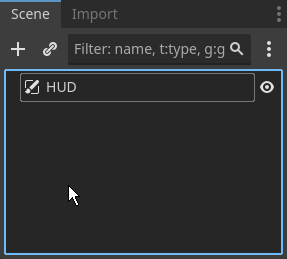

summary: UI & Audio
id: export
categories: UI, Canvas, Slider, Label, Alignment, Anchors, Container, Gradient, Progress Bar, Health, Collectibles, Audio, Audio Manager, Audio Bus, Audio Stream, Audio Listener, Tween
status: Published
authors: Ondřej Kyzr
Feedback Link: https://forms.gle/J8eeuQAJ3wMY1Wnq7

# Lab08 - UI & Audio

## Overview TODO
Duration: hh:mm:ss

This lab will focus on learning about 

Then we will learn about 

In a bullet point format, we will:
- Look at the **changes I made** in the project such as.
- **Import** 
- Learn about 
- Look at the 
- Implement 
- Learn how to create 
- Use the 
- Lastly, look at 

Here is the template for this lab. Please download it, there are scripts, models, and scenes needed for the Behavior Trees and Steering Behaviors.
<button>
  [Template Project](https://cent.felk.cvut.cz/courses/39HRY/godot/08_UI&Audio/template.zip)
</button>


## Changes Made in the Project TODO
Duration: hh:mm:ss

Since the last codelab I have added and changed quite a few things in our game.

### Collectibles
I added a 3D model for the malware trace, which will be a collectible item working as currency in this game. I also made the complete scene and script, and we will only fill out a small function in the player script.


To remember the amount of traces collected I added a variable for this in the `player_stats.gd` script.


### UI textures
I drew sprites, which we will use in the UI for a **Health Bar** and **Collectible counter**.


### Sounds
I have created and added many sound effects for us to try out and use. I also downloaded some free to use music and ambient sounds. All can be found in the folder `Audio`.

### Audio Manager
I prepared a script `audio_manager.gd` script and `audio_manager.tscn` scene. We will focus on this scene and script in the second part of the lab.


## Health Bar UI TODO
Duration: hh:mm:ss

Let's start by creating a player HUD with a health bar.

### HUD setup
First, we need to somehow draw sprites and images to the screen regardless of if we are in 2D or 3D. For these purposes the `CanvasLayer` node exists.

1. **Create** a new scene of type `CanvasLayer` (`CTRL+N`)
2. **Rename** the root `CanvasLayer` to `UI`
3. **Save the scene** into the folder `UI`
4. **Instantiate** the scene in the `debug_3d_scene.tscn` scene




### `TextureProgressBar`
Now, let's go back to the `ui.tscn` scene. A health indicator can be done in many different ways. You can use simple text (`Label` or `RichTextLabel` nodes) or make something more complex. We will create a health bar using a `TextureProgressBar`.

1. **Add** a `TextureProgressBar` node as a child of the `UI`
2. **Rename** it to `HPBar`
3. **Set** all the textures in the `Textures` category (`Under` → `hp_bar_under.png`, etc.)
4. **Set** the `Texture Filter` to `Nearest` (disabling linear interpolation of the textures)
5. **Set** the `Value` to `50` (so that the fill is visible)

If you zoom in, the bar should look like this:


We can see that the `Fill` is in the wrong place. **Change** the `Offset Progress` property to `(9, 6)`.


### UI Script
Let's now create a script that will set the `Value` of the `TextureProgressBar` based on the amount of HP the player has.

1. **Create** and a script called `ui.gd` in the folder `UI`
2. **Make** it `extend` the `CanvasLayer` class
3. **Attach** the script to the `UI` node

#### Player Signal
Now, we need to be notified every time the players HP changes. We can do that by **adding a signal** to the player script `player_controller_3d.gd`:
```GDScript
class_name PlayerController3D
extends CharacterBody3D

signal hp_change

...
```

Then **add** a call to emit the signal in the `receive_damage()` function **AFTER** the HP change:
```GDScript
func receive_damage(value : float, from : Node3D):
    ...
    hp_change.emit()
    ...
```

#### Connect the signal
**Create** a function for the updating the HP in the UI:
```GDScript
func _update_hp() -> void:
    pass
```

Then **add a reference** to the player in the UI script and **connect it** to the `hp_change` signal of the player in the `_ready()` function:
```GDScript
@export var player : PlayerController3D

func _ready():
    player.hp_change.connect(_update_hp)
```

Don't forget to **SET** the reference node to the player in the `UI` node in `debug_3d_scene.tscn`.


#### HP update function
Now, we need a reference to the `HPBar` to set the `Value`. Since we will be moving the node a lot in the subtree later on, we will use the **Access as Unique Name** option.

1. **Right-click** the `HPBar`
2. **Select** the `Access as Unique Name` option

The `HPBar` node should now have a  icon and can be referenced in code easily. **Add** this line to the top of the UI script:
```GDScript
@onready var hp_bar : TextureProgressBar = %HPBar
```

The last thing to do, is to set the actual `Value` in the `_update_hp()` function:
```GDScript
func _update_hp() -> void:
    hp_bar.value = player.get_curr_hp() / player.stats.health
```

To make the setting of the `Value` correct and adjustable for different max HP, let's "normalize" the slider so that the range is from `0.0 - 1.0` (no HP - max HP):

1. **Set** the `Max Value` to `1.0`
2. **Set** the `Step` to `0.01`
3. **Set** the `Value` to `0.5`

The `HPBar` is now functional, but there are still some things that need to be done.

> aside positive
> Referencing nodes with `Access as Unique Name` will no longer break the reference in scripts when changing the structure of the subtree.


### Anchors and Position

### Gradient and Progress Tint


## Collectible UI TODO
Duration: hh:mm:ss

### `VBoxContainer` texture and label

### Another `VBoxContainer` + `ColorRect`

### Put UI Together
Control nodes for transform retention
`HBoxContainer`


## Temporary Audio Sliders TODO
Duration: hh:mm:ss

### `GridContainer`

### Label and Slider

### Slider Signals


## Audio Basics TODO
Duration: hh:mm:ss

### Bus Layout

### Audio Nodes


## Play Simple Audio TODO
Duration: hh:mm:ss

### Sound Import Loop

### `AudioStreamPlayer3D` Setup


## Complex Audio using an `AudioManager` TODO
Duration: hh:mm:ss

### Overview of `AudioManager`

### Play Music

### Fill DEBUG UI Callback


### SFX Settings

### Play SFX Methods


## Play SFX
Duration: hh:mm:ss

### Player Walk
#### physics could work but no
#### bone attachments yes

### Player Jump

### Player Damaged

### Player Shooting

### Collectible Gather

### `GroundEnemy` - Damage

### `GroundEnemy` - Shooting

### `AirEnemy` - Damage


## Recap TODO
Duration: hh:mm:ss

### Feedback
I would be very grateful if you could take a moment to fill out a **very short feedback form** (it takes less than a minute). Your feedback will prove very useful for my diploma thesis, where I will use it to evaluate the work I have done.
<button>
  [Google Forms](https://forms.gle/xcsTDRJH2sjiuCjP7)
</button>

> aside positive
> This whole course and the game we are making are a part of my diploma thesis.

### Recap
Let's look at what we did in this lab.
- We looked at the **changes I made** in the project such as:
    - s
    - s
    - s
- Then, we 
- Next, we looked at 
- We looked at the 3 types 
- The second part of the codelab looked closely 
- We implemented 
- We made a little detour into 
- After that, we used 
- Lastly, we looked at 


### Note on Audacity
X

### Note on Freesound.org
X

### Project Download
If you want to see what the finished template looks like after this lab, you can download it here:
<button>
  [Template Done Project](https://cent.felk.cvut.cz/courses/39HRY/godot/07_Animation&Physics/template-done.zip)
</button>
