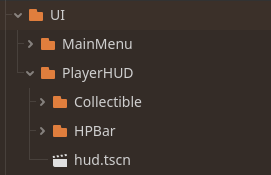

summary: UI
id: export
categories: UI, Canvas, Slider, Label, Alignment, Anchors, Container, Gradient, Progress Bar, Health, Collectibles, Tween
status: Published
authors: Ondřej Kyzr
Feedback Link: https://forms.gle/J8eeuQAJ3wMY1Wnq7

# Lab08 - UI

## Overview
Duration: hh:mm:ss

This lab will focus on learning about the UI in Godot. We will learn the basics by creating a **Player HUD**, which will show the health of the player and the amount of collectibles the player has. Then we will create a **main menu** for our game with a loading and saving system.

In a bullet point format, we will:
- Look at the **changes I made** in the project.
- Learn about **UI containers** and **UI nodes**
- Implement a **health bar** and a **collectible counter** for the player HUD 
- Learn how to create a **main menu** for a game and hook up buttons to functions
- Lastly, we will implement the logic behind **loading and saving** the game state

Here is the template for this lab. Please **download it**, there are scripts, models, and scenes needed for the UI implementation.
<button>
  [Template Project](https://cent.felk.cvut.cz/courses/39HRY/godot/08_UI/template.zip)
</button>


## Changes Made in the Project
Duration: hh:mm:ss

Since the last codelab, I have added and changed quite a few things in our game.

### Collectibles
I added a 3D model for the malware trace, which will be a collectible item working as currency in this game. I also made the complete scene and script for the collectible, and we will only fill out a small function in the player script.


To remember the amount of traces collected, I added a variable for this in the `player_stats.gd` script.


### `player_stats.gd` change
Since we will be adding the **main menu** and a **save and load system**, I decided to move the variable of the player `player_stats` to a new autoload script.

This script is called `GlobalState` and is located in the `Global` folder. It will be responsible for loading, saving, and holding the current state (or save) of the game. The script is added as autoload, so it can be used from everywhere.

> aside positive
> **Reminder:** `player_stats.gd` resource script holds the current stats of the player (health, jump, speed, damage, etc.), and the player script uses the values from it.

> aside positive
> **Reminder:** autoloaded scenes/scripts are created above the current scene as a child of the root and are accessible from anywhere just by their name.
>
> 
> - `@_DD3D_...` and `@DebugDraw...` are autoloads from the **Debug Draw 3D** plugin (lab05)
> - Both `Beehave...` autoloads are from the **Beehave** plugin (lab06)
> - `GlobalDebug` our helpful script for testing (lab05)
> - `GlobalState` holds the current state of the player and will save and load it


### UI textures
I drew sprites, which we will use in the UI for a **Health Bar**, **Collectible counter**, and a **logo** for the main menu.


## Health Bar HUD
Duration: hh:mm:ss

Let's start by creating a player HUD with a health bar.

### HUD setup
First, we need to somehow draw sprites, text, and buttons to the screen, regardless of whether we are in 2D or 3D. For these purposes, the `CanvasLayer` node exists.

1. **Create** a new scene of type `CanvasLayer` (`CTRL+N` ⇾ `Other node`)
2. **Rename** the root `CanvasLayer` to `HUD`
3. **Save the scene** into the folder `UI/PlayerHUD`
4. **Instantiate** the scene in the `debug_3d_scene.tscn` scene





### `TextureProgressBar`
A health indicator can be done in many different ways. You can use simple text (`Label` or `RichTextLabel` nodes) or make something more complex. We will create a health bar using a `TextureProgressBar` node.

1. **Add** a `TextureProgressBar` node as a child of the `HUD`
2. **Rename** it to `HPBar`
3. **Set** all the textures in the `Textures` category (`Under` → `hp_bar_under.png`, etc.)
4. **Set** the `Texture` ⇾ `Filter` property to `Nearest` (disabling linear interpolation of the textures)
5. **Set** the `Value` to `50` (so that the fill is visible)

If you zoom in, the bar should look like this:


We can see that the `Fill` is in the wrong place. **Change** the `Offset Progress` property to `(9, 6)`.


### HUD Script
Let's now create a script that will set the `Value` of the `TextureProgressBar` based on the amount of HP the player has.

1. **Create** a script called `hud.gd` in the folder `UI/PlayerHUD`
2. **Make** it `extend` the `CanvasLayer` class
3. **Attach** the script to the `HUD` node

#### Player Signal
Now, we need to be notified every time the player's HP changes. We can do that by **adding a signal** to the player script `player_controller_3d.gd`:
```GDScript
class_name PlayerController3D
extends CharacterBody3D

signal hp_change

...
```

Then **add** a call to emit the signal in the `receive_damage()` function **AFTER** the HP change:
```GDScript
func receive_damage(value : float, from : Node3D):
    ...
    hp_change.emit()
    ...
```

#### Connect the signal
Now, let's go back to the `hud.gd` script. **Create** a function for updating the HP in the HUD:
```GDScript
func _update_hp() -> void:
    pass
```

Then **add a reference** to the player in the HUD script and **connect it** to the `hp_change` signal of the player in the `_ready()` function:
```GDScript
@export var player : PlayerController3D

func _ready() -> void:
    player.hp_change.connect(_update_hp)
```

Don't forget to **SET** the reference node to the player in the `HUD` node in `debug_3d_scene.tscn`.


#### HP update function
Now, we need a reference to the `HPBar` to set the `Value`. Since we will be moving the node a lot in the subtree later on, we will use the **Access as Unique Name** option.

1. **Right-click** the `HPBar`
2. **Select** the `Access as Unique Name` option

The `HPBar` node should now have a  icon and can be referenced in code easily. **Add** this line to the top of the HUD script:
```GDScript
@onready var hp_bar : TextureProgressBar = %HPBar
```

The last thing to do is to set the actual `Value` in the `_update_hp()` function:
```GDScript
func _update_hp() -> void:
    hp_bar.value = GlobalState.player_stats.curr_health / GlobalState.player_stats.health
```

To make the setting of the `Value` correct and automatically adjust for different max HP, let's "normalize" the min and max of the range, so that it is from `0.0 - 1.0` (no HP - max HP).

In the `HPBar` node:
1. **Set** the `Max Value` to `1.0`
2. **Set** the `Step` to `0.01`
3. **Set** the `Value` to `0.5`

The `HPBar` is now functional, but there are still some things that need to be done to make it look nice.

> aside positive
> Referencing nodes with `Access as Unique Name` will no longer break the reference in scripts when changing the structure of the subtree.


### Anchors and Position
One of the most important settings for UI is the ability to anchor it. Anchors basically say how the **UI elements should behave** with respect to **the aspect ratio** of the screen.

#### How to change anchors
To change the anchors, you can either:
- Use the **context menu** on the top of the scene view with a node that inherits from `Control` (green color), selected.


- Or set it in the **Inspector** of the node, where it is called `Anchor Preset`:


#### Set the `HPBar`
I want the `HPBar` to sit on the bottom left of the screen and be oriented vertically. Let's set it up:

1. **Set** the `Size` to `(64 ,16)`
2. **Set** the `Anchor Preset` to `Bottom left`
3. **Set** the `rotation` to `-90.0`
4. **Set** the `scale` to `(6, 6)`

Here is the full viewport with the `HPBar`:


> aside positive
> The blue border in the image above is what the viewport sees.


### Gradient and Progress Tint
The last thing I want to do with the `HPBar` is to make the progress bar change color from **green to red** based on the amount of HP.

**Add** a new `@export` variable to `hud.gd`:
```GDScript
@export var hp_gradient : Gradient
```

**Add** a new `Gradient` and **set** it in the inspector like this:


Let's now change the `update_hp()` function to also update the `Tint Progress` property:
```GDScript
func _update_hp() -> void:
    var hp_ratio : float = GlobalState.player_stats.curr_health / GlobalState.player_stats.health
	
    hp_bar.value = hp_ratio
    hp_bar.tint_progress = hp_gradient.sample(hp_ratio)
```

> aside positive
> You can also change the `Tint Progress` in the inspector for a constant value.


### Bug Fix
The current implementation has one small bug. Until the player takes damage, the `HPBar` keeps displaying as half full. To fix this, simply **add** a call to the `_update_hp()` in the `_ready()` function of the `hud.gd` script.

```GDScript
func _ready() -> void:
    player.hp_change.connect(_update_hp)
    _update_hp()
```

Here is the final `HPBar` in action:


And here is the code:
```GDScript
extends CanvasLayer

@export var player : PlayerController3D
@export var hp_gradient : Gradient

@onready var hp_bar : TextureProgressBar = %HPBar

func _ready() -> void:
    player.hp_change.connect(_update_hp)
    _update_hp()

func _update_hp() -> void:
    var hp_ratio : float = GlobalState.player_stats.curr_health / GlobalState.player_stats.health
	
    hp_bar.value = hp_ratio
    hp_bar.tint_progress = hp_gradient.sample(hp_ratio)
```

> aside positive
> Health bars don't have to be only on the screen. **Diegetic health bars** are health bars that are present in the world in a realistic and believable way (not just spacial UI). For example, in my game I will use the **robots backpack** as a health indicator.
>
>   


## Collectible HUD
Duration: hh:mm:ss

In this section, we will add a collectible counter and put it all together with the `HPBar` we created in the last section.

### Collectible Texture and Label
I want the texture and label (text with a number) to be located one after another in a vertical list. To do this, we will use a `VBoxContainer`, which will automatically align the elements.

1. **Add** a `VBoxContainer` node as a child of the `HUD` (rename to `CollectibleVBox`)
2. **Add** a `TextureRect` node as a child of the `VBoxContainer`
3. **Add** a `Label` node as a child of the `VBoxContainer` (rename to `CollectibleCounter`)


#### `TextureRect` Settings
1. **Set** the `Texture` property to `UI/PlayerHUD/Collectible/collectible.png`
2. **Set** the `Custom Minimum Size` to `(112.0, 112.0)` (to make the sprite larger)
3. **Set** the `Texture` ⇾ `Filter` property to `Nearest`

This makes the `TextureRect` have a **texture**, **bigger**, and render as **pixel art**.

#### `Label` Settings
1. **Set** the `Text` to `0`
2. **Set** the `Label Settings` property to a `new LabelSettings`
    - Font size = `40`
    - Outline size = `20`
    - Outline color = `Black`
3. **Set** the `Horizontal` and `Vertical Alignment` to `Center`
4. **Set** the `Theme Overrides` ⇾ `Constants` ⇾ `Separation` to `-10`

This makes the `Label` **visible**, so that we easily set it, **formats the text** and makes it **closer** to the `TextureRect`


### Put the `HPBar` and `CollectibleCounter` Together
I would like to move the **collectible counter** to be on the right of the `HPBar`. We could set the anchor to `Bottom Left` and offset it manually. However, this is very error-prone and could hinder us in the future if we wanted to change some aspects of the UI.

#### The Horizontal Container
Similarly to when we wanted the collectible label and texture to be above each other, we will use a `HBoxContainer` (`H` since we want a horizontal list).

1. **Add** a `HBoxContainer` as a child of the `HUD`
2. **Set** the `Anchor Preset` to `Bottom Left`
3. **Set** the `CollectibleVBox` as a child of the `HBoxContainer`


Now, the problematic part comes in. If we were to set the `HPBar` as a child of the `HBoxContainer`, its scale and rotation would be reset. To circumvent this, we need to add a `Control` node and put the `HPBar` as a child of it.

#### Retain Transform
1. **Add** a `Control` node as a child of the `HUD`
2. **Reset** the `Anchor Preset` of the `HPBar` back to `Top Left` 
3. **Set** the `HPBar` node as a child of the `Control` node
4. **Set** the `Control` node as the **FIRST** child of the `HBoxContainer`

Now, the `HPBar` should keep its size. However, it still overlays the `CollectibleCounter`. Why?

#### Correct `Control` Size
The reason is that the `Control` node has a size of `0` on the `X-axis`. We cannot directly change this, as the `Anchor Preset`, `size`, `position`, etc., are all controlled by the `HBoxContainer`. However, we can use the `Custom Minimum Size` property.

1. **Set** the `Custom Minimum Size` of the `Control` node to `(96.0, 384.0)` (texture size * scale)
2. **Set** the `Pivot Offset` of the `HPBar` to `(32, 8)` (middle of the texture)
3. **Set** the `Anchor Preset` of the `HPBar` to `Center`

#### Alignment of `CollectibleVBox`
Ok, now it looks much better. One small tweak I would like to implement is that the `CollectibleCounter` should be positioned at the very bottom of the screen.

1. **Set** the `Alignment` property of `CollectibleVBox` node to `End`

The resulting `HUD` should look like this:


> aside negative
> I don't blame you if you find these UI settings a bit unintuitive. For me personally, it is always a bit of trial and error to get it right.

`HBoxContainer`
Control nodes for transform retention


### Updating the `CollectibleCounter`
Finally, after setting all the HUD elements, the final thing we need to do is to actually **update** the `Label` showing the amount of malware traces the player has.

#### Player Script
When the player touches the collectible, it calls a function in the player script called `func collectible_touched()`. Please **navigate** to the function and let's **fill it out**.

First, we would like to **update the count** in `player_stats`:
```GDScript
GlobalState.player_stats.collectible_count += 1
```

Then, let's **add a signal** to the top of the player script, so that other nodes can know when a collectible has been collected:
```GDScript
signal collectible_gathered
```

Lastly, we need to **emit the signal** when the collectible is touched. Here is the full function:
```GDScript
# Updates the count and emits a signal
func collectible_touched(collectible : Collectible) -> void:
    GlobalState.player_stats.collectible_count += 1
    collectible_gathered.emit()
```

#### HUD Script
Now, we need a **reference to the label**. Let's also use the `Access as Unique Name` option.
1. **Right-Click** the `CollectibleCounter` node.
2. **Select** the `Access as Unique Name` option
3. **Add** this line to the top of the `hud.gd` script
    - `@onready var collectible_counter : Label = %CollectibleCounter`

Next, in the `hud.gd` script, let's **add a function** for updating the label:
```GDScript
func _update_collectible_counter() -> void:
    collectible_counter.text = str(GlobalState.player_stats.collectible_count)
```

Lastly, we need to **connect** the function to the players signal in the `_ready()` function and **update it** right away:
```GDScript
func _ready() -> void:
    ...
    player.collectible_gathered.connect(_update_collectible_counter)
    _update_collectible_counter()
```

### Try it out
Let's try it out. **Instantiate** any number of the `collectible.tscn` scenes around the level or close to the player in the `debug_3d_scene.tscn` scene.

Play the game and:
- Walk around and **collect malware traces**.
- Watch the **HUD update** with the correct count.
- See how the malware trace **flies towards the HUD**


Here is the full code of the `hud.gd` script:
```GDScript
extends CanvasLayer

@export var player : PlayerController3D
@export var hp_gradient : Gradient

@onready var hp_bar : TextureProgressBar = %HPBar
@onready var collectible_counter : Label = %CollectibleCounter


func _ready() -> void:
    player.hp_change.connect(_update_hp)
    _update_hp()
	
    player.collectible_gathered.connect(_update_collectible_counter)
    _update_collectible_counter()

func _update_hp() -> void:
	var hp_ratio : float = GlobalState.player_stats.curr_health / GlobalState.player_stats.health
	
	hp_bar.value = hp_ratio
	hp_bar.tint_progress = hp_gradient.sample(hp_ratio)

func _update_collectible_counter() -> void:
	collectible_counter.text = str(GlobalState.player_stats.collectible_count)
```

> aside positive
> Making the malware fly towards the HUD was not covered here. You can look at the tween code in `collectible.gd` for more details.


## Bonus: Hide the `CollectibleCounter`
Duration: hh:mm:ss

As a bonus exercise, I would like to implement the `CollectibleCounter` to **move down below the screen** when the player doesn't pick up any traces for a while.

### Setup

#### Reference
First, we need to have a reference to the whole `CollectibleVBox`, which represents the whole counter.

1. **Right-click** the `CollectibleVBox` node and **select** the `Access as Unique Name` option
2. **Add** a reference to it by **CTRL + drag** to script or **copy** this line:
    - `@onready var collectible_v_box : VBoxContainer = %CollectibleVBox`
3. **Add** all of these `@export` parameters to the `hud.gd` script:
    - `@export var malware_move_px : float = 200`
    - `@export var malware_tween_time : float = 0.5`
    - `@export var malware_stay_up_time : float = 3`

#### Counter States
Now, we will **define all states** that the counter can be in and **add** a variable to track the current state:
```GDScript
enum MalwareStates
{
    DOWN = 0,
    GOING_UP = 1,
    UP = 2,
    GOING_DOWN = 3
}

var _malware_state : MalwareStates
```

> aside positive
> This will help us to react precisely to the current state that the counter can be in.

#### Start Position
The last thing we need is to remember the starting position of the counter. First, we will **declare a variable** for keeping track of the starting position, and then in the `_ready()` method we will **set it**. Lastly, we will **set the counter as hidden** by default.

However, before we set the variable, we need to **wait one frame**, so that the `CollectibleVBox` can finish its own `_ready()` function, where the **correct position** of the counter is set, based on the current resolution and aspect ratio.  

Here is the code for the setup, please **add it** to the `hud.gd` script:
```
var _counter_up_pos : Vector2
...
func _ready() -> void
    ...
    await get_tree().process_frame
	
    _counter_up_pos = collectible_v_box.global_position
	
    collectible_v_box.global_position = _counter_up_pos + Vector2.DOWN * malware_move_px
    _malware_state = MalwareStates.DOWN

    # Connect the collectible_gathered signal and update it
    player.collectible_gathered.connect(_update_collectible_counter)
    _update_collectible_counter()
```

> aside negative
> Be sure to put the signal connection and function call **after** the setup, so that the correct positions are used.

#### Moving Tween
For moving the counter, we will use a `Tween` and remember it globally in the script. We will do this so that we can cancel the animation depending on the current state. **Add** this line to the top of the script, we will use it later:
```GDScript
var _counter_tween : Tween
```

### Structure
Each call of the `_update_collectibles()` function should **move the counter up** (if not already) and after a while **move it back down** (if not already). Let's start with the first part.

#### Move the counter up
Here is the code with explanations:

```GDScript
# If the counter is going down or is down, move it up
if _malware_state == MalwareStates.DOWN or _malware_state == MalwareStates.GOING_DOWN:
    if _counter_tween != null: _counter_tween.kill()
        
    # Animate
    _counter_tween = create_tween()
    _counter_tween.tween_property(collectible_v_box, "global_position", _counter_up_pos , malware_tween_time)\
    .set_ease(Tween.EASE_IN)\
    .set_trans(Tween.TRANS_CUBIC)
        
    # State change wait
    _malware_state = MalwareStates.GOING_UP
    await _counter_tween.finished
    _malware_state = MalwareStates.UP
```
- We check if the counter should move up based on the current state.
- If the tween is running (`!= null`), we stop it
- We create the animation of moving up
- Change the state tracker
- Wait for the animation to stop and update the tracker again

#### Move the counter down
Here is the code with explanations:

```GDScript
# Wait to hide
await get_tree().create_timer(malware_stay_up_time).timeout

# If the counter is UP, move it down
if _malware_state == MalwareStates.UP:
    _counter_tween = create_tween()
    _counter_tween.tween_property(collectible_v_box, "global_position",\
        _counter_up_pos + Vector2.DOWN * malware_move_px, malware_tween_time)\
    .set_ease(Tween.EASE_IN)\
    .set_trans(Tween.TRANS_CUBIC)

    # State change wait
    _malware_state = MalwareStates.GOING_DOWN
    await _counter_tween.finished
    _malware_state = MalwareStates.DOWN
```
- We create a timer and wait for a set while
- If the counter is still up, we animate it moving down
- The state also needs to be updated accordingly

### One small problem
Currently, the animation of the counter seems to work correctly. However, let's say the counter is set to stay up for `3 seconds`, if a collectible is picked up and another one is picked up after `2.9 seconds`, the timer will still move down after `0.1 seconds` instead of waiting an additional `3` seconds. We will fix this be **remembering the number of collectibles**.

```GDScript
func _update_collectible_counter() -> void:
    var collectible_count : int = GlobalState.player_stats.collectible_count
    ...
```

Now, after waiting, we will check if the counter changed, which would mean that another collectible was picked up, and our current call should not be the one to move the counter down.

```
func _update_collectible_counter() -> void:
    ...
    # Wait to hide
    await get_tree().create_timer(malware_stay_up_time).timeout

    # A new collectible was gathered -> we should not move down, new collection will move it
    if collectible_count != GlobalState.player_stats.collectible_count: return

    # If the counter is UP, move it down
    if _malware_state == MalwareStates.UP:
        ...
```

The counter animation should work correctly now. Here is how it looks:


Here is the full `hud.gd` code with all the previous changes:
```GDScript
extends CanvasLayer

@export var player : PlayerController3D
@export var hp_gradient : Gradient

@export var malware_move_px : float = 200
@export var malware_tween_time : float = 0.5
@export var malware_stay_up_time : float = 3

enum MalwareStates
{
    DOWN = 0,
    GOING_UP = 1,
    UP = 2,
    GOING_DOWN = 3
}

@onready var hp_bar : TextureProgressBar = %HPBar
@onready var collectible_counter : Label = %CollectibleCounter
@onready var collectible_v_box : VBoxContainer = %CollectibleVBox

var _malware_state : MalwareStates
var _counter_tween : Tween
var _counter_up_pos : Vector2

func _ready() -> void:
    player.hp_change.connect(_update_hp)
    _update_hp()
	
    # Remember the starting position of the collectible counter
    await get_tree().process_frame
	
    _counter_up_pos = collectible_v_box.global_position
	
    collectible_v_box.global_position = _counter_up_pos + Vector2.DOWN * malware_move_px
    _malware_state = MalwareStates.DOWN
	
    # Connect the collectible_gathered signal and update it
    player.collectible_gathered.connect(_update_collectible_counter)
    _update_collectible_counter()

func _update_hp() -> void:
    var hp_ratio : float = GlobalState.player_stats.curr_health / GlobalState.player_stats.health
	
    hp_bar.value = hp_ratio
    hp_bar.tint_progress = hp_gradient.sample(hp_ratio)

func _update_collectible_counter() -> void:
    var collectible_count : int = GlobalState.player_stats.collectible_count
    collectible_counter.text = str(GlobalState.player_stats.collectible_count)
	
    # If the counter is going down or is down, move it up
    if _malware_state == MalwareStates.DOWN or _malware_state == MalwareStates.GOING_DOWN:
        if _counter_tween != null: _counter_tween.kill()

        # Animate
        _counter_tween = create_tween()
        _counter_tween.tween_property(collectible_v_box, "global_position", _counter_up_pos , malware_tween_time)\
        .set_ease(Tween.EASE_IN)\
        .set_trans(Tween.TRANS_CUBIC)

        # State change wait
        _malware_state = MalwareStates.GOING_UP
        await _counter_tween.finished
        _malware_state = MalwareStates.UP
	
    # Wait to hide
    await get_tree().create_timer(malware_stay_up_time).timeout
	
    # A new collectible was gathered -> we should not move down, new collection will move it
    if collectible_count != GlobalState.player_stats.collectible_count: return
	
    # If the counter is UP, move it down
    if _malware_state == MalwareStates.UP:
        _counter_tween = create_tween()
        _counter_tween.tween_property(collectible_v_box, "global_position",\
            _counter_up_pos + Vector2.DOWN * malware_move_px, malware_tween_time)\
        .set_ease(Tween.EASE_IN)\
        .set_trans(Tween.TRANS_CUBIC)

        # State change wait
        _malware_state = MalwareStates.GOING_DOWN
        await _counter_tween.finished
        _malware_state = MalwareStates.DOWN
```


## Main Menu UI
Duration: hh:mm:ss

This section will focus on creating a working **Main Menu** using the UI system for our game. It will feature a basic background, game name, a few buttons, and images.

Please **open** the `UI/MainMenu/main_menu.tscn` scene.

### What is already present?
I have already created a basic UI scene (`Control` node as the root) with a background created from a randomized tilemap, which I have previously used for the **2D puzzle sections**. 

I also made a basic empty script with the headers of functions, which will be called by all the different main menu buttons.

> aside positive
> For more information on how to do this, you can check out the **Lab03 - 2D Platformer** lab, which goes in depth on `TileMaps`.


### Buttons - UI
Let's start by creating a **game name** and the **three buttons**. To keep all these nodes aligned properly, we will use a `VBoxContainer` for this whole middle section.

1. **Add** a new `VBoxContainer` node as a child of the `MainMenu` node
2. **Set** the `Anchor Preset` to `Center`

#### Anchor Problem
You might notice that even though we set the `Anchor Preset` of the `VBoxContainer` to `Center`, it is **not in the center of the screen**. The `Anchor Preset` option sets the position of the `Control` node (all 2D UI nodes) in relation to its parent `Control` node.

If we look at the `Control` parent node → `MainMenu`, we can see that its size is `(0, 0)`, and it is aligned to the `Top Left`. We want the `MainMenu` to encompass the whole screen, and we can do it easily, without setting exact values of the screen.

- **Set** the `Anchor Preset` of the `MainMenu` to `Full Rect`.

Now, the outline of the `MainMenu` fills the whole screen, and the `VBoxContainer` is in the middle of the screen.


#### Button Nodes
Let's now add the buttons.

1. **Add** a `Button` node as a child of the `VBoxContainer`
2. **Set** the text to `Start New Game`
3. **Repeat** 2 more times with `Continue Game` and `Exit Game`

Furthermore, you can style the buttons as you like using the `Theme Overrides` or by making a whole `Theme` **resource**, which is useful when creating a UI-heavy game. `Themes` allow you to define the **style of all UI elements** with a complex yet easy-to-use interactive editor.


An example `Theme` I created for the menu buttons can be seen in the **completed template project**.


### Game Name
We will now add the game name to the top of the screen. We will use a `Label` node to add the text.

1. **Add** a `Label` node as the **FIRST** child of the `VBoxContainer`
2. **Set** the text to `GORODITH`
3. **Set** the `Label Settings` to `New LabelSettings` and style the text (size, color, outline)

In my case, the buttons stretched to the width of the `Label`. If you do not want this to be the case, you can set the `Horizontal Alignment` in the **Context Menu**:


#### Game Name Spacing
Moreover, I would like the `Label` to be a **bit higher above the buttons**. We can achieve this in multiple ways, but the simplest is to set the `Layout/Custom Minimum Size` to `(0, 400.0)` or higher and keep the text vertically aligned to `Top`.

The main menu should now look like this:


### Side Images
The final visual step we will do is to add images of the main character on both sides of the main menu.

1. **Add** a `TextureRect` node as the child of the `MainMenu`
2. **Rename** it to `LogoRight`
3. **Set** the `Texture` property to `UI/MainMenu/MainMenuLogo.png`
4. **Set** the `Stretch Mode` property to `Keep Aspect Centered`
5. **Multiply** the `Layout/Transform/Size` by `4` (should be `(404, 288)`)
6. **Set** the `Anchor Preset` to `Centered Right`
7. **Set** the `Layout/Custom Minimum Size` to `(500, 0)` to offset the image from the border
8. **Set** the `CanvasItem/Texture/Filter` to `Nearest` to make the image pixel-perfect

Now let's do the other side:
1. **Duplicate** the `LogoRight` node and rename it to `LogoLeft`
2. **Switch** the `Flip H` property to `On`
3. **Set** the `Anchor Preset` to `Centered Left`

The final look of the main menu should look like this:


## Main Menu Logic
Duration: hh:mm:ss

The visual side of the main menu is complete. Let's now make it functional.

### Button Signals
The First step is to connect the `pressed()` signals of the buttons to the prepared functions in `main_menu.gd`. We will start with the **first button**.

1. **Select** the `Button` node
2. **Go** to the `Signals` tab
3. **Follow** the steps in the following image: 
4. **Repeat** the process for the **other two buttons** (`_continue_game()`, `_exit_game()`)


### Start New Game Button
Let's start with the first button. To switch a scene, we can easily call `get_tree().change_scene_to_packed(...)` with the `@export` variable I prepared beforehand.

1. **Set** the `New Game Scene` variable of the `MainMenu` to the `debug_3d_scene.tscn` scene.
2. **Open** the `main_menu.gd` script and **fill** the `_start_new_game()` function:

```GDScript
func _start_new_game() -> void:
    get_tree().change_scene_to_packed(new_game_scene)
```

### Continue Game Button
The functionality of this button will be a bit more complex on the `GlobalState` side. The function will be very straightforward:

```GDScript
func _continue_game() -> void:
    GlobalState.load_game()
    get_tree().change_scene_to_packed(new_game_scene)
```

> aside positive
> We do not need to reset the `PlayerStats` in `GlobalState` when starting a new game, since without loading a savefile, the `PlayerStats` will be created in the `_ready()` function in `GlobalState` with the default values.


#### `load_game()` and `save_game()` functions
We will use the `PlayerStats` as the save file of the game. This class is a resource, and all resources can be easily loaded and saved with the `ResourceLoader` and `ResourceSaver` classes.

**Open** the `global_state.gd` script and **fill the functions** as such:
```GDScript
func load_game() -> void:
    if ResourceLoader.exists(SAVE_PATH):
        player_stats = ResourceLoader.load(SAVE_PATH)

func save_game() -> int:
    return ResourceSaver.save(player_stats, SAVE_PATH)
```

> aside positive
> There are many ways we can save and load the game. If your game needs to save extra info, like nodes in a scene with their properties, you can use [this tutorial](https://docs.godotengine.org/en/stable/tutorials/io/saving_games.html) from the documentation of Godot. 

### Exit Game Button
The last button to make functional is the **exit game button**. This will also be very straightforward:

```GDScript
func _exit_game() -> void:
    get_tree().quit()
```

### The Result
I added a **quick save button** (`F5`) to the `GlobalDebug` before the codelab, so that you can try out the **loading and saving** system. Currently, the only way you can notice a difference is in the **number of collectibles** that the player has.

Here is a video showing just that:
<video id=BpZtfy93EBw></video>


## Recap
Duration: hh:mm:ss

### Feedback
I would be very grateful if you could take a moment to fill out a **very short feedback form** (it takes less than a minute). Your feedback will prove very useful for my diploma thesis, where I will use it to evaluate the work I have done.
<button>
  [Google Forms](https://forms.gle/xcsTDRJH2sjiuCjP7)
</button>

> aside positive
> This whole course and the game we are making are a part of my diploma thesis.

### Recap
Let's look at what we did in this lab.
- We looked at the **changes I made** in the project, such as:
    - Added a **3D model** for the Collectible
    - Added **textures** for the UI
- Then, we implemented the **Health Bar** on the player HUD using a `TextureProgressBar`
- Next, we looked at `Anchors Preset` and **positioning** of UI nodes
- We implemented a **collectible counter** and made it work with the health bar
- In the bonus chapter, we made the **collectible counter** animated - move offscreen after a while 
- After that, we created the visual side of the **main menu** for our game with:
    - `Start New Game`, `Continue Game`, and `Exit Game` buttons
    - Game name using a `Label`
    - Side images of the main character
- Lastly, we implemented the **logic** behind:
    - The main menu buttons
    - Saving and Loading game


### More on UI
For a more extensive tutorial that shows how to create an interactive multi-level menu, I recommend this video:
<video id=KOyREJu1P3I></video>

### Project Download
If you want to see what the finished template looks like after this lab, you can download it here:
<button>
  [Template Done Project](https://cent.felk.cvut.cz/courses/39HRY/godot/08_UI/template-done.zip)
</button>
