summary: UI
id: export
categories: Audio, Audio Manager, Audio Bus, Audio Stream, Audio Listener, Tween
status: Published
authors: Ondřej Kyzr
Feedback Link: https://forms.gle/J8eeuQAJ3wMY1Wnq7

# Lab09 - Audio

## Overview
Duration: hh:mm:ss

This lab will focus on learning about **audio** in Godot. We will have a brief overview of how Godot deals with audio, play audio using a simple player and an `AudioManager`, play music, and look at how footstep sounds can be implemented. 

In a bullet point format, we will:
- Look at the **audio folder** I added to the project.
- Learn about **audio buses** and **audio nodes**.
- **Play a simple** audio using the `AudioStreamPlayer3D` node.
- Look at the `AudioManager` I prepared and **implement** `play_sfx...` methods.
- Use the `play_sfx...` methods to **play the player SFX**.
- Learn about 2 methods of how **footstep sounds** can be played.
- Lastly, we will make the **enemies play SFX**.

Here is the template for this lab. Please download it, there are scripts, audio clips, and scenes needed for the implementation of the audio playing.
<button>
  [Template Project](https://cent.felk.cvut.cz/courses/39HRY/godot/09_Audio/template.zip)
</button>


## Audio Basics
Duration: hh:mm:ss

Let's first go through the basics of **playing audio** in Godot and look at the new folder with files I added.

### Audio Folder
I added a yellow-colored folder `Audio` with all the necessary stuff needed for this codelab. 

- `Ambient` folder - Hosts ambient sounds that will be played in certain areas
- `Music` folder - Hosts the music tracks that will be used in the game
- `SFX` folder - Hosts all the sound effects for the player and enemies
- `audio_manager.tscn` and `audio_manager.gd` - Autoloaded manager, that I made to make playing sounds and music easier, which we will complete in this codelab
- `sfx_settings.gd` - Resource to modify SFX settings which keeps track of the number of actively playing SFX


### Audio Bus
Every audio, that is played in Godot must be played on a **Audio Bus**. The most common use-case for having multiple buses is to play each audio type (music, SFX, ambient, voices...) on a separate audio bus. This allows you to set the volume, solo/mono, etc. for each audio type, as it is done in almost all games.

#### Definition
*An audio bus (also called an audio channel) can be considered a place that audio is channeled through on the way to playback through a device's speakers. Audio data can be modified and re-routed by an audio bus.* - [Godot Documentation](https://docs.godotengine.org/en/latest/tutorials/audio/audio_buses.html)

#### Godot Bus Layout
In Godot, you can find the Audio Bus settings at the bottom of the editor next to the `Debugger` tab. This is how it looks in our template:

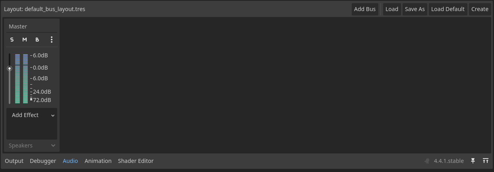

There is a single "Master" audio bus present through which all audio is played by default. You can set many things for each bus such as the **volume**, **audio effects**, or **route bus** though another one (dropdown at the bottom).

#### Our Setup
We will create a very standard audio bus setup. Please **recreate the audio buses** as seen in the following picture:

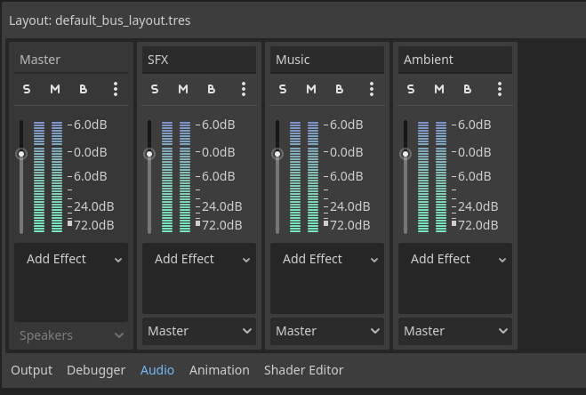

> aside negative
> Make sure to **name the buses the same** as I did, since I already connected audio sliders to these bus names, more on that later on.

> aside positive
> **Bus routing** can be used to composite different buses, in our case we will just route all the buses to the `Master Bus`. This way, the `Master Bus` will control the volume of all the other buses. 


### Audio Nodes
To play and listen to audio Godot provides several audio nodes. Here is a brief overview:
-  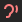 `AudioListener2D/3D` - Usually not used since the current camera works as a listener by default, **overrides the location** sounds are heard from in 2D/3D, 
-  `AudioStreamPlayer` - **Plays the audio** equally loud in both speakers
-   `AudioStreamPlayer2D/3D` - **Plays the audio** in 2D/3D space, that is **attenuated with distance and angle** to the listener, e.g. audio played 10 meters to the left of listener is quieter and heard more from the left speaker


### Debug Audio Sliders
For our convenience, I also created debug audio sliders for each audio bus and placed them on the player HUD, so that we can easily adjust the audio levels during this codelab.

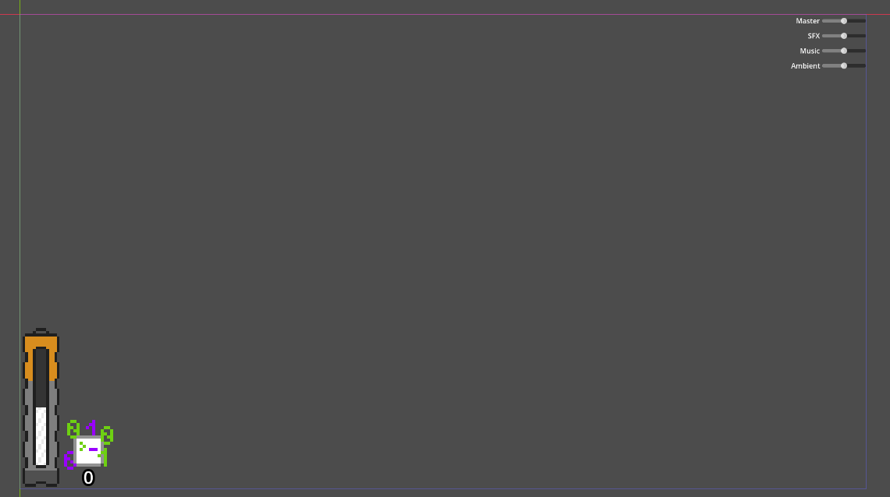


## Play Simple Audio
Duration: hh:mm:ss

Let's first create a simple audio player without the use of the `AudioManager`. We will use it for playing an ambient computer noises near the 2D puzzle section.

### `AudioStreamPlayer3D` Setup
**Open** the `2DPuzzles/puzzle.tscn` scene, which hosts the 3D scene setup of the puzzle.

1. **Add** a `AudioStreamPlayer3D` node as a child of the `PuzzleSection`
2. **Set** the `Stream` property to `beep_boop_ambient.wav`
3. **Set** the `Autoplay` property to `On`, which makes the sound automatically play on starting the game
4. **Set** the `Bus` to `Ambient`

#### Distance Attenuation
The attenuation of sound over distances is an important effect, that makes sounds believable. To set how the sound is attenuated with distance Godot offers these parameters:
- `Attenuation Mode` - changes the way the audio gets quieter with distance (linear, quadratic, logarithmic)
- `Unit Size` - factor of the attenuation, higher values make the sound hearable over larger distances
- `Max Distance` - works in tandem with `Attenuation Mode`, sets the maximum distance the sound can be heard from and linearly makes the sound quieter

I only changed the `Max Distance` to `30m` but feel free to change the parameters and see how they change the sound. Here is the full setup:

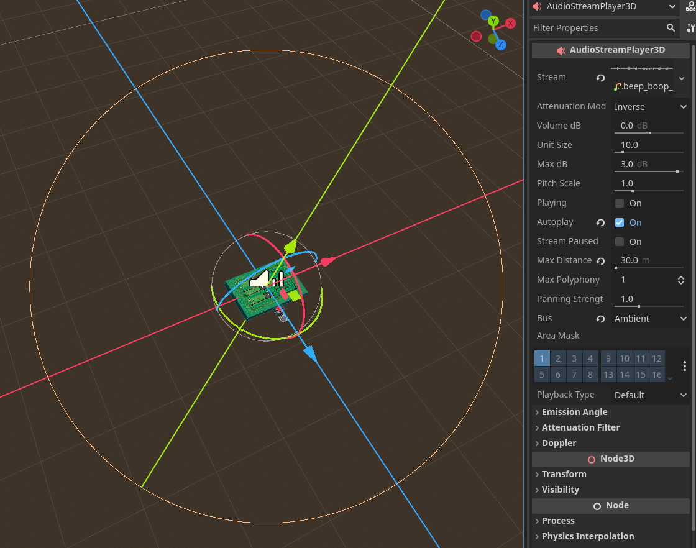


### Sound Import Loop
The last thing we need to change is to make the sound loop.

1. **Select** the `beep_boop_ambient.wav` sound file in the **FileSystem**
2. **Switch** to the `Import` tab in the **Scene Hierarchy**
3. **Set** the `Loop Mode` to `Forward`
4. **Press** the `Reimport` button

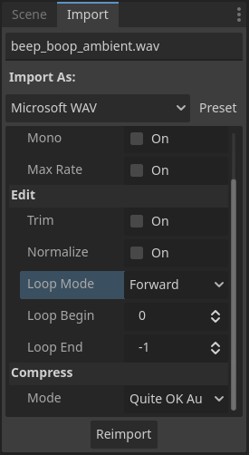

> aside positive
> There are many more parameters, that can be set, for example the Doppler Effect. That I won't go over, since most of them are very straightforward and can be looked up in the documentation.


## Complex Audio using an `AudioManager`
Duration: hh:mm:ss

Simply playing audio with audio players, like we did in the last section, is a good practice for playing looping sounds (ambience) without any complex logic. Playing SFX like the player walking, enemy shooting, or music can be done in the same way but making an `AudioManager` with helpful methods is the recommended approach.

### Overview of `AudioManager`
Let's now look at the `AudioManager` I prepared.

#### SFX settings and SFX bank
The first thing the `AudioManager` hosts, is an `enum` for all the different SFX, that can be played. These `enums` are used as keys in the `sfx_bank`, which has the settings for each SFX.

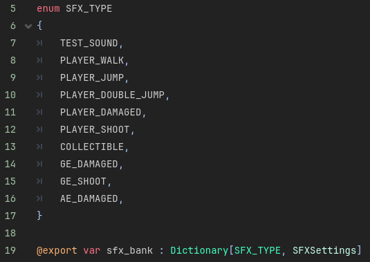

#### Methods
There several implemented and ready-to-implement methods.

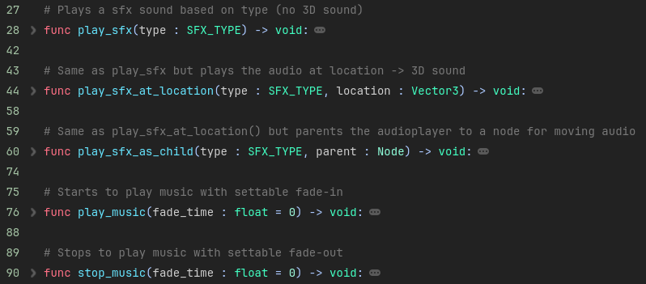

- `play_sfx()` - plays a SFX sound without distance attenuation (`AudioStreamPlayer`)
- `play_sfx_at_location()` - plays an attenuated SFX sound at given location (`AudioStreamPlayer3D`)
- `play_sfx_as_child()` - plays an attenuated SFX sound as a child of a given node (`AudioStreamPlayer3D`)
- `play_music()` - starts playing music with given fade-in
- `stop_music()` - stops playing music with given fade-in


### Play Music
Let's now complete the implementation of the music player, so that we can test it out. Since there will only ever be one type of music playing in our game, we will use a single `AudioStreamPlayer` as a child of the `AudioManager`, that will be reused.

1. **Add** a `AudioStreamPlayer` node as a child of the `AudioManager`
2. **Rename** the node to `MusicStreamPlayer`
3. **Set** the `Stream` property to `music_better.wav`
4. **Set** the `Volume` property to `-80.0 dB`
5. **Set** the `Bus` property to `Music`

Now, try to **run the game** and **press** `F4`. The music should slowly fade-in and with another press of `F4` it should slowly fade-out. 


### SFX Settings
We will quickly look over the `SFXSettings` so that we can then work with the parameters of each SFX.

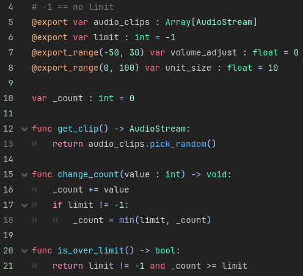
- `audio_clips` - All the clips that correspond to the SFX (useful for variants of often repeating sounds)
- `limit` - The maximum number of instances of the SFX that can be playing at once.
- `volume_adjust` - Volume of the SFX for quick changes without needing to change the sound file
- `unit_size` - Same as the `AudioStreamPlayer3D` parameter
- `func get_clip()` - Returns a random audio clip from the list
- `func change_count()` - Changes the counter of each SFX, should be called when SFX starts and stops playing
- `func is_over_limit()` - Simple check if there aren't too many instances of the SFX playing

### Fill the `sfx_bank`
The setup is now almost complete, we need to only fill out the `sfx_bank` with the `SFXSettings`. **Open** the `audio_manager.tscn` scene, **select** the `AudioManager` node, and **click** the `Dictionary[int, SFXSettings]` in the **Inspector**.

1. **Set** the `New Key` to `Player Walk`
2. **Set** the `New Value` to a `New SFXSettings`
3. **Fill** the `Audio Clips` with `player_walk1.wav` though `player_walk5.wav`
4. **Set** the `Limit` to `1` (avoids audio spamming)
5. **Set** the `Volume Adjust` to `-6.5`
6. **Press** the `+ Add Key/Value Pair`

Here is how it should look like:

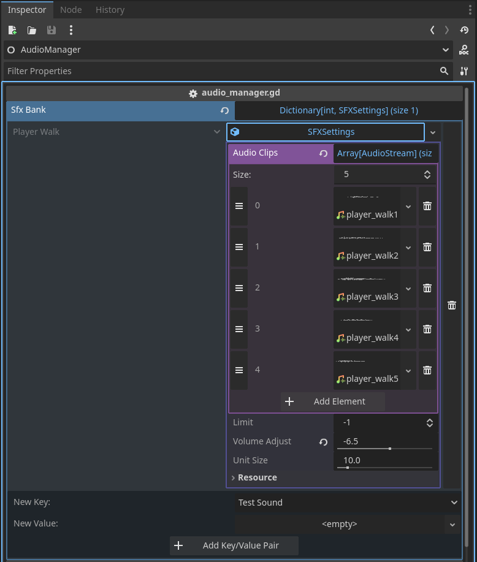

Now add **all the other sound effects** in the same way. Keep the `Limit` and `Volume Adjust` to the default values. The final `sfx_bank` should look like this:

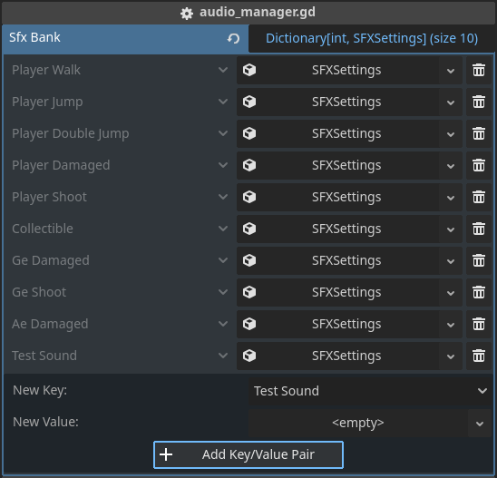


### Task: Filling out the Play SFX methods
Let's now fill out the missing parts of the `play_sfx...` methods, so that we can use them in the next section to play actual sounds.

Try to **fill them out yourself**, here are a few notes:
- Use the `sfx_settings` variable for `stream`(use the `get_clip()` method), `volume`, and `unit_size`
- To add a parameter to a function call in the finished signal call, use the `bind()` function
- All three function will be very similar. They only will differ by a few lines.

> aside positive
> Some of you might say, that creating an `AudioStreamPlayer` node for each played SFX and destroying it after the sound stop is wasteful. I agree with you and in a different game that plays a lot of SFXs a better approach such as `AudioStreamPlayer` pooling should be used. However, the performance impact should not be noticeable if you keep the number of played SFX under 100 per second (rough estimate).


## Solution: `play_sfx()` methods
Duration: hh:mm:ss

```GDScript
# Plays a sfx sound based on type (no 3D sound)
func play_sfx(type : SFX_TYPE) -> void:
    # Check and get the settings
    if not sfx_bank.has(type): return
    var sfx_settings : SFXSettings = sfx_bank[type]

    # Handle sfx limit
    if sfx_settings.is_over_limit(): return
    sfx_settings.change_count(1)

    # Create AudioStreamPlayer
    var audio_player : AudioStreamPlayer = AudioStreamPlayer.new()
    add_child(audio_player)

    # Set params of AudioStreamPlayer
    audio_player.bus = SFX_BUS
    audio_player.stream = sfx_settings.get_clip()
    audio_player.volume_db = sfx_settings.volume_adjust
    audio_player.finished.connect(audio_player.queue_free)
    audio_player.finished.connect(sfx_settings.change_count.bind(-1))

    audio_player.play()

# Same as play_sfx but plays the audio at location -> 3D sound
func play_sfx_at_location(type : SFX_TYPE, location : Vector3) -> void:
    # Check and get the settings
    if not sfx_bank.has(type): return
    var sfx_settings : SFXSettings = sfx_bank[type]

    # Handle sfx limit
    if sfx_settings.is_over_limit(): return
    sfx_settings.change_count(1)

    # Create AudioStreamPlayer
    var audio_player : AudioStreamPlayer3D = AudioStreamPlayer3D.new()
    add_child(audio_player)

    # Set params of AudioStreamPlayer (+ location)
    audio_player.bus = SFX_BUS
    audio_player.position = location
    audio_player.stream = sfx_settings.get_clip()
    audio_player.volume_db = sfx_settings.volume_adjust
    audio_player.unit_size = sfx_settings.unit_size
    audio_player.finished.connect(audio_player.queue_free)
    audio_player.finished.connect(sfx_settings.change_count.bind(-1))

    audio_player.play()

# Same as play_sfx_at_location() but parents the audioplayer to a node for moving audio
func play_sfx_as_child(type : SFX_TYPE, parent : Node) -> void:
    # Check and get the settings
    if not sfx_bank.has(type): return
    var sfx_settings : SFXSettings = sfx_bank[type]

    # Handle sfx limit
    if sfx_settings.is_over_limit(): return
    sfx_settings.change_count(1)

    # Create AudioStreamPlayer (+ parent)
    var audio_player : AudioStreamPlayer3D = AudioStreamPlayer3D.new()
    parent.add_child(audio_player)

    # Set params of AudioStreamPlayer
    audio_player.bus = SFX_BUS
    audio_player.stream = sfx_settings.get_clip()
    audio_player.volume_db = sfx_settings.volume_adjust
    audio_player.unit_size = sfx_settings.unit_size
    audio_player.finished.connect(audio_player.queue_free)
    audio_player.finished.connect(sfx_settings.change_count.bind(-1))

    audio_player.play()
```


## Make the Game Play SFX
Duration: hh:mm:ss

Now the setup of the `AudioManager` is complete, and we can use it to play actual SFX sounds in the game.

### Player Jumping

#### Jump
Let's start easy with the player jump. **Open** the `player_controller_3d.gd` script, navigate to the `jump()` function and add this line to the end:

```GDScript
func _jump() -> void:
    ...
    AudioManager.play_sfx_as_child(AudioManager.SFX_TYPE.PLAYER_JUMP, self)
```

#### Double Jump
The double jump will work in the same way. Navigate to the `double_jump()` function and add this line at the end:

```GDScript
func _double_jump() -> void:
    AudioManager.play_sfx_as_child(AudioManager.SFX_TYPE.PLAYER_DOUBLE_JUMP, self)
```

Try out, if the sounds work by **playing the game** and **jumping**.

### Player Damaged
This sound will be very similar to the last one. Just **place the line** in the correct spot just before the HP change line.

```GDScript
func receive_damage(value : float, from : Node3D):
    ...

	AudioManager.play_sfx_as_child(AudioManager.SFX_TYPE.PLAYER_DAMAGED, self)
	GlobalState.player_stats.curr_health -= value
    ...
```

### Player Shooting
Same as the last few headers, we will just add this line to the end of the `_shoot()` function:

```GDScript
func _shoot() -> void:
    ...
    AudioManager.play_sfx_at_location(AudioManager.SFX_TYPE.PLAYER_SHOOT, shoot_point.global_position)
```

### Player Walk
The walking of the player is a bit more tricky. There are several ways to do it.

#### Using Animations
One way that you can do this is to **reimport** the animations with `Custom Tracks` enabled. Then **adding** a `Call Method` tracks with **calls to play the SFX** at the exact moment the feet touch the ground.

However, since we are using a `BlendTree2D` for the walking animation all 4 calls from the 4 animations that are blended are called. Ideally, we would only want the `Call Method` track of the animation with the biggest weight to be called, but even with this approach walking diagonally would not sound right.

#### Using Physics
The other way, which we will implement, is to **place colliders at the bottom of the feet** of the player and play SFX upon collision with the ground.

1. **Open** the `player_3d.tscn` scene
2. **Add** a `BoneAttachment3D` as the child of the `Skeleton3D`
3. **Set** the `Bone Name` property to `RightFoot_end`
4. **Add** an `Area3D` node as a child of the `BoneAttachment3D`
5. **Add** an `CollisionShape3D` node as a child of the `Area3D`
6. **Set** the `Shape` property to a `New BoxShape3D` with the size of `(0.001, 0.002, 0.001)`
7. **Connect** the `body_entered()` signal of the `Area3D` to a new function in the `player_controller_3d.gd` script
8. **Put** this line into the function:
    ```GDScript
    AudioManager.play_sfx_as_child(AudioManager.SFX_TYPE.PLAYER_WALK, self)
    ```

Now, please **repeat the process** for the other foot. This is how the final setup should look like now:

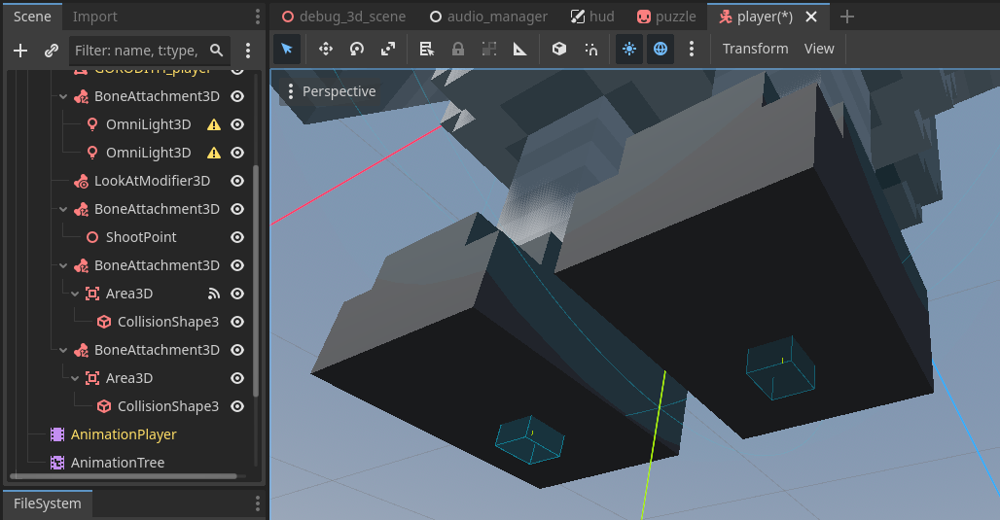


This way of playing footsteps sounds is more realistic, but it can still have some issues, such as:
- Producing more sounds than should be played in certain situations.
- Might not be possible to do depending on the walking animation.

> aside negative
> Normally, we would have to set the correct `Collision Mask` and `Layer`, but in our case the default is correct.


### Collectible Gather
Let's now return to a simpler audio playing and fill out the rest of the sounds. **Navigate** to the `collectible_touched()` function a put this line there:

```GDScript
func collectible_touched(collectible : Collectible) -> void:
    ...
    AudioManager.play_sfx_at_location(AudioManager.SFX_TYPE.COLLECTIBLE, collectible.position)
```

Here, we want to use the `play_sfx_at_location` with the location of the collectible and not set it as the child of the collectible since it will be destroyed before the sound will finish playing.

### The `GroundEnemy` Sounds
In codelab 5 and 6 we created 2 versions of the `GroundEnemy`, **FSM** and **Beehave**, but we will only implement the **Beehave** variant, since that version is present in the debug scene and the implementations will not differ.

#### Shooting
Let's add a sound, which will play when the enemy shoots a projectile.
1. **Open** the `bh_shoot.gd` script
2. **Place** this line **before** the `return SUCCESS`

    ```GDScript
    AudioManager.play_sfx_at_location(AudioManager.SFX_TYPE.GE_SHOOT, enemy.global_position)
    ```

#### Damaged
Now, we will add a sound that will play upon receiving damage.
1. **Open** the `ground_enemy_bh.gd`
2. **Place** this line as the **first line** of the `damage()` function
    ```GDScript
    AudioManager.play_sfx_at_location(AudioManager.SFX_TYPE.GE_DAMAGED, global_position)
    ```

> aside positive
> In both of these SFX we use the `play_sfx_at_location()` instead of the `play_sfx_as_child()` because the enemy could die while playing the sound, which would cut the sound short.


### The `AirEnemy` Sounds
Similar to the last audio, we will add a sound to play upon the **enemy taking damage**.
1. **Open** the `air_enemy.gd`
2. **Place** this line as the **first line** of the `damage()` function
    ```GDScript
    AudioManager.play_sfx_at_location(AudioManager.SFX_TYPE.AE_DAMAGED, global_position)
    ```

### Result
Now that all the sounds that I prepared are being played let's see how the result looks like. Play the game or watch the following video:

<video id=kI2c7S7K4Zw></video>

As you can see, the sound effects change how the game feels and plays. Having an audio feedback to shooting and dealing damage makes the game feel much **more reactive** to the players actions. Try to watch the video **with** and **without** sound to see the difference.


## Recap
Duration: hh:mm:ss

### Feedback
I would be very grateful if you could take a moment to fill out a **very short feedback form** (it takes less than a minute). Your feedback will prove very useful for my diploma thesis, where I will use it to evaluate the work I have done.
<button>
  [Google Forms](https://forms.gle/xcsTDRJH2sjiuCjP7)
</button>

> aside positive
> This whole course and the game we are making are a part of my diploma thesis.

### Recap
Let's look at what we did in this lab.
- First, we looked at the `Audio` folder that I added
- Next, we learned what **audio buses** are how they are used in Godot
- We created the **audio bus** setup that we needed
- Then, we learned about all the **Audio nodes** that Godot has.
- After the intro, we made simple **3D spacial audio** play and **reimported audio to loop**.
- Next, we looked at the `AudioManager`, `SFXSettings`, and how to **play music**.
- Then, we implemented the `play_sfx_...` **methods**.
- With that complete, we used these methods to **play SFX of the player and enemies**.
- Lastly, we learned how to play **footstep sounds realistically**.

### Note on Audacity
If you are wondering, where I found the SFX used in this codelab, I made them myself. I used the free program `Audacity`, where I recorded noises that I made with stuff on my desk and my mouth. Then I edited these audio clips to sound more robotic. The whole process is very easy, and I recommend looking into it if you are interested.

<video id=MjusZESiLiw></video>

### Note on sfxr.me 
Alternatively if it matches the theme of your game, you can use [jsfxr](https://sfxr.me) or [bfxr](https://www.bfxr.net) websites to create sound effects. These sites let you easily create 8-bit SFX.

### Note on Freesound.org
The last alternative, and the place where I found the **ambient** and **music** tracks, is [Freesound](https://freesound.org). Here you can download free sounds and music to use in your projects. However, be careful to **check the license of the sound/music** that you are downloading. Some tracks are limited for personal use, some for noncommercial use, and some are even free to distribute.

### Project Download
If you want to see what the finished template looks like after this lab, you can download it here:
<button>
  [Template Done Project](https://cent.felk.cvut.cz/courses/39HRY/godot/09_Audio/template-done.zip)
</button>
