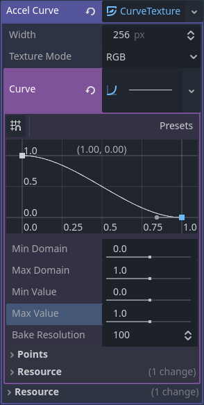
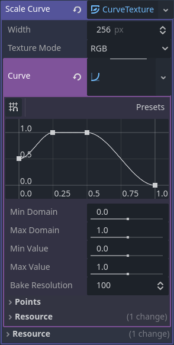
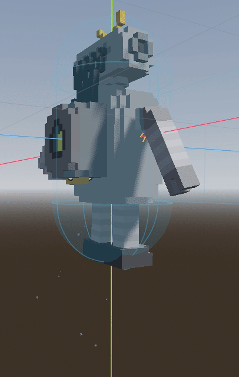
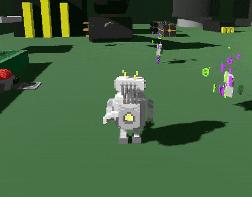
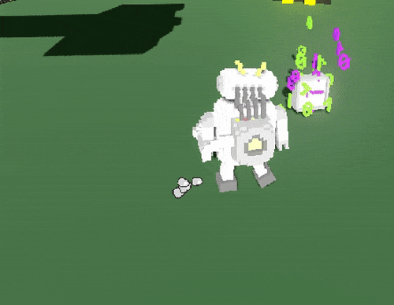
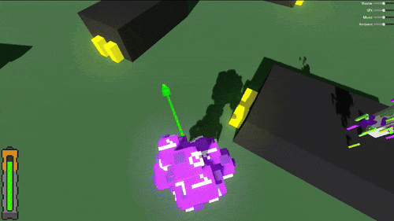
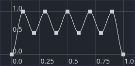
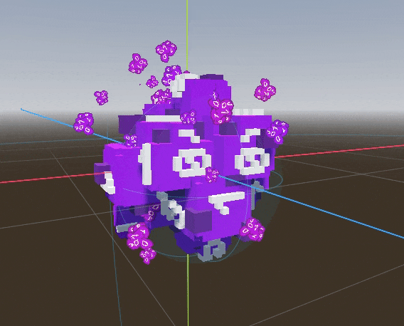
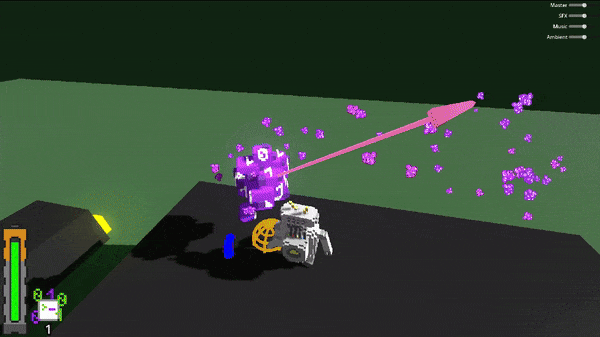

summary: VFX
id: export
categories: VFX, Shader, Visual Shader, GLSL, Fullscreen Effect, Hologram, Noise, Particles, Tween
status: Published
authors: Ondřej Kyzr
Feedback Link: https://forms.gle/J8eeuQAJ3wMY1Wnq7

# Lab10 - VFX (Visual Effects)

## Overview
Duration: hh:mm:ss

This lab will focus on learning about **visual effects (VFX)**. We will start with creating a **grayscale screen overlay** using code. Then move on to making a **hologram shader** for the player using **visual shaders**. In the second part of the codelab, we will dive into **particle effects**. We will add a **double jump**, **walking**, **player damage**, and **enemy flying** particles.


In a bullet point format, we will:
- Look at the **changes and new files** I added to the project 
- Learn about the **GPU rendering pipeline** to see which parts can be influenced.
- Implement a simple **grayscale overlay effect** using shader code.
- Go step-by-step and create the visual and logic sides of a **hologram shader** using visual shaders.
- Look at another part of **VFX** ⇾ **Particle Effects**

Here is the template for this lab. Please download the template; it contains scripts, shaders, sprites, and scenes necessary for the lab.
<button>
  [Template Project](https://cent.felk.cvut.cz/courses/39HRY/godot/10_VFX/template.zip)
</button>


## Changes in the Project
Duration: hh:mm:ss

Since the last codelab, I have added and made a few changes to our game, which will be used today.

### Object Hologram Shader
We will create the hologram shader for our player. However, the "hologramable" objects require a different shader, which we will not create in this codelab, as it is already prepared in the template.


### Secret Box for Hologram
I prepared a testing object for the hologram shader. It's a white box, where one of the walls can be passed through when using the hologram ability.


### VFX Manager
The manager handles playing fullscreen VFX. We will add it to `Autoload` and use it to add the fullscreen grayscale effect to the game. Now it just has a tweening function to pulse the grayscale effect, which is not yet implemented.

### Particle Sprites
The last thing I added are the sprites that will be used for the particle effects, which we will create in the second part of the codelab. They are just small `64x64` textures.

    


## Shaders
Duration: hh:mm:ss

Let's quickly look at how shaders work and what they can be used for. I recommend at least reading the **vertex**, **rasterisation**, and **fragment** stages.

### The Graphic Pipeline
This image ([Source](https://docs.vulkan.org/tutorial/latest/03_Drawing_a_triangle/02_Graphics_pipeline_basics/00_Introduction.html)) shows the stages of the **graphics pipeline**. We will briefly go over them.


### Input Assembler
The **input assembler** collects the raw vertex data.

❌ Non-programmable part of the pipeline.

### Vertex Shader
The **vertex shader** is executed for every vertex and generally applies transformations to turn vertex positions from model space to screen space. It is the first programmable stage, where you can adjust the properties of vertices (position, normal, UV, etc.).

✔️ Programmable part of the pipeline. 

### Tessellation
The **tessellation shaders** enable you to divide geometry into smaller parts, increasing the mesh quality. This effect is often used to make surfaces, such as brick walls and cobblestone floors, look less flat.

🟡 Tessellation shaders are a programmable part of the pipeline, but a bit too complex and out of scope for our course.

### Geometry Shader
The **geometry shader** is run on every primitive (triangle, line, or point), and it can discard the primitive or output more primitives than came in. This stage is similar to the tessellation shader but much more flexible. However, it is not used very often in today’s applications due to the performance overhead.

🟡 Geometry shaders are also programmable and too complex to be within the scope of our course.

### Rasterization
The **rasterisation stage** breaks the primitives into fragments (pixel elements). Any fragments that fall outside the screen are discarded, and the attributes output by the vertex shader are interpolated across the fragments (colour, normals, etc.). Usually, the fragments that are behind other primitive fragments are also discarded here because of depth testing.

❌ Non-programmable part of the pipeline.

### Fragment Shader
The **fragment shader** is invoked for every fragment (usually fragment == pixel) that survives. It uses interpolated data from the vertex shader, which can include properties such as texture coordinates and normals for lighting. The **final color of the pixel** is the output of this stage.

✔️ Programmable part of the pipeline.

### Color Blending
The **color blending** stage applies operations to mix different fragments that fall on the same pixel in the framebuffer. Fragments can overwrite each other, add up, or be mixed based on transparency.

❌ Non-programmable part of the pipeline.


> aside positive
> The pipeline image and descriptions are taken from the Vulkan rendering API, but all rendering APIs implement most of the stages.

## Fullscreen Effect
Duration: hh:mm:ss

Creating fullscreen effects in Godot is very simple. I made the `VFXManager` to handle playing and composing them. However, this is not necessary, as a simple `Canvas` and `ColorRect` setup is sufficient (which will be examined in this section).

> aside positive
> The `VFXManager` could also be part of the UI/HUD. It depends on the game that you are making.

### VFX Manager
Let's look at the `VFXManager` and **add** it as `Autoload`.

1. **Open** the `VFX/vfx_manager.tscn` scene
2. **Open** the `Project Settings`
3. **Select** the `Globals` tab
4. **Set** the `Path` to `res://VFX/vfx_manager.tscn` (or use the folder icon to find the manager)
5. **Set** the `Node Name` to `VFXManager`
6. **Press** the `+Add` button


### `CanvasLayer` and `ColorRect`
Now, we will add a `CanvasLayer` node, which will cause all its 2D children to display on the screen, and a `ColorRect` node, which will hold the shader effect.

1. **Add** a `CanvasLayer` node as a child of the `VFXManager`
2. **Add** a `ColorRect` node as a child of the `CanvasLayer`
3. **Set** the `Layout/Anchor Preset` property to `Full Rect`
4. **Rename** the `ColorRect` to `GrayscaleRect`
5. **Right-click** the `GrayscaleRect` and **Select** the `Access as Unique Name`

> aside negative
> Be sure to set the correct name `GrayscaleRect` or else the underlying code in `vfx_manager.gd` will not work.


### Debug sprite
For testing purposes, let's also add an image so that we can see the effect.

1. **Add** a `Sprite2D` node as a child of the `VFXManager`
2. **Set** the `Texture` property to `icon.svg`
3. **Move** the `Sprite2D` to the threshold of the `GrayscaleRect` (similar to the image below)


> aside positive
> If you want the fullscreen effect to also work on the `PlayerHUD`, you need to set the `Layer` variable of the effects `CanvasLayer` to a **higher** number than the `Layer` of the `PlayerHUD` canvas.

### Grayscale Shader - Setup
Let's now create the grayscale shader.

1. **Right-click** the `VFX/Shaders/Grayscale` folder
2. **Press** the `Create New` ⇾ `Resource` option
3. **Choose** the `Shader` resource
4. **Set** the `Mode` to `Canvas Item` and **name** the file as `grayscale_shader.gdshader`

With the shader created, let's use it on the `GrayscaleRect`.

1. **Select** the `GrayscaleRect` node
2. In the `Material` property **create** a `New ShaderMaterial`
3. **Set** the `Shader` property of the `ShaderMaterial` to the `grayscale_shader.gdshader`

### Grayscale Shader - Programming Language
Godot uses a similar shading programming language to **GLSL**. If you have never heard of it, don't worry, the syntax is very similar to the `C` programming language. I recommend briefly reviewing the **shader reference** in the [Godot Documentation](https://docs.godotengine.org/en/stable/tutorials/shaders/shader_reference/shading_language.html) to get the basic idea.

**Open** the newly created `grayscale_shader.gdshader` shader. You should see this:


### Grayscale Shader - Implementation
Let's start actually implementing the shader.

#### Screen texture
First, we will need to get the current rendered screen. We can get that by adding this line above the `vertex()` function:

```C
shader_type canvas_item;

uniform sampler2D screen_texture : hint_screen_texture, repeat_disable, filter_nearest;

void vertex() {
...
```
- `uniform` - tells the engine that this variable is settable from the editor/code (similar to `@export`) and is not interpolated between the stages of the pipeline
- `sampler2D` - represents a 2D texture, which in our case is the rendered screen image
- `hint_screen_texture` - tells the engine to fill this variable with the rendered screen image

> aside positive
> The `repeat_disable` hint prevents the texture from repeating when sampling out of range. The `filter_nearest` hint makes the texture not pixel-perfect (no pixel interpolation).


#### Color of the Current Pixel
Let's go into the `fragment()` function since we only want to change the final pixels. To sample a texture, we can use the `texture()` function.

```C
...
void fragment() {
    vec4 color = texture(screen_texture, SCREEN_UV);
    COLOR = color;
}
...
```
- `SCREEN_UV` is an automatically set variable that holds the `UV` coordinates of the pixel on the screen.

The last line in the fragment shader sets the `COLOR` variable, which is the final pixel color, to the sampled color. If you save the shader file (`CTRL + S`), you should now see that the `GrayscaleRect` is transparent in the scene.


> aside positive
> Colors are stored as `Vector4` since a color is composed of the RGB channels and the alpha channel.

#### Get the Grayscale Color
To make the color grayscale, we can easily average all the RGB channels, create a new vector with this value, and set it as the final color.

```C
...
void fragment() {
    vec4 color = texture(screen_texture, SCREEN_UV);
    float avg = (color.r + color.g + color.b) / 3.0f;
    vec4 grayscale = vec4(avg, avg, avg, 1.0f);
    COLOR = grayscale;
}
...
```

> aside positive
> You can index vectors in shaders with any of these `(x, y, z, w)`, `(r, g, b, a)`, or `(s, t, p, q)`, the result is the same.

#### Control the Grayscale
I want to control the grayscale effect with a variable that can be set from the CPU side (for example, activating it when the player is hit).

```C
shader_type canvas_item;

uniform float amount : hint_range(0.0, 1.0, 0.01);
...

void fragment() {
    ...
    COLOR = mix(color, grayscale, amount);  // Change the previous COLOR = ... line
}
```
- `hint_range(start, end, step)` changes the way the variable is shown in the editor to a slider
- `mix()` function is the same as `lerp()` in GDScript

Now, if you navigate to `GrayscaleRect` in the **scene view** and look at the **inspector**, you can change the `amount` variable:


#### The whole shader code
Here is the whole shader code:

```C
shader_type canvas_item;

uniform float amount : hint_range(0.0, 1.0, 0.01);

uniform sampler2D screen_texture : hint_screen_texture, repeat_disable, filter_nearest;

void vertex() {
	// Called for every vertex the material is visible on.
}

void fragment() {
	vec4 color = texture(screen_texture, SCREEN_UV);
	float avg = (color.x + color.y + color.z) / 3.0f;
	vec4 grayscale = vec4(avg, avg, avg, 1.0f);
	COLOR = mix(color, grayscale, amount);
}
```

### Player On-hit Effect
Let's play the effect when the player gets hit. I have already prepared a handy function for us to use in the `vfx_manager.gd` script.

#### Clean-up
First, we need to clean up the `vfx_manager.tscn` scene.

1. **Select** the `GrayscaleRect` node in the **scene hierarchy**
1. **Set** the `amount` property of the **grayscale shader** to `0`
2. **Delete** the `Sprite2D` node with the Godot icon

#### Pulse the grayscale effect
Let's now navigate to the `player_controller_3d.gd` script and play the grayscale effect when the player gets hit. I have already prepared the function that will interact with the shader and the variables (prefix `OHG`) of the effect in the player.

**Navigate** to the `receive_damage()` function and **add** the following line above the `AudioManager.play...` line:

```GDScript
VFXManager.pulse_grayscale(OHG_amount, OHG_fade_in, OHG_wait_time, OHG_fade_out)
```

#### The result
Playing the game now, you should see the grayscale effect working when you get hit.


#### Override
An interesting effect emerges when you set the `OHG_amount` parameter of the player to a higher number than `1`. **Open** the `player.tscn` scene and **change** the `OHG_amount` parameter to `1.5`.


You should see this effect:


> aside positive
> Making shaders is a bit of an **artistic process**. If you had asked me to make this shader effect (override variant), I would not have known how to do that. However, through **experimentation** and **tinkering** with the grayscale shader, creating this effect proved relatively easy.


## Hologram Shader - Visual
Duration: hh:mm:ss

Creating shaders using code is efficient and performant, but for more artistic people, it can be a bit too complex and unintuitive. That is why **Visual Shaders** exist. They are a node-based system that allows you to create shaders very intuitively. While **not as performant** (with huge graphs) and a **little less capable** than "code" shaders, they can be used for **quick and easy prototyping** or **creating simple effects**.


Let's learn how to use the **visual shaders** and create a hologram effect for the player.

### Setup
First, we will need to set up a few things.

#### Test Object
We will create a **testing object** with the shader applied, allowing us to view the current state of the shader during the creation.
1. **Go** to the `debug_scene_3d.tscn` scene
2. **Add** a new `MeshInstance3D` node as child of the **root**
3. **Set** the `Mesh` property as a `New CapsuleMesh`
4. **Move** the `MeshInstance3D` out of the ground


#### Material and Shader
Let's set the material of the `MeshInstance3D` and create the shader.
1. **Select** the `MeshInstance3D`
2. **Click** the `Mesh` property in the **Inspector** to open it
3. **Set** the `Material` to a `New ShaderMaterial`
4. **Click** the `Material` property to open it
5. **Set** the `Shader` property to a `New Shader`
6. **Set up** the pop-up window as such:
    
7. **Double-click** the created shader in `VFX/Hologram/hologram_shader.tres`

### Scanlines
The hologram effect is composed of several effects. We will begin by creating the scanlines that are present on holographic objects.

#### Basic Lines
Copy this setup:


- `Input` (`vertex`) - position of the vertex in camera space
- `Vector Decompose` - allows you to use only parts of a vector, in our case `y` since we want the lines on the `Y-axis`
- `FloatOp` (`Remainder`) - works as the `%` modulo operator, making the transparency periodically fade
- `Output ` (`Alpha`) - adjusts the transparency of the object

The setup creates this effect:


#### World Space
You might have noticed that the effect "stays" with the camera. That is because we use `Vertex` input, which is in the **Camera space**.


Let's move the effect to **World space** by getting the correct coordinates from the `Vertex Shader`. We will do this by using a `Varying`, which is a variable type that gets **interpolated** from the `Vertex stage` to the `Fragment stage`, similarly to the normal vector, position, color, etc.

1. **Switch** to the `Vertex` shader in the **top left** of the **Shader Editor**
2. **Press** the `Manage Varyings` button and **Press** the `Add Varying` button 
    
3. **Set** the `Type` to `Vector3`, **name** to `WorldPos`, and **Press** the `Create` button
4. **Recreate** this setup in the `Vertex Shader`:
    
5. **Change** the `Input` (`vertex`) node in the **Fragment Shader** to a `VaryingGetter`
    

Now the effect is correctly positioned in **World space** and does not warp under weird angles. It also "stays in place", meaning that moving/rotating the object moves the effect as such:


#### Scanlines Adjustment
Let's make the size of the scanline settable from **outside the shader** and make the effect more **pronounced**. In the `Fragment Shader`:

1. **Add** a `FloatParameter` node and **set it up** like this:
    

2. **Add** a `Remap` node and **set it up** it like this:
    

    - This takes the input value from `[0.0 - 0.075]` range to `[0.0 - 1.0]`, basically normalizing it.
3. **Add** a `FloatOp` (`Pow`) node and **set it up** like this:
    

    - This makes the transparent and non-transparent parts more equal.

This should be the resulting look:


#### Moving Scanlines
Currently, the scanlines are static and appear somewhat dull. Let's make the scanlines move with the `Input` (`time`) node and controllable with a parameter from outside the shader.

**Adjust** the scanline setup in the `Fragment Shader` like this:


> aside positive
> The highlighted nodes represent the newly added ones.

This change makes the hologram effect move on the `Y-axis` based on the `FloatParameter`:


### Hologram Color
Let's take a short break from more complex nodes and create the **color of the hologram**.

**Recreate** this setup:


> aside positive
> You can use the `Reroute` node to **arrange** the connections in a clearer way as I did.

This node setup interpolates from the `Input` (`color`) to the `HologramColor` using the `Mix` node. The interpolation is done with the `alpha` channel of the `HologramColor`.

### Fresnel Effect
We will enhance the hologram with one more effect. The **Fresnel effect** is the strongest on edges of objects, where the angle between the `view vector` (camera forward) and the `normal vector` of the surface. Here is an example, where the **whiter** the color is, the stronger the effect is:


#### Fresnel Hologram
Let's utilise the Fresnel effect to make the hologram more interesting. **Add** the **highlighted** nodes to the setup:


This is the resulting look. In my opinion, the addition of Fresnel makes the hologram feel more enclosed.


> aside positive
> The **Fresnel effect** is usually used to add specular highlights on the edges of objects. However, as you can see, it can be used for many other uses.

### Vertex Glitch
The last effect of the hologram is **Vertex glitch**. We will move the vertices of the model in "random" ways to simulate the instability of holograms.

#### Basic noise texture setup
To offset the vertices "randomly", we will use a noise texture, which is essentially a controlled randomness. We will only offset the `y` coordinate to make this tutorial a bit easier to digest. The effect will still look good.

1. **Switch** to the `Vertex shader` in the **Shader Editor**
2. **Add** a `Texture2D` node
3. **Set** the middle parameter of the `Texture2D` node to a `New NoiseTexture2D`

    

4. **Set** the `Noise` parameter in the **Inspector** to a `New FastNoiseLite`
5. **Replicate** the following setup to adjust the position of the vertices (highlighted nodes are new):


> aside negative
> We need to use the `Input` (`vertex`) from the `Varying` setup so that we force the compiled code to send the **unchanged** vertex to the `Varying`. If we had used another `Input` (`vertex`) node, it would have used the displaced vertex position, and the glitch effect would not have been visible.

This basic setup moves the vertices up. 


#### Controlled noise texture
The effect does not look so good. Let's first `remap` the noise from `[0.0 - 1.0]` to `[-1.0 - 1.0]` so that we don't just move the vertices **up** but also **down**. We will also add a `FloatParameter` to **control the amount** of vertex glitch.

**Add/Change** these highlighted nodes to the `Vertex shader`:


#### Moving noise texture
The effect looks a bit better, but it would be nice if the **vertex glitch effect** moved. We can do that by adjusting the `uv` input of the `Texture2D` node, which controls which pixel of the texture is sampled.

**Add** these highlighted nodes to the `Vertex shader`:


> aside positive
> We use the `Input` (`vertex`) instead of the `Input` (`uv`) because of the special way the player model is made (duplicate vertices). To fit the `vertex` position (`Vector3`) to the `uv` input of the `Texture2D`, I decided to add all the parts together with the `z-axis` being added to both `x` and `y`.

### Glow in scene
Let's make our hologram **glow** to add a bit more juice.

1. **Go** into the `WorldEnvironment` node in the `debug_scene_3d.tscn`.
2. **Change** the `Glow` property to `On`.
3. **Change** the `Hologram Color` property of the testing object (`MeshInstance3D`) using the **RAW** tab, to a value over the standard range, for example: `(0, 1.2, 0)`

The color exaggeration makes the hologram glow more.

### Shader Flags
You can also change the `Shader Flags` and `Modes` to adjust the rendering behavior of the object. For example, toggling `Depth Prepass Alpha` will enable the hologram to **cast shadows** (required for shadows due to transparency).


### Do not Receive Shadows
The last thing I want to change is that currently, the hologram receives shadows, which doesn't really make sense. We can either toggle `On` the `Unshaded` flag, but this would **remove the glow** effect, or we can **set** the `emission` property in the `Fragment Shader`. If we put it to the same value as the `albedo`, it will override the shadows.

**Connect** the last node that goes to `albedo` to also go into `emission` like this:


### The Result

Here is the final shader **visual**:


Here is the `Vertex Shader` **setup**:


Here is the `Fragment Shader` **setup**:


> aside positive
> If the image is too small, since the codelab framework downscales the image, **Right-click** and **Select** the `Open Image in a New Tab` option.

## Hologram Shader - Logic
Duration: hh:mm:ss

The visual side of the shader is done. Let's now make the player turn into a hologram.

### Hologram in `GlobalState`
First, we will add a new `bool` to track if the player has already obtained the **Hologram ability**.

1. **Open** the `player_stats.gd` script
2. **Add** this line under the `has_double_jump` variable:
    ```GDScript
    @export var has_hologram : bool = true
    ```

> aside negative
> Let's keep it set to `true` for now, since we will be **implementing the ability**. Later on, in the full game, it will be set to `false` until the player finds the ability.

### Hologram Player Material
Now, we will **create a new material** for the player, which will be **swapped** with the normal one upon activating the hologram.

#### Create and set up the material
1. **Open** the `player.tscn` scene
2. **Select** the `GORODITH_player` node (`MeshInstance3D`)
3. **Set** the `Surface Material Override` to a `New ShaderMaterial`
4. **Set** the `Shader` of the material to the `hologram_shader.tres` shader
5. **Change** the `Shader Parameters` as such:
    - `Vertex Glitch Speed` = `5`
    - `Vertex Glitch Amount` = `0.002`


> aside negative
> While editing the **shader parameters**, the effect is best seen in the `debug_scene_3d.tscn`, since for some reason the effect is more exaggerated in the `player.tscn` scene.


#### Save the Material
Let's save the hologram material so we can swap it with the normal one later on the go.

1. **Right-Click** the `Material` in the `Surface Material Override`
2. **Select** the `Save As...` option
3. **Navigate** to the folder `res://3D/Player/Material`
4. **Name** the material `player_hologram.tres` and **Save** it
5. Don't forget to **Set** the players material back to the `player_material.tres`


### Hologram Player Function
We will now get into the main logic of the hologram ability.

**Open** the `player_controller_3d.gd` script and **navigate** to the `_hologram()` function. 

#### Current state


The function checks the necessary conditions that need to be met:
- Has the player gained the **Hologram Ability**?
- Isn't the hologram already **active**?
- Is the hologram **Button pressed**?

> aside positive
> I have already added the `hologram_switch` button to the **Input map**.

Feel free to **try and complete** the function using the comments or **fill the function** step by step using the subsections below.


#### Toggle `_is_hologram` ON
This variable helps us keep track of whether the player **is in the hologram state** or not.

```GDScript
_is_hologram = true
```

#### Save Old Material
We need to **remember** what (non-hologram) material the player had before, so that we can **set it again later**.

```GDScript
var old_material : Material = mesh_instance.get_surface_override_material(0)
```

#### Play Hologram ON Sound
I prepared a sound effect of a **hologram turning on**. If you didn't complete the **Lab09** on audio, you can easily play it using my `AudioManager` as such:

```GDScript
AudioManager.play_sfx_as_child(AudioManager.SFX_TYPE.PLAYER_HOLO_ON, self)
```

#### Turn ON the Hologram Effect
We can do that by setting the `Surface Override Material` property of the `MeshInstance3D`:

```GDScript
mesh_instance.set_surface_override_material(0, hologram_material)
```

#### Wait for a set while
We could use a `Timer` node as the child of the player, but since the hologram effect will not be used very frequently (max once every few seconds), we can use the `get_tree().create_timer(...)`, which creates a new `Timer` node and destroys it after timeout.

```GDScript
await get_tree().create_timer(hologram_time).timeout
```

#### Play Hologram OFF Sound
Same as the **Play Hologram ON Sound** but with different SFX (`PLAYER_HOLO_OFF`):

```GDScript
AudioManager.play_sfx_as_child(AudioManager.SFX_TYPE.PLAYER_HOLO_OFF, self)
```

#### Reset Material to the Old One
Same as the **Turn ON the Hologram Effect** but with the `old_material`:

```GDScript
mesh_instance.set_surface_override_material(0, old_material)
```

#### Toggle `_is_hologram` OFF
The hologram effect ended, so we toggle the state variable.

```GDScript
_is_hologram = false
```

#### The full function
```GDScript
func _hologram() -> void:
    if not GlobalState.player_stats.has_hologram: return
    if _is_hologram: return
    if not Input.is_action_just_pressed("hologram_switch"): return

    # Toggle
    _is_hologram = true

    # Save old material
    var old_material : Material = mesh_instance.get_surface_override_material(0)

    # Play hologram SFX
    AudioManager.play_sfx_as_child(AudioManager.SFX_TYPE.PLAYER_HOLO_ON, self)

    # Turn ON the hologram effect
    mesh_instance.set_surface_override_material(0, hologram_material)

    # Wait for a set while
    await get_tree().create_timer(hologram_time).timeout

    # Play Hologram OFF Sound
    AudioManager.play_sfx_as_child(AudioManager.SFX_TYPE.PLAYER_HOLO_OFF, self)

    # Reset material to old one
    mesh_instance.set_surface_override_material(0, old_material)

    # Toggle _is_hologram OFF
    _is_hologram = false
```

#### Set the Material
One last thing we need to do is to set the `@export` variable of `hologram_material` of the player.

**Set** the `Hologram Material` property of the `Player` script in the `player.tscn` scene:


#### The result
Here is the result. The `gif` shows what happens when the `1` **key** is pushed. It toggles the hologram `ON`, and after a while, it toggles itself `OFF`. Please feel free to **try it out** in the project yourself.


### Secret Box
Currently, the **hologram ability** is useless to the player, but we will change that. I prepared a scene called `secret_box.tscn` in the folder `3D/WorldObjects/`. This scene features a special `HologramWall` scene, which, after implementation, will interact with the players' hologram.


### Hologram Wall Set up
The effect of the hologram wall needs to **know the position of the player**. Making all hologram walls depend on the player is not a good idea, since the game could crash if the player does not exist in the scene. We will achieve this by placing the `HologramWall` node in a special group. The `LevelManager` will then locate all of them and set the player reference upon the start of the scene.

**Set** the root of the `hologram_wall.tscn` scene to a new **Global Group** called `Hologramable`:


### Set-up in `debug_3d_scene.tscn`
First, we need to add the `secret_box.tscn` scene to the scene.

1. **Add** the `secret_box.tscn` scene as a child of the `Environment` node
2. **Move** the `SecretBox` node to position `(22, 3.53, 36)`
3. **Place** a few `collectible.tscn` scenes into the box as a reward for the player

#### `LevelManager` script
Currently, the script is basically empty. Let's fill it out.

1. **Open** the `level_manager.gd` script in `3D/Levels/`
2. **Change** the script like this:
```GDScript
class_name LevelManager
extends Node

@export var player : PlayerController3D

# Called when the node enters the scene tree for the first time.
func _ready():
    var hologramables : Array[Node] = get_tree().get_nodes_in_group("Hologramable")

    for node in hologramables:
        if node.has_method("set_player_ref"):
            node.set_player_ref(player)
        else:
            push_warning("Node %s tagged as `Hologramable` without `set_player_ref` function!" % [node.name])

```
3. **Set** a reference to the player in the **inspector** of the `Debug3dScene` node (it has the `LevelManager` script)


### The result
Playing the game now, you should be able to press the `1` button to turn the **player into a hologram**. In this hologram state, you should be able to walk through the front wall of the `SecretBox` and collect the collectibles on the inside.


> aside positive
> The hologram wall has a special variant of the `hologram_shader.tres` that we created. If you are interested in how it works, you can look into the `hologram_dist_shader.tres` file.


## Particles
Duration: hh:mm:ss

Let's move away from shaders and explore another area of VFX. This section is about **particle effects**. These effects are composed of **particles (3D models or Sprites)**, which are **spawned (emitted)** in a given shape and behave in a set way. It will become clearer as we dive deeper into this section.

### Particle Nodes
There are quite a few nodes:

-  `CPUParticles2D` /  `CPUParticles3D` - 2D and 3D variants of particle systems that are simulated on the `CPU`, should generally be only used on **older devices**.
-  `GPUParticles2D` /  `GPUParticles3D` - 2D and 3D variants of particle systems that are simulated on the `GPU` using **hardware acceleration**. They are **much faster** since the `GPU` is made for tasks like these. We will use these to **create all the effects**.
- `GPUParticleAttractor3D` - Special nodes, that **attract nearby particles**. Useful for particles that interact with the environment or the player. **We will not use these nodes in this codelab.**


- `GPUParticleCollider3D` - Special nodes that act as **colliders for nearby particles**, not letting them pass through. Useful for particles that interact with the environment or the player. **We will not use these nodes in this codelab.**


### Double Jump - Basic Particle Effect Setup
The first particle effect that we will create is making the player emit **steam particles** when double jumping, which complements the steam release sound that is played.

#### Add a  `GPUParticles3D` node
1. **Open** the `player.tscn` scene
2. **Add** a `GPUParticles3D` node as a child of the root
3. **Rename** the node to `DoubleJumpParticles` (important!) 
4. **Move** the node to `(0, -0.2, 0.3)`, so that it is at the bottom of the backpack

#### Add a basic `ProcessMaterial`
The particles behave based on a `ProcessMaterial`, where almost everything can be set. We will put all the properties later on. For now, let's add a basic one, so that we can see the particles in the next step.

1. **Set** the `ProcessMaterial` property to a `New ParticleProcessMaterial`

#### Add a `Draw Pass`
A draw pass tells the `GPUParticles3D` what kind of object we would like the particles to be. It can be a 3D mesh, or in our case, just a `Quad` with a sprite.

1. **Set** the property of `Draw Passes/Pass 1` to a `New QuadMesh`
    - **Gray quads should start falling.**
2. **Open** the `QuadMesh` and **Set** the `Size` property to `(0.3, 0.3)`
    - **The quads are now smaller.**
3. **Set** the `Material` property to a `New StandardMaterial3D`
    - **The quads are lighter, and we can change the material.**
4. **Open** the `Material` and **Set** the `Albedo/Texture` property to `cloud_particles.png`
    - **The quads have the cloud particles texture.**
5. **Set** the `Transparency/Transparency` property to `Alpha`
    - **The particles have a transparent background.**
6. **Set** the `Sampling/Filter` property to `Nearest`
    - **The particles are pixel-perfect. There is no blurring using linear interpolation.**
7. **Set** the `Billboard/Mode` property to `Particle Billboard`
    - **The particles always face the camera under any angle.**
8. **Set** the `Billboard/Keep Scale` property to `On`
    - **Has no visual effect on the particles for now, will be useful later.**

The result after the setup:


#### `GPUParticles3D` Parameters
Let's now go from the top of the **inspector** of the `DoubleJumpParticles` and change various settings that control the **emission of the particles**.

1. **Set** the `Amount` property to `16`.
    - **More particles per second are emitted.**
2. **Set** the `Time/Lifetime` property to `0.6`
    - **The particles are deleted earlier.**
3. **Set** the `Time/Explosiveness` to `0.9`
    - **The particles are emitted more as a burst than a constant stream.**


#### `Particle Flags` and `Spawn` Categories
Let's now go into the `ProcessMaterial` property and change the `Particle Flags` and `Spawn` category properties to change the spawn behavior of the particle.

1. **Set** the `Particle Flags/Rotate Y` to `On`
    - **This allows the particles to be rotated.**
2. **Set** the `Spawn/Angle/Angle/min` to `-720` and `Spawn/Angle/Angle/max` to `720`
    - **This makes the particles spawn with a random rotation and hides the monotony of the sprite a bit.**
3. **Set** the `Spawn/Initial Velocity/min` to `4` and `Spawn/Initial Velocity/max` to `6`
    - **The particles now shoot to the right of the player. Each particle has a random velocity between** `4` **and** `6`.
4. **Set** the `Spawn/Velocity/Direction` to `(0, -1.0, 0)`
    - **The particles now shoot downwards instead of right. Adjusting the direction of the** `Initial Velocity`.
5. **Set** the `Spawn/Velocity/Spread` to `30`
    - **The particles now shoot in a tighter cone from the emission point. Controlling the maximum angle difference allowed from the** `Spawn/Velocity/Direction`.


#### `Animated Velocity`, `Accelerations`, and `Display` Categories
Now, we will modify properties in the `Animated Velocity` category to cause the particle to spin, then adjust properties in the `Accelerations` category to slow the particles down as they move, and lastly, in the `Display` category, make the particles scale down at the end of their lifetime so that their disappearance is less noticeable.

1. **Set** the `Animated Velocity/Angular Velocity/min` to `-150` and `Animated Velocity/Angular Velocity/max` to `150`
    - **The particles now slightly rotate during their lifetime.**
2. **Set** the `Accelerations/Gravity` to `(0, -2, 0)`
    - **The particles do not fall as fast and feel more floaty, the same way that steam particles behave.** 
3. **Set** the `Accelerations/Linear Accel/min` to `-18` and `Accelerations/Linear Accel/max` to `-18`
    - **This slows down the acceleration of the particles.**
4. **Set** the `Accelerations/Linear Accel/Accel Curve` to a `New CurveTexture` and set it like this:
    - 
    - **This makes the previous slowdown setting be applied gradually.**
5. **Set** the `Display/Scale/min` to `0.8` and `Display/Scale/max` to `1.2`
    - **The scale of particles is now randomized between 0.8 and 1.2.**
6. **Set** the `Display/Scale/Scale Curve` to a `New CurveTexture` and set it like this:
    - 
    - **The particles now start smaller, then go full size, and scale down before disappearing.** 

#### The Visual Result
Here is how the particle effect looks now:



#### Play the Effect on Double Jump
The last thing we need to do is actually play the particle effect when the player double-jumps. Let's first change the effect, so that it **only plays once**:

1. **Toggle** the `Time/One-Shot` property of the `DoubleJumpParticles` node
2. **Add** these two lines at the end of the `func double_jump()` function in the `player_controller_3d.gd` script:
    ```GDScript
    double_jump_particles.restart()
    double_jump_particles.emitting = true
    ```



> aside positive
> We **restart** the particles so that if particles from a previously played double jump still exist, they are deleted, and new ones are played. As to why this is done, I will explain in the following subsection.

### Walking Particles - Creating Particle Nodes
Making the player emit particles when walking is a bit more complex. Sadly, we **cannot simply play** a particle effect when we want to. We need to wait for the previous emission to complete first. To combat this, I have prepared the `GPUParticles3D` node as a separate scene, and we will **create a new emitter of particles** each time the player takes a step.

**Go** into the `_took_a_step()` function in the `player_controller_3d.gd` script and **add** these lines at the **end**:
```GDScript
func _took_a_step(_body : Node3D) -> void:
    ...
    var particles : GPUParticles3D = foot_particles.instantiate()
    add_child(particles)
    particles.position = foot_particles_offset
    particles.finished.connect(particles.queue_free)
    particles.emitting = true
```
- First, we **instantiate** a new `GPUParticles3D` node and **add** it as a child
- Then, we set the position to be at the feet
- Next, we connect the `finished` signal of the particle node to its own `queue_free()` function. This setup will delete the node once the effect stops playing.
- Lastly, we start emitting the particles.


Now **set** the `@export` variable `Particles/Walking Particles/Foot Particles Offset` to `(0, -0.9, 0)` to make the particles emit at the feet of the player.



> aside positive
> This approach of **creating and deleting nodes** is a standard procedure and should not pose a significant performance impact. However, having a **pool of several** `GPUParticle3D` **nodes** that are reused when needed should be a better approach in case performance becomes critical.

### Damage Particles - Setting Particle Parameters
Let's use the already prepared `DamageParticles` node and learn how you can easily set particle parameters from code to make them more responsive. I want the effect's `Spawn/Velocity/Direction` to be set based on the direction the damage came from.

1. **Go** into the `player_controller_3d.gd` into the `receive_damage()` function
2. **Put** this code above the `VFXManager...` and `AudioManager...` lines:
    ```GDScript
    # Damage Particles
    var process_material : ParticleProcessMaterial = damage_particles.process_material
    process_material.direction = -to_local(from.global_position).normalized()
    process_material.direction.y = 0.1
    damage_particles.restart()
    damage_particles.emitting = true
    ```
- **Get** the `ParticleProcessMaterial` resource.
- **Set** the `direction` to the direction from the enemy to the player.
- **Set** the `direction.y` to `0.1` to make the effect pop upwards a bit.
- **Restart** and **Emit** the particles.




### Enemy Flying Particles - Constantly Emitting Particles
Another way to use particles is to have them **constantly emit**, making a trail effect. Let's create a trail of particles behind the `AirEnemy`, that slowly disappear after time.

#### The Setup
1. **Open** the `air_enemy.tscn` scene
2. **Add** a new `GPUParticles3D` node as a child of the root
3. **Set** the `ProcessMaterial` to a `New ParticleProcessMaterial`
4. **Set** the `Draw Passes/Pass 1` to a `New QuadMesh`
5. **Set** the `Size` of the `QuadMesh` to `(0.25, 0.25)`
6. **Set** the `Material` of the `QuadMesh` to a `New StandardMaterial`
7. **Set** these properties of the `StandardMaterial`:
    - `Transparency/Transparency` = `Alpha`
    - `Vertex Color/Use as Albedo` = `On`
    - `Albedo/Texture` = `air_enemy_particles.png`
    - `Sampling/Filter` = `Nearest`
    - `Billboard/Mode` = `Particle Billboard`
    - `Billboard/Keep Scale` = `On`

#### The Effect
1. **Set** the `Time/Lifetime` to `3.0 s`
2. **Set** the `Amount` to `64`
3. Now in the `ParticleProcessMaterial` **set** these properties and **watch** how they change the effect:
    - `Spawn/Position/Emission Shape` = `Sphere`
    - `Spawn/Angle/min` and `max` = `-720` and `720`
    - `Spawn/Velocity/Direction` = `(0, 1, 0)`
    - `Spawn/Velocity/Spread` = `30`
    - `Spawn/Velocity/Initial Velocity/min` and `max` = `0.2` and `0.2`
    - `Animated Velocity/Angular Velocity/min` and `max` = `200` and `400`
    - `Accelerations/Gravity` = `(0, 0, 0)`
    - `Display/Scale Curve`
        
    - `Display/Hue Variation/Variation/max` = `0.1`
    - `Turbulance/Enabled` = `On`
    - `Turbulence/Noise Scale` = `4`

Now the effect should look like this, giving the enemy a more dangerous feel:





## Recap
Duration: hh:mm:ss

### Feedback
I would be very grateful if you could take a moment to fill out a **very short feedback form** (it takes less than a minute). Your feedback will prove very useful for my master's thesis, where I will use it to evaluate the work I have done.
<button>
  [Google Forms](https://forms.gle/xcsTDRJH2sjiuCjP7)
</button>

> aside positive
> This entire course, as well as the game we are creating, is part of my master's thesis.

### Recap
Let's look at what we did in this lab.
- First, we looked at the **changes and new files** in the project.
- Then, we learned about the **GPU rendering pipeline** to see which parts can be influenced.
- Next, we created a simple **grayscale screen overlay** shader with code.
- Step-by-step we created the **hologram shader** using the **visual shader** workflow:
    - Adding scanlines
    - Adding color
    - Adding the Fresnel Effect
    - Adding Vertex Glitch effect using noise
- Then, we made the shader useful by making the player be able to **activate a hologram form** and **walk through special hologram walls**.
- After this part, we looked at another part of VFX, which is **Particle Effects**.
- We went and designed the **double jump particles** and made them **play** at the correct time.
- Then, we implemented the **creation and deletion** of the **walking particles**.
- Next, with the **damage particles**, we learned how to set the parameters of **particles** on-to-go.
- Lastly, we designed the `AirEnemy` **particles**, that the enemy constantly emits. 


### Project Download
If you want to see what the finished template looks like after this lab, you can download it here:
<button>
  [Template Done Project](https://cent.felk.cvut.cz/courses/39HRY/godot/10_VFX/template-done.zip)
</button>
